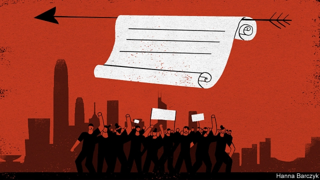

###### Chaguan

# China is using Kublai Khan’s methods to quell protests in Hong Kong 

 

> print-edition iconPrint edition | China | Aug 31st 2019 

AT THE PEAK of Kublai Khan’s empire-building career, his reputation for ferocity was such that Mongol armies conquered some cities with handwritten notes, wrapped around arrows and fired over the walls. A typical letter urged inhabitants to submit at once to avoid a siege that was sure to end in mass slaughter. Vanquished local rulers, if lucky, might be granted a princely death, sewn into a sack and then trampled by horses. 

Though China’s Communist Party probably dislikes comparisons to a Mongol horde, its leaders are trying similar tactics in their confrontation with Hong Kong. Videos have been released showing Chinese soldiers practising riot suppression and paramilitary police massing just across the border from Hong Kong. Officials have declared that 12 weeks of pro-democracy marches and anti-government protests, many of them vast and peaceful but some of them small and violent, amount to a “colour revolution” with elements of “terrorism”. Well-briefed Hong Kong tycoons have hinted at a deadline for displays of defiance by the territory to end: October 1st, when the 70th anniversary of the People’s Republic of China will be marked in Beijing with a grand parade. On August 25th the state news agency, Xinhua, reported on a gathering of officials to study speeches by Deng Xiaoping, the leader who devised the “one country, two systems” model, a promise to preserve Hong Kong’s Western-style freedoms after British rule ended in 1997. That pledge of autonomy is quite compatible with sending troops to crack skulls, Xinhua reported: Deng himself stipulated that if Hong Kong drifted into turmoil, the central government should intervene. 

Nobody should doubt that, if they sense Hong Kong sliding out of control, China’s leaders would use violence to preserve their authority, even if that would spark massive civil disobedience, tank Hong Kong’s stock- and property markets, and risk pushing American politicians, notably in Congress, from suspicion of China into a full-blown cold war. Yet, like Mongol missives zinging over city walls, the government’s threats are at once serious and a stratagem to frighten Hong Kongers into disowning the protesters and suing for peace. For sending in troops would be an admission of failure. 

Privately, some informed figures in Beijing play down the idea that October 1st is a deadline for ending the impasse, murmuring that Hong Kong, a tiny place of 7m people, cannot overshadow celebrations by a motherland of 1.4bn citizens. That raises a question: if China is signalling that it is at once implacable but somewhat patient, what do party leaders have in mind for Hong Kong? 

Multiple, overlapping campaigns are likely to enforce loyalty to China. One campaign is visibly under way within that part of Hong Kong that resembles an oligarchy. Chinese officials have scolded tycoons for allowing society to become so unequal and unaffordable. A best-case scenario would see curbs on magnates’ rent-seeking. Less happily, officials have told company bosses to suppress dissent among their employees or quit, as happened to the chief executive of Hong Kong’s flagship airline, Cathay Pacific. 

Less visible, but just as important, is a looming purge within the bit of Hong Kong that resembles a technocracy: the world of professionals who, for better or worse, have helped to run Hong Kong since colonial times, in the absence of full democracy. With youngsters dominating so many protests, Hong Kong’s schools and university campuses will be early targets for scrutiny. Ominously, a prominent pro-mainland politician talks of educators who “hate China” and teach the same to their students. 

Hong Kong has already seen attempts to marginalise pro-democracy voices in civil society for more than a decade. Now professionals are braced for a second purge, targeting pro-business conservatives who side with the government 80% or 90% of the time, but who—notably as the current protests began in opposition to a proposed extradition law that would have exposed Hong Kongers to the mainland’s criminal justice system—have voiced qualms or urged the authorities to make concessions. Such conservatives have long dominated such bodies as the Law Society or the Institute of Engineers, which in turn help fill umpteen disciplinary panels and advisory committees that make Hong Kong tick. Others sit in Hong Kong’s Legislative Council (LegCo), often representing “functional constituencies” consisting of a few thousand members of this or that industry or profession. 

Mainland institutions that once shunned the spotlight, notably the central government’s Liaison Office, are increasingly open in their lobbying. Dennis Kwok, a pro-democracy politician and barrister who represents the legal constituency in LegCo, notes that particular controversy surrounds elections within professional bodies that allow for proxy voting. Junior members of law firms are routinely told to hand over proxy votes to partners, charges Mr Kwok. Then at election time, firms “get calls from clients, or from the Bank of China”, urging block-voting for candidates favoured by the Liaison Office. Time and again, China-friendly “Reds” are driving out old-school conservatives, says Mr Kwok. The authorities in Beijing “want people who are absolutely loyal”. 

Several professionals describe how architects, lawyers, engineers and the like are urged to join study tours of the mainland. Lectures and visits to Chinese patriotic sites allow the Liaison Office and its allies to scout for potential recruits. Later, reunions are organised back in Hong Kong, creating networks. Loyalists can expect lucrative projects and offers of work on the mainland. 

Such patronage politics lacks the drama of troops on the streets. It will still disgust many Hong Kongers, for the city’s political culture—as millions of marchers have made clear—includes a respect for individual rights and accountable government wholly alien to the bossy, collectivist, croneyish autocrats in Beijing. Alas, as Kublai Khan knew, not all conquests require invasion. ■ 

