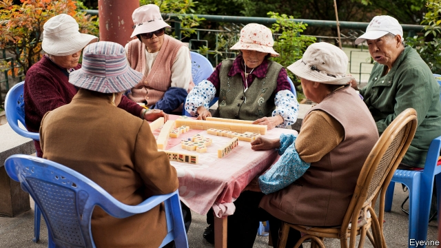
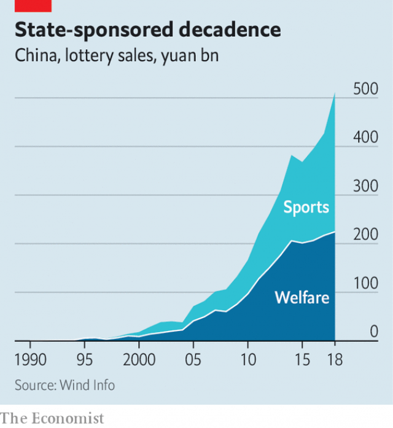

###### Rien ne va plus

# The Chinese state manages the world’s second-biggest lottery industry 

 

> print-edition iconPrint edition | China | Aug 31st 2019 

THERE WAS no violence and there were no victims, unless you count the crickets, which rushed at each other, mandibles agape, for a few seconds. But that did not stop the police raiding the barn on the outskirts of Shanghai, abruptly halting the cricket-fighting tournament, dispersing the spectators and arresting the organisers, all for the crime of gambling. Over the previous five nights, 1m yuan ($140,000) had changed hands. So zealous have China’s anti-gambling squads become that not even battling bugs escape their attention. 

Gambling has been outlawed since the Communists took power in 1949. Mainlanders keen for a flutter must travel to Macau’s extravagant casinos or to Hong Kong’s jockey clubs. Those who stay put have just two legal outlets for a punt: the state-run Welfare Lottery and the Sports Lottery, set up in 1987 and 1994 respectively. Tickets can be bought at corner shops for as little as 2 yuan; jackpots are capped at 10m yuan. It was only in 1985 that the government made it legal to play (but not bet on) mah jong. 

The well-loved game has recently been hit by a fresh interdiction, ensnaring poker too, this time online. Since a state directive last year, apps for playing either game have been culled by the tens of thousands. And to curb non-digital gambling, police last year began to use drones to detect pop-up casinos set up in the woods or on mountainsides. The law threatens as much as a decade behind bars for those who run gambling dens, and three years for patrons. 

Betting is an obvious target in the crackdown on corruption led by Xi Jinping, the country’s leader. State media have said primly that officials “must resolutely stop” playing mah jong. Long-mooted plans to allow horse-racing and lotteries in the island province of Hainan are languishing. Even state-sanctioned lotteries have landed in hot water. In 2015 an investigation in 18 provinces found that local administrators had siphoned 17bn yuan from them. Late last year 14 officials running the Welfare Lottery were punished for corruption. The government denied rumours that 136bn yuan had been misappropriated. 

In July a state-backed report denounced Suncity, Macau’s biggest operator of gambling tours, whose clients include high-rollers from the mainland. It alleged that the firm was facilitating online gambling, which is illegal even in Macau; Suncity denied the accusation. The report said that the practice had caused “great harm to China’s social-economic order”. 

The report claimed that the annual amount wagered by Suncity’s mainland clients in the online casinos it operates from South-East Asia was over 1trn yuan, “equivalent to nearly twice the annual income of China’s lottery”. In other words, big sums are being diverted from state coffers and flowing abroad instead. China praised Cambodia for its decision in August to ban online gambling, and urged the Philippines to do the same for a pastime it called “a most dangerous tumour in modern society detested by people all across the world”. It is nervous about the many Chinese who have moved there to set up gambling websites since the Philippines began issuing online gaming licences in 2016. 

 

A Communist-Party-run lotto may sound drab. But last year the Sports and Welfare lotteries combined raked in 511bn yuan in ticket sales, nearly as much as America’s various state lotteries earned between them. Since Mr Xi took office in 2013, sales have almost doubled (see chart). By revenue, Chinese lotteries are on course to overtake America’s this year, to become the world’s biggest. 

Lotteries matter to the state for a number of reasons. The first is their contribution to social welfare. Only half of the ticket revenues are devoted to prize money, leaving more than a third for favoured causes (the rest goes on administration). The government publishes an annual list of recipients, such as public sports facilities, the Red Cross and programmes to help the elderly and poor. Players who win over 10,000 yuan must hand over a fifth of their winnings to the state in taxes. 

There is also a widespread belief that lotteries help eradicate other forms of gambling. As Wang Xuehong, an academic who advises the Ministry of Finance, puts it, “The government does not want to be held responsible if anything goes wrong.” It therefore tries to make sure there is just one regulated outlet for gambling. One strand of its efforts to supervise lotteries more closely, says Ms Wang, was a pause imposed four years ago on online ticket sales, in the wake of the embezzlement scandals. Last summer it reinstated that ban. The promotion of state lotteries by television celebrities and through smartphones has also been quashed under Mr Xi. 

The anti-gambling campaign may have curbed some illegal betting. Hans Steinmüller of the London School of Economics, who has studied rural gambling, suspects it has had an impact on small-stakes mah jong parlours frequented by housewives and the retired. It has become “very sensitive” for local officials to be seen to be involved with these, he says. Still, many villagers continue to place bets with local bookies on the numbers that will win Hong Kong’s lottery. In winter peasant farmers while away the day playing popular card games, including dou dizhu (“struggle against the landlord”) and zha jinhua (“bash the golden flower”), for money. 

The law is “flexible” on whether to prosecute such games, says Ms Wang. A few years ago the police said that they would penalise players staking more than 500 yuan. In reality regulators play a cat-and-mouse game with gamblers and app developers, says Mr Steinmüller, as semi-legal options pop up that are not covered by gambling regulations. Yaoji Poker, the world’s largest maker of playing cards, says rural sales are robust. Still, last year it bought an online-gaming startup that survived the purge. It is now looking for ways to attract players to its virtual dou dizhu, among other card games, without falling foul of the crackdown. 

Ms Wang estimates that, all told, the money spent on unofficial gambling is at least five times that wagered on the state lottery. The International Centre for Sport Security, a Qatar-based outfit, reckoned in 2016 that illegal sports gambling in China alone attracts $600bn a year—of a global illegal market worth between $750bn and $1trn. In the hope of luring these punters, the state lotteries have jazzed up their offerings. The Sports Lottery, for instance, offers virtual car-racing and football games. 

China’s tech titans are tempting their fortunes. AGTech, which runs four-fifths of the state’s lottery terminals, was bought in 2016 by Alibaba, an e-commerce giant. It recently received a contract to develop augmented-reality products. Tencent has a stake in China Lotsynergy, which builds “video lottery terminals” for the Welfare Lottery. These closely resemble slot machines, but involve betting on which random numbers the terminals will generate. They have become among the lottery’s most popular products. On a recent Friday afternoon one such lottery hall in central Shanghai was packed, though mostly with older customers. 

But the hopes of private firms seem at variance with state aims. John Sun, the boss of AGTech, has grumbled that the lotteries could double their returns if they reopened online sales. Officials recently announced that they were slowing down a popular “fast-paced” lottery-ticket game from ten-minute playing intervals to 20, because of worries about money-laundering. Any bets that legal gambling will flourish in China must surely have long odds. ■ 

