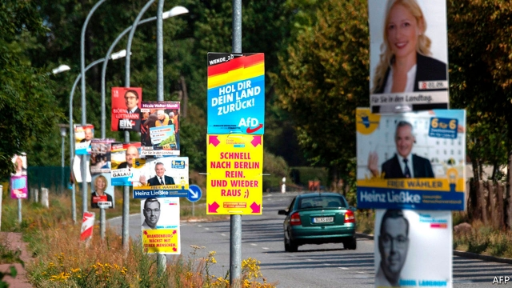
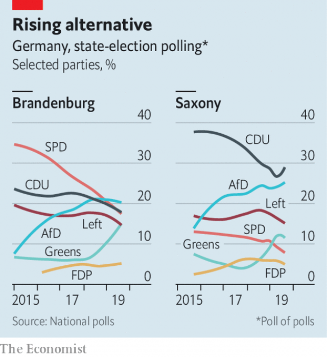

###### Autumn of the coalition

# Elections in the east test Germany’s creaky unity government 

 

> print-edition iconPrint edition | Europe | Aug 31st 2019 

IT IS ELECTION season in Brandenburg. Under a generous Friday-evening sun, the crowd in Wildau, a small commuter town south of Berlin, thump the tables in approval as Dietmar Woidke, the state’s centre-left premier, vows to take the fight to the far-right Alternative for Germany party (AfD). Regina Bartsch, a retired engineer in the audience, voices her support. She has voted for other parties in the past, she says, but this time will plump for Mr Woidke’s Social Democrats (SPD) to keep the AfD from coming first. “That’s the most important thing.” 

An election in a state like Brandenburg, population 2.5m, would usually struggle to catch the nation’s attention. The campaign has been dominated by issues like house prices and transport links to Berlin. Yet the outcome of three elections in eastern Germany—in Brandenburg and Saxony on September 1st and Thuringia on October 27th—will resonate nationwide. 

There are two reasons for this. The first is that Germany’s fragmenting party system could open the way for the AfD to come first in one or more of the three polls. The party’s rightward shift in recent years has earned it a solid block of support across eastern Germany, where it stokes grievances against refugees, climate policy and “Wessi” arrogance. Its leader in Brandenburg, Andreas Kalbitz, who has a history of dalliance with neo-Nazi organisations, is the brains behind the Flügel (“wing”), anultra-right group slowly taking over the AfD from within. The AfD is shunned by every other party, so it has no hope of entering coalitions. But its first victory in a state election would be a watershed for Germany. “We will be closely observed to see if we can overcome this,” says Jörg Steinbach, Brandenburg’s economy minister. 

 

Mr Woidke, who leads a coalition with Die Linke, a left-wing party, has belatedly tried to present the Brandenburg election as a straight fight between his party and the AfD. The tactic may be working: the SPD and AfD are now neck-and-neck in polls. In Saxony the drama may come after the election. Michael Kretschmer, the premier, who has fought a strong campaign, is odds-on to lead the CDU to first place. But he has ruled out coalition talks with either the AfD or Die Linke. That may force him to seek an unwieldy, left-leaning coalition of three or even four parties after the vote, infuriating his party’s conservative base. Many think it is time to remove the cordon sanitaire around the AfD, however much that would irritate the CDU’s national leadership. Mr Kalbitz’s antennae, naturally, are up. After Angela Merkel is gone, he says, “it’s just a question of time” before the CDU agrees to work with the AfD. The dam will break first in the east, he adds. 

The second reason to watch the state elections is for the national fallout. Germany’s “grand coalition” between the CDU (plus its Bavarian sister party) and the SPD has long been in intensive care. It is ailed by quarrels over taxes, pensions and climate policy. In the past year both parties have seen leaders resign after poor state-election results. Disasters in Brandenburg and Saxony would sharpen the pain. In particular, for the SPD to lose power in Brandenburg, a state it has run for 30 years, “could be the straw that breaks the camel’s back,” says Jochen Franzke, a political scientist at the University of Potsdam. Nationally the party is quarrelsome and deeply unpopular; it now sits behind the AfD and the Greens in opinion polls. Many of its restive members long to quit government and lick their wounds in opposition. 

At a party congress in December the SPD must decide whether to do just that. The question will therefore hover over the party’s leadership contest, which starts in earnest in September. Winning in Brandenburg would help continuity candidates like Olaf Scholz, Germany’s vice-chancellor and finance minister, who changed his mind about running when the thinness of the field became embarrassing. Mr Woidke, a Scholz supporter, calls the discussion over staying in government “superfluous”. But some of Mr Scholz’s rivals are already urging a walkout. Poor election results will help them make their case. 

The CDU, meanwhile, has begun to lose its way as Mrs Merkel, who will leave office before the next election, steps away from front-line politics. Annegret Kramp-Karrenbauer, who took over the party leadership from the chancellor last December, stumbles from one gaffe to another, most recently hurting the CDU’s election campaigns by condemning a prominent right-wing member popular in the east. Her missteps mean she is no longer a shoo-in to run as the party’s candidate for chancellor at the next election. Should the CDU do poorly this weekend, it is Ms Kramp-Karrenbauer who will take the blame rather than Mrs Merkel, who has removed herself from the election fray. The new party leader’s rivals are circling. 

The gloom in Berlin also infects the local contests. The national SPD’s weakness is “of course a burden”, admits Mr Woidke. In fact, he and Mr Kretschmer have good economic stories to tell in their own states. But it is hard to gain purchase in such a febrile political atmosphere. After many years of stability under Mrs Merkel, there is a whiff of change in the air. ■ 

