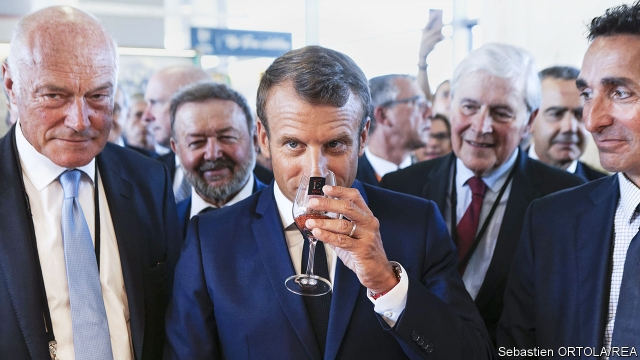

###### Back on the scene

# Emmanuel Macron reclaims France’s international role 

 

> print-edition iconPrint edition | Europe | Aug 31st 2019 

AT THE START of this year, a fretful Emmanuel Macron grounded his presidential plane and cleared his diary in order to focus on civil disorder at home. For two months, as he tried to defuse the gilets jaunes (yellow jackets) protests, the French president left Europe only once, shunned global gatherings and ceded the stage to Angela Merkel. Mr Macron’s hopes of stepping into the German chancellor’s shoes as Europe’s leader looked then to be over. 

Six months later, the turnaround is startling. For three days starting on August 24th Mr Macron presided over the G7 summit in the seaside resort of Biarritz, an event many expected to be wrecked by conflict and theatrics. Instead, the French host managed to avert disaster, keep America’s Donald Trump happy, ease trans-Atlantic tensions over a French tech tax and win a pledge from Mr Trump to talk to Iran’s President Hassan Rouhani. He also mobilised a bit of aid for fires in the Amazon, though that fell through in a spat with Jair Bolsonaro, Brazil’s president. Mr Trump declared the summit to be “truly successful”, claimed that “nobody wanted to leave” and called Mr Macron a “spectacular leader”. 

The most tantalising outcome was Mr Macron’s announcement that a meeting between the American and Iranian presidents could take place in the “coming weeks”. French diplomats have been working for months on ways to ease tensions with Iran and preserve the principles of the nuclear deal that America signed in 2015, before Mr Trump withdrew and hit Iran with sanctions. On August 25th Mr Macron pulled off what looked suspiciously like a stunt when he invited Muhammad Javad Zarif, Iran’s foreign minister, to Biarritz for bilateral meetings. Yet a day later, there was Mr Trump, standing beside the French president, acknowledging that “if the circumstances were right” he would “certainly agree” to a meeting with Mr Rouhani. 

In the end, nothing came of it. Iran said it wanted sanctions lifted first. And Mr Macron has learned the hard way that efforts to charm and cajole Mr Trump into better behaviour are usually in vain. Last year the American president withdrew from the Iran nuclear deal shortly after Mr Macron visited Washington, hoping to persuade him otherwise. 

Indeed Mr Macron’s broader diplomatic policy of dialogue with all carries evident risks. His parallel efforts with Russia’s Vladimir Putin, whom he invited to the presidential fort on the Mediterranean shortly before the G7 summit, have so far yielded little. The French president has long argued that such leaders are more dangerous when isolated, and is trying instead to mix firmness and flattery. In a speech in Paris on August 27th he called it a “strategic error” for Europe to shun Russia, as that pushes it towards China. In the short run Mr Macron hopes to revive peace talks between Russia and Ukraine, supervised by France and Germany. In the long run, he told reporters before the G7 summit, he thinks that a better-behaved Russia should be allowed back into the G8. 

Ultimately, France remains a mid-sized power, albeit one with a nuclear deterrent. So Mr Macron’s diplomatic space to pursue all these ambitions is limited. This is why the French president spends so much time pushing ideas to strengthen what he calls “European sovereignty”, or its ability to assert its independence as a strategic and economic bloc. It is also why he sees the diplomatic role he can realistically play as primarily that of a “mediating power”. 

 

As it happens, Mr Macron may have an unusual opportunity to build on the leadership he displayed in Biarritz. One reason is that, two years after his election, the French president has built up a global address book and got the measure of leaders such as Mr Trump. In Biarritz Mr Macron had an impromptu two-hour seafront lunch à deux with the American president, peeling him away from his hawkish advisers. “Lunch with Emmanuel was the best meeting we have yet had,” Mr Trump gushed afterwards on Twitter. In a joint press conference the usually verbose French president was careful to use short words, and appear respectful. “Macron is very clear about their differences,” says Benjamin Haddad, of the Atlantic Council, a think-tank in Washington: “But the G7 outcome reflects the work that he has been doing, investing in that relationship for the past two years, which is now paying off.” 

A second is the leadership gap in Europe. America has grown used to looking to Mrs Merkel. Yet the chancellor has been weakened by her party’s electoral difficulties, along with the prospect of recession in Germany. Brexit, meanwhile, is occupying all of Britain’s diplomatic bandwidth. Mr Macron, who keeps a copy of Charles de Gaulle’s memoirs on his desk, is eager to occupy the space. To that end, he has helped manoeuvre France-friendly nominees into top European jobs, including Ursula von der Leyen, the incoming European Commission president, and Christine Lagarde at the European Central Bank. 

A final factor is France’s relative economic resilience. French GDP is expected to grow by 1.3% this year, compared with 0.5% in Germany. Unemployment is still 8.5%, but that is its lowest level in a decade. France is less export-dependent than Germany and so less vulnerable to trade turbulence. And it has benefited from the fiscal boost Mr Macron injected late last year in response to the gilets jaunes protests. The president’s poll ratings have now recovered to where they were a year ago. 

The French, with their universalist aspirations, are unusually sensitive to how well their leaders do abroad. Mr Macron’s G7 performance was roundly applauded at home. The summit, wrote Le Monde, was an “unquestionable success”. Deals may yet come unstuck. Talks may not materialise. Disappointments are inevitable. But Biarritz suggested that Mr Macron is growing into a role as a European leader who is prepared to take risks, push new ideas, and try to use the multilateral system to ease tensions and defend the liberal order.■ 

