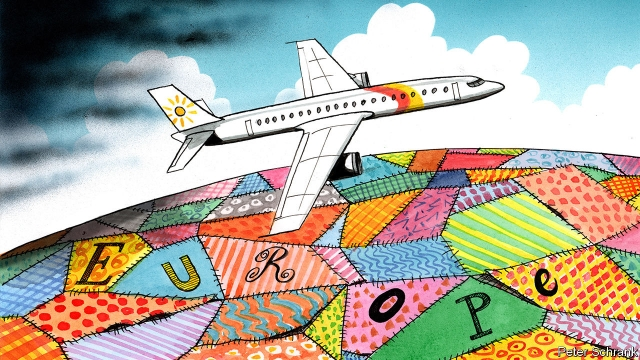

###### Charlemagne

# Europe’s long vacation flight home 

 

> print-edition iconPrint edition | Europe | Aug 31st 2019 

EVEN IN EUROPE, a continent of welfare states famed for their gloriously long holidays, the summer must eventually end. This week, as they trickle back from Mediterranean beaches and Alpine campgrounds, Europeans are preparing for a fateful autumn. The risk of a recession looms. Eurosceptic populists are likely to win elections in Poland, and perhaps in Italy. Britain is heading for a hard or no-deal Brexit. From trade wars to migrant crises, the outside world looks threatening. Still, gazing out of their aeroplane windows, returning holidaymakers may notice some of the things that hold their curious little continent together. 

For one thing, they are physically connected. In Africa or SouthEast Asia, infrastructure often peters out at borders. Yet in Europe motorways, railway lines and waterways criss-cross the continent. Peering down into deep Balkan valleys, one can see how absurd local ethnic rivalries and hatreds are; they carve up a continuous landscape of rocky coastlines and dusty roads that can obviously succeed only as an integrated region. 

Europe is an old continent. Forts and castles dot the landscape; cities are built around pedestrian cores rather than grids from the motor age. (Where highways are linear, it may be not because they are modern but because they follow the dead-straight lines of Roman roads, as with parts of the A2 in Britain and the A1 in Italy.) Many cityscapes in central Europe follow the medieval German layout of a castle on a hill, with a lower town around a market square spreading outwards to a ring-road on the line of an old wall. That pattern can be seen flying over Leipzig or Nuremberg, and also over Wroclaw in Poland, Riga in Latvia or Prague in the Czech Republic—a reminder of the blurred lines between German, Slav and Baltic spheres in this part of Europe. Sometimes one can wake up from a mid-flight snooze and not know which country is below, just that one is unmistakably over Europe. 

Yet differences are also visible from above. The rationalist post-war reconstruction of the West German state, essential to understanding Germany today, is seen in the orderly lines of fields and woods produced by the Flurbereinigung (land-reform consolidations) in the 1950s. By contrast, Britain’s chaotic but organic state is reflected in its rambling, patchwork countryside. Madrid, sprawling but stranded in the middle of the dry Spanish meseta, makes sense only as the capital of a mighty empire that valued central control—in a way that marks Spain’s politics today. Road and railway patterns reveal much, too. France’s long tradition of dirigiste centralisation is evident in the hub-and-spoke radiation of its arteries from Paris, whereas in Germany and the Netherlands they are polycentric. Austria-Hungary, long dead on political maps, lives on in the way that railways in much of south-eastern Europe converge on Vienna. 

Flat regions, like the Fens in Britain and Scania in Sweden, have huge farms. Sometimes an indicator of historical economic inequality, these can also signal a starker left-right political divide. Hilly or mountainous regions with small livestock holdings, like Ireland and the Basque country, often tend towards more communitarian political traditions. For a symbol of the enduring differences between the former eastern and western parts of Germany, look no further than Berlin at night: sodium-powered street lamps bathe the former east in an orange glow, where fluorescent lamps in the west burn almost white. In Belgium, by contrast, night-time projects unity. Differences between Flanders and Wallonia disappear as an unusually powerfully illuminated highway network, a federal responsibility, makes the outline of this fractured state visible even from space. 

To fly over Europe is to witness many of the policy challenges awaiting leaders on their return from holidays. At night, darkness envelops the emptying countrysides of rural Spain, southern Italy, Greece and Bulgaria. Meanwhile, even in times of trade wars and tariffs, the prosperous Rhine and Rotterdam glow with the lights of barges and ships carrying German exports into the world. Forest fires, floods and scorched fields speak of Europe’s vulnerability to global warming. Then there are security threats. Historical Baltic and Polish fears of Russian expansionism make sense from above. The countries have no natural barriers to their east, just tank-friendly plains. The Mediterranean, too, seems less of an impediment from above, with container ships and refugee dinghies crossing what is increasingly a common Euro-African space. On the island of Ireland, in contrast, the problem comes from what cannot be seen: the invisible Northern Irish border, which would soon become visible—and perhaps a focus for violence—in the event of a no-deal Brexit. 

From above, you can also see what Europe, acting together, can achieve. The return of forests across swathes of the continent thanks to enlightened environmental policies; wind turbines and solar-power installations cutting carbon emissions; former communist countries woven back into the rest of the continent; new transport links and economic development in places that long languished in poverty. 

For politicians, journalists or ordinary travellers who want to really understand a place and its people, there is no substitute for shoe leather. You do not know anywhere until you have walked it. But for those who do fly—and millions do, with some European airports reporting record passenger levels—you can learn a lot at high altitude, too. The continent is a patchwork of different histories, cultures and political traditions, but one where borders are utterly inadequate as tools of organisation. Common responsibilities and problems, histories and futures spill across those borders and demand common action. This autumn the challenge of seeing Europe as a single space, the way it looks from a plane, seems greater than ever. But it is also more essential. ■ 

