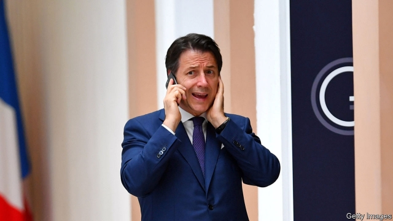

###### Not fallen yet

# Italy’s Five Star Movement has a deal to form a new government 

 

> print-edition iconPrint edition | Europe | Aug 29th 2019 

GIUSEPPE CONTE is poised to boldly go where no Italian technocrat has gone before. Independent prime ministers in Italy either bow out at the end of their governments or get shoved aside by the voters if they try to hang on. But on August 29th President Sergio Mattarella asked Mr Conte to form a second coalition, this time teaming the anti-establishment Five Star Movement (M5S) with the centre-left Democratic Party (PD). 

Mr Conte has spent 14 months heading an all-populist government that yoked the Five Stars to the hard-right Northern League. The League’s leader, Matteo Salvini, ill-advisedly pulled the rug this month, thinking it was under his allies’ feet, when in fact it was under his own. The M5S has around a third of the seats in parliament, and can command a majority with the help of the PD and independent lawmakers. 

In his resignation speech on August 20th, the popular Mr Conte excoriated the League leader to his face, calling him disloyal and irresponsible. The former university law teacher’s performance endeared him to the Five Stars, to the point that they made his continuance in office a condition for a deal with the PD. 

A second Conte government will please officials in Brussels. They feared that Mr Salvini’s plans for drastic tax cuts, in a country already saddled with a debt equivalent to 134% of GDP, could panic the markets and jeopardise the euro. It will also delight Donald Trump, who tweeted his support for his “highly respected” buddy, “Giuseppi” (sic). 

But there are snags. The M5S intends to seek its members’ approval in an online ballot. If they vote against the alliance, it will probably force a general election. Italy can ill afford that. It could take until November to hold the vote, and parliament has to approve a budget by year’s end. That will be tricky: €23bn ($25bn) in deficit cuts are needed to meet EU limits. Otherwise, value-added-tax rates will have to be raised. 

Moreover, in over a week of negotiation, the Five Stars and PD seemed to have agreed on little more than the prime minister’s name. The M5S’s founder, Beppe Grillo, suggested the cabinet might include other technocrats. 

Perhaps most important, the two parties have sharply different cultures. Though most Five Star activists lean left, they disdain the liberal elite and see the PD as its embodiment. That was not a problem with the League, though it backed some policies they disliked. The fate of Italy’s new government may show which is the stronger bond—ideological affinity or a populist temperament.■ 

-- 

 单词注释:

1.Aug[]:abbr. 八月（August） 

2.giuseppe[]:n. 朱塞佩（男子名） 

3.conte[kuŋt]:n. 短篇小说 

4.poise[pɒiz]:n. 平衡, 均衡, 姿势, 镇静, 安静, 砝码 vt. 使平衡, 使悬着, 保持...姿势 vi. 平衡, 悬着, 准备好 

5.boldly['bәuldli]:adv. 大胆地, 显眼地 

6.technocrat['teknәukræt]:n. 技术专家治国论者, 技术专家统治论者 

7.shove[ʃʌv]:n. 推, 挤 vt. 推挤, 猛推, 强使 vi. 推 

8.voter['vәutә]:n. 选民, 投票人 [法] 选民, 选举人, 投票人 

9.Sergio[]:n. 塞尔吉奥（NBA球员） 

10.Mattarella[]:马塔雷拉 

11.conte[kuŋt]:n. 短篇小说 

12.coalition[.kәuә'liʃәn]:n. 结合体, 结合, 联合 [经] 联合, 联盟 

13.Pd[]:[医] 钯(46号元素) 

14.yoke[jәuk]:n. 轭, 牛轭, 束缚 vt. 给...上轭, 连接, 结合, 使匹配 vi. 结合, 匹配 [计] 磁轭; 磁头组; 偏转线圈 

15.matteo[]:马泰奥（人名） 

16.salvini[]:[网络] 索氏丽体鱼；萨尔维尼 

17.lawmaker[lɒ:'meikә]:n. 立法者 

18.excoriate[ek'skɒ:rieit]:vt. 剥皮, 擦破皮肤, 严厉的责难 

19.disloyal[dis'lɒiәl]:a. 不实的, 不义的, 不忠的 

20.irresponsible[.iri'spɔnsәbl]:a. 不负责任的；不可靠的 

21.endear[in'diә]:vt. 使受喜爱, 使受钟爱 

22.continuance[kәn'tinjuәns]:n. 继续, 停留, 持续 [法] 继续, 延续, 诉讼延期 

23.Brussel[]:n. 布鲁塞尔（比利时首都） 

24.drastic['dræstik]:a. 激烈的 [医] 峻泻药, 剧烈的 

25.jeopardise[]:vt. 使受危险, 危及, 危害 [法] 使受危害, 使陷入危险, 危及 

26.euro['juәrәu]:n. 欧元（欧盟的统一货币单位） 

27.tweet[twi:t]:vi. 啁啾 n. 小鸟叫声 

28.buddy['bʌdi]:n. 好朋友, 伙伴 

29.giuseppi[]:[网络] 朱塞皮 

30.sic[sik]:adv. 原文如此 

31.snag[snæg]:n. (尖利的)突出物, (衣服等的)戳破处, 断牙, 意外障碍 vt. 造成阻碍, 抓住机会, 抢到, 清除障碍物 

32.online[]:[计] 联机 

33.ballot['bælәt]:n. 投票, 投票用纸, 抽签 vi. 投票, 抽签 vt. 投票选出, 拉选票 

34.alliance[ә'laiәns]:n. 联盟, 联合 [法] 同盟, 联盟, 联姻 

35.deficit['defisit]:n. 赤字, 不足额 [医] 短缺 

36.EU[]:[化] 富集铀; 浓缩铀 [医] 铕(63号元素) 

37.negotiation[ni.gәuʃi'eiʃәn]:n. 谈判, 磋商, 交涉 [经] 谈判, 协商 

38.founder['faundә]:n. 创立者, 建立者 vt. 使沉没, 使摔倒, 弄跛, 浸水, 破坏 vi. 沉没, 摔到, 变跛, 倒塌, 失败 

39.beppe[]:n. (Beppe)人名；(意)贝佩 

40.grillo[]:n. (Grillo)人名；(法)格里约；(德、葡、意)格里洛；(西)格里略 

41.activist['æktivist]:n. 激进主义分子 

42.disdain[dis'dein]:n. 蔑视 vt. 蔑视, 鄙弃 

43.elite[ei'li:t]:n. 精华, 精锐, 中坚分子 

44.embodiment[im'bɒdimәnt]:n. 具体化, 化身 

45.affinity[ә'finiti]:n. 吸引, 姻亲关系, 类同 [化] 亲合力; 亲合能; 亲合势; 近似; 类似 

46.Populist['pɔpjulist]:n. 民粹派的成员 

