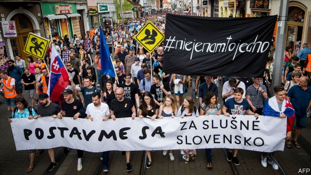

###### Bloody texts

# Messages may show corruption behind a Slovak journalist’s murder 

 

> print-edition iconPrint edition | Europe | Aug 31st 2019 

THE BRUTAL murders of Jan Kuciak, an investigative journalist, and his fiancée in February 2018 quickly turned Slovakia’s politics upside-down. Tens of thousands of Slovaks took to the streets, suspecting the killings were linked to political corruption. “We just thought our politicians’ behaviour was fishy,” says Jan Galik, a 31-year-old IT specialist who helped found “For a Decent Slovakia”, one of the main groups behind the demonstrations. The protests forced police to mount a serious investigation and ultimately drove the former prime minister, Robert Fico, to resign. 

Over the past month, the fishy smell has grown ever stronger. Slovak newspapers have been publishing excerpts from hundreds of pages of instant messages supposedly leaked from a police report on Marian Kocner, a businessman charged with ordering the murders. The messages purport to show Mr Kocner assiduously trying to help Mr Fico’s Smer-SD party stay in power. “Otherwise, we will all end up in jail,” reads one message to a long-time associate. Others refer to meetings with “Squarehead” (Mr Fico’s nickname on satirical websites). 

Another message boasts of having breakfast in the Maldives shortly after the murders with Bela Bugar, chairman of Smer-SD’s junior coalition partner, Most-Hid. Addressed to a woman who also faces charges connected to the murders, it promises to tell Mr Bugar “what I would do in his place”. Most-Hid has been criticised for refusing to pull out of the coalition, thus keeping Smer-SD in power. 

Mr Bugar says his party’s actions have nothing to do with Mr Kocner, whom he calls “evil”. As for Mr Fico, he denies that the meetings to which the messages refer took place. Mr Kocner rejects the charge that he was involved in the murder, while his lawyer notes that it is hard to prove his client sent the messages (though he does not explicitly deny it). 

Some pundits suggest Mr Kocner may have boasted of meetings that never happened, to impress the people he was corresponding with. Prosecutors confirm that they have Mr Kocner’s messages, but not that those published are genuine. Still, they seem to take at least some of the information in them seriously. In one message, Mr Kocner refers to an official at the ministry of justice as his “monkey”. Last week the police seized that official’s mobile phone. 

For now, clean-government forces have the upper hand in Slovakia. In June an environmental and anti-corruption campaigner, Zuzana Caputova, took office as president. But the country has a long way to go. “For a Decent Slovakia” plans to take to the streets again in September. “We want to remind people that the fight for freedom is a never-ending process,” says Mr Galik. ■ 

