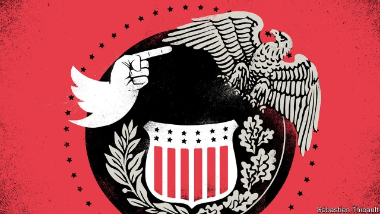

###### Monetary policy

# A meeting of economists and central bankers was overshadowed by President Donald Trump 

 

> print-edition iconPrint edition | Finance and economics | Aug 29th 2019 

AS THE ANNUAL meeting of central bankers and economists at Jackson Hole, a mountain resort in Wyoming, began on August 23rd, two participants made a bet. Would President Donald Trump tweet about the opening remarks of Jerome Powell, the chairman of the Federal Reserve, within 45 minutes? In the event, it took the president 57 minutes. That night the victor enjoyed his winnings—a glass of whiskey—in the bar. 

Mr Trump’s words made the conference theme, “challenges for monetary policy”, uncomfortably timely. He called Mr Powell an “enemy” and promised to ramp up trade tensions with China. Then he announced increases in tariff rates on over $500bn of Chinese imports. But even as stockmarkets reeled, the conference continued serenely. Indeed, Mr Trump even brought the assembled economists and monetary policymakers closer together. 

Most obviously, they were united in grumbling about the impact of his trade policy on the global economy. Philip Lowe, the governor of the Reserve Bank of Australia, said that business uncertainty was turning political shocks into economic ones. Mark Carney, the governor of the Bank of England, said that trade tensions had raised risk premiums, thus tightening financial conditions. The president’s twitter tirade could lead to greater policy convergence, too. Mr Powell said that the Fed’s doveish shift had helped secure a positive outlook for inflation and employment. As recently as December it was raising rates away from those set by other central banks; now it is moving downwards with them. 

Participants also seemed united in scepticism that monetary policy could entirely offset the trade war’s ill effects. It could help with confidence, said Mr Powell, but could not create a “settled rulebook for international trade”. Mr Lowe questioned how much modest interest-rate cuts would stimulate investment, and noted that countries could not all pep up their economies with currency depreciation, as “we trade with one another, not with Mars”. 

 

The academic presentations revealed another point of sympathy. Mr Trump is a powerful force outside the Fed’s control—one it cannot fully offset. In claiming to put America first, he complicates the Fed’s task of keeping America’s economy on an even keel. That difficulty is paralleled by how the Fed, in turn, complicates monetary policy in the rest of the world. 

Mr Trump’s power is expressed via social media. The Fed’s is exerted via the dollar, which has become more important globally in the decade since the financial crisis. America accounts for just 15% of global GDP and 10% of global trade, yet the greenback is used for half of global trade invoicing, two-thirds of emerging-market external debt and two-thirds of official foreign-exchange reserves.  

Fed policy thus has far-reaching effects. Participants at Jackson Hole referred to the work of Gita Gopinath of the IMF, which showed that the dollar’s dominance in trade invoicing may stop economies from adjusting to external shocks by as much as traditional models suggest. They also heard about the findings of Arvind Krishnamurthy and Hanno Lustig of Stanford University, showing that when the Fed raises interest rates, the premium for buying the world’s safest asset—dollar-denominated American government debt—rises too. That, they think, is because the Fed is, in effect, signalling that a reduction in supply is imminent. Wenxin Du of the University of Chicago suggested that the premium could also reflect limits on global banks’ ability to lend in dollars, and that tighter Fed policy could exacerbate those constraints. 

That discussion built on earlier work by another participant, Hélène Rey of London Business School, who has argued that when the Fed raises interest rates financial conditions tighten in the rest of the world. Sebnem Kalemli-Ozcan of the University of Maryland explained how emerging markets could be hit as, when the Fed raises rates, some money moves from emerging markets towards America. Investors then worry that emerging markets might run into problems, which makes them look riskier and worsens capital flight. Central banks, she added, would be unable to shield their economies fully from the consequences. In theory they could lean against the wind, raising rates to encourage investors to stay. But the tightening required tends to be so extreme that it would throttle the domestic economy. Though allowing the exchange rate to adjust instead also brings pain, it is the less bad option. 

The assembled central bankers uttered a chorus of complaints about the forces making their lives harder. Amir Yaron, the governor of the Bank of Israel, spoke of keeping interest rates very low for the past three years, but still seeing foreign capital slosh in as the Fed tightened, because investors regarded Israel as an emerging-market haven. The Fed’s moves were offset only partially by Israel’s monetary policy, he said. Participants from advanced economies also grumbled: Mr Carney called the dollar “domineering”. 

In some ways, then, the Fed’s struggles to cope with the consequences of Mr Trump’s words and deeds echo the experiences of its counterparts in other countries, for which it is the Fed itself that is the unruly, unbiddable external force. But in other ways the comparison is unfair. The Fed is, after all, seeking to create the conditions for America’s economy to thrive. The more it succeeds, the better for everyone else. And sometimes it considers the spillover effects of its actions. Its decision in July to cut interest rates was motivated in part by concerns over “weak global growth”. 

On August 27th Bill Dudley, a former president of the New York Fed, suggested in an opinion piece for Bloomberg that the Fed should not ease monetary policy in response to the trade war in case it emboldened Mr Trump’s protectionism and boosted his chances of re-election. It responded with a statement slapping down any idea that it had such political motives. America’s monetary policymakers certainly create problems for their counterparts elsewhere. But, unlike Mr Trump, they are not trying to. ■ 

-- 

 单词注释:

1.monetary['mʌnitәri]:a. 货币的, 金钱的 [经] 货币的, 金融的 

2.economist[i:'kɒnәmist]:n. 经济学者, 经济家 [经] 经济学家 

3.banker['bæŋkә]:n. 银行家, 庄家 [经] 银行业者, 银行家 

4.overshadow[.әuvә'ʃædәu]:vt. 遮阴, 使阴暗, 使失色, 使相形见绌, 使蒙上阴影 

5.Aug[]:abbr. 八月（August） 

6.jackson['dʒæksn]:n. 杰克逊（男子名）；杰克逊（美国密西西比州的城市） 

7.Wyoming[wai'әumiŋ]:n. 怀俄明 

8.participant[pɑ:'tisipәnt]:n. 参加者, 参与者 a. 有份的, 参加的, 参与的 

9.tweet[twi:t]:vi. 啁啾 n. 小鸟叫声 

10.jerome[dʒә'rәum]:n. 杰罗姆（男子名） 

11.powell['pәuәl, 'pauәl]:n. 鲍威尔（英国物理学家） 

12.victor['viktә]:n. 胜利者 a. 胜利的 

13.monetary['mʌnitәri]:a. 货币的, 金钱的 [经] 货币的, 金融的 

14.uncomfortably[ʌnˈkʌmftəbli]:adv. 不舒适地, 不自在地, 令人不快地 

15.timely['taili]:a. 及时的, 适时的 adv. 及时地 

16.ramp[ræmp]:n. 斜坡, 坡道, 敲诈 vi. 狂跳乱撞, 乱冲, 敲诈, 蔓延 vt. 使有斜面, 敲诈 

17.tariff['tærif]:n. 关税, 关税表, 价格表, 收费表 vt. 课以关税 [计] 价目表 

18.stockmarket[s'tɒkmɑ:kɪt]: 证券市场; 证券交易所; 证券行情 

19.serenely[sə'ri:nlɪ]:adv. 安详地, 沉着地, 宁静地 

20.policymaker['pɔlisi.meikә]:n. 政策制定者；决策人 

21.grumble['grʌmbl]:n. 怨言, 满腹牢骚 vi. 抱怨, 发牢骚, 发隆隆声 vt. 抱怨 

22.philip['filip]:n. 菲利普（男子名） 

23.lowe[]:n. 劳氏（世界知名跨国公司）；灵狮（全球第4大广告代理机构） 

24.uncertainty[.ʌn'sә:tnti]:n. 不确定, 不可靠, 不确定的事物 [化] 不确定度 

25.carney['kɑ:ni]:v. 哄骗 n. 哄骗的话 

26.premium['pri:miәm]:n. 额外补贴, 奖金, 奖赏, 保险费 [医] 保险费 

27.tighten['taitn]:vt. 勒紧, 使变紧 vi. 变紧, 绷紧 

28.twitter['twitә]:n. 啁啾, 唧唧喳喳声 vi. 啭, 啁啾, 颤抖 vt. 嘁嘁喳喳地讲, 抖动 

29.tirade['taireid]:n. 激烈的长篇演说 

30.convergence[kәn'vә:dʒәns]:n. 集中, 收敛 [计] 收敛, 会聚 

31.doveish[]:[网络] 鸽子 

32.inflation[in'fleiʃәn]:n. 胀大, 夸张, 通货膨胀 [化] 充气吹胀; 膨胀 

33.downwards['daunwәdz]:adv. 向下 

34.scepticism['skeptisizm]:n. 怀疑论, 怀疑主义 [医] 多疑癖 

35.entirely[in'taiәli]:adv. 完全, 全然, 一概 

36.offset['ɒ:fset]:n. 抵消, 把...并列, 旁系, 支管, 用胶印法印 vt. 弥补, 抵消, 胶印 vi. 装支管 n. 偏移量 [计] 偏移量 

37.rulebook['ru:lbjk]:n. 规则手册[说明] 

38.pep[pep]:n. 活力, 气力, 劲头, 锐气 vt. 鼓起精神, 激励, 使充满活力 

39.depreciation[di.pri:ʃi'eiʃәn]:n. 价值减低, 减价, 跌落, 贬低, 折旧 [化] 折旧; 减值 

40.mar[mɑ:]:vt. 损毁, 损伤, 糟蹋 n. 三月 

41.cannot['kænɒt]:aux. 无法, 不能 

42.fully['fuli]:adv. 十分地, 完全地, 充分地 

43.keel[ki:l]:n. 龙骨, 平底船 vt. 装以龙骨, 使倾覆 vi. 倾覆 

44.parallele[]:[网络] 对等描述法；法国本土品牌；组合柜 

45.globally[]:[计] 全局地 

46.greenback['gri:nbæk]:n. 美钞, 绿背动物 [法] 美钞 

47.invoice['invɒis]:n. 发票, 发货单 v. 开发票, 记清单 

48.Gita[]:n. 吉塔（印度女子名） 

49.IMF[]:国际货币基金组织 [经] 国际货币基金 

50.dominance['dɔminәns]:n. 优势, 显性, 统治, 控制, 支配 [计] 控制, 扰势 

51.arvind[]:n. (Arvind)人名；(瑞典、印、肯)阿尔温德 

52.krishnamurthy[]:[网络] 克里希纳穆尔蒂教授 

53.Hanno[]:n. (Hanno)人名；(西)安诺；(德、挪、瑞典)汉诺 

54.lustig[]: [人名] 勒斯蒂格 

55.stanford['stænfәd]:n. 斯坦福（姓氏, 男子名）；斯坦福大学（美国一所大学） 

56.imminent['iminәnt]:a. 即将来临的, 逼近的 

57.Chicago[ʃi'kɑ:gәu]:n. 芝加哥 

58.exacerbate[ek'sæsәbeit]:vt. 使恶化, 使增剧, 激怒, 使加剧 

59.constraint[kәn'streint]:n. 强制, 约束 [计] 约束 

60.rey[]:n. 雷伊（男子名, 姓氏） 

61.Maryland['merilәnd]:n. 马里兰州 

62.investor[in'vestә]:n. 投资者 [经] 投资者 

63.risky['riski]:a. 危险的 

64.worsen['wә:sn]:vt. 使更坏, 使恶化 vi. 变得更坏, 恶化 

65.throttle['θrɒtl]:n. 节流阀, 节气阀, 喉咙 vt. 扼喉咙, 使窒息, 压制, 使节流 vi. 窒息, 节流, 减速 

66.les[lei]:abbr. 发射脱离系统（Launch Escape System） 

67.amir[ә'miә]:n. 埃米尔(穆斯林国家的酋长等称号) 

68.yaron[]:n. (Yaron)人名；(俄、德、以)亚龙 

69.Israel['izreil]:n. 以色列, 以色列后裔, 犹太人 

70.slosh[slɒʃ]:n. 泥泞, 溅泼声 v. 走泥泞路, 液体晃动, 溅, 泼 

71.haven['heivn]:n. 港, 避难所, 安息所 vt. 安置...于港中, 庇护, 入港 

72.domineering[,dɔmi'niәriŋ]:a. 盛气凌人的, 跋扈的, 专横的, 专制的 

73.counterpart['kauntәpɑ:t]:n. 副本, 复本, 配对物, 相应物 [经] 副本, 正副二份中之一 

74.unruly[.ʌn'ru:li]:a. 难控制的, 无法无天的, 任性的 

75.unbiddable[]:[网络] 不可买 

76.spillover['spil.әuvә]:n. 溢出, 外流人口, 伴随的发展, 间接影响 [电] 流溢 

77.dudley['dʌdli, 'dju-]:n. 达德利（姓氏） 

78.york[jɔ:k]:n. 约克郡；约克王朝 

79.bloomberg[]: [人名] 布隆伯格 

80.embolden[im'bәuldn]:vt. 使大胆, 使有胆量 

81.protectionism[prә'tekʃәnizm]:n. 贸易保护主义, 贸易保护制 [经] 保护(贸易)主义, 保护(贸易)制 

82.slap[slæp]:n. 掴, 掌击, 侮辱, 拍击声 v. 拍击, 惩罚 adv. 正面地, 直接地, 突然地 

