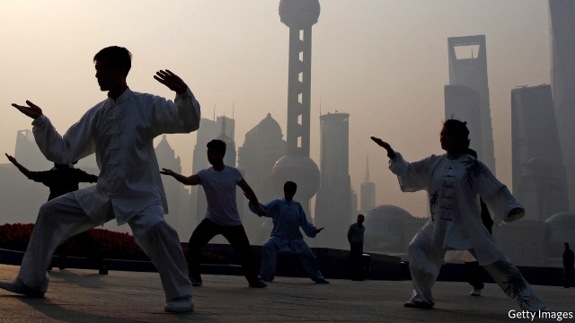
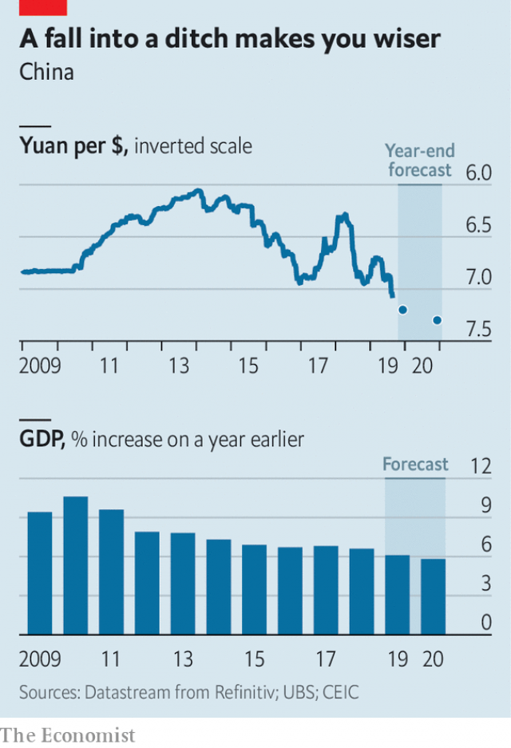

###### The other inversion

# China is calm as growth slows. But is it complacent? 

 

> print-edition iconPrint edition | Finance and economics | Aug 31st 2019 

HALF A DECADE ago, if you had asked economists which number—five or seven—described China’s GDP and which its currency, most would have answered this way: growth will remain strong at around 7% annually, and the currency will strengthen until it takes just five yuan and change to buy a dollar. One measure of the impact of Donald Trump’s trade war on China is the inversion of these digits. As American tariffs bite, economic forecasters think that Chinese growth next year will slow to five-point-something percent. The yuan, for its part, has slumped to more than seven per dollar. 

Mr Trump has crowed about the success of his tactics. “China has taken a very hard hit,” he said on August 26th at a news conference after the G7 summit in France. “They want to make a deal very badly.” But a more accurate reading of China’s policy stance is one of surprising calm in the face of the economic slowdown and, by extension, of stiffer resolve in the trade dispute. 

The toll of tariffs on China’s economy is becoming more visible. Although exports to America account for just a small share of overall GDP, the uncertainty has bruised corporate confidence. Investment spending is on track to increase this year at its weakest pace in at least two decades. Factory prices have veered into deflation, a bad sign for industrial profits. Economists at Morgan Stanley, a bank, now forecast that Chinese growth will fall to 5.8% next year; previously they had expected 6.3%. 

 

In the past, whenever growth looked set to slow sharply, Chinese companies could count on a stimulus package to revive it. But this time officials have been much more restrained in their response, partly because of concern about adding to China’s hefty debt burden. On August 26th the central bank had a chance to lower funding costs for banks, but it refrained, bucking the global trend towards lower rates. On August 27th the State Council, or cabinet, issued an underwhelming 20-point plan to promote consumption. Some analysts had been hoping for targeted tax cuts or subsidies; instead, it made small-bore promises, such as more 24-hour convenience stores. 

The Chinese government’s lack of panic about the economic outlook should give Mr Trump pause. “Its leadership now looks committed to a strategy of toughing out trade tensions,” says Andrew Batson of Gavekal, a research firm. It helps that China has procured insurance in letting its exchange rate decline to 7.1 yuan per dollar, the weakest since 2008, offsetting some of the drag from tariffs. 

But some think the calm is verging on complacency. Not only has China’s government refrained from stimulus, but it has become more hawkish about the property sector, the engine of its economy. In line with President Xi Jinping’s oft-repeated warning that investors should not speculate on housing, regulators have curtailed lending to developers and sworn off cutting mortgage rates. “We would view stabilising growth by choking credit to the property sector as analogous to performing cardiac surgery without blood pumps, oxygen and anaesthesia,” says Lu Ting, an economist with Nomura, a bank. In other words, things could get ugly. ■ 

