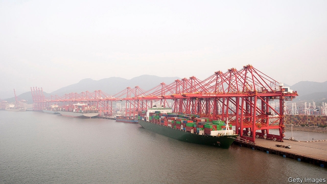
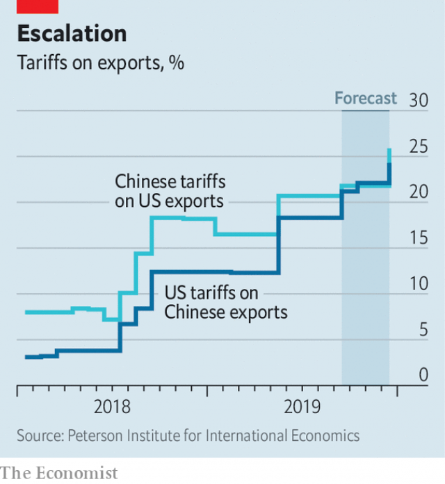

###### Trade

# Donald Trump admits to putting the world through a “rough patch” 

 

> print-edition iconPrint edition | Finance and economics | Aug 31st 2019 

“I THINK IT was necessary,” said President Donald Trump of the “rough patch” the world economy has been going through as a consequence of his shake-up of the global trade regime. His comments came on August 26th, towards the end of the G7 meeting of rich-world leaders in Biarritz, France, and a particularly bumpy series of trade announcements. There is still plenty of turbulence ahead. 

The drama started on August 23rd, when the Chinese government announced its plans for retaliation in response to an earlier tranche of American tariffs. China’s average tariff on imports from America (weighted to match America’s global exports in 2017) will rise from 20.7% to 21.8% on September 1st, and to 25.9% on December 15th (see chart), by which time 69% of America’s exports to China will be affected. 

 

Aircraft, integrated circuits and pharmaceuticals were spared, perhaps in recognition that tariffs on those would hurt China more. But previously announced tariffs on cars and car parts that had been suspended as a goodwill gesture are now to come into force in December. 

Hours later, Mr Trump hit back, accusing China of being “politically motivated” (as if he was not). He announced counter-tariffs of an extra five percentage points on over $500bn of imports from China. By the end of the year American tariffs on Chinese goods, on a weighted average, will be 24.3%, up from 3.1% before Mr Trump’s trade conflict began. Ominously, he tweeted a reference to the International Emergency Economic Powers Act of 1977, saying he could use it to go much further. As its name suggests, this law grants the president sweeping powers. Bill Clinton used it in 1997 to ban all transactions, including trade, with Sudan. 

America’s stockmarket reeled. Chinese officials boasted that they now had the upper hand, citing the sell-off as evidence that America’s trade war was a type of self-harm. But the Chinese government seemed desirous of limiting the fallout. Domestic media barely mentioned a tweet by Mr Trump in which he called the Chinese president, Xi Jinping, an “enemy”. 

Over the next couple of days Mr Trump softened his rhetoric, emphasising “meaningful talks” with China. He trumpeted progress towards a trade deal with Japan, which negotiators hope to seal in September. Robert Lighthizer, the United States Trade Representative, said it would cover industrial tariffs, digital trade and agriculture. The element that seemed to excite Mr Trump most was a Japanese promise to encourage firms to buy American corn. 

Trade tensions with the European Union also eased a little. A French tax on digital services, imposed in July, had triggered an investigation into whether American businesses were being unduly burdened. Mr Trump had threatened retaliatory tariffs on French wine. But officials hashed out a deal to avoid tit-for-tat measures, in which the French reiterated that they would remove the tax once a multilateral equivalent had been agreed and was in place, and added that they would refund companies any difference between the unilateral measure and any eventual replacement. 

Mr Trump is likely to take away from his hectic week the message that he has more leverage to reshape trade than his critics claim. Details of what was agreed during the G7 weekend are scant, but it seems that the Japanese and French both gave ground under the threat of American tariffs. It would be wrong, though, to infer that the Chinese will also do so, not least because what America is demanding of them is vastly greater. Moreover, for all Mr Trump’s sporadic boasts of being dealmaker-in-chief, his truces tend to be temporary. ■ 
<<<<<<< HEAD

-- 

 单词注释:

1.Aug[]:abbr. 八月（August） 

2.regime[rei'ʒi:m]:n. 政权, 当权期间, 政体, 社会制度, 体制, 情态 [医] 制度, 生活制度 

3.Biarritz[biә'rits]:宽袖中长手套, 双面纬向棱纹毛呢 

4.bumpy['bʌmpi]:a. 颠簸的, 崎岖不平的 

5.sery[]:n. (Sery)人名；(俄)谢雷；(科特)塞里 

6.turbulence['tә:bjulәns]:n. 混乱, 动荡, 骚乱, 紊流 [化] 湍流; 紊流 

7.retaliation[ri.tæli'eiʃәn]:n. 报复 [法] 报仇, 报复, 回敬 

8.tranche[trɑ:nʃ]:[经] 一片, 一期, 一批 

9.tariff['tærif]:n. 关税, 关税表, 价格表, 收费表 vt. 课以关税 [计] 价目表 

10.pharmaceutical[,fɑ:mә'sju:tikәl]:a. 药学的, 制药的, 药用的, 药物的, 药剂师的, 药师的 n. 药品, 成药, 药剂 

11.goodwill[^jd'wil]:n. 友好, 好意, 善意, 亲善, (企业享有的)信誉, 声誉 [经] (企业的)商誉, 信誉 

12.politically[]:adv. 政治上 

13.ominously['ɒmɪnəslɪ]:adv. 恶兆地, 不吉利地; 预示地 

14.tweet[twi:t]:vi. 啁啾 n. 小鸟叫声 

15.clinton['klintәn]:n. 克林顿（男子名） 

16.transaction[træn'sækʃәn]:n. 交易, 办理, 学报, 和解协议 [计] 事务处理 

17.Sudan[su:'dæn]:n. 苏丹 [化] 苯偶氮间苯二酚; 苏丹 

18.stockmarket[s'tɒkmɑ:kɪt]: 证券市场; 证券交易所; 证券行情 

19.cite[sait]:vt. 引用, 引证, 表彰 [建] 引证, 指引 

20.desirous[di'zaiәrәs]:a. 想要的, 想望的, 渴望的 

21.fallout['fɒ:laut]:n. 原子尘的降下, 辐射性微尘, 原子尘, 附带结果 [医] [放射尘]回降 

22.soften['sɒftn]:v. (使)变柔软, (使)变柔和 

23.rhetoric['retәrik]:n. 修辞, 修辞学, 雄辩(术) 

24.emphasise[]:vt. 强调, 重读, 加强...的语气, 着重 

25.meaningful['mi:niŋful]:a. 意味深长的 

26.negotiator[ni'gәuʃieitә]:n. 磋商者, 交涉者, 议定者 [经] 谈判者, 交易者, 协商者 

27.Robert['rɔbәt]:[法] 警察 

28.lighthizer[]:[网络] 减震器 

29.trigger['trigә]:n. 触发器, 扳机 vt. 触发, 发射, 引起 vi. 松开扳柄 [计] 切换开关 

30.unduly[.ʌn'dju:li]:adv. 不适当地, 过度地 [法] 过分的, 过度的, 不正当的 

31.retaliatory[ri'tæliәtәri]:a. 报复的 [经] 报复性的 

32.hash[hæʃ]:n. 剁碎的食物, 杂乱无章的的一大堆, 杂烩, 复述 vt. 切碎, 搞糟 

33.reiterate[ri:'itәreit]:vt. 反复地说, 重申, 反复地做 [法] 重述, 重申, 反覆地做 

34.multilateral[.mʌlti'lætәrәl]:a. 多边的, 多国的 [经] 多边的, 涉及多方的 

35.refund['ri:fʌnd]:n. 偿还 vt. 付还, 偿还借款 vi. 归还, 偿还 

36.unilateral[.ju:ni'lætәrәl]:a. 单方面的, 单边的, 片面的 [医] 单侧的, 一侧的 

37.eventual[i'ventʃuәl]:a. 最后的, 终于的 

38.replacement[ri'pleismәnt]:n. 归还, 更换, 代替者 [医] 复位, 置换 

39.hectic['hektik]:a. 脸上发红, 发热的, 潮热的, 肺病的 n. 脸红, 潮热病人 

40.reshape[ri:'ʃeip]:vt. 改造, 使成新的形状, 打开新局面 vt. 整形 vi. 整形 [计] 整形 

41.scant[skænt]:a. 不充分的, 不足的 vt. 减少, 吝啬, 限制, 藐视, 忽略 

42.vastly['vɑ:stli]:adv. 广大地, 许多, 巨大 

43.sporadic[spәu'rædik]:a. 偶尔发生的, 零星发生的, 分散的 [医] 散在的, 散发的 

44.truce[tru:s]:n. 停战, 休战 vi. 停战, 休止 vt. 以休战结束 
=======
>>>>>>> 50f1fbac684ef65c788c2c3b1cb359dd2a904378

