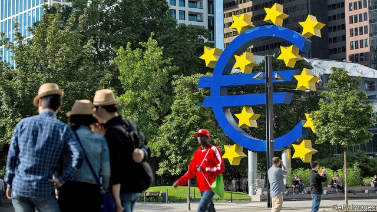

###### Dear prudence

# Germany debates banning negative interest rates 

 

> print-edition iconPrint edition | Finance and economics | Aug 31st 2019 

“SAVE OUR savings, Frau Merkel!” begged Bild, a German tabloid, on August 26th. Articles blaming the European Central Bank (ECB) for keeping interest rates low, and seeking reassurances from banks that thrifty Germans will be spared Strafzinsen, or negative “penalty rates”, are proliferating. One in Die Welt in July feared that ECB stimulus would lead to the “ultimate expropriation” of the German saver. 

German hostility to low interest rates is hardly surprising. The value of thrift has deep roots in the national psyche, going back to the Reformation. Households have €2.4trn ($2.6trn) stashed in bank deposits, almost as much as those in France and Italy combined. Last year they squirrelled away a tenth of their disposable income, twice the savings rate of Britons. 

With markets pricing in a further cut at the ECB’s policy meeting on September 12th, the opposition in Germany is getting louder. Politicians spy a bandwagon. On August 21st Markus Söder, Bavaria’s premier, said his party would propose legislation to ban negative interest rates on retail deposits of less than €100,000. Olaf Scholz, the federal finance minister, has asked officials to look into the practicalities. 

The ECB and its German critics have clashed before. Indeed, a lawsuit claiming that the bank’s quantitative-easing scheme overstepped its legal mandate is making its way through Germany’s constitutional court. But it is unusual for the finance ministry to tread on monetary-policy turf. It seems particularly so as Germany’s economy teeters on the brink of recession. 

With unemployment at a record low and wages rising, though, Germans feel little need for stimulus just yet, says Marcel Fratzscher, the head of DIW, a think-tank. He sees the politicians’ proposals as “purely populist”. Regional elections are looming, so it pays to curry favour with savers. 

And for all the sound and fury, negative rates for retail depositors appear some way off. The central bank’s deposit rate is -0.4%, meaning that rather than paying interest on the reserves kept with it by lenders, it charges to hold them. Some banks have passed those negative rates on to corporate clients, and a smaller fraction have done so to wealthy retail clients, many of whom appear reluctant to move their money elsewhere, even when squeezed. But Vítor Constâncio, a former ECB official, told Der Spiegel he doubted whether banks would offer negative interest rates for ordinary retail depositors. That might be because those customers are bigger flight risks. 

Banks themselves detest negative rates, which reduce the amount they can earn from interest. The Association of German Banks (BDB) says lenders in Germany paid €2.3bn to the ECB last year, equivalent to nearly a tenth of profits for 2017. But it is also horrified by the prospect of the government setting a floor on retail interest rates. That could restrict banks’ room for manoeuvre and, the BDB warns, cause financial disruption. (The ECB is considering other ways to ease the squeeze on banks’ interest margins, such as exempting some reserves from negative rates.) 

The backlash may indicate that the ECB should be wary of the costs of cutting rates further. The risk is that depositors stash their savings under mattresses rather than in banks. Even so, the ECB can reasonably feel irked by the stance of German officials. As Mr Constâncio pointed out, the root cause of low interest rates in the euro area is an excess of saving over spending. Germans’ obsession with frugality bears much of the blame. 
<<<<<<< HEAD

-- 

 单词注释:

1.prudence['pru:dns]:n. 审慎, 慎重, 精明, 节俭 

2.Aug[]:abbr. 八月（August） 

3.frau[frau]:n. （德）夫人；已婚的女人 

4.bild[]:n. 图片报（德国报纸名称） 

5.tabloid['tæblɒid]:n. 小报, 小型画报, 药片, 文摘 a. 轰动性的, 扼要的, 缩略的, 小报式的 

6.ECB[]:[计] 事件控制块 

7.reassurance[.ri:ә'ʃurәns]:n. 安心, 放心, 再保证 

8.thrifty['θrifti]:a. 节俭的, 兴旺的, 繁茂的 

9.penalty['penәlti]:n. 处罚, 刑罚, 罚款, 罚球, 报应, 不利结果, 妨碍 [经] 罚金(款), 违约金 

10.proliferate[prәәu'lifәreit]:vi. 增殖, 激增, 扩散 vt. 使激增 

11.welt[welt]:n. 贴边, 鞭痕, 殴打 vt. 加贴边, 鞭打 

12.stimulus['stimjulәs]:n. 刺激, 激励, 刺激品 [医] 刺激特, 刺激 

13.expropriation[eks.prәupri'eiʃәn]:n. 征用, 收用, 征收 [经] 征用, 没收, 征购 

14.saver['seivә]:n. 节省...的器具, 节约装置, 省俭的人 [化] 回收器; 收集器 

15.hostility[hɒs'tiliti]:n. 敌意, 敌对, 反对 

16.thrift[θrift]:n. 节约, 茂盛, 海石竹 

17.psyche['psaiki]:n. 灵魂, 精神, 普赛克(希腊神话中人类灵魂的化身) [医] 精神, 心灵 

18.reformation[.refә'meiʃәn]:n. 改革, 改正, 重新形成, 重新组成 

19.stash[stæʃ]:vt. 藏起来 n. 隐藏处, 隐藏物 

20.disposable[dis'pәuzәbl]:a. 可任意处理的 [法] 可任意处理或处置的, 可自由使用的 

21.Briton['britәn]:n. 大不列颠人, 英国人 

22.opposition[.ɒpә'ziʃәn]:n. 反对, 敌对, 相反, 在野党 [医] 对生, 对向, 反抗, 反对症 

23.bandwagon['bænd.wægәn]:n. 乐队彩车, 流行 

24.MARKUS[]:n. 马库斯（姓氏） 

25.les[lei]:abbr. 发射脱离系统（Launch Escape System） 

26.olaf['әulәf, 'ɔl-]:n. 奥拉夫（男子名） 

27.scholz[]:n. (Scholz)人名；(瑞典)斯科尔茨；(英)肖尔茨 

28.practicality[.prækti'kæliti]:n. 实际性, 实用性, 实际事物 

29.clash[klæʃ]:n. 冲突, 撞击声, 抵触 vi. 冲突, 抵触 vt. 使发出撞击声 [计] 对撞 

30.lawsuit['lɒ:sju:t]:n. 诉讼 [法] 诉讼, 诉讼案件 

31.overstep[.әuvә'step]:vt. 踏过, 逾越, 超出...的限度 [法] 违犯, 逾越 

32.mandate['mændeit]:n. 命令, 指令, 要求 vt. 委任统治 

33.constitutional[.kɒnsti'tju:ʃәnl]:a. 宪法的, 立宪的, 体质的 [医] 全身的; 体质的 

34.tread[tred]:n. 踏, 步态, 梯级, 交尾, 鞋底 vi. 踏, 行走, 交尾 vt. 踩, 踏, 践踏, 跳(舞) 

35.turf[tә:f]:n. 草皮, 泥炭, 跑马场 vt. 覆草皮于 

36.teeter['ti:tә]:vi. 步履不稳地走动, 踉跄, 摇晃, 摇摆不定, 摇摇欲坠, 玩跷跷板 n. 踉跄, 摇摆, 跷跷板 

37.brink[briŋk]:n. 边缘, 陡岸 

38.recession[ri'seʃәn]:n. 后退, 凹处, 衰退, 归还 [医] 退缩 

39.marcel[mɑ:'sel]:n. 波浪形鬈发 vt. 把...烫成波浪形 vi. 烫发 

40.DIW[]:舰船在水上静上不动 

41.Populist['pɔpjulist]:n. 民粹派的成员 

42.regional['ri:dʒәnәl]:a. 地方的, 地域性的 [医] 区的, 部位的 

43.loom[lu:m]:n. 织布机, 若隐若现的景象 vi. 朦胧地出现, 隐约可见, 可怕地出现 

44.curry['kʌri. 'kә:ri]:n. 咖哩粉, 咖哩饭菜 vt. 用咖哩粉调味, 用马梳梳, 制革 

45.fury['fjuri]:n. 愤怒, 狂暴, 狂怒的人 [医] 狂乱, 狂暴, 狂怒 

46.depositor[di'pɒzitә]:n. 存放者, 存款人 [经] 存款人, 储户, 委托人 

47.lender['lendә]:n. 出借人, 贷方 [经] 出借者, 贷方, 贷款人 

48.corporate['kɒ:pәrit]:a. 社团的, 合伙的, 公司的 [经] 团体的, 法人的, 社团的 

49.client['klaiәnt]:n. 客户, 顾客, 委托人 [计] 客户, 客户机, 客户机程序 

50.der[]:abbr. 区分编码规则（Distinguished Encoding Rules） 

51.spiegel['spi:^әl]:[机] 镜铁 

52.detest[di'test]:vt. 厌恶, 憎恨 

53.BDB[]:[=bis-diazotized-benzidine]双重氮化联苯胺,双偶氮联苯胺 

54.horrify['hɒrifai]:vt. 使恐惧, 使震惊 

55.manoeuvre[mә'nu:vә]:n. 调遣, 演习, 策略 vi. 调动, 演习, 用策略 vt. 调动, 操纵 

56.disruption[dis'rʌpʃәn]:n. 分裂, 崩溃, 瓦解 

57.exempt[ig'zempt]:n. 免税者, 被免除义务者 a. 免除的 vt. 使免除, 豁免 

58.backlash['bæklæʃ]:n. 后冲, 强烈反对 [电] 反撞, 逆栅流 

59.wary['wєәri]:a. 谨慎的, 小心的, 机警的, 周到的, 唯恐的 

60.mattress['mætris]:n. 床垫, 空气垫, 沉床 [医] 褥子, 床垫 

61.reasonably['ri:znәbli]:adv. 适度地, 相当地 

62.irk[ә:k]:vt. 使厌倦, 使苦恼 

63.stance[stæns]:n. 准备击球姿势, 站立的姿势, 位置, 姿态 [经] 地位, 形势 

64.euro['juәrәu]:n. 欧元（欧盟的统一货币单位） 

65.obsession[әb'seʃәn]:n. 困扰, 困扰人的情绪 [医] 强迫观念 

66.frugality[fru:'gæliti]:n. 节俭, 俭省 
=======
>>>>>>> 50f1fbac684ef65c788c2c3b1cb359dd2a904378

