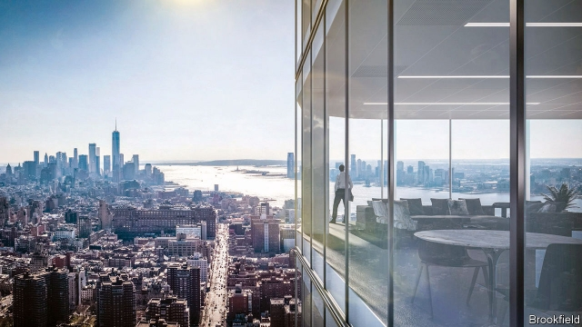

###### Tower grab

# How a Canadian firm has taken on Wall Street’s private-equity titans 

 

> print-edition iconPrint edition | Finance and economics | Aug 31st 2019 

ON THE 67TH floor of One Manhattan West, a new glass tower in the island’s drab south-west, construction managers survey the skyline. They are about to sign off on a feat of engineering. The 303-metre skyscraper is the tallest part of a $5bn office, retail and residential project covering an area the size of 100 football fields. Resting on a huge concrete slab covering active rail tracks, the weight is carried by a column sitting on the sturdiest parts. The first tenants are due to move in within weeks. 

One Manhattan West is the culmination of a decades-long bet by Brookfield Asset Management. The Canadian firm bought the land in 1996 as part of its swoop on Olympia and York, a bankrupt builder. The towers are an apt metaphor for its success in alternative asset management, investing in the likes of property, infrastructure and private equity. With $388bn under management (debt included), it rivals Wall Street giants like Blackstone and Carlyle. Insiders reckon it can grow further. 

Most buy-out giants were founded in recent decades by investment bankers. Brookfield, by contrast, started with São Paulo’s tramway and power lines in 1899 and spent most of its history operating infrastructure and property projects in the Americas. By 1990 it was a conglomerate of “somewhat disparate assets”, says Neil Downey of RBC Capital Markets, a bank, spanning beer, baseball, forests, mines and more. After it struggled during the recession of the early 1990s a team of executives that included Bruce Flatt, now the boss, narrowed the focus. 

A decade later Brookfield started to invest third-party money. In the mid-2000s it began to raise private funds for property, infrastructure, private equity and renewables. It then listed its public funds on the New York Stock Exchange (it is listed in Amsterdam, New York and Toronto). The strategy took time to reap rewards. “Going into the financial crisis, it was a strong company. But it was relatively small,” says David Hodes of Hodes Weill, a firm that helps funds find investors. Some investors were confused by its complex structure, with the parent firm, listed vehicles and private funds all hunting for deals. 

But the crisis proved a boon. After several peers collapsed under debt built up during the boom years, Brookfield could draw on private and public capital to pick up the pieces. Experienced at turnarounds, it snapped up at a discount projects others thought too troubled. It was also lucky with timing, Mr Flatt says. As central banks’ bond-buying sprees hammered returns on the safest assets, the sorts of tangible, cash-generating projects that Brookfield runs became popular with cautious investors like insurers and pension funds. 

Investing other people’s money is now its biggest business. It earns fees on $164bn of third-party capital, four times as much as it invests from its balance-sheet. Sohrab Movahedi of BMO, a bank, reckons that will rise to $276bn by 2021. More than 700 institutions back its private funds. Its investments span more than 30 countries and punctuate skylines in financial capitals including London, Sydney and Toronto. The retail space it owns would fill two New York Midtowns. It runs 37 ports and more than 10,000km of rail tracks. Its renewables plants produce twice as much clean energy as green-minded Denmark. 

 

Another recession could provide another boost. It has ample liquidity (see chart). Completion of its $4.7bn acquisition of Oaktree Capital, a credit-investment firm, is imminent. That will cement its position as a one-stop shop for alternative assets, at a time when investors are seeking to consolidate their holdings. When growth fades it will be able to seek high rewards by buying the debt of ailing businesses, Oaktree’s speciality. “When people panic they sell things too cheap,” says Howard Marks, Oaktree’s co-founder. “And when the environment settles down, prices tend to recover. It’s a good way to make a living.” 

Could Brookfield be getting greedy? Like other buy-out firms, it is raising record amounts, leading some to worry that capital is coming in too fast to be spent without mistakes. And though Mr Flatt argues that Brookfield’s size means it can gobble up assets that many rivals would find indigestible, there is the matter of eventually exiting these mega-projects, says Lincoln Webb of British Columbia Investment Management Corporation, a client of Brookfield’s infrastructure franchise. Just as few can buy mega-projects, there might be limited takers when it comes to sell, should that coincide with poor conditions for initial public offerings. 

Yet by private-equity standards Brookfield’s funds have long durations, and the largest are nowhere near maturity. Its access to public equity also means it can be patient, as it was for the years it held the disused plot that is now home to One Manhattan West. And institutional investors in its funds with long-term liabilities may be keen to team up for the cash-yielding assets it will want to divest. As economic clouds gather, Brookfield’s horizons look enviably clear. ■ 

-- 

 单词注释:

1.grab[græb]:n. 抓握, 掠夺, 强占, 东方沿岸帆船 vi. 抓取, 抢去 vt. 攫取, 捕获, 霸占 

2.Titan['taitn]:n. 提坦, 太阳神, 巨人 

3.Aug[]:abbr. 八月（August） 

4.Manhattan[mæn'hætәn]:n. 曼哈顿 

5.drab[dræb]:a. 土褐色的, 单调的 

6.skyline['skailain]:n. 天涯, 地平线, 空中轮廓线 

7.feat[fi:t]:n. 壮举, 功绩, 技艺表演 a. 灵巧的, 合适的, 整洁的 

8.residential[.rezi'denʃәl]:a. 住宅的, 与居住有关的 [法] 有关居住的, 房产的:居所的, 适于居住的 

9.slab[slæb]:n. 平板, 厚片 vt. 切成厚板, 以平板盖上 

10.sturdy['stә:di]:a. 强健的, 健全的 [医] 羊晕倒病, 羊蹒跚病 

11.culmination[.kʌlmi'neiʃәn]:n. 顶点, 高潮, 最高点 

12.Brookfield['bruk,fi:ld]:n. 布鲁克菲尔德（美国城市）；博勒菲（公司名） 

13.asset['æset]:n. 资产, 有益的东西 

14.swoop[swu:p]:n. 俯冲, 攫取 vt. 抓取 vi. 猛扑, 突然袭击 

15.Olympia[әu'limpiә]:n. 奥林匹亚 

16.york[jɔ:k]:n. 约克郡；约克王朝 

17.bankrupt['bæŋkrʌpt]:n. 破产者 a. 破产的 vt. 使破产 

18.builder['bildә]:n. 建立者 [机] 组份 

19.apt[æpt]:a. 有...倾向的, 易于的, 恰当的, 聪明的 [计] 自动数控语言, 自动图象传输, 自动程序控制, 自动程序设计工具 

20.metaphor['metәfә]:n. 隐喻 

21.asset['æset]:n. 资产, 有益的东西 

22.infrastructure['infrәstrʌktʃә]:n. 基础结构, 基础设施 [经] 基础设施 

23.equity['ekwiti]:n. 公平, 公正 [经] 权益, 产权 

24.Blackstone[]:n. 百仕通集团（即黑石集团, 全球最大私募基金公司）；布莱克斯通（英国前文化部长）；黑石镇（美国马萨诸塞州的一个镇） 

25.Carlyle[kɑ:'lail]:n. 卡莱尔 

26.insider['in'saidә]:n. 内部的人, 权威人士, 知道内情的人 [经] 熟悉内情者 

27.reckon['rekәn]:vt. 计算, 总计, 估计, 认为, 猜想 vi. 数, 计算, 估计, 依赖, 料想 

28.banker['bæŋkә]:n. 银行家, 庄家 [经] 银行业者, 银行家 

29.tramway['træmwei]:n. 有轨电车路线, 电车道, (有轨)电车, (吊车)索道 

30.conglomerate[kәn'glɒmәrit]:a. 聚成球形的, 砾岩性的 n. 集成物, 混合体, 砾岩 v. (使)凝聚成团 

31.disparate['dispәrәt]:a. 根本不同的, 全异的, 不相干的 n. 无法相比的东西(或人) 

32.neil[]:n. 尼尔（男子名） 

33.Downey['dauni]:n. 唐尼（美国城市）；唐尼（姓氏） 

34.RBC[]:红血球, 红细胞 [医] 红细胞计数 

35.recession[ri'seʃәn]:n. 后退, 凹处, 衰退, 归还 [医] 退缩 

36.Bruce[bru:s]:n. 布鲁斯 

37.flatt[]:abbr. Federacion Latinoamericana de Trabajadores del Transporte （西班牙语）拉丁美洲运输工人联合会 

38.renewable[ri'nju(:)әbl]:a. 可更新的, 可恢复的, 可继续的, 可换新的, 可重复的, 可重说的 [计] 可更新, 可再生的 

39.Amsterdam[.æmstә'dæm]:n. 阿姆斯特丹(荷兰首都) 

40.toronto[tә'rɔntәu]:n. 多伦多（加拿大城市） 

41.david['deivid]:n. 大卫；戴维（男子名） 

42.hodes[]: [人名] 霍兹 

43.Weill[]:韦尔（人名） 

44.investor[in'vestә]:n. 投资者 [经] 投资者 

45.boon[bu:n]:n. 恩惠 

46.peer[piә]:n. 同等的人, 匹敌, 贵族 vi. 凝视, 窥视, 费力地看, 隐现 vt. 与...同等, 封为贵族 

47.turnaround['tә:nә.raund]:n. 转向, 回车道, 转变 [化] 小修; 预防(性)修理 

48.timing['taimiŋ]:n. 时间选择, 时间测定, 定时, 调速 [计] 定时器时钟 

49.spree[spri:]:n. 戏耍, 喧闹, 宴会, 狂饮 vi. 狂欢, 狂饮 

50.tangible['tændʒәbl]:n. 可触知的东西, 有形资产 a. 可触摸的, 有实体的, 非相像的, 有形的, 明确的 

51.insurer[in'ʃuәrә]:n. 保险公司 [法] 保险人, 承保人, 保险公司 

52.sohrab[]:[网络] 拉博；索拉博；苏赫拉布 

53.bmo[]:abbr. 蒙特利尔银行（Bank of Montreal）；弹道导弹局（Ballistic Missile Office） 

54.sydney['sidni]:n. 悉尼（澳大利亚港市） 

55.midtown['midtajn]:n. 商业区与住宅区之间的地区 

56.Denmark['denmɑ:k]:n. 丹麦 

57.liquidity[li'kwiditi]:n. 流动性, 流畅 [经] 流动性 

58.completion[kәm'pli:ʃәn]:n. 完成 [经] 完井, 结束, 完工 

59.oaktree[]:[网络] 橡树资本；橡树资本公司；橡树公司 

60.imminent['iminәnt]:a. 即将来临的, 逼近的 

61.consolidate[kәn'sɒlideit]:vt. 巩固, 使联合, 统一 vi. 巩固 [计] 合并计算 

62.holding['hәuldiŋ]:n. 把持, 支持, 保持 [法] 租借地, 占有物, 拥有的财产 

63.ailing['eiliŋ]:a. 生病的 [医] 患病的, 病痛的 

64.howard['hauәd]:n. 霍华德（男子名） 

65.gobble['gɒbl]:n. 火鸡叫声 vt. 狼吞虎咽 vi. 贪食, 咯咯叫 

66.indigestible[.indi'dʒestәbl]:a. 不消化的, 难消化的, 难理解的 [医] 不消化的 

67.Lincoln['liŋkәn]:n. 林肯 

68.webb[]:n. 韦勃（人名）；威布市（美国密苏里州的城市名） 

69.Columbia[kә'lʌmbiә]:n. 哥伦比亚 

70.client['klaiәnt]:n. 客户, 顾客, 委托人 [计] 客户, 客户机, 客户机程序 

71.franchise['fræntʃaiz]:n. 公民权, 特权, 特许经营权, 免赔额 vt. 给以特权, 给以...公民权 

72.taker['teikә]:n. 取者, 捕者, 接受者, 收取者 [法] 受者, 收票人, 接受打赌的人 

73.coincide[.kәuin'said]:vi. 一致, 符合 [化] 重合 

74.offering['ɒfәriŋ]:n. 提供, 奉献物, 牲礼, 上市的股票(或证券等) [经] 出售物 

75.maturity[mә'tjuәriti]:n. 成熟, 完备, 到期 [医] 成熟, 成熟期, 发育期 

76.disused[]:a. 不用, 废弃 

77.institutional[.insti'tju:ʃәnәl]:a. 制度的, 公共机构的, 学会的 [法] 组织机构的, 制度的, 公共机构的 

78.liability[laiә'biliti]:n. 责任, 债务, 倾向 [经] 责任, 义务, 负债 

79.divest[dai'vest]:vt. 使摆脱, 使脱去, 夺去 [经] 取消权力 

80.enviably['envɪəblɪ]:adv. 令人羡慕地; 羡慕地, 渴望得到地 

