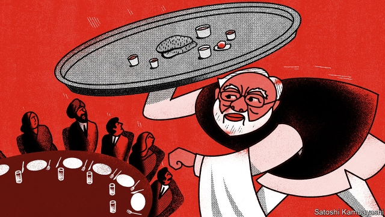
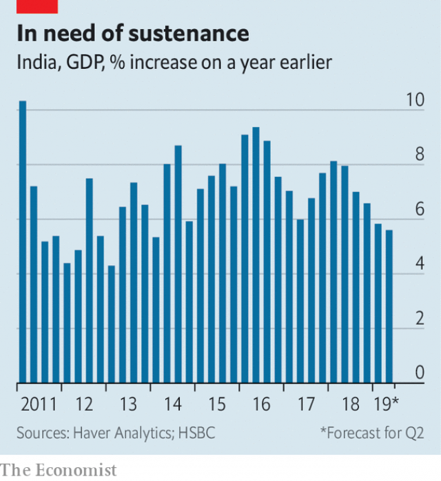

###### Meagre fare

# India’s government is scrambling to revive the economy 

 

> print-edition iconPrint edition | Finance and economics | Aug 31st 2019 

FOR DECADES Kwality restaurant has served spiced chickpeas and fried flatbreads to traditionalists and tourists amid the colonnades of central Delhi. One prominent fan was Arun Jaitley, a former finance minister and foodie, who would drop in for an impromptu lunch when parliament was disrupted. It is fitting, therefore, that Kwality’s wood-panelled shelves hold bound copies of Excise Law Times, a journal about some of the country’s Byzantine taxes. 

When Mr Jaitley died on August 24th after a long period of ill-health, the great and good from across India’s fierce political divides joined in praising his intellect and civility. But the economy he presided over for most of Narendra Modi’s first term as prime minister has shown no such sense of decorum. Figures due on August 30th are expected to show growth of less than 6% year-on-year for the second quarter in a row. India has not had such a poor run since early 2013 (see chart), during a period of policy paralysis that helped destroy the previous government. 

 

In the years since, economists have waited with growing exasperation for investment spending to stage a decisive recovery. The capital-expenditure cycle has always been about to turn, without ever quite doing so. And now consumer spending has faltered. Car sales plummeted by over 30% in the year to July, the fastest drop in 19 years. Nor were small-ticket items spared. Parle, the country’s largest biscuit-maker, has warned that it may have to lay off up to 10,000 people thanks to poor demand. Its rival, Britannia, complains that rural consumers are hesitating to buy even a five-rupee ($0.07) packet of biscuits. 

During Mr Modi’s first term, investors also waited anxiously for India’s banks to recover from the reckless lending of the boom years before 2012. But just as their non-performing assets began to fall (from over 11% of the total in March 2018 to 9.3% a year later), trouble befell another group of lenders, non-bank financial companies (NBFCs). These raise money from the capital markets, among other sources, and lend it to households and companies ill-served by deposit-taking banks. 

A year ago Infrastructure Leasing and Financial Services, a sprawling, strongly rated NBFC with 348 subsidiaries, defaulted. That spread alarm through the financial system. Other lenders found it harder to roll over the short-term debt with which they had financed their rapid growth. Dewan Housing Finance Corporation, which lent to homebuyers and property developers, defaulted in June, complaining that it could not raise fresh funding after its credit rating fell. “Illiquidity is turning into insolvency,” said Rajiv Kumar, head of NITI Aayog, a government think-tank, at a recent conference. “The entire financial sector is in a churn and nobody is trusting anybody else.” 

This financial churn has exacerbated the economic slowdown. Notably, it has interrupted the flow of credit to carbuyers. But some economists think the problems run deeper. Goldman Sachs, for example, traces the deceleration back to the start of 2018 or even earlier. Mr Jaitley’s signature achievement as finance minister may bear part of the blame. His negotiating nous helped secure the introduction of the Goods and Services Tax, a levy on consumption, in 2017 (forcing a companion journal to Excise Law Times to change its name to  gst Law Times). Intended as a radical tax simplification, it has proved complex and cumbersome in practice. The biscuit-makers blame it for putting off customers. Small companies complain about long waits for refunds of the GST they pay on their inputs. 

The government has been slow to acknowledge the severity of the slowdown. The July budget, which imposed a higher tax (or “enhanced surcharge”) on foreign investors, was not calculated to revive animal spirits. When the stockmarket subsequently dropped, Nirmala Sitharaman, Mr Jaitley’s successor as finance minister, said she did not let it “affect her calms”. 

Perhaps sensing that this lack of alarm was having the opposite effect on everyone else, the government has unveiled a plethora of measures intended to revive the economy. It relaxed a local-sourcing requirement for foreign retail brands like Apple and IKEA. It unenhanced the foreign-investor surcharge and removed an “angel tax” on the funds raised by startup firms. It will try to revive the car industry by buying more vehicles for its departments. It will urge public-sector enterprises to pay suppliers more punctually and cough up GST refunds within 30 days. 

To help non-bank lenders, it will enable them to offload more of their assets by guaranteeing a greater quantity of loans that are bundled into securities and sold. Its National Housing Bank will give extra support to illiquid housing lenders. Aided by the handover of 1.7trn rupees ($24bn) in profits and excess capital from the central bank (see article), it will also hasten to inject a previously announced sum of 700bn rupees of fresh capital into public-sector banks. That would, according to S&P Global Ratings, be “sufficient for now”. 

The response was piecemeal, lacking a grand plan, strategic vision or large-scale mobilisation of public money. But for now, corporate India will settle for a government that has belatedly seen fit to respond to its complaints. In terms Mr Jaitley might have appreciated, this was not a slow-cooked feast that anyone would savour, but a thali, a platter of mixed dishes, offered in the hope of keeping everyone going. ■ 

