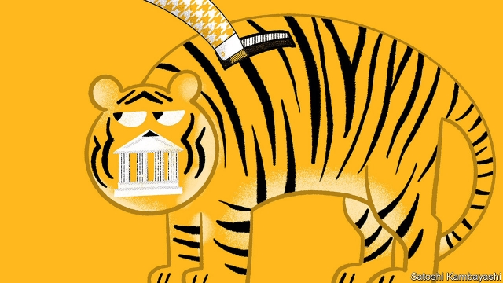

###### Ravaged Bank of India?

# Narendra Modi’s government dips into central-bank reserves 

 

> print-edition iconPrint edition | Finance and economics | Aug 31st 2019 

MOST CENTRAL banks occupy impressive premises in expensive parts of town. Few begrudge them this perk. Nice digs seem only fitting for the guardians of the nation’s currency, giving them a reassuring air of gravitas and permanence. But is grand architecture necessary for central banks to perform their functions? Is there any economic justification for it? The honest answer is no. 

What is true of central-bank architecture is also true of central-bank capital. Most such institutions have reassuring balance-sheets. Their assets, which usually comprise safe government securities, comfortably exceed their liabilities, which are chiefly the banknotes they issue and the deposits held with them by commercial banks. The assets of the Reserve Bank of India (RBI), for example, exceed its liabilities by over 9trn rupees ($125bn), of which about 2.7trn rupees is ready to hand. 

This balance-sheet is a source of pride, allowing the institution to feel financially independent. Thus when Narendra Modi’s government began to argue that it was too lavishly capitalised, the RBI was displeased. And when the finance ministry concluded last year that it should give some of its excess capital to the government, which was keen to shore up public-sector commercial banks, the RBI resisted. The tussle was one reason why Urjit Patel, then its governor, resigned. 

The central bank asked Bimal Jalan, a former governor, to consider the issue further. This week his committee recommended that the RBI reduce its risk buffer to 5.5-6.5% of its balance-sheet. Now under more pliant leadership, it promptly reduced the buffer to the bottom of that range, enabling it to hand over 526bn rupees in addition to a bumper dividend of over 1.2trn rupees. Rahul Gandhi, an opposition leader, accused the government of stealing from the RBI. A former minister said the institution had been left no room to intervene in a crisis. Another critic said Mr Modi had “converted the R in RBI from ‘Reserve’ to ‘Ravaged’”. 

Lost amid this political controversy was the deeper economic question of whether central banks need capital at all. They cannot go bust. Their liabilities are the money they issue. But that money is simply a promise to pay money. Their creditors already hold the thing they are owed. Central banks’ assets are also peculiar. The principal one is their licence to print money that people will accept in exchange for real resources. This right to earn seigniorage, as it is called, is worth a lot, even if their money-printing is constrained by the need to keep inflation in check. 

Mr Jalan’s committee argues that central banks do need strong financial positions to carry out their business. But its justifications mostly boil down to perceptions: central-bank capital matters because people think it does. That can include central bankers. If a central bank fears negative equity, it may sacrifice other macroeconomic goals to protect its financial position. But if this phobia distorts their work, perhaps they should work harder to shed their fear. 

Several central banks have functioned well for years with liabilities that greatly exceed their assets. Often they have accumulated large stocks of foreign-exchange reserves, which fall in value relative to their domestic currency when it appreciates. In these cases, then, the central bank suffers capital losses because of growing, not diminishing, confidence in its money. Take the Bank of Thailand (BOT). It says emphatically in its financial statements that its “accumulated loss has no impact on the continued operation of the BOT”. And indeed inflation in Thailand is less than 1%. Perhaps it helps that the BOT’s handsome premises are valued at over $200m.■ 
<<<<<<< HEAD

-- 

 单词注释:

1.ravage['rævidʒ]:n. 破坏, 蹂躏 v. 毁坏, 破坏, 掠夺 

2.narendra[]:[网络] 纳伦德拉；纳兰德；纳然陀 

3.Aug[]:abbr. 八月（August） 

4.premise['premis]:n. 前提, 房屋连地基, 上述各项 vt. 预先提出, 引出, 作为...的前提 vi. 作出前提 

5.begrudge[bi'grʌdʒ]:vt. 嫉妒, 羡慕, 勉强允给, 吝惜 

6.perk[pә:k]:vi. 昂首, 振作, 举止高傲, 神气活现, 滤煮 vt. 竖起, 打扮, 使振作, 滤煮 n. 小费 

7.guardian['gɑ:diәn]:n. 看守者, 监护人, 保护人 a. 保护的 

8.reassure[.ri:ә'ʃuә]:vt. 使...安心, 向...再保证 [法] 重新保证, 再保险, 使清除疑虑 

9.gravita[]:[网络] 严谨 

10.permanence['pә:mәnәns]:n. 永久, 持久, 固定性 [法] 永久性, 持久性 

11.justification[.dʒʌstifi'keiʃәn]:n. 辩护, 证明正当, 释罪 [计] 调整 

12.asset['æset]:n. 资产, 有益的东西 

13.comfortably['kʌmfәtәbli]:adv. 安乐地, 舒服地, 宽裕地 

14.liability[laiә'biliti]:n. 责任, 债务, 倾向 [经] 责任, 义务, 负债 

15.chiefly['tʃi:fli]:adv. 主要地 

16.banknote['bæŋknәut]:n. 钞票 

17.RBI[,ɑ:bi:'ai,'ribi]:abbr.[棒球] Run Batted In ,打点 

18.rupee[ru:'pi:]:n. 卢比(印、巴等国货币单位) 

19.financially[]:adv. 金融上；财政上 

20.lavishly['læviʃli]:adv. 浪费地, 丰富地 

21.capitalise['kæpitәlaiz]:vt. 用大写字母写, 用大写字母印, 投资于, 使变为资本, 提供资本给 vi. 利用 

22.tussle['tʌsl]:n. 扭打, 争斗, 论争 vi. 扭打, 打斗 

23.Patel[]:n. 帕特尔（姓氏） 

24.Bimal[]:[网络] 比玛 

25.jalan[]:n. （马来西亚）道路 n. (Jalan)人名；(蒙)扎兰；(阿拉伯)贾兰 

26.buffer['bʌfә]:n. 缓冲器, 缓冲区 vt. 缓冲 [计] 缓冲区, 缓冲器 

27.pliant['plaiәnt]:a. 易弯的, 柔韧的, 柔顺的 

28.promptly['prɒmptli]:adv. 敏捷地, 迅速地 

29.bumper['bʌmpә]:n. 缓冲器, 满杯 a. 大胜利的 

30.dividend['dividend]:n. 被除数, 股利 [计] 被除数 

31.rahul[]:n. 拉胡尔（人名） 

32.Gandhi['gændi:]:n. 甘地 

33.opposition[.ɒpә'ziʃәn]:n. 反对, 敌对, 相反, 在野党 [医] 对生, 对向, 反抗, 反对症 

34.intervene[.intә'vi:n]:vi. 插入, 调停, 干涉 [经] 进场干预 

35.MODI['mәudai]:[计] 模块化光学数字接口 

36.R[ɑ:(r)]:[计] 半径, 比例, 读, 接收, 寄存器, 复位, 电阻, 程式 

37.amid[ә'mid]:prep. 在其间, 在其中 [经] 在...中 

38.controversy['kɒntrәvә:si]:n. 论争, 辩论, 论战, 争论 [法] 论战, 争论, 争吵 

39.cannot['kænɒt]:aux. 无法, 不能 

40.bust[bʌst]:n. 半身像, 胸部, 失败, 殴打 vt. 使爆裂, 使破产 vi. 爆裂, 破产 [计] 操作错 

41.creditor['kreditә]:n. 债权人 [法] 债权人, 债主, 贷方 

42.seigniorage['si:njәridʒ]:n. 领主特权, 硬币铸造税 [经] 银币(金币)铸造税, 银币(金币)铸造利差 

43.constrain[kәn'strein]:vt. 强迫, 限制, 关押 

44.inflation[in'fleiʃәn]:n. 胀大, 夸张, 通货膨胀 [化] 充气吹胀; 膨胀 

45.banker['bæŋkә]:n. 银行家, 庄家 [经] 银行业者, 银行家 

46.equity['ekwiti]:n. 公平, 公正 [经] 权益, 产权 

47.macroeconomic[-mik]:n. 整体经济 

48.phobia['fәubiә]:n. 恐怖病, 恐惧症, 惧怕, 憎恶 [医] 恐怖[症] 

49.distort[dis'tɒ:t]:vt. 扭曲, 歪曲 [法] 歪区, 曲解, 纂改 

50.diminish[di'miniʃ]:v. (使)减少, (使)变小 

51.Thailand['tailәnd]:n. 泰国 

52.BOT[bɔt]:[计] 磁带开始标志, 计算机角色 [医] 肤蝇[类]幼虫 

53.emphatically[im'fætikәli]:adv. 强调地, 着重地 

54.les[lei]:abbr. 发射脱离系统（Launch Escape System） 
=======
>>>>>>> 50f1fbac684ef65c788c2c3b1cb359dd2a904378

