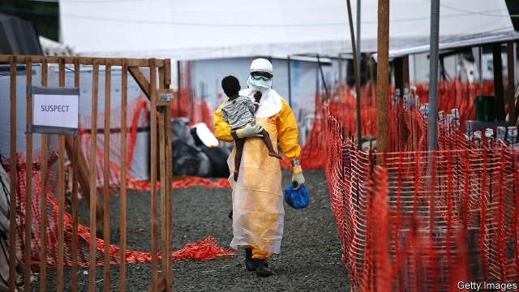

###### Sick notes

# The World Bank’s pandemic bonds are not paying out for Ebola 

 

> print-edition iconPrint edition | Finance and economics | Aug 31st 2019 

THE EBOLA outbreak in west Africa in 2014-16 was the worst in history, with nearly 30,000 cases and a death toll of more than 11,000. It exposed a flaw in funding mechanisms to tackle such health emergencies: by the time money arrives the disease has already spread. So to speed things up the World Bank created “pandemic bonds”, a type of insurance scheme. In 2017 they were sold to private investors, who would lose their money if any of six deadly pandemics hit. In the event of Ebola, up to $150m would be released to affected countries’ governments, and agencies such as the World Health Organisation, to be used to fight the outbreak. 

Last year Ebola struck the Democratic Republic of Congo. It has already killed nearly 2,000 people. But the scheme has not paid out. The 386-page bond prospectus contains a clause making payout conditional on the disease spreading to a second country, with at least 20 people dying there. Ebola has indeed spread, to neighbouring Uganda. But it has killed just three people there, with no new cases since June. 

Investors, including pension funds and asset managers, had bought $320m of the bonds in a deal that was heavily oversubscribed. The notes covering Ebola give them an annual coupon of 11.5 percentage points above LIBOR, a benchmark interest rate. The World Bank, with contributions from Japan and Germany, has already spent $87m on coupon payments, swap premiums and fees. Unless the outbreak worsens, investors will get their money back when the bonds mature next year. 

If the insurance had been designed to cover all severe outbreaks it would have been “prohibitively expensive”, says Mukesh Chawla, who co-ordinates the World Bank’s pandemic emergency-financing facility. As well as the bond proceeds, the institution holds a smaller pot of money, which can be disbursed at the discretion of experts. It has already allocated $50m from this to tackling the Ebola outbreak, alongside $350m from other sources. 

It is inevitably hard to design insurance for rare events. Indeed, says Andrew Farlow of Oxford University, it may be impossible to set triggers so that the bonds deliver when needed, at the same time as providing the returns that investors demand. Before the World Bank issued its bonds, consultants ran a computer simulation of half a million outbreaks of filoviruses (a group of viruses that includes Ebola). But pandemics are even harder to model than natural disasters such as hurricanes, for which a market in “catastrophe bonds” is well established. 

In all insurance contracts the cost of cover exceeds the expected payout (otherwise insurers would go bust). For pandemic bonds and related swaps this risk premium is about $17m a year. That money would be better spent on public-health systems and surveillance to try to catch outbreaks earlier, says Olga Jonas, a fellow at the Harvard Global Health Institute who has previously worked on risk-financing at the World Bank. In Uganda, vigilance stopped Ebola from spreading. That saved lives, as well as investors’ millions. ■ 

