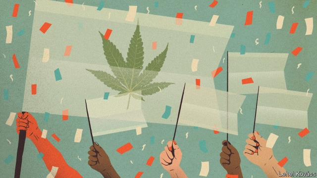
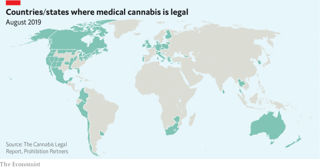

###### Where the grass is greener

# A global revolution in attitudes towards cannabis is under way 

 

> print-edition iconPrint edition | International | Aug 31st 2019 

THE DOCTOR was blunt with Hannah Deacon, the mother of an epileptic boy. He told her that she would “never” get a prescription on the National Health Service (NHS) for medicine based on tetrahydrocannabinol (THC), the psychoactive ingredient in cannabis. The British government, too, was unhelpful, maintaining in February 2018 that cannabis had no medical value—a position that it had held for over 50 years, even as the country grew and exported cannabis for medicinal use. Yet within months, it had made a U-turn, accepting that Cannabis sativa had medical uses. Eight months after Ms Deacon made her first public plea for it, her son, Alfie, got THC-based medicine on the NHS. 

Legislatures across the planet have been having similar changes of heart. This may presage broader legalisation. History suggests that when medical cannabis is permitted this is often the prelude to broader recreational access. 

People have exploited C. sativa for thousands of years and its medicinal use can be traced as far back at least as 400AD. But, like other recreational drugs, it started to face restrictions during the first half of the 20th century. Fear-mongering was common. A turning-point came in the 1900s when John Warnock, a British expatriate doctor in Egypt, suggested that cannabis was responsible for a large amount of the insanity and crime in the country. When the League of Nations met in 1924 to discuss narcotics such as opium and heroin, his “evidence” of the dangers of cannabis was influential. But his methodology was dubious. Data were gathered only from patients in the Egyptian Department of Lunacy. He spoke no Arabic, and an important way to determine if patients had been users was to note their “excited” denials when asked if they had tried the drug. 

Then in the 1930s America was afflicted with a moral panic, as cannabis was accused of inciting violence among Mexican immigrants and of corrupting America’s children. When the international system of drug control, the Single Convention on Narcotic Drugs, was set up in 1961 at the United Nations, the use of cannabis in traditional medicine was ignored. It was treated as having limited or no therapeutic use, and as being a dangerous drug, like heroin, requiring the strictest controls. 

Within the plant are chemicals called cannabinoids, similar to molecules produced by the human body, known as endocannabinoids. A wide network of receptors in the human brain and body respond to the plant and human versions of these molecules. The body’s endocannabinoid system is involved in regulating everything from pain to mood, appetite, stress, sleep and memory. So far, 144 different cannabinoids have been found in C. sativa—most of them barely understood—and new properties are being discovered all the time. 

The best known are THC, the ingredient that gets you high, and cannabidiol (CBD), which does not and which is increasingly used as a food additive and supplement. Drug treaties have severely impeded research into cannabis. But over the years evidence from clinical trials and elsewhere has shown its efficacy in treating a range of conditions, such as muscle pain in multiple sclerosis, nausea induced by chemotherapy, treatment-resistant epilepsy and chronic pain in adults. 

Helpful both in alleviating pain and in giving pleasure, pot has been wildly popular in the decades since the Single Convention and the drug-control treaties that followed it. It is the world’s most widely grown and used illicit drug. In 2017 it was produced in almost every country on Earth. The UN’s estimates of global drug-taking put the number of users at 188m (out of a total of 271m taking illegal drugs). 

Cannabis is not completely free of dangers. An overdose is unlikely, perhaps impossible, but one in ten do become addicted. And at high doses, with high-strength strains or long-term use, there is a risk of psychosis. In adolescents there is a risk of impaired brain development. But, given how much pot is smoked for fun, it is remarkable how little harm it does. And more and more countries—over 30 so far—have legalised medical cannabis (see map). In North and South America, medical use has tended to be followed by acceptance of its recreational use. Some European countries have liberalised their laws for both sorts of purpose. But Germany, France and Britain have moved to medical pot first. 

 

Allowing medical cannabis forces governments to build regulatory structures to control the legal supply to patients. Once this happens, it seems easier for societies to accept the idea of recreational use. When grandma starts smoking pot for her arthritis, the drug has entered the mainstream. 

Other arguments are also persuasive in the push for full legalisation, such as racial disparities in prosecutions, the social and judicial costs of criminalising so many users, and the profits and taxes a legal industry might generate. But that patients are suffering seems to carry more political weight than arguments from liberalisers. Perhaps nervous politicians from a generation that grew up taking drugs find wheelchairs offer convenient cover. 

In America 33 states allow medical use, and 11 have legalised the recreational kind. Nationally, most of the population favours federal legalisation. By 2024 medical cannabis will be legal in all states, and recreational use will be found in almost half, predict Arcview Market Research and BDS Analytics, firms that monitor the cannabis business. Medical use is spreading weed-like across Latin America, as opposition wanes. Medical use is already found in Argentina, Colombia, Mexico, Chile, Peru, Jamaica and Uruguay. 

Some governments and health insurers will cover cannabis prescriptions. Almost 16,000 German patients receive medical cannabis—mostly for chronic pain and spasticity, and some, improbably, for attention-deficit disorder. In 2017 the leading insurer approved two-thirds of requests and spent $2.7m on pot. This year the European Parliament passed a (non-binding) vote to improve access to medical pot. Even the World Health Organisation wants cannabis treated in a less restrictive way that would acknowledge its medical utility and make it easier to conduct research. Most striking of all is the arrival of medical cannabis in countries that seemed highly unlikely to relax drug laws, including South Korea, Thailand and Zimbabwe. 

In the countries that accept medical use, ease of access varies. International drug treaties technically permit medical cannabis. But the body that monitors international compliance with drug treaties, the International Narcotics Control Board (INCB), maintains a tone of almost perpetual annoyance in its reports, arguing medical-cannabis schemes are poorly regulated and allow leakage of the drug to recreational users. 

Uruguay paved the way when it legalised cannabis in 2013. But it is the reform in Canada, a G7 member, that has done most to heighten international tension over cannabis’s legal status. Last year it fully legalised the drug. Part of its rationale was that a regulated legal trade would curb the black market and protect young people, who were buying it there. Canada’s change has caused fierce fights within the UN in Vienna, according to Martin Jelsma of the Transnational Institute, a think-tank. The country now stands accused of undermining the drug-control system. Bill Blair, a minister responsible for organised-crime reduction, acknowledges that Canada is non-compliant. “But”, he says, “it is a very principled approach.” 

Attitudes towards the drug are softening around the world. But many important countries, most notably Russia and China, remain implacably opposed to reform. The lack of a global consensus prevents the rewriting of the drug treaties. Divisions are also found within the UN itself. The Human Rights Council and the Special Rapporteur on extrajudicial killings are critical of the human-rights violations that come with harsh national policies to suppress drug use, and the WHO wants a shift in the status quo. The INCB and the UN Office of Drug Control oppose change. 

It may be true that licensing medical marijuana tends to lead to a broader liberalisation. But those resisting this are swimming against the current. Mexico will probably legalise this year; Luxembourg is hot on its heels and likely to become the first EU country to legalise recreational cannabis; and New Zealand is planning a referendum on the issue. It is only a matter of time before international drug treaties will come to be seen as fundamentally broken. Some worry that international law more generally will be undermined by all this rule-breaking. Mr Blair is reluctant to be drawn on how Canada might help resolve the issue. 

It could withdraw from the convention. But the Canadian government has already ruled this out. When Bolivia wanted to legalise the chewing of coca leaves, it withdrew from the convention and rejoined with a “reservation”. A possibility that intrigues international-policy wonks is for Canada and other law-breakers to form an “inter se” (between themselves) agreement, allowing them to modify existing drug-treaty provisions. For this to be an option, Canada will probably want to wait until the club of outlaws is bigger. 

In Britain medicinal cannabis is legal but still very hard to get without an expensive private prescription. (Alfie was lucky.) The dilemma is that cannabis sits in an unusual medical no-man’s-land: neither licensed for most of the uses for which people want it, nor tested to the standards that patients usually expect from medicines. Despite this, many countries are finding ways to push forward. France, for example, is moving ahead with a large-scale clinical trial of the medical uses of cannabis. 

The drug’s ambiguous legal status as a medicine will persist for years. A long history of prejudice has thwarted research and deprived millions of patients access to therapies that might help them. The work of creating regulated and approved medicines should be well advanced, but is only just beginning. Ironically, it may be that only when cannabis is legal for recreational use will a fuller picture emerge of the benefits it offers and the risks it poses. ■ 
<<<<<<< HEAD

-- 

 单词注释:

1.cannabis['kænәbis]:n. 大麻 [化] 大麻 

2.Aug[]:abbr. 八月（August） 

3.blunt[blʌnt]:a. 钝的, 坦率的, 麻痹的 

4.hannah['hænә]:n. 汉娜（女子名） 

5.deacon['di:kәn]:n. 副主祭, 执事, 行会会长 vt. 朗读, 摆得好看些 

6.epileptic[.epi'leptik]:a. 癫痫的, 癫痫性的 n. 癫痫患者 

7.nh[]:abbr. 不吸湿的（nonhygroscopic）；全日空航空公司；美国地名, 新罕布什尔（New Hampshire） 

8.tetrahydrocannabinol[,tetrә,haidrәu'kænәbi,nɔl]:n. [化]四氢大麻醇,四氢大麻酚(大麻树脂的主要成分,麻醉用) 

9.thc[]:abbr. [药]四氢大麻酚（tetrahydrocannabinol） 

10.psychoactive[,saikәu'æktiv]:a. 对神经起显著作用的, 对神经起特殊作用的 

11.unhelpful['ʌn'helpful]:a. 不起帮助作用的, 无用的, 无益的, 不予帮助的, 不予合作的 

12.medicinal[me'disinәl]:a. 药用的, 药的, 有益的 [医] 药用的, 医药的, 医治的 

13.cannabis['kænәbis]:n. 大麻 [化] 大麻 

14.sativa[sә'tivә]:漂白亚麻纤维卷(混纺用) 

15.plea[pli:]:n. 恳求, 辩解, 抗辩, 诉讼, 请愿, 托词 [法] 抗辩, 申诉案件, 答辩 

16.Alfie['ælfi]:n. 阿尔菲(Alfred的昵称)(m.) 

17.legislature['ledʒisleitʃә]:n. 立法机关, 议会, 立法院 [法] 立法机构, 立法机关 

18.presage['presidʒ]:n. 预感, 预兆, 预知 vt. 预示, 预言 vi. 预感, 预言 

19.legalisation[ˌli:gəlaɪ'zeɪʃən]:n. 合法化, 法律上认可 

20.prelude['prelju:d]:n. 前奏, 序幕, 序诗, 前奏曲 vi. 作为前奏 vt. 作为...的开头 

21.recreational[.rekri'eiʃәnәl]:a. 消遣的, 娱乐的 

22.C[si:]:[计] 调用, 访问, 呼叫；电容, 进位, 通道, 字符, 清除, 常数, 控制, 周期；C 程序设计语言 [化] 碳的化学符号; 胞苷 

23.john[dʒɔn]:n. 盥洗室, 厕所, 嫖客 

24.Warnock[]:沃诺克（人名） 

25.expatriate[eks'peitrieit]:n. 移居国外者, 侨民, 被流放者, 背井离乡者 vt. 逐出国外, 脱离国籍, 放逐 vi. 移居国外 

26.Egypt['i:dʒipt]:n. 埃及 

27.insanity[in'sæniti]:n. 疯狂, 愚顽, 精神错乱 [医] 精神病 

28.narcotic[nɑ:'kɒtik]:n. 麻醉药, 镇静剂 a. 麻醉的, 催眠的 

29.opium['әupjәm]:n. 鸦片 [化] 阿片; 鸦片 

30.heroin['herәuin]:n. 海洛因, 吗啡 [化] 海洛因; 二醋吗啡; 二乙酰吗啡 

31.methodology[.meθә'dɒlәdʒi]:n. 方法学, 方法论 [化] 操作法; 工艺 

32.dubious['dju:biәs]:a. 可疑的, 不确定的 

33.datum['deitәm]:n. 论据, 材料, 资料, 已知数 [医] 材料, 资料, 论据 

34.lunacy['lu:nәsi]:n. 精神失常, 精神病, 疯狂愚蠢的行为 [医] 精神错乱(精神病的旧名) 

35.denial[di'naiәl]:n. 否认 [法] 否定, 否认, 拒绝接受 

36.afflict[ә'flikt]:vt. 使苦恼, 折磨 

37.incite[in'sait]:vt. 刺激, 激励, 引诱 [法] 鼓动, 煽动 

38.narcotic[nɑ:'kɒtik]:n. 麻醉药, 镇静剂 a. 麻醉的, 催眠的 

39.therapeutic[.θerә'pju:tik]:a. 治疗的, 有益于健康的 [医] 治疗的; 治疗学的 

40.cannabinoids[kænəbɪ'nɔɪdz]: [医]大麻素类 

41.endocannabinoids[]:[网络] 内源性大麻素；内生性大麻硷；内源性大麻酚类 

42.receptor[ri'septә]:n. 受体, 感觉器官 [化] 接受器; 受体 

43.endocannabinoid[]:[网络] 内源性大麻素；内源大麻；内生性大麻 

44.cannabidiol[]:[化] 大麻二酚 [医] 大麻二酚 

45.cbd[]:abbr. 交货前付款（Cash Before Delivery）；业务中心地区（Central Business District） 

46.additive['æditiv]:a. 添加的, 附加的, 加法的, 累积的 n. 添加物 

47.impede[im'pi:d]:vt. 妨碍, 阻碍, 阻止 

48.clinical['klinikәl]:a. 临床的, 门诊部的 [医] 临床的, 临证的 

49.efficacy['efikәsi]:n. 功效, 效力 [医] 效能, 功效, 效验 

50.sclerosis[skliә'rәusis]:n. 硬化症, 硬化, 僵化 [医] 硬化 

51.nausea['nɒ:ʃjә]:n. 反胃, 晕船, 恶心, 厌恶 [医] 恶心 

52.induce[in'dju:s]:vt. 引诱, 招致, 归纳出, 感应 [医] 诱导, 感应 

53.chemotherapy[.kemәu'θerәpi]:n. 化学疗法 [化] 化学疗法 

54.epilepsy['epilepsi]:n. 癫痫症 [医] 癫痫(羊痫疯) 

55.chronic['krɒnik]:a. 慢性的, 习惯性的 n. 慢性病患者 

56.alleviate[ә'li:vieit]:vt. 减轻, 使缓和 

57.wildly[]:adv. 狂暴地, 激动地, 狂热地, 鲁莽地, 轻率地 

58.illicit[i'lisit]:a. 不法的, 不正当的, 禁止的 [法] 违法的, 违禁的, 被禁止的 

59.overdose['әuvәdәus]:n. 配药量过多 vt. 配药过量, 使过分沉溺 

60.addict[ә'dikt]:vt. 使沉溺, 使上瘾 n. 入迷的人, 上瘾者 

61.psychosis[sai'kәusis]:n. 精神病, 精神不正常 [医] 精神病 

62.impair[im'pєә]:vt. 损害, 减少, 削弱 [法] 损害, 伤害, 减少 

63.legalise['li:^әlaiz]:vt. 使合法化, 使成为法定, 法律上认可 

64.liberalise['lɪbərəlaɪz]:vt. 使自由化 

65.regulatory['regjulәtәri]:a. 受控制的, 统制的, 调整的 [经] 规则的 

66.arthritis[ɑ:'θraitis]:n. 关节炎 [医] 关节炎 

67.mainstream['meinstri:m]:n. 主流 

68.persuasive[pә'sweisiv]:a. 有说服力的, 劝诱的, 劝导性的 

69.disparity[dis'pæriti]:n. 不一致 [医] 差异, 不等 

70.prosecution[.prɒsi'kju:ʃәn]:n. 执行, 经营, 起诉 

71.judicial[dʒu:'diʃәl]:a. 法庭的, 公正的, 审判上的, 司法的 [法] 司法的, 审判上的, 法官的 

72.criminalise['krimənəlaiz]:vt. [主英国英语] =criminalize 

73.liberalisers['libərəlaiz]:liberaliser n. liberalise的变形 liberalise ['libərəlaiz] vt.,vi. [主英国英语] 使成为自由；使自由化；使自由主义化： to liberalise foreign trade 使对外贸易自由化 对…放宽限制；解除对…的官方控制： to liberalise the price policies 放宽物价政策 变形： vt.,vi. liberalised . liberalising 

74.wheelchair['hwi:l.tʃєә]:n. 轮椅 

75.nationally['næʃәnәli]:adv. 作为整个民族, 举国一致地, 全国性地 

76.arcview[]:[网络] 地理信息系统；地理资讯系统软体；地理信息系统软件 

77.bds[]:abbr. 用硬纸板作封面（bound in boards） 

78.analytic[.ænә'litik]:a. 分析的, 善于分析的, 解析的 [医] 分析的 

79.opposition[.ɒpә'ziʃәn]:n. 反对, 敌对, 相反, 在野党 [医] 对生, 对向, 反抗, 反对症 

80.wane[wein]:n. 减少, 衰微, 败落, 亏缺, 月亏 vi. 变小, 亏缺, 衰落, 消逝, 退潮 

81.Argentina[.ɑ:dʒәn'ti:nә]:n. 阿根廷 

82.Colombia[kә'læmbiә]:n. 哥伦比亚 

83.Chile['tʃili]:n. 智利 [化] 番椒; 辣椒 

84.Peru[pә'ru:]:n. 秘鲁 

85.Jamaica[dʒә'meikә]:n. 牙买加 

86.Uruguay['uru^wai]:n. 乌拉圭 [经] 乌拉圭 

87.insurer[in'ʃuәrә]:n. 保险公司 [法] 保险人, 承保人, 保险公司 

88.spasticity[]:[医] 痉挛状态, 强直 

89.improbably[im'prɒbәbli]:adv. 未必会地, 不象真实地 

90.organisation[,ɔ: ^әnaizeiʃən; - ni'z-]:n. 组织, 团体, 体制, 编制 

91.les[lei]:abbr. 发射脱离系统（Launch Escape System） 

92.restrictive[ri'striktiv]:a. 限制的, 约束的, 限定的 n. 限制词 

93.Korea[kә'riә]:n. 朝鲜, 韩国 

94.Thailand['tailәnd]:n. 泰国 

95.Zimbabwe[zim'bɑ:bwei]:n. 津巴布韦 

96.technically['teknikli]:adv. 技术上, 学术上, 专门地 

97.compliance[kәm'plaiәns]:n. 遵从, 顺从, 屈从 [化] 柔顺; 顺应 

98.INCB[]:abbr. International Narcotics Control Board 国际麻醉药管制委员会 

99.perpetual[pә'petʃuәl]:a. 永久的, 不断的, 无期限的, 没完没了的, 四季开花的 [经] 永远的, 终身的, 持续的 

100.annoyance[ә'nɒiәns]:n. 烦恼, 打扰, 可厌之事 [法] 使人烦恼的事物, 麻烦事, 讨厌物 

101.poorly['puәli]:adv. 贫穷地, 不充分地, 贫乏地 a. 身体不舒服的 

102.leakage['li:kidʒ]:n. 漏, 漏出物, 泄漏 [化] 漏电; 漏水; 漏气; 渗漏; 漏失量; 漏出量 

103.heighten['haitn]:vt. 增高, 提高, 加强 vi. 升高, 变大 

104.statu[]:[网络] 状态查看；雕像；特级雪花白 

105.fully['fuli]:adv. 十分地, 完全地, 充分地 

106.rationale[.ræʃә'nɑ:li]:n. 基本原理 [医] 原理, 理论 

107.curb[kә:b]:n. 抑制, 勒马绳, 边石 vt. 抑制, 束缚, 勒住 

108.UN[ʌn]:pron. 家伙, 东西 [经] 联合国 

109.Vienna[vi'enә]:n. 维也纳 

110.Martin['mɑ:tin]:n. 马丁, 圣马丁鸟 

111.jelsma[]:[网络] 杰克逊 

112.transnational[træns'næʃәnl]:a. 超越国界的, 跨国的 [法] 超越国界的, 超国家的, 跨国的 

113.undermine[.ʌndә'main]:vt. 在...下面挖, 渐渐破坏, 暗地里破坏 [法] 暗中破坏, 以阴谋中伤伤害 

114.blair[bleә(r)]:n. 布莱尔（男子名） 

115.principled['prinsәpld]:a. 原则的, 有原则的, 原则性的 

116.soften['sɒftn]:v. (使)变柔软, (使)变柔和 

117.notably['nәjtbәli]:adv. 显著地, 著名地, 尤其, 特别 

118.implacably[im'plækәbli]:adv. 难宽恕地, 无法和解地, 执拗地 

119.rewrit[]:[网络] 重写 

120.rapporteur[.ræpɒ:'tә:]:n. 做报告者, 大会报告起草人 [法] 负责整理编辑报告者, 主要起草人 

121.extrajudicial[,ekstrәdʒu(:)'diʃәl]:a. 法庭职权以外的 

122.killing['kiliŋ]:n. 谋杀, 杀戮 a. 杀害的, 疲惫的, 迷人的 

123.violation[.vaiә'leiʃәn]:n. 违反, 违背, 妨碍 [法] 违犯, 违背, 违反 

124.suppress[sә'pres]:vt. 镇压, 使止住, 禁止, 抑制, 查禁 [法] 镇压, 平定, 禁止出版 

125.quo[]:vt. [古]说 

126.marijuana[.mæriju'ɑ:nә]:n. 大麻 [医] 大麻 

127.liberalisation[,libərəlai'zeiʃən, -li'z-]:n. 自由化；开放 

128.luxembourg['luksәm,bә:^]:n. 卢森堡公国；卢森堡（卢森堡公国首都） 

129.EU[]:[化] 富集铀; 浓缩铀 [医] 铕(63号元素) 

130.zealand['zi:lәnd]:n. 西兰岛（丹麦最大的岛） 

131.referendum[.refә'rendәm]:n. （就重大政治或社会问题进行的）全民公决，全民投票 

132.fundamentally[fʌndә'mentәli]:adv. 基础, 首要, 主要, 十分重要, 基本, 根本, 原始, 基频, 基音, 基谐波 

133.Bolivia[bә'liviә]:n. 玻利维亚 

134.coca['kәukә]:n. 古柯, 古柯叶 [医] 古柯 

135.rejoin[ri'dʒɒin]:vt. 使再结合, 再加入, 回答 vi. 重新聚合, 回答, 第二次答辩 

136.intrigue[in'tri:g]:n. 阴谋, 复杂的事 vi. 密谋, 私通 vt. 激起...的兴趣, 用诡计取得 

137.wonk[wɔŋk]:[俚]书呆子, 死用功的学生 

138.inter[in'tә:]:vt. 埋葬 prep. 在中间 

139.SE[]:[计] 栈空, 系统扩充 [医] 硒(34号元素) 

140.outlaw['autlɒ:]:n. 被剥夺法律保护的人, 罪犯 vt. 使...失去法律保护, 将...逐出社会, 宣告非法, 取缔 

141.thwart[θwɒ:t]:a. 横放的 vt. 反对, 阻挠, 横过 prep. 横过 adv. 横过 

142.deprive[di'praiv]:vt. 剥夺, 使丧失 [法] 剥夺, 剥夺, 夺去 

143.therapy['θerәpi]:n. 治疗 [医] 疗法, 治疗 

144.ironically[]:adv. 冷嘲地, 挖苦地, 讽刺地, 令人啼笑皆非地 
=======
>>>>>>> 50f1fbac684ef65c788c2c3b1cb359dd2a904378

