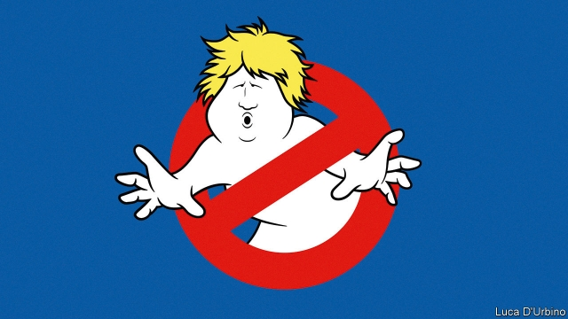

###### Who you gonna call?

# How Parliament can stop Boris Johnson’s no-deal Brexit 

 

> print-edition iconPrint edition | Leaders | Aug 29th 2019 

ONE BY ONE, the principles on which the Brexit campaign was fought have been exposed as hollow. Before the referendum, Leavers argued that victory would enable them to negotiate a brilliant deal with the European Union. Now they advocate leaving with no deal at all. Before the vote they said that Brexit would allow Britain to strike more free-trade agreements. Now they say that trading on the bare-bones terms of the World Trade Organisation would be fine. Loudest of all they talked of taking back control and restoring sovereignty to Parliament. Yet on August 28th Boris Johnson, a leading Leaver who is now prime minister, announced that in the run-up to Brexit Parliament would be suspended altogether. 

His utterly cynical ploy is designed to stop MPs steering the country off the reckless course he has set to leave the EU with or without a deal on October 31st (see article). His actions are technically legal, but they stretch the conventions of the constitution to their limits. Because he is too weak to carry Parliament in a vote, he means to silence it. In Britain’s representative democracy, that sets a dangerous precedent (see article). 

But it is still not too late for MPs to thwart his plans—if they get organised. The sense of inevitability about no-deal, cultivated by the hardliners advising Mr Johnson, is bogus. The EU is against such an outcome; most Britons oppose it; Parliament has already voted against the idea. Those MPs determined to stop no-deal have been divided and unfocused. When they return to work next week after their uneasy summer recess, they will have a fleeting chance to avert this unwanted national calamity. Mr Johnson’s actions this week have made clear why they must seize it. 

Of all her mistakes as prime minister, perhaps Theresa May’s gravest was to plant the idea that Britain might do well to leave the EU without any exit agreement. Her slogan that “no deal is better than a bad deal” was supposed to persuade the Europeans to make concessions. It didn’t—but it did persuade many British voters and MPs that if the EU offered less than perfect terms, Britain should walk away. 

In fact the government’s own analysis suggests that no-deal would make the economy 9% smaller after 15 years than if Britain had remained. Mr Johnson says preparations for the immediate disruption are “colossal and extensive and fantastic”. Yet civil servants expect shortages of food, medicine and petrol, and a “meltdown” at ports. A growing number of voters seem to think that a few bumpy months and a lasting hit to incomes might be worth it to get the whole tedious business out of the way. This is the greatest myth of all. If Britain leaves with no deal it will face an even more urgent need to reach terms with the EU, which will demand the same concessions as before—and perhaps greater ones, given that Britain’s hand will be weaker. 

Mr Johnson insists that his intention is to get a new, better agreement before October 31st, and that to do so he needs to threaten the EU with the credible prospect of no-deal. Despite the fact that Mrs May got nowhere with this tactic, many Tory MPs still see it as a good one. The EU wants a deal, after all. And whereas it became clear that Mrs May was bluffing about walking out, Mr Johnson might just be serious (the fanatics who do his thinking certainly are). Angela Merkel, Germany’s chancellor, said recently that Britain should come up with a plan in the next 30 days if it wants to replace the Irish backstop, the most contentious part of the withdrawal agreement. Many moderate Tories, even those who oppose no-deal, would like to give their new prime minister a chance to prove his mettle. 

They are mistaken. First, the effect of the no-deal threat on Brussels continues to be overestimated in London. The EU’s position—that it is open to plausible British suggestions—is the same as it has always been. The EU’s priority is to keep the rules of its club intact, to avoid other members angling for special treatment. With or without the threat of no-deal, it will make no more than marginal changes to the existing agreement. Second, even if the EU were to drop the backstop altogether, the resulting deal might well be rejected by “Spartan” Tory Brexiteers, so intoxicated by the idea of leaving without a deal that they seem ready to vote against any agreement. And third, even if an all-new deal were offered by the EU and then passed by Parliament, ratifying it in Europe and passing the necessary laws in Britain would require an extension well beyond October 31st. Mr Johnson’s vow to leave on that date, “do or die”, makes it impossible to leave with any new deal. It also reveals that he is fundamentally unserious about negotiating one. 

That is why Parliament must act now to take no-deal off the table, by passing a law requiring the prime minister to ask the EU for an extension. Even before Mr Johnson poleaxed Parliament, this was not going to be easy. The House of Commons’ agenda is controlled by Downing Street, which will allow no time for such a bill. MPs showed in the spring that they could take temporary control of the agenda, when they passed a law forcing Mrs May to request an extension beyond the first Brexit deadline of March 29th. This time there is no current legislation to act as a “hook” for an amendment mandating an extension, so the Speaker of the House would have to go against precedent by allowing MPs to attach a binding vote to an emergency debate. All that may be possible. But with Parliament suspended for almost five weeks there will be desperately little time. 

So, if rebel MPs cannot pass a law, they must be ready to use their weapon of last resort: kicking Mr Johnson out of office with a vote of no confidence. He has a working majority of just one. The trouble is that attempts to find a caretaker prime minister, to request a Brexit extension before calling an election, have foundered on whether it should be Jeremy Corbyn, the far-left Labour leader whom most Tories despise, or a more neutral figure. 

If the various factions opposed to no-deal cannot agree, Mr Johnson will win. But if they needed a reason to put aside their differences, he has just given them one. The prime minister was already steering Britain towards a no-deal Brexit that would hit the economy, wrench at the union and cause a lasting rift with international allies. Now he has shown himself willing to stifle parliamentary democracy to achieve his aims. Wavering MPs must ask themselves: if not now, when? ■ 
<<<<<<< HEAD

-- 

 单词注释:

1.gonna['ɡɔnә]:abbr. （美）将要（等于going to） 

2.boris['bɔris]:n. 鲍里斯（男子名） 

3.Brexit[]:[网络] 英国退出欧盟 

4.Aug[]:abbr. 八月（August） 

5.referendum[.refә'rendәm]:n. （就重大政治或社会问题进行的）全民公决，全民投票 

6.leaver['li:vә]:n. 离开者（常指学校毕业生） 

7.organisation[,ɔ: ^әnaizeiʃən; - ni'z-]:n. 组织, 团体, 体制, 编制 

8.sovereignty['sɒvrәnti]:n. 主权, 独立国 [法] 主权, 主权国家, 统治权 

9.johnson['dʒɔnsn]:n. 约翰逊（姓氏） 

10.leaver['li:vә]:n. 离开者（常指学校毕业生） 

11.utterly['ʌtәli]:adv. 完全地, 全然, 绝对 

12.cynical['sinikәl]:a. 愤世嫉俗的, 讽刺的, 冷嘲的 

13.ploy[plɒi]:n. 手段, 活动, 玩乐 

14.MP[]:国会议员, 下院议员 [计] 宏处理程序, 维护程序, 线性规划, 微程序, 多处理器 

15.reckless['reklis]:a. 不介意的, 大意的, 鲁莽的, 不顾后果的 [法] 不注意的, 粗心大意的, 鲁莽的 

16.EU[]:[化] 富集铀; 浓缩铀 [医] 铕(63号元素) 

17.technically['teknikli]:adv. 技术上, 学术上, 专门地 

18.precedent['presidәnt]:n. 先例, 前例 a. 在先的, 在前的 

19.thwart[θwɒ:t]:a. 横放的 vt. 反对, 阻挠, 横过 prep. 横过 adv. 横过 

20.inevitability[in.evitә'biliti]:n. 无法逃避之事, 不可逃避, 必然性 [法] 不能避免 

21.hardliner[ˌhɑ:d'laɪnə(r)]:n. 强硬路线者 

22.bogus['bәugәs]:a. 假的, 伪造的 [经] 伪的, 伪造的 

23.Briton['britәn]:n. 大不列颠人, 英国人 

24.unfocused[.ʌn'fәukәst]:a. 不聚成焦点的 

25.recess[ri'ses]:n. 休息, 休会, 放假, 凹进处, 深处 vt. 使凹进 vi. 休假, 休息 

26.avert[ә'vә:t]:vt. 转开, 避免, 防止 

27.unwanted[.ʌn'wɒntid]:a. 没人要的, 不需要的, 多余的 

28.calamity[kә'læmiti]:n. 灾难, 不幸事件 

29.theresa[ti'ri:zә]:n. 特丽萨（女子名） 

30.concession[kәn'seʃәn]:n. 特许, 让步, 认可 [经] 核准, 许可, 特殊(权) 

31.voter['vәutә]:n. 选民, 投票人 [法] 选民, 选举人, 投票人 

32.les[lei]:abbr. 发射脱离系统（Launch Escape System） 

33.disruption[dis'rʌpʃәn]:n. 分裂, 崩溃, 瓦解 

34.colossal[kә'lɒsәl]:a. 巨大的, 巨像似的 

35.meltdown['meltdaun]:[经] 销毁(货币等), 变卖(财产) 

36.bumpy['bʌmpi]:a. 颠簸的, 崎岖不平的 

37.myth[miθ]:n. 神话, 虚构的事, 虚构的人 

38.credible['kredәbl]:a. 可信的, 可靠的 [法] 可信的, 可靠的 

39.Mr['mistә(r)]:先生 [计] 存储器回收程序, 多重请求 

40.tactic['tæktik]:n. 一项战术, 一条策略 a. 战术的, 顺序的, 排列的 

41.Tory['tɒ:ri]:n. 托利党党员, 保守党员, 亲英分子 a. 保守分子的 

42.bluff[blʌf]:n. 断崖, 绝壁, 吓唬 a. 直率的 v. 吓唬, 欺骗 

43.fanatic[fә'nætik]:n. 狂热者, 盲信 a. 狂热的, 盲信的 

44.angela['ændʒilә]:n. 安吉拉（女子名） 

45.merkel[]: [人名] 默克尔; [地名] [美国] 默克尔 

46.chancellor['tʃɑ:nsәlә]:n. 大臣, 总理, 首相, 大使馆/领事馆的一等秘书, 司法官, 大学校长 

47.backstop['bækstɒp]:n. 挡球网, 接球手 [电] 背向停止 

48.contentious[kәn'tenʃәs]:a. 好争吵的, 爱争论的, 有异议的 [法] 诉讼的, 争执的, 引起争论的 

49.withdrawal[wið'drɒ:l]:n. 提款, 撤退, 退回, 撤消, 退隐, 戒毒过程 [医] 戒除, 脱瘾 

50.Tory['tɒ:ri]:n. 托利党党员, 保守党员, 亲英分子 a. 保守分子的 

51.mettle['metl]:n. 气质, 耐力, 勇气 

52.Brussel[]:n. 布鲁塞尔（比利时首都） 

53.overestimate[.әuvәr'estimeit]:vt. 评价过高, 过高估价 n. 估计过高, 评价过高 

54.plausible['plɒ:zibl]:a. 貌似真实的, 貌似合理的, 说得煞有其事的 [法] 花言巧语的, 似乎有理的 

55.alway['ɔ:lwei]:adv. 永远；总是（等于always） 

56.intact[in'tækt]:a. 尚未被人碰过的, 原封不动的, 完整的 [医] 完整的, 无伤的 

57.marginal['mɑ:dʒinәl]:a. 边缘的, 最低限度的, 有旁注的 [医] 缘的 

58.Spartan['spɑ:tәn]:a. 斯巴达的, 斯巴达式的, 刚强的, 勇敢的, 好战的, 严峻的, 简朴的, 艰苦的 n. 斯巴达人, 勇士, 坚韧不拔的人 

59.Brexiteers[]:支持英国退欧的人（Brexiteer的复数） 

60.intoxicate[in'tɒksikeit]:vt. 使陶醉, 使喝醉 

61.ratify['rætifai]:vt. 批准, 认可 [经] 证实, 肯定, 确认 

62.vow[vau]:n. 誓约, 誓言, 许愿 vi. 起誓, 发誓, 郑重宣言 vt. 立誓, 起誓要, 郑重地宣布 

63.fundamentally[fʌndә'mentәli]:adv. 基础, 首要, 主要, 十分重要, 基本, 根本, 原始, 基频, 基音, 基谐波 

64.unserious['ʌnsɪərɪəs]: 不严肃的 

65.poleax['pәulæks]:n. 战斧, 屠斧 v. 以斧砍倒或攻打 

66.amendment[ә'mendmәnt]:n. 修订, 改善, 改良, 改正 [化] 调理剂; 修正 

67.mandate['mændeit]:n. 命令, 指令, 要求 vt. 委任统治 

68.desperately['despәrәtli]:adv. 拼命地；绝望地；极度地 

69.cannot['kænɒt]:aux. 无法, 不能 

70.caretaker['kєәteikә]:n. 照顾者, 看管者, 看守人 [法] 看守员, 管理员, 看管人 

71.founder['faundә]:n. 创立者, 建立者 vt. 使沉没, 使摔倒, 弄跛, 浸水, 破坏 vi. 沉没, 摔到, 变跛, 倒塌, 失败 

72.jeremy['dʒerimi]:n. 杰里米（男子名） 

73.Corbyn[]:科尔宾（人名） 

74.faction['fækʃәn]:n. 小派系, 内讧 [法] 宗派, 派别, 小集团 

75.wrench['rentʃ]:n. 扳钳, 扳手, 扭伤, 歪曲, 痛苦 vt. 猛扭, 扭伤, 曲解, 折磨 vi. 猛扭, 猛绞 

76.rift[rift]:n. 裂口, 空隙 vi. 裂开 vt. 使分开, 使割开 

77.ally['ælai. ә'lai]:n. 同盟者, 同盟国, 助手 vt. 使联盟, 使联合, 使有关系 vi. 结盟 

78.stifle['staifl]:vt. 使窒息, 抑止, 扼杀 vi. 窒息, 被扼杀 

79.parliamentary[.pɑ:lә'mentәri]:a. 国会的, 议会的, 议会制度的 

80.waver['weivә]:n. 动摇, 踌躇, 挥动者 vi. 摇摆, 颤抖, 摆动, 摇曳, 犹豫 
=======
>>>>>>> 50f1fbac684ef65c788c2c3b1cb359dd2a904378

