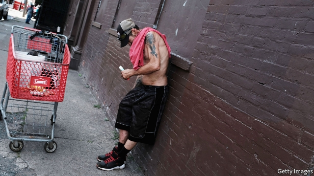
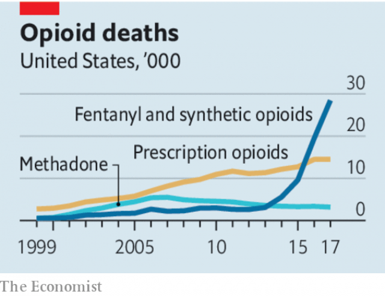

###### Opioids

# Legal settlements alone will not solve America’s opioid crisis 

 

> print-edition iconPrint edition | Leaders | Aug 31st 2019 

THIS WEEK saw a landmark reckoning in court for a drugmaker involved in America’s opioid disaster. A judge in Oklahoma ordered Johnson & Johnson (J&J) to pay $572m to fund a state plan to combat opioid addiction. Whatever the outcome of J&J’s legal appeal, this is a milestone in a public-health calamity that cost 47,600 American lives in 2017 and could well claim a further 500,000 over the next decade (see article). Faced with such devastation, states, counties and municipalities have served firms with roughly 2,500 lawsuits. 

The roots of the epidemic lie in the marketing of prescriptions by pharma firms almost 25 years ago. Opioids have long been known to be highly addictive and easy to overdose on. Almost one in five addicts dies within a decade. Yet newer versions of the drugs were sold as having lower risks. Firms also worked hard to promote the idea that doctors were undertreating chronic pain. 

Drugmakers involved in mis-selling opioids could begin to make amends by shouldering their share of the blame and settling quickly. That way the money will arrive sooner, and less of it will go to lawyers. There are encouraging signs that Purdue Pharma, which lies at the origin of the epidemic, may settle a batch of lawsuits for up to $12bn. Yet it is vital not to lose sight of why the opioid crisis struck America so much harder than anywhere else. The blame lies partly with the incentives woven into its health-care system. 

For a start, many drug distributors and pharmacies, mesmerised by growing sales, failed to take action, as they are obliged to, when signs emerged that opioids were being diverted for illicit use. Doctors and hospitals, eyeing the bottom line, also veered towards incaution when handing out pills. The system put sales and “customer” satisfaction before patients’ well-being. Medical-professional societies were at best supine, and in a few cases complicit in encouraging overuse. Regulators fell short, too. States could have limited prescription volumes, or set rules for how opioids were to be prescribed. The Food and Drug Administration (FDA), the federal regulator, failed to take account of the public-health impact of opioids when it deemed them safe. It has since not done enough to reform its approval regime, and it has still not properly reassessed the opioids already on the market to determine whether they need to be removed from sale. 

 

Keen to signal they mean business, some states have introduced laws to tighten supply. Paradoxically, perhaps, they need to be careful. Prescription opioids are no longer the main cause of death from addiction. Efforts to cut off people who are addicted risk sending them onto the black market for supplies. Regulators need to focus instead on medically assisted treatment for addicts, which has been scandalously neglected. This would save thousands of lives a year. 

The full cost of dealing with the crisis will run to hundreds of billions of dollars, which is why legal redress is needed—and why, unlike in tobacco settlements, the damages from pharma companies should go directly into alleviating the harm from opioids rather than into general government spending. Unfortunately, even then, generous settlements with drug firms and distributors will not foot the entire bill. Large sums will thus have to come from taxpayers. 

All this should be a warning to governments everywhere. In most parts of the world there is a shortage of pain relief. But as governments expand access to drugs, they should heed the lessons from America. Opioids need to be dispensed according to properly enforced rules. Regulators have a role in supervising how they are marketed. Doctors should be vigilant and inform patients of the risks. None of this is to absolve the companies that mis-sold drugs or looked the other way. Patients have a right to expect high ethical standards from those who supply their medicines. But making sure that opioids are a gift to humanity and not a curse is a job for the entire health system. ■ 

