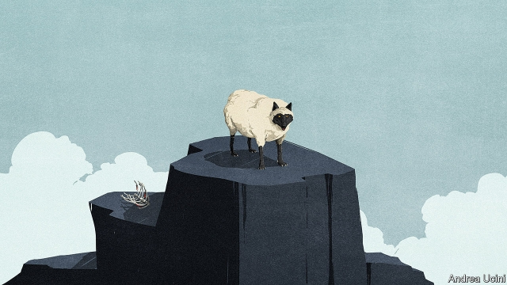

###### Populism

# The corrupting of democracy 

 

> print-edition iconPrint edition | Leaders | Aug 29th 2019 

DEMOCRACIES ARE generally thought to die at the barrel of a gun, in coups and revolutions. These days, however, they are more likely to be strangled slowly in the name of the people. 

Take Hungary, where Fidesz, the ruling party, has used its parliamentary majority to capture regulators, dominate business, control the courts, buy the media and manipulate the rules for elections. As our briefing explains, the prime minister, Viktor Orban, does not have to break the law, because he can get parliament to change it instead. He does not need secret police to take his enemies away in the night. They can be cut down to size without violence, by the tame press or the taxman. In form, Hungary is a thriving democracy; in spirit, it is a one-party state. 

The forces at work in Hungary are eating away at other 21st-century polities, too. This is happening not just in young democracies like Poland, where the Law and Justice party has set out to mimic Fidesz, but even the longest-standing ones like Britain and the United States. These old-established polities are not about to become one-party states, but they are already showing signs of decay. Once the rot sets in, it is formidably hard to stop. 

At the heart of the degradation of Hungarian democracy is cynicism. After the head of a socialist government popularly seen as corrupt admitted that he had lied to the electorate in 2006, voters learned to assume the worst of their politicians. Mr Orban has enthusiastically exploited this tendency. Rather than appeal to his compatriots’ better nature, he sows division, stokes resentment and exploits their prejudices, especially over immigration. This political theatre is designed to be a distraction from his real purpose, the artful manipulation of obscure rules and institutions to guarantee his hold on power. 

Over the past decade, albeit to a lesser degree, the same story has unfolded elsewhere. The financial crisis persuaded voters that they were governed by aloof, incompetent, self-serving elites. Wall Street and the City of London were bailed out while ordinary people lost their jobs, their houses and their sons and daughters on the battlefield in Iraq and Afghanistan. Britain erupted in a scandal over MPs’ expenses. America has choked on the lobbying that funnels corporate cash into politics. 

In a survey last year, over half of voters from eight countries in Europe and North America told the Pew Research Centre that they were dissatisfied with how democracy is working. Almost 70% of Americans and French people say that their politicians are corrupt. 

Populists have tapped into this pool of resentment. They sneer at elites, even if they themselves are rich and powerful; they thrive on, and nurture, anger and division. In America President Donald Trump told four progressive congresswomen to “go back...to the broken and crime-infested places from which they came”. In Israel Binyamin Netanyahu, a consummate insider, portrays official inquiries into his alleged corruption as part of an establishment conspiracy against his premiership. In Britain Boris Johnson, lacking support among MPs for a no-deal Brexit, has outraged his opponents by manipulating procedure to suspend Parliament for five crucial weeks. 

What, you might ask, is the harm of a little cynicism? Politics has always been an ugly business. The citizens of vibrant democracies have long had a healthy disrespect for their rulers. 

Yet too much cynicism undermines legitimacy. Mr Trump endorses his voters’ contempt for Washington by treating opponents as fools or, if they dare stand on honour or principle, as lying hypocrites—an attitude increasingly mirrored on the left. Britain’s Brexiteers and Remainers denigrate each other as immoral, driving politics to the extremes because compromising with the enemy is treachery. Matteo Salvini, leader of Italy’s Northern League, responds to complaints about immigration by cutting space in shelters, in the knowledge that migrants living on the streets will aggravate discontent. Mr Orban has less than half the vote but all the power—and behaves that way. By ensuring that his opponents have no stake in democracy, he encourages them to express their anger by non-democratic means. 

Cynical politicians denigrate institutions, then vandalise them. In America the system lets a minority of voters hold power. In the Senate that is by design, but in the House it is promoted by routine gerrymandering and voter-suppression. The more politicised the courts become, the more the appointment of judges is contested. In Britain Mr Johnson’s parliamentary chicanery is doing the constitution permanent damage. He is preparing to frame the next election as a struggle between Parliament and the people. 

Politics used to behave like a pendulum. When the right made mistakes the left won its turn, before power swung back rightward again. Now it looks more like a helter-skelter. Cynicism drags democracy down. Parties fracture and head for the extremes. Populists persuade voters that the system is serving them ill, and undermine it further. Bad turns to worse. 

Fortunately, there is a lot of ruin in a democracy. Neither London nor Washington is about to become Budapest. Power is more diffuse and institutions have a longer history—which will make them harder to capture than new ones in a country of 10m people. Moreover, democracies can renew themselves. American politics was coming apart in the era of the Weathermen and Watergate, but returned to health in the 1980s. 

The riposte to cynicism starts with politicians who forsake outrage for hope. Turkey’s strongman, Recep Tayyip Erdogan, suffered a landmark defeat in the race for the mayoralty in Istanbul to a tirelessly upbeat campaign by Ekrem Imamoglu. Anti-populists from all sides should unite behind rule-enforcers like Zuzana Caputova, the new president of Slovakia. In Romania, Moldova and the Czech Republic voters have risen up against leaders who had set off down Mr Orban’s path. 

The bravery of young people who have been protesting on the streets of Hong Kong and Moscow is a powerful demonstration of what many in the West seem to have forgotten. Democracy is precious, and those who are lucky enough to have inherited one must strive to protect it. ■ 
<<<<<<< HEAD

-- 

 单词注释:

1.Populism['pɒpjulizm]:n. 平民主义, 民粹主义 

2.Aug[]:abbr. 八月（August） 

3.coup['ku:]:n. 砰然的一击, 妙计, 出乎意料的行动, 政变 [医] 发作, 中, 击 

4.strangle['stræŋgl]:vt. 勒死, 扼死, 压制, 使窒息, 抑制 vi. 被扼死, 被绞死, 窒息而死 

5.Hungary['hʌŋgәri]:n. 匈牙利 

6.fidesz[]:[网络] 青年民主党；匈牙利执政党青民盟；匈牙利执政党青年民主党 

7.parliamentary[.pɑ:lә'mentәri]:a. 国会的, 议会的, 议会制度的 

8.regulator['regjuleitә]:n. 调整者, 校准者, 校准器, 调整器, 标准钟 [化] 调节剂; 调节器 

9.manipulate[mә'nipjuleit]:vt. 操纵, 利用, 操作, 巧妙地处理, 假造 

10.Viktor[]:维克托（人名） 

11.orban[]: [人名] 奥尔班 

12.taxman['tæksmæn]:收税员,税收检查员 

13.polity['pɒliti]:n. 政体, 国体, 政治组织 [法] 政府, 政治制度, 政治形态 

14.Poland['pәulәnd]:n. 波兰 

15.mimic['mimik]:a. 模仿的, 摹拟的 n. 效颦者, 模仿者, 小丑, 仿制品 vt. 模仿, 摹拟 

16.formidably['fɒ:midәbli]:adv. 可怕地, 敌不住, 强大地 

17.degradation[.degrә'deiʃәn]:n. 降格, 堕落, 退化 [计] 降级 

18.Hungarian[hʌŋ'gєәriәn]:a. 匈牙利的, 匈牙利人的, 匈牙利语的 n. 匈牙利人, 匈牙利语 

19.cynicism['sinisizm]:n. 犬儒主义 

20.popularly['pɒpjulәli]:adv. 通俗地, 平易地, 通过民众 

21.electorate[i'lektәrit]:n. 选民, 有选举权者, 选区 [法] 选民, 选举团, 选区 

22.voter['vәutә]:n. 选民, 投票人 [法] 选民, 选举人, 投票人 

23.enthusiastically[in.θju:zi'æstikli]:adv. 热心地, 狂热地 

24.stoke[stәuk]:v. 司炉, (使)大吃 

25.resentment[ri'zentmәnt]:n. 怨恨, 愤恨 

26.distraction[dis'trækʃәn]:n. 娱乐, 分心的事物, 分心 [医] 注意力分散, 内脱位, 牙弓过宽 

27.artful['ɑ:tful]:a. 巧妙的, 狡猾的 

28.manipulation[mә.nipju'leiʃәn]:n. 操作, 处理 [化] (用手)操作; 使用 

29.albeit[ɔ:l'bi:it]:conj. 尽管, 虽然 

30.lesser['lesә]:a. 较少的, 较小的, 次要的 

31.aloof[ә'lu:f]:a. 远离的, 冷淡的 adv. 远离, 冷漠超然地 

32.incompetent[in'kɒmpitәnt]:a. 无能力的, 无资格的, 机能不全的, 不胜任的 n. 无能力者 

33.elite[ei'li:t]:n. 精华, 精锐, 中坚分子 

34.bail[beil]:n. 保释, 拎环, 杓, 栅栏 vt. 保释, 舀水 

35.battlefield['bætlfi:ld]:n. 战场, 沙场 

36.Iraq[i'rɑ:k]:n. 伊拉克 

37.Afghanistan[æf'gænistæn]:n. 阿富汗 

38.lobby['lɒbi]:n. 大厅, 休息室, 游说议员者 vi. 游说议员, 游说 vt. 游说 

39.funnel['fʌnl]:n. 漏斗, 漏斗状的东西, 烟囱 [化] 漏斗 

40.corporate['kɒ:pәrit]:a. 社团的, 合伙的, 公司的 [经] 团体的, 法人的, 社团的 

41.politic['pɒlitik]:a. 精明的, 明智的, 策略的 

42.pew[pju:]:n. 教堂长椅, 会众, 座位 vt. 为(教堂)安装座位, 把...围在一起 

43.Populist['pɔpjulist]:n. 民粹派的成员 

44.sneer[sniә]:n. 冷笑, 嘲笑 vi. 嘲笑, 冷笑 vt. 嘲笑着说, 嘲笑得使 

45.nurture['nә:tʃә]:n. 养育, 营养物, 培育 vt. 养育, 供给营养物, 教养 

46.congresswoman['kɒŋgreswumәn]:n. 国会女议员, 众议院女议员 

47.backto[]:v. 回到 [网络] 回到伊甸园 

48.Israel['izreil]:n. 以色列, 以色列后裔, 犹太人 

49.binyamin[]:本雅明 

50.Netanyahu[]:n. 内塔尼亚胡（人名） 

51.consummate['kɒnsәmeit]:vt. 完成, 使完美 a. 无上的, 至上的, 完美的 

52.insider['in'saidә]:n. 内部的人, 权威人士, 知道内情的人 [经] 熟悉内情者 

53.portray[pɒ:'trei]:vt. 描绘, 描写, 描绘...的肖像 

54.allege[ә'ledʒ]:vt. 宣称, 主张, 提出, 断言 [法] 断言, 指称, 指证 

55.corruption[kә'rʌpʃәn]:n. 腐败, 堕落, 贪污 [计] 论误 

56.conspiracy[kәn'spirәsi]:n. 同谋, 阴谋, 阴谋集团 [法] 阴谋, 通谋, 共谋 

57.premiership['premjәʃip;pri'miә-,'pri:m-]:n. 总理职位, 首相职权, 首相职位, 总理职权 [法] 总理职位 

58.boris['bɔris]:n. 鲍里斯（男子名） 

59.johnson['dʒɔnsn]:n. 约翰逊（姓氏） 

60.MP[]:国会议员, 下院议员 [计] 宏处理程序, 维护程序, 线性规划, 微程序, 多处理器 

61.Brexit[]:[网络] 英国退出欧盟 

62.outrage['autreidʒ]:n. 暴行, 侮辱, 愤怒 vt. 凌辱, 虐待, 触犯 

63.alway['ɔ:lwei]:adv. 永远；总是（等于always） 

64.vibrant['vaibrәnt]:a. 振动的, 战栗的, 响亮的, 活跃的 

65.disrespect[.disri'spekt]:n. 不敬, 失礼, 无礼 

66.undermine[.ʌndә'main]:vt. 在...下面挖, 渐渐破坏, 暗地里破坏 [法] 暗中破坏, 以阴谋中伤伤害 

67.legitimacy[li'dʒitimәsi]:n. 合法, 正统, 正当 [法] 合法性, 正统性, 婚生 

68.endorse[in'dɒ:s]:vt. 支持, 赞同, 背书于, 签署 [经] 赞成, 背书 

69.Washington['wɒʃiŋtn]:n. 华盛顿 

70.Brexiteers[]:支持英国退欧的人（Brexiteer的复数） 

71.remainers[]:[网络] 剩余物 

72.denigrate['denigreit]:vt. 使变黑, 玷污, 诋毁 

73.immoral[i'mɒrәl]:a. 不道德的, 邪恶的, 放荡的 [法] 不道德的, 道德败坏的, 邪恶的 

74.treachery['tretʃәri]:n. 背叛, 变节 [法] 背叛, 变节, 背信弃义 

75.matteo[]:马泰奥（人名） 

76.salvini[]:[网络] 索氏丽体鱼；萨尔维尼 

77.migrant['maigrәnt]:n. 候鸟, 移居者 [法] 移居者 

78.aggravate['ægrәveit]:vt. 使恶化, 使更严重, 加重 

79.discontent[.diskәn'tent]:n. 不满 

80.les[lei]:abbr. 发射脱离系统（Launch Escape System） 

81.cynical['sinikәl]:a. 愤世嫉俗的, 讽刺的, 冷嘲的 

82.vandalise['vændәlaiz]:vt. 摧残(文化), 破坏(公共财产), 故意破坏 

83.gerrymander['dʒerimændә]:vt. 为政党利益改划选区 vi. 不公正地划分选区 n. 改变选举区 

84.politicise[pɒ'lɪtɪsaɪs]:vt. 使政治化, 使具有政治性; 使对政治有兴趣 

85.chicanery[ʃi'keinәri]:n. 强词夺理, 狡辩, 欺骗 

86.pendulum['pendʒәlәm]:n. 钟摆, 摇锤, 摇摆不定的事态(或局面) [化] 摆 

87.rightward['raitwәd]:adv. 向右, 向右倾 a. 朝右的 

88.cynicism['sinisizm]:n. 犬儒主义 

89.fracture['fræktʃә]:n. 破碎, 骨折 v. (使)破碎, (使)破裂 

90.Budapest[bju:dә'pest]:n. 布达佩斯(匈牙利首都) 

91.diffuse[di'fju:z]:v. 散播, 传播 a. 散开的, 弥漫的 

92.watergate['wɔ:tәɡeit. 'wɔ-]:n. 水门, 水闸；水门事件 

93.riposte[ri'pәust]:n. (击剑中)还击, 机敏的回答 vi. 迅速还击, 机敏回答 

94.forsake[fә'seik]:vt. 放弃, 断念, 抛弃 [法] 遗弃, 抛弃, 摒绝 

95.strongman[ˈstrɒŋmæn]:n. 大力士 

96.recep[]:n. (Recep)人名；(土)雷杰普 

97.tayyip[]:[网络] 塔伊普 

98.erdogan[]:[网络] 埃尔多安；土耳其总理埃尔多安；艾尔多安 

99.landmark['lændmɑ:k]:n. 陆标, 划时代的事, 地界标 [医] 界标 

100.mayoralty['mєәrәlti]:n. 市长职位 [法] 市长职位, 市长任期 

101.Istanbul[.istæn'bu:l]:n. 伊斯坦布尔 

102.tirelessly[]:adv. 不知疲倦地；不屈不挠地 

103.upbeat['ʌpbi:t]:n. 弱拍, 上升, 兴旺 a. 上升的, 乐观的 

104.ekrem[]:n. (Ekrem)人名；(芬、土、塞)埃克雷姆 

105.zuzana[]:[网络] 健身教练祖札娜；张虹；捷克的正妹祖札娜 

106.Slovakia[slәu'vækiә]:n. 斯洛伐克 

107.Romania[rәu'meinjә]:n. 罗马尼亚 

108.Moldova[mɔl'dɔvɑ:]:n. 摩尔多瓦 

109.Czech[tʃek]:n. 捷克人, 捷克语 a. 捷克的, 捷克语的, 捷克人的 

110.hong[hɔŋ]:n. （中国、日本的）行, 商行 

111.kong[kɔŋ]:n. 含锡砾石下的无矿基岩；钢 

112.demonstration[.demәn'streiʃәn]:n. 示范, 实证 [医] 示教, 实物教授 

113.strive[straiv]:vi. 努力, 奋斗, 斗争 
=======
>>>>>>> 50f1fbac684ef65c788c2c3b1cb359dd2a904378

