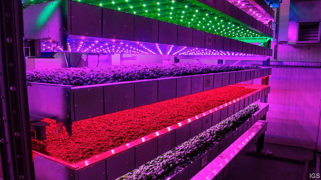

###### Horticulture

# The foody benefits of farming vertically 

 

> print-edition iconPrint edition | Leaders | Aug 31st 2019 

MANY FOODIES pin the blame for farming’s ills on “unnatural” industrial agriculture. Agribusinesses create monocultures that destroy habitat and eliminate historic varieties. Farmers douse their crops with fertiliser and insecticide, which poison streams and rivers—and possibly human beings. Intensive farms soak up scarce water and fly their produce around the world in aeroplanes that spew out carbon dioxide. The answer, foodies say, is to go back to a better, gentler age, when farmers worked with nature and did not try to dominate it. 

However, for those who fancy some purple-ruffles basil and mizuna with their lamb’s leaf lettuce, there is an alternative to nostalgia. And it involves more intensive agriculture, not less. 

A vast selection of fresh salads, vegetables and fruit is on the way, courtesy of a technology called vertical farming. Instead of growing crops in a field or a greenhouse, a vertical farm creates an artificial indoor environment in which crops are cultivated on trays stacked on top of each other (see article). From inside shipping containers in Brooklyn, New York, to a disused air-raid shelter under London’s streets and an innocuous warehouse on a Dubai industrial estate, vertical farms are sprouting up in all sorts of places, nourished by investment in the business from the likes of Japan’s SoftBank and Amazon’s founder, Jeff Bezos. 

This should cheer anyone who wants organic produce that has been grown without pesticides and other chemicals, and which has not been driven hundreds of miles in refrigerated lorries or flown thousands of miles in the belly of a plane. Such farms can greatly reduce the space needed for cultivation, which is useful in urban areas where land is in short supply and expensive. Inside, climatic conditions are carefully controlled with hydroponic systems supplying all the nutrients a plant needs to grow and recycling all but 5% of their water—which is incorporated in the crop itself. Specially tuned LED lighting generates only the wavelengths that the plants require to prosper, saving energy. Bugs are kept out, so pesticides are not needed. Foliage and fruit can be turned out in immaculate condition. And the harvests last all year round. 

There is more. As they will remain safe and snug inside a vertical farm, long-forgotten varieties of fruit and vegetables can stage a comeback. Most of these old-timers have been passed over by varieties bred to withstand the rigours of intensive farming systems. A cornucopia of unfamiliar shapes, colours and flavours could arrive on the dinner table. 

This glimpse of Eden is still some way off. The electricity bill remains high, principally because of the cost of powering the huge number of LEDs required to simulate sunlight. That means vertical farming can, for the time being, be profitable only for high-value, perishable produce, such as salad leaves and fancy herbs. But research is set to bring the bill down and the costs of renewable energy are falling, too. In a hot climate such as Dubai’s extensive solar power could make vertical farms a valuable food resource, particularly where water is scarce. In a cold climate thermal, wind or hydroelectric power could play a similar role. 

Some field crops, including staples such as rice and wheat, are unlikely ever to be suitable for growing in vast stacks. But as its costs fall thanks to further research, vertical farming will compete more keenly with old-fashioned greenhouses and conventional, horizontal farms where crops grow in the earth. As an extra form of food production, vertical farming deserves to be welcomed, especially by the people whose impulse is to turn their back on the future. ■ 
<<<<<<< HEAD

-- 

 单词注释:

1.horticulture[.hɒ:ti'kʌltʃә]:n. 园艺 

2.foody[]: [人名] 富迪 

3.vertically['vetikli]:adv. 垂直地 

4.Aug[]:abbr. 八月（August） 

5.unnatural[.ʌn'næʃәrәl]:a. 不自然的, 反常的, 不近人情的 [法] 不自然的, 违背人道, 邪恶的 

6.agribusiness['ægri.bizinis]:n. 农业综合经营 [经] 农产品行业 

7.monoculture['mɒnәkʌltʃә]:n. 单一栽培, 单作 [经] 单一农作物 

8.habitat['hæbitæt]:n. 栖息地, 居留地, 自生地, 聚集处 [医] 习生地, 产地, 生境, 栖所 

9.historic[hi'stɒrik]:a. 历史上著名的, 有历史性的 

10.douse[daus]:vt. 插入水中, 浇(或洒、泼)水在...上, 熄(灯、火等), 平息 vi. 浸泡 n. 泼洒 

11.fertiliser['fә:tilaizә]:[化] 肥料 

12.insecticide[in'sektisaid]:n. 杀虫剂 [化] 杀虫剂 

13.spew[spju:]:vi. 呕吐, 喷涌 vt. 呕出, 喷 n. 呕吐物, 喷涌物 

14.gentl[]:[网络] 旧非；情奴；西格 

15.basil['bæzil]:n. 罗勒属植物 [医] 罗勒, 矮糠 

16.mizuna[]:n. 日本沙拉菜 

17.lettuce['letis]:n. 莴苣, 生菜, 纸币 [医] 莴苣 

18.nostalgia[nɒs'tældʒiә]:n. 乡愁, 向往过去, 怀旧之情 [医] 怀乡病 

19.les[lei]:abbr. 发射脱离系统（Launch Escape System） 

20.courtesy['kә:tisi]:n. 礼貌, 谦恭, 好意 [法] 优待, 礼貌, 恩惠 

21.Brooklyn['bruklin]:n. 布鲁克林区(纽约行政区) 

22.york[jɔ:k]:n. 约克郡；约克王朝 

23.disused[]:a. 不用, 废弃 

24.innocuous[i'nɒkjuәs]:a. 无害的, 无伤大雅的 [医] 无害的, 良性的 

25.dubai['dju:bai]:n. 迪拜（阿拉伯联合酋长国的酋长国之一）；迪拜港（阿拉伯联合酋长国港市） 

26.sprout[spraut]:n. 芽, 萌芽 vt. 使发芽, 摘去芽 vi. 长芽, 抽条 

27.nourish['nә:riʃ]:vt. 滋养, 使健壮, 怀有 

28.softbank['sɒftbæŋk]: 日本最大的软件销售商 

29.founder['faundә]:n. 创立者, 建立者 vt. 使沉没, 使摔倒, 弄跛, 浸水, 破坏 vi. 沉没, 摔到, 变跛, 倒塌, 失败 

30.jeff[dʒef]:n. 杰夫（男子名, 等于Jeffrey） 

31.bezos[]:贝索斯（人名） 

32.pesticide['pestisaid]:n. 杀虫剂 [化] 农药 

33.refrigerate[ri'fridʒәreit]:vt. 使冷却, 使清凉, 冷藏 [机] 冷冻 

34.cultivation[.kʌlti'veiʃәn]:n. 教化, 培养, 耕作 [医] 培养[法] 

35.climatic[klai'mætik]:a. 气候的 

36.carefully['kєәfuli]:adv. 小心地, 谨慎地 

37.hydroponic[.haidrә'pɒnik]:a. 水耕法的 

38.nutrient['nju:triәnt]:a. 营养的, 滋养的 n. 营养物, 滋养物 

39.recycling[]:[电] 再循环 

40.incorporate[in'kɒ:pәreit]:a. 合并的, 组成公司的, 一体化的 vt. 吸收, 合并, 使组成公司, 体现 vi. 合并, 混合, 组成公司 

41.prosper['prɒspә]:vi. 繁荣, 兴隆, 成功 vt. 使成功, 使昌盛 

42.bug[bʌg]:n. 错误, 虫, 病菌, 缺陷, 窃听器, 癖好, 防盗报警器, 双座小汽车, 要人 vt. 装防盗报警器, 装窃听器, 激怒 vi. 捉虫, 暴突 [计] 缺点, 错误 

43.foliage['fәuliidʒ]:n. 树叶, 植物 

44.immaculate[i'mækjulit]:a. 无污点的, 纯洁的, 无缺点的, 无辜的 [医] 无斑点, 无瑕疵的, 洁净的 

45.snug[snʌg]:a. 舒适的, 温暖的, 整洁的, 紧身的, 隐藏的 vt. 使整洁干净, 使紧身, 隐藏 

46.comeback['kʌmbæk]:n. 复原, 复辟, 复位, 尖刻的对答, 抱怨的原因 [计] 复原的 

47.rigour['rigә]:n. 严格, 严厉, 苛刻, 严酷, 严密, 精确 

48.cornucopia[.kɒ:nju'kәupiә]:n. 丰盛 [医] 外侧隐窝(第四脑室) 

49.unfamiliar[.ʌnfә'miljә]:a. 不熟悉的 

50.Eden['i:dn]:n. 伊甸园, 乐园 

51.principally['prinsәpәli]:adv. 主要地, 大部分 

52.led[led]:lead的过去式和过去分词 [计] 发光二极管 

53.simulate['simjuleit]:vt. 模拟, 假装, 模仿 [法] 伪装的, 模拟的; 假装的, 伪装的, 冒充 

54.perishable['periʃәbl]:a. 易腐坏的, 会枯萎的, 易毁灭的, 不经久的 n. 易腐坏的东西 

55.renewable[ri'nju(:)әbl]:a. 可更新的, 可恢复的, 可继续的, 可换新的, 可重复的, 可重说的 [计] 可更新, 可再生的 

56.thermal['θә:ml]:a. 热的, 热量的, 温泉的 n. 上升温暖气流 

57.hydroelectric[.haidrәui'lektrik]:a. 水力电气的 [医] 水电的, 水电治疗的 

58.staple['steipl]:n. 主要产物, 常用品, 主要要素, 原料, 订书钉, 钩环 a. 主要的, 重要的 vt. 分级, 钉住 

59.keenly['ki:nli]:adv. 锐利地, 敏捷地, 激烈地 

60.impulse['impʌls]:n. 冲动, 驱使, 刺激, 推动, 冲力, 建议, 脉冲 vt. 推动 
=======
>>>>>>> 50f1fbac684ef65c788c2c3b1cb359dd2a904378

