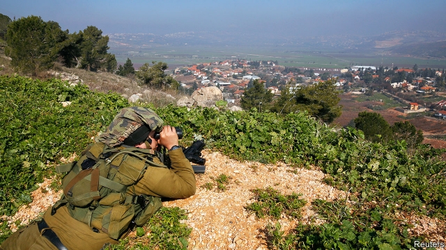

###### The plots thicken

# New fronts open up in the conflict between Israel and Iran 

 

> print-edition iconPrint edition | Middle East and Africa | Aug 29th 2019 

AN EXPLOSION AND subsequent fire in the early hours of August 25th in Beirut’s Dahiye neighbourhood led to fevered speculation. Were they caused by two quadcopter drones, one of which was captured in a shaky video moments before? Were the drones Israeli or Iranian? Was the intended target a media office of Hizbullah, as the Lebanese militia suggested? Or was the target Iranian-supplied equipment to improve the guidance systems of Hizbullah missiles, as anonymous “intelligence services” claimed? One thing seems sure: the episode is part of a broadening of the battlefields between Israel and Iran. 

Lebanon was one of the earliest frontlines. Iran helped found Hizbullah there in 1985 to fight the Israeli army, which had invaded its northern neighbour. More recently the conflict has expanded to Iraq. A series of explosions there has been ascribed to Israel. “Iran doesn’t have immunity anywhere,” said Binyamin Netanyahu, Israel’s prime minister, neither confirming nor denying responsibility. Israel accuses Iran of spreading missile and attack-drone technology. The sites targeted in Iraq are bases of Iranian-backed militias which may have been storing Iranian missiles. 

The explosion in Beirut came just hours after an Israeli air strike near Damascus, where a team of Iranian and Hizbullah operatives were said to have been preparing to launch drones against Israel, apparently in retaliation for the attacks in Iraq. This time Mr Netanyahu was quick to acknowledge responsibility. (Lebanon’s state media claimed that Israel also struck the base of a Palestinian organisation aligned with Iran and Hizbullah near the Lebanon-Syria border on August 26th.) 

The world’s attention, meanwhile, was on diplomacy. France’s president, Emmanuel Macron, engineered a surprise visit by Iran’s foreign minister, Muhammad Javad Zarif, to the G7 summit in Biarritz. Mr Macron has been trying to salvage the nuclear deal signed by Iran and six world powers in 2015. The agreement limits Iran’s nuclear programme in exchange for the partial lifting of sanctions. President Donald Trump withdrew from it last year and embarked on a policy of “maximum pressure” to cripple Iran’s economy. 

Mr Macron dangled the prospect of a summit between Mr Trump and his Iranian counterpart, Hassan Rouhani. Mr Trump seemed tempted by the idea. So did Mr Rouhani, at first. “If I know that by meeting someone, the problem of my country will be solved, I will not hesitate,” he said in a speech. But, under pressure from hardliners, he later backed away, saying that there can be no meeting unless America first lifts its sanctions on Iran. 

Israel is keen for America to maintain pressure on Iran. It worries about the strategy of regional expansion championed by Iran’s Revolutionary Guard Corps and supported by the country’s supreme leader, Ali Khamenei. In recent weeks Israeli officials have warned that this strategy now includes a full rapprochement with Hamas, the Palestinian Islamist movement in Gaza. Ties between them were cut off in the early years of the Syrian uprising when Iran backed Bashar al-Assad’s regime, which was butchering Hamas’s Sunni coreligionists. With the war in Syria all but over, normal service has been resumed. Iranian support for Hamas is reckoned to be as much as $100m a year. 

But the Iranian network may have become overextended and easier for rival espionage agencies to penetrate. Israel has carried out hundreds of air strikes on Iranian targets in Syria. Senior Israeli officers claim they have succeeded in preventing Iran from establishing missile bases there. 

Until recently Israel maintained a policy of “opaqueness” regarding its strikes against Iranian targets. Mr Netanyahu, however, has taken to extolling Israel’s intelligence-gathering and operational successes in surprising detail, as well as openly saying it carried out the latest air strike in Syria. Some of his critics in Israel’s security and political establishments are uncomfortable with this. They see a link between his sudden transparency and Israel’s parliamentary election due on September 17th. Mr Netanyahu is currently defence minister as well as prime minister; successful strikes increase his popularity. His tactics are also causing unease in Washington, where sources in the Pentagon have briefed the media that Israel is behind the explosions in Iraq. The Americans fear this could destabilise the Iraqi government. 

Like Iran, Israel too may have overreached. The incident in Beirut is seen as a breach of the unofficial “red lines” with Hizbullah. Since the war of 2006, in which the two sides fought each other to a stalemate while Israel destroyed much of Lebanon’s civil infrastructure, they have not carried out offensive operations against each other on Lebanese territory. Hizbullah’s leader, Hassan Nasrallah, has publicly warned Israel to “wait for our response which may take place at any time on the border and beyond the border”. 

Such talk is usually cheap in the Middle East, but Mr Nasrallah’s threats are taken seriously. Israel has closed roads and airspace on its northern border in anticipation of an attack. Still, neither side wants to see a major escalation. Hizbullah is not just an Iranian proxy but also a Lebanese political party with a stake in maintaining calm. Mr Netanyahu wants to preserve his tough image, but is anxious not to upset Israeli voters on the eve of elections. 

With luck, such calculations will work to contain a dramatic escalation of hostilities. But the conflict between Israel and Iran is widening. That is one more reason—on top of the need to contain Iran’s nuclear ambitions—to hope that there is more to Mr Macron’s diplomatic efforts than G7 summit showmanship. ■ 

