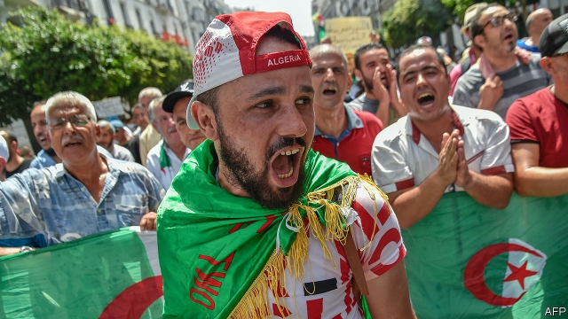

###### Democracy delayed

# The army and the people face off in Algeria 

 

> print-edition iconPrint edition | Middle East and Africa | Aug 31st 2019 

A COUNTRY THAT could not get rid of its ruler for 20 years seems unable to pick a new one. By now, many Algerians thought they would have a new president. After months of protests brought down President Abdelaziz Bouteflika in April, an election was set for July. That deadline came and went, though, with no replacement in sight. Demonstrators, angry about both stalled politics and a stalling economy, still take to the streets each week. The army, which holds de facto power, tolerates them. But nothing else has changed: the status quo has prevailed through a long, languid summer. 

After giving Mr Bouteflika a final push, the army set out to dismantle the power base he built over the previous two decades. Wealthy businessmen like Ali Haddad, who made a fortune from state contracts, were carted off to jail. So were the president’s brother, two former spy chiefs and other powerful behind-the-scenes figures known as le pouvoir. 

That was a good start. But the transition to democracy has not gone much further. The opposition feared that the election that was supposed to have happened in July would be rigged by the army. Almost no one bothered to register, save for two unknown candidates, one of them a veterinarian. A six-member panel of academics and politicians was then set up by the interim president, Abdelkader Bensalah (whose term expired in July). Tasked with writing a new transition plan, they started by asking for the release of jailed protesters, an end to police violence and greater freedom for the press and dissenters. The army chief, Ahmed Gaid Salah, rejected their terms. 

The Arab world is littered with failed revolutions. Even where the army did side with protesters, as in Egypt, it later turned on them and violently restored autocratic rule. That has not happened yet in Algeria—a modest success, in the eyes of opposition activists. But the army is slowly ratcheting up the pressure on its critics. It continues to round them up on spurious charges. Dozens have been arrested for waving the Amazigh (or Berber) flag at demonstrations. Independent news websites often find themselves blocked. The government briefly shut down YouTube in August after a former defence minister released a video on the site urging soldiers to oust General Salah. 

One of the main complaints about Mr Bouteflika’s long rule was a sluggish economy. Algeria is one of Africa’s largest oil and gas producers, but corruption and inefficient subsidies have squandered much of its wealth. Endless bureaucracy deterred foreign investment. Young people make up most of the population. One in four are jobless. Low oil prices have pinched the budget. Foreign reserves, though still a sizeable $65bn, are barely a third of what they were five years ago. 

The current political turmoil is not helping. The economy, which grew by a modest 2.3% in 2018, will probably slow down this year. Rounding up Mr Bouteflika’s corrupt allies was the right thing to do, but it also brought short-term pain. Fertial, a fertiliser company linked to Mr Haddad, is struggling to pay wages. Sonatrach, a state energy giant, had been in talks with foreign oil majors to attract new investment. With the government unable to pass a necessary energy law, though, those talks are on hold. 

Algeria has not seen the kind of violence that followed Sudan’s recent uprising, to say nothing of the horrors in Libya or Syria. But it looks stuck at a difficult impasse. The opposition wants a freely elected government that does not include the army. The army, which long feared that Mr Bouteflika was trying to sideline it, has power again and does not wish to relinquish it. 

General Salah occasionally slips into the familiar language of autocrats, slandering the opposition as “traitors” bent on undermining the state. The latter part is true: Algerians want to tear down a repressive state that failed to govern well for decades. The general can either go along with them, or go the way of other strongmen. ■ 

-- 

 单词注释:

1.Algeria[æl'dʒiәriә]:n. 阿尔及利亚 

2.Aug[]:abbr. 八月（August） 

3.Algerian[æl'dʒiәriәn]:a. 阿尔及利亚的 n. 阿尔及利亚人 

4.abdelaziz[]:n. (Abdelaziz)人名；(阿拉伯)阿卜杜勒-阿齐兹 

5.bouteflika[]:[网络] 布特弗利卡；阿尔及利亚总统布特弗利卡；布特佛里卡 

6.replacement[ri'pleismәnt]:n. 归还, 更换, 代替者 [医] 复位, 置换 

7.demonstrator['demәnstreitә]:n. 论证者, 证明者, 指示者, 示威者 [医] 示教者 

8.stall[stɒ:l]:n. 厩, 停车处, 牧师职位, 货摊, 托辞, 拖延 vt. 关入厩, 停顿, 推托, 支吾, 使陷于泥中 vi. 被关在厩内, 陷于泥中, 停止, 支吾 

9.politic['pɒlitik]:a. 精明的, 明智的, 策略的 

10.de[di:]:[化] 非对映体过量 [医] 铥(69号元素铥的别名,1916年Eder离得的假想元素) 

11.facto[]:[法] 实际上, 事实上 

12.statu[]:[网络] 状态查看；雕像；特级雪花白 

13.quo[]:vt. [古]说 

14.languid['læŋgwid]:a. 疲倦的, 无力的, 阴沉的 

15.dismantle[dis'mæntl]:vt. 拆除...的设备, 分解, 去除覆盖物 

16.ALI[]:[计] 异步线路接口 

17.haddad[]:n. (Haddad)人名；(法、西)阿达；(塞、瑞典、阿拉伯、英)哈达德 

18.LE[]:[计] 小于或等于 

19.Pouvoir[]:[网络] 权力；能；政权 

20.transition[træn'ziʃәn]:n. 转变, 转换, 变迁, 过渡时期, 临时转调 [化] 跃迁 

21.opposition[.ɒpә'ziʃәn]:n. 反对, 敌对, 相反, 在野党 [医] 对生, 对向, 反抗, 反对症 

22.rig[rig]:n. 装备, 帆装 vt. 装配, 装扮, 给船装帆, 垄断, 操纵 

23.bother['bɒðә]:vt. 烦扰, 迷惑 vi. 烦恼, 操心 n. 麻烦, 纠纷, 讨厌的人 

24.veterinarian[.vetәri'nєәriәn]:n. 兽医 [医] 兽医 

25.interim['intәrim]:a. 暂时的, 临时的, 间歇的 n. 过渡时期 

26.Abdelkader[]:n. (Abdelkader)人名；(阿拉伯)阿朴杜勒-卡德尔；(1808-83)阿卜杜卡迪尔〈阿尔及〉军事家。 

27.expire[ik'spaiә]:vi. 期满, 呼气, 断气 vt. 呼出 

28.protester[]:n. 抗议者, 持异议者, 拒付者 [经] 反对者 

29.dissenter[di'sentә]:n. 持异议者, 不同意者, 不顺从国教者 

30.ahmed[]:n. 艾哈迈德（男子名） 

31.gaid[]:[网络] 通信技术促进发展全球联盟；通信技术与发展联盟；发展联盟 

32.Salah[sә'lɑ:]:n. = salat [变体] 

33.Egypt['i:dʒipt]:n. 埃及 

34.violently['vaiәlәntli]:adv. 猛烈地, 激烈地, 极端地 

35.autocratic[.ɒ:tә'krætik]:a. 独裁的, 专制的 

36.activist['æktivist]:n. 激进主义分子 

37.spurious['spjuriәs]:a. 假造的, 伪造的, 欺骗的 [医] 假的, 伪的 

38.amazigh[]:[网络] 阿马齐格 

39.Berber['bә:bә]:n. 柏柏尔人, 柏柏尔语 a. 柏柏尔人的 

40.demonstration[.demәn'streiʃәn]:n. 示范, 实证 [医] 示教, 实物教授 

41.briefly['brifli]:adv. 简短地, 扼要地, 简明地, 简单地 

42.youtube[]:n. 视频网站（可以让用户免费上传、观赏、分享视频短片的热门视频共享网站） 

43.oust[aust]:vt. 逐出, 罢黜, 剥夺, 驱逐 [法] 驱逐, 剥夺, 免职 

44.sluggish['slʌgiʃ]:a. 偷懒的, 懒惰的, 迟钝的 [经] 萧条的, 呆滞的 

45.producer[prә'dju:sә]:n. 生产者, 制作者, 制作人 [化] 发生器; (炉煤气)发生炉; 制气炉; 生产者 

46.corruption[kә'rʌpʃәn]:n. 腐败, 堕落, 贪污 [计] 论误 

47.squander['skwɒndә]:vt. 浪费, 使分散 vi. 浪费, 漂泊, 四散 

48.bureaucracy[bjuә'rɒkrәsi]:n. 官僚, 官吏 [法] 官僚主义, 官僚政治, 官僚机构 

49.deter[di'tә:]:vt. 制止, 吓住, 威慑 

50.jobless['dʒɔblis]:a. 失职的, 无职业的 [经] 失业的 

51.sizeable['saizәbl]:a. 相当大的, 可观的 

52.turmoil['tә:mɒil]:n. 骚动, 混乱 

53.ally['ælai. ә'lai]:n. 同盟者, 同盟国, 助手 vt. 使联盟, 使联合, 使有关系 vi. 结盟 

54.fertiliser['fә:tilaizә]:[化] 肥料 

55.sonatrach[]:abbr. Societe Nationale pour la Recherche; la Production; le Transport; la Transformation et la Commercialisation des Hydro-carbures （法语）<阿尔>国营碳化氢勘探生产运输和销售公司 

56.uprise[ʌp'raiz]:n. 升起, 起立, 上山坡, 出现 vi. 上升, 起义, 出现 

57.Libya['libiә]:n. 利比亚 

58.Syria['siriә]:n. 叙利亚 [经] 叙利亚 

59.impasse['impɑ:s]:n. 难局, 僵局, 死路, 死胡同 

60.sideline['saidlain]:n. 副业, 旁线, 界线, 兼职, 旁观者看法 vt. 使退出比赛场地 

61.relinquish[ri'liŋkwiʃ]:vt. 放弃, 撤回, 停止, 松开, 让与 [法] 让与, 把...交给, 放弃 

62.autocrat['ɒ:tәkræt]:n. 独裁者 

63.slander['slændә]:n. 中伤, 诽谤 vt. 中伤, 诽谤 

64.undermine[.ʌndә'main]:vt. 在...下面挖, 渐渐破坏, 暗地里破坏 [法] 暗中破坏, 以阴谋中伤伤害 

65.repressive[ri'presiv]:a. 压抑的, 抑制的, 镇压的 

66.strongman[ˈstrɒŋmæn]:n. 大力士 

