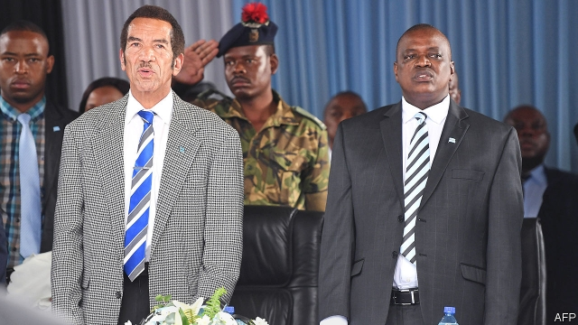

###### A diamond in the rough

# The battle of Botswana’s big men 

 

> print-edition iconPrint edition | Middle East and Africa | Aug 31st 2019 

“ELEPHANTS EXCITE most children,” says Timex Moalosi, the chief of Sankuyo, in northern Botswana. “But not ours.” Since the country’s former president, Ian Khama (pictured, left), suspended game-hunting in 2014, pachyderms have besieged the village, stomping crops and scaring kids. The destruction upset residents, as did the loss of income from selling permits to gun-wielding tourists. So when Mokgweetsi Masisi, Botswana’s current president (right), reversed the ban in May, Sankuyo rejoiced. 

Others were unhappy. For Mr Khama, the decision was seemingly the straw that broke the elephant’s back. The ex-president said he should not have anointed the “immature” Mr Masisi in 2018. In May Mr Khama left the Botswana Democratic Party (BDP), which has ruled since independence in 1966, and endorsed a new party, the Botswana Patriotic Front (BPF). The BPF is loosely allied to the main opposition coalition, the Umbrella for Democratic Change (UDC). Elections are in October. 

At first glance it is a personal feud. Mr Masisi has ditched flagship policies of Mr Khama’s, like the hunting ban. He has cut his predecessor’s privileges, such as flying on official aircraft. He has dismissed Mr Khama’s allies, including Isaac Kgosi, the intelligence chief. It is rumoured that Mr Masisi broke a promise to appoint Mr Khama’s younger brother, Tshekedi, as vice-president. But for all the elements of soap opera, the drama is deeply serious. Botswana, arguably Africa’s most successful state, is in unprecedented flux. 

When it became independent it was one of the world’s poorest countries. The southern African state, almost the size of France, had 7.5 miles of paved roads; 22 citizens had degrees. In the parliament of the outgoing colonial power, Britain, a speaker warned of “the appalling difficulties which will confront this young republic”. 

Botswana proved its doubters wrong. It has held regular elections, avoided civil war and developed into one of the richest countries in sub-Saharan Africa. Its GDP per person is $18,650, higher than South Africa’s ($13,870) and similar to countries such as China, Costa Rica and Serbia. Botswana, writes one historian, “stands out as a unique example” in Africa. 

How to explain its success? Its small population (2.25m) and a shared culture help. But it has more people than Equatorial Guinea, a kleptocratic petro-state, and is more diverse than people assume. Today academics focus on its institutions. If Zimbabwe fascinates economists for all the wrong reasons, Botswana interests political scientists for all the right ones. 

It has largely avoided the “resource curse” that has led mineral-rich African states to corruption and conflict. After diamonds were found in 1967 in Botswana the government enacted laws to share the proceeds and spend them on infrastructure and education. The partnership between the government and De Beers, a diamond company, predates independence; neither has taken the other to court. Botswana’s is a story of “well-managed good luck”, says Keith Jefferis, a consultant. 

Institutions do not, however, emerge from thin air. They reflect political cultures. Botswana drew on fairly pluralistic precolonial institutions, such as the kgotla, or council. It had an elite that subscribed to the rule of law. This was partly out of self-interest: property rights suited the cattle-owning nobility. But there were also unusually enlightened leaders. Sir Seretse Khama, Botswana’s first president and Ian’s father, was the “paramount chief” in the area where diamonds were found. But he passed laws preserving mineral rights for the nation, not his chieftaincy. 

In some eyes Ian Khama’s moves repudiate his father’s legacy. Mr Khama is also the “paramount chief” of the Bangwato, who populate the country’s central district. Unlike his father, who stressed that chiefs and politicians must not mix their roles, the ex-president is using his tribal authority for electoral gain. “He is eroding our norms,” says one businessman. Mr Khama may consider that worth it. One-third of Botswana’s 57 parliamentary seats are in his district. All but one are held by the BDP, which has 37 MPS in total. If Mr Khama gets supporters to ditch the ruling party, he could be kingmaker in a coalition. 

That worries some Batswana. As president, Mr Khama built up the country’s spy agencies and surrounded himself with securocrats, who appointed allies to top jobs, such as head of the main anti-corruption body. Human-rights groups accuse the authorities of intimidating journalists and NGOs. “The space for civil society has shrunk,” says Alice Mogwe, a lawyer. 

Mr Masisi says he was once a “bootlicker”, but is now his own man. So far, that seems to mean making rash populist pledges in order to shore up the BDP’s support. The repeal of the hunting ban has impressed rural voters, but hurt tourism bookings nationwide. A proposal to build electric cars in Botswana is unrealistic. 

The election campaign does not bode well for Botswana’s reputation for sound policy. That matters as the country tries to reduce its dependence on diamonds, which make up roughly the same share of exports today (73%) as they did in 1992 (71%). Botswana still has enviable institutions. But there is a sense among Batswana that what made their country special is at risk. “Botswana’s exceptionalism?” ponders David Sebudubudu of the University of Botswana. “That’s history now.” ■ 
<<<<<<< HEAD

-- 

 单词注释:

1.Aug[]:abbr. 八月（August） 

2.Timex[]:n. 天美时（品牌手表） 

3.botswana[bɔt'swɑ:nә]:n. 博茨瓦纳（非洲中南部国家） 

4.ian[iәn]:n. 伊恩（男子名） 

5.Khama[]:[网络] 卡玛；卡马；种因果 

6.pachyderm['pækidә:m]:n. 厚皮类动物, 迟钝的人, 脸皮厚的人 

7.besiege[bi'si:dʒ]:vt. 围攻, 包围 

8.stomp[stɒmp]:n. 跺脚 vt. 跺, 践踏 vi. 跺脚, 践踏 

9.Masisi[]:[地名] 马西西 ( 刚(金) ) 

10.seemingly['si:miŋli]:adv. 看来似乎, 表面上看来 

11.anoint[ә'nɒint]:vt. 涂油, 施以涂油礼 [医] 涂油膏 

12.immature[.imә'tjuә]:a. 不成熟的, 未完全发育的, 粗糙的 [医] 未成熟的 

13.bdp[]:abbr. 商业数据处理（Business Data Processing）；银行人进修项目（Banker Development Program） 

14.endorse[in'dɒ:s]:vt. 支持, 赞同, 背书于, 签署 [经] 赞成, 背书 

15.patriotic[.peitri'ɒtik]:a. 爱国的, 有爱国心的 [法] 爱国的, 有爱国心的 

16.BPF[]:abbr. Band-Pass Filter 带通滤波器 

17.loosely['lu:sli]:adv. 松弛地, 宽松地, 不紧 

18.ally['ælai. ә'lai]:n. 同盟者, 同盟国, 助手 vt. 使联盟, 使联合, 使有关系 vi. 结盟 

19.opposition[.ɒpә'ziʃәn]:n. 反对, 敌对, 相反, 在野党 [医] 对生, 对向, 反抗, 反对症 

20.coalition[.kәuә'liʃәn]:n. 结合体, 结合, 联合 [经] 联合, 联盟 

21.UDC[]:abbr. 国际十进位分类（universal decimal classification） 

22.feud[fju:d]:n. 不和, 封地, 争执 vi. 长期不和, 擦亮 

23.flagship['flægʃip]:n. 旗舰 

24.isaac['aizәk]:n. 艾萨克（男人名）；以撒（希伯来族长, 犹太人的始祖亚伯拉罕和萨拉的儿子） 

25.kgosi[]: 

26.arguably['ɑ:ɡjuәbli]:adv. 可论证地；可争辩地；正如可提出证据加以证明的那样地 

27.unprecedented[.ʌn'presidentid]:a. 空前的 [经] 空前的, 无前例的 

28.flux[flʌks]:n. 流出, 涨潮, 变迁 vi. 熔化, 流出 vt. 使熔融 [计] 助焊剂 

29.colonial[kә'lәunjәl]:a. 殖民的, 殖民地的 [法] 殖民地居民 

30.appalling[ә'pɒ:liŋ]:a. 骇人的, 令人震惊的 

31.confront[kәn'frʌnt]:vt. 使面对, 对抗, 遭遇, 使对质, 比较 [法] 对证, 使对质, 比较 

32.doubter['dautә]:n. 抱怀疑态度的人；不信宗教的人；怀疑论者 

33.costa['kɒstә]:n. 肋骨, 肋脉, 叶的中脉 [医] 肋 

34.rica[]:n. 黎加（人名） 

35.serbia['sә:bjә]:n. 塞尔维亚（南斯拉夫成员共和国名） 

36.historian[hi'stɒ:riәn]:n. 历史学家, 记事者 

37.equatorial[.ekwә'tɒ:riәl]:a. 近赤道的, 赤道的 [医] 中纬线的 

38.guinea['gini]:n. 几内亚 

39.kleptocratic[,kleptə'krætik]:a. kleptocracy的变形 

40.Zimbabwe[zim'bɑ:bwei]:n. 津巴布韦 

41.fascinate['fæsineit]:vt. 令人入神, 使着迷 vi. 入迷 

42.economist[i:'kɒnәmist]:n. 经济学者, 经济家 [经] 经济学家 

43.corruption[kә'rʌpʃәn]:n. 腐败, 堕落, 贪污 [计] 论误 

44.enact[i'nækt]:vt. 制定法律, 扮演, 颁布 [法] 法令, 法规, 条例 

45.infrastructure['infrәstrʌktʃә]:n. 基础结构, 基础设施 [经] 基础设施 

46.partnership['pɑ:tnәʃip]:n. 合伙, 合股, 合作关系 [经] 合伙(合作)关系, 全体合伙人 

47.de[di:]:[化] 非对映体过量 [医] 铥(69号元素铥的别名,1916年Eder离得的假想元素) 

48.predate['pri:'deit]:vt. 倒填...的日期, 把...的日期填早, 在日期上早于, 在日期上先于 [经] 提前日期 

49.keith[ki:θ]:n. 基思（男子名） 

50.jefferis[]: [人名] [英格兰人姓氏] 杰弗里斯取自父名，来源于Jeffery,含义是“杰弗里之子”(son of Jeffery) 

51.pluralistic[.pluәrә'listik]:a. 兼职的, 多元论的 

52.precolonial[,pri:kә'lәjniәl]:a. 沦为殖民地前的,殖民地时期前的 

53.kgotla[]: 

54.elite[ei'li:t]:n. 精华, 精锐, 中坚分子 

55.nobility[nәu'biliti]:n. 贵族, 高尚, 贵族阶级 

56.enlightened[in'laitnd]:a. 有知识的, 进步的, 文明的 

57.seretse[]:塞雷茨 

58.paramount['pærәmaunt]:n. 首长, 最高当局 a. 最重要的, 最高的, 至上的 

59.chieftaincy['tʃi:ftәnsi]:n. 酋长或首领的地位 

60.repudiate[ri'pju:dieit]:vt. 声明离婚, 拒绝, 拒付, 拒绝履行 [经] 拒付(公债,国债等) 

61.legacy['legәsi]:n. 祖先传下来之物, 遗赠物 [经] 遗产, 遗赠物 

62.populate['pɔpjuleit]:vt. 使人口聚居在...中, 殖民于, 移民于, 居住于, 定居于 

63.tribal[traibl]:a. 部落的, 宗族的 

64.electoral[i'lektәrәl]:a. 选举人的, 选举的, (有关)选举的 [法] 选举的, 选举人的, 由选举人组成的 

65.erode[i'rәud]:vt. 腐蚀, 侵蚀 vi. 受腐蚀 

66.norm[nɒ:m]:n. 基准, 模范, 标准, 准则, 平均数 [化] 定额 

67.parliamentary[.pɑ:lә'mentәri]:a. 国会的, 议会的, 议会制度的 

68.MP[]:国会议员, 下院议员 [计] 宏处理程序, 维护程序, 线性规划, 微程序, 多处理器 

69.supporter[sә'pɒ:tә]:n. 支持者, 后盾, 迫随者, 护身织物 [法] 支持者, 赡养者, 抚养者 

70.kingmaker['kiŋmeikә]:n. 拥立国王者, 有权支配要职的任命者 

71.Batswana[bæt'swɑ:nə]:n. [英国英语]；博茨瓦纳 

72.securocrats[sɪ'kjʊərəkræt]:〈南非〉军警官参政要员 拥护军警官参政者（security与bureaucrat的缩合） 

73.ngos[]:abbr. non-government organization 非政府组织，非政府机构 

74.ALICE['ælis]:[计] 应用语言接口转换与扩充 

75.mogwe[]:莫韦 

76.bootlicker[bu:tlikә(r)]:n. 拍马屁(者) 

77.rash[ræʃ]:a. 轻率的, 匆忙的, 鲁莽的 n. 皮疹 

78.Populist['pɔpjulist]:n. 民粹派的成员 

79.pledge[pledʒ]:n. 诺言, 保证, 誓言, 抵押, 信物, 保人, 祝愿 vt. 许诺, 保证, 使发誓, 抵押, 典当, 举杯祝...健康 

80.repeal[ri'pi:l]:n. 废止, 撤消 vt. 废止, 撤消, 放弃 

81.voter['vәutә]:n. 选民, 投票人 [法] 选民, 选举人, 投票人 

82.booking['bukiŋ]:n. 预约演出合同 [机] 书型模法 

83.unrealistic[.ʌnriә'listik]:a. 不切实际的, 幻想的 

84.bode[bәud]:v. 预示 bide的过去式 

85.dependence[di'pendәns]:n. 依赖, 依存, 信赖 [医] 依赖(如对药物的依赖,即瘾或癖), 从属, 偏利共生 

86.enviable['enviәbl]:a. 令人羡慕的, 可羡慕的 

87.ponder['pɒndә]:v. 沉思, 考虑 

88.david['deivid]:n. 大卫；戴维（男子名） 
=======
>>>>>>> 50f1fbac684ef65c788c2c3b1cb359dd2a904378

