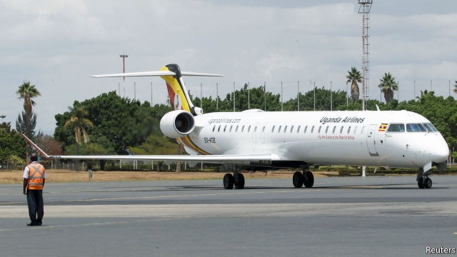

###### Blue-sky thinking

# Uganda is the latest African country to revive its national airline 

 

> print-edition iconPrint edition | Middle East and Africa | Aug 31st 2019 

AN AIRLINE IS a way of showcasing a people, says Jenifer Bamuturaki, commercial director of Uganda Airlines, which made its first commercial flight on August 28th. Passengers can tuck into katogo, a popular banana dish, served with a warm Ugandan welcome. The airline will soon fly to seven regional destinations, such as Nairobi and Mogadishu, on four 76-seater planes. It has also placed orders for two wide-body Airbus A330-800s, which could one day reach London and Guangzhou. 

Uganda has had a national airline before. It started out shipping whisky for President Idi Amin in the 1970s and collapsed in 2001. Now Uganda is returning to the air, and it is not alone. Neighbouring Tanzania, which is reviving its national carrier, has bought eight new planes and is considering flights to London. Ethiopian Airlines, the regional leader, is entering into joint ventures across the continent: it helped resurrect Chad’s national airline last year and has plans to do the same in Ghana and Zambia. In the past decade new airlines have taken to the skies in countries such as Senegal and Ivory Coast. 

African governments are not in it for the money. The International Air Transport Association (IATA), a trade group, forecasts that carriers on the continent will lose $300m this year, or $3.51 per passenger. Planes fly with more empty seats than in any other region of the world. High taxes, expensive fuel and old aircraft add to costs. South African Airways survives on government bail-outs. In July Kenya’s parliament voted to fully nationalise Kenya Airways as part of a plan to rescue it from debt. 

Joseph Muvawala, who heads the National Planning Authority in Uganda, says that governments see airlines as an investment in infrastructure. Technocrats hope that Uganda’s new airline will boost exports of fish and cut flowers, while pulling in tourist dollars, and will drive down high ticket prices on routes served by established carriers. Even if the airlines are unprofitable, the argument goes, the economy will gain. 

Such is the theory. In practice, airlines are bound up with ideas of national prestige. They stir a fuzzy feeling of patriotism in middle-class flyers (who get less excited about, say, rural roads). They can also become targets for political meddling. Some governments are pushing ahead with state-owned carriers even where the market is well served by private players, notes Raphael Kuuchi of IATA. Ghana’s politicians are talking of a new airline, even though a private operator flies to seven destinations from Accra. 

Only in Ethiopia has a national airline been an undoubted success. Managers have been left to get on with their jobs, even though the business is state-run. By joining up with Ethiopian Airlines, governments elsewhere hope to learn from its expertise. But they cannot import its other advantages, such as Ethiopia’s strategic location as a gateway for Asian traffic. As Ethiopian Airlines spreads its wings, ever more journeys will be funnelled through Addis Ababa airport, which already welcomes more than 10m passengers a year. 

The gleaming ranks of planes on the tarmac in Addis Ababa embody the dream of national carriers—and hint at a future which transcends them. The most efficient way to connect Africa is through a handful of regional hubs; the fastest way to increase flight numbers is by opening national markets to continental competition. Big players like Ethiopian Airlines are the obvious winners from that process, leaving little room for minnows. 

Yet patriotic illusions persist. The Ugandan government is protecting its infant airline and has not signed up to the Single African Air Transport Market, which would liberalise regional aviation. Even the president says the ideal option would be to create an “East African Airways” with neighbouring countries. Politics stops that idea from taking off. ■ 

-- 

 单词注释:

1.Uganda[ju(:)'^ændә, u:'^ændә]:n. 乌干达 

2.revive[ri'vaiv]:vt. 使苏醒, 使复兴, 使振奋, 回想起, 重播 vi. 苏醒, 复活, 复兴, 恢复精神 

3.Aug[]:abbr. 八月（August） 

4.showcase['ʃәukeis]:n. 陈列橱 [经] 商品陈列所, 货物陈列架 

5.jenifer[]:n. 珍妮弗（女子名） 

6.Ugandan[ju:'^ændәn]:n. 乌干达人 a. 乌干达(人)的 

7.regional['ri:dʒәnәl]:a. 地方的, 地域性的 [医] 区的, 部位的 

8.Nairobi[nai'rәubi]:n. 内罗比 

9.Mogadishu[,mɔ:^ɑ:'di:ʃu:]:摩加迪沙[索马里首都] 

10.airbus['eәbʌs]:空中客车 

11.guangzhou['ɡwɑ:ŋ'dʒəu]:n. 广州（广东省省会） 

12.IDI[]:abbr. 以色列钻石协会（Israeli Diamond Industry）；综合控制直接点火（Integrated Direct Ignition）；初始域标识符（Initial Domain Identifier）；美国国际器件公司 

13.amin[]:n. 阿敏（七十年代乌乾达的独裁者） 

14.Tanzania[.tænzә'ni:ә]:n. 坦桑尼亚 

15.Ethiopian[.i:θi'әupiәn]:a. 埃塞俄比亚的 n. 埃塞俄比亚人 

16.resurrect[.rezә'rekt]:vi. 复活 vt. 使复活, 复兴, 恢复, 盗掘 

17.Ghana['gɑ:nә]:n. 加纳 

18.Zambia['zæmbiә]:n. 赞比亚 [经] 赞比亚 

19.Senegal[,seni'^ɔ:l]:n. 塞内加尔 

20.ivory['aivәri]:n. 象牙, 乳白色 a. 象牙制的, 乳白色的 

21.iata[]:abbr. 国际航空运输协会（International Air Transport Association） 

22.airway['єәwei]:n. 空中航线, 风道 [医] 导气管 

23.fully['fuli]:adv. 十分地, 完全地, 充分地 

24.nationalise['næʃәnәlaiz]:vt. 把...收归国有, 使具有某国国籍, 使国有化 

25.Kenya['kenjә]:n. 肯尼亚 

26.Joseph['dʒәuzif]:n. 约瑟夫（男子名）；约瑟（圣经中雅各的第十一子） 

27.infrastructure['infrәstrʌktʃә]:n. 基础结构, 基础设施 [经] 基础设施 

28.technocrat['teknәukræt]:n. 技术专家治国论者, 技术专家统治论者 

29.unprofitable[.ʌn'prɒfitәbl]:a. 无利益的, 不赚钱的, 不上算的 [法] 无利可图的, 无益的 

30.prestige[pre'sti:ʒ]:n. 声望, 威望, 威信 [经] 商誉, 声誉 

31.fuzzy['fʌzi]:a. 有微毛的, 模糊的 [电] 微毛 

32.patriotism['peitriәtizm]:n. 爱国心, 爱国精神, 爱国主义 

33.flyer['flaiә]:n. 飞鸟, 飞行物, 飞行员, 快车, 传单, 飞跳 [经] 投机买卖, 孤注一掷, (广告)传单 

34.les[lei]:abbr. 发射脱离系统（Launch Escape System） 

35.meddle['medl]:vi. 干涉, 干预, 擅自摸弄 [法] 干预, 插手, 弄乱 

36.raphael['reifl, 'ræfeil]:n. 拉斐尔（姓氏）；拉斐尔（意大利画家、建筑学家） 

37.Accra[ә'krɑ:]:n. 阿克拉(加纳首都) 

38.Ethiopia[.i:θi'әupiә]:n. 埃塞俄比亚 

39.undoubted[.ʌn'dautid]:a. 无疑的, 确实的 [法] 无疑的, 确实的 

40.expertise[.ekspә:'ti:z]:n. 专家意见, 专门技术 [法] 专门知识, 专家意见 

41.cannot['kænɒt]:aux. 无法, 不能 

42.gateway['geitwei]:n. 门, 通路 [计] 网关 

43.funnel['fʌnl]:n. 漏斗, 漏斗状的东西, 烟囱 [化] 漏斗 

44.addis['ædis]:n. 艾缔思（姓氏） 

45.Ababa[]:n. (Ababa)人名；(塞)阿巴巴 

46.gleam[gli:m]:n. 光束, 微光, 反光 vi. 闪烁, 隐约地闪现 vt. 使发微光, 使闪烁 

47.tarmac['tɑ:mæk]:n. 柏油碎石, 柏油碎石路 

48.embody[im'bɒdi]:vt. 具体表达, 使具体化 [经] 合并, 具体化, 具体表现 

49.transcend[træn'send]:vt. 超越, 胜过 

50.hub[hʌb]:n. 毂, 木片, 中心 [计] 插座; 插孔; 集线器, 集中器, 连接器, 中继站 

51.continental[.kɒnti'nentl]:a. 大陆的, 洲的 n. 欧洲大陆人 

52.minnow['minәu]:n. 鲤科淡水小鱼 

53.patriotic[.peitri'ɒtik]:a. 爱国的, 有爱国心的 [法] 爱国的, 有爱国心的 

54.liberalise['lɪbərəlaɪz]:vt. 使自由化 

55.politic['pɒlitik]:a. 精明的, 明智的, 策略的 

