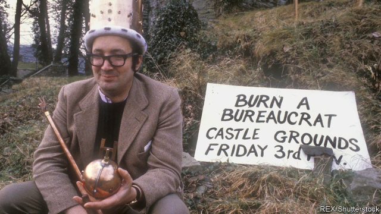

###### A saviour in ermine

# Obituary: Richard Booth died on August 20th 

 

> print-edition iconPrint edition | Obituary | Aug 31st 2019 

IF YOU WERE presented with a town like Hay-on-Wye—a sandstone cluster of some 2,000 souls guarded by a Norman castle, cradled in green Welsh hills and watered by the loveliest river in Britain—and were told to revive its fading economy, you might not think of a second-hand bookshop. The entrepreneurial flame seldom burns bright there. Outside, a few shelves open to the weather tempt you with Proceedings of the 1957 Plumbers’ Convention and “Turnips for Fun and Profit”. Inside the stock is haphazard, unalphabetical, and sometimes in piles on the floor. Beside the till, an intellectual ancient in tweed jacket or cardigan, roughly according to sex, sits sunk in such slumbrous appreciation of a volume from the stock that they do not stir either to wish you good day when you enter, or say goodbye when you leave. 

Richard Booth overturned all that. He swept into Hay in 1961, fresh down from Oxford, flush with inherited money from Yardley’s soap and toilet water and sparkling with visionary schemes. First he bought the dilapidated old fire station in Lion Street and filled it with books. He did the same with the old cinema, then two premises on the high street, until he had opened 20, and the original shop had become, by his estimate, the biggest second-hand bookshop in the world. Many of his employees went on to start bookshops of their own, until the town had almost 40. Encouraged by this bonanza the Hay Festival of Literature started up in 1988, drawing up to 250,000 visitors for ten days every year. Little Hay was now world-famous. In 1999 the University of Strathclyde reported that, since Mr Booth and the books arrived, not only had the town boomed but, on the back of that, Wales had. 

Odd, then, that Hay’s saviour did not care that much for books. His father liked browsing, and as a boy he had tagged along, but those dusty tomes might have been vegetables or shoes as far as he was concerned. You could carry them about, and use them as wallpaper; he was happy to choose books for the libraries of rich Americans simply for their bindings, not for anything inside. Books were something he could sell, piling high and flogging cheap, and the more outlets he had in a place, the more people would come. So with several strong men from Hay he toured America and the English-speaking world, buying whole libraries, until his shops were so stuffed that in the 1980s, to the horror of those who did care, he was offering books as kindling at £1.50 a car-boot-load. One famous visiting writer counted 20 copies of “The Indian Dog” in the main shop. No matter; Mr Booth reasoned that any book at all might have a buyer waiting somewhere. 

And books were a means to his glorious end: to make his home town stand proudly on its own two feet, freed from the shackles of the useless town council, the Welsh Tourist Board and the quangos of the Development Board for Rural Wales. Government bureaucrats had no idea how to make a town like Hay thrive. Everything they came up with—chain motels employing the slave-labour of the locals, theme parks, supermarkets selling them bad bland food—stripped away the distinctiveness of the place. Local voices went unheard. The answer was to give the town back to the talents and good sense of its citizens, and books were just the start. He already lived in the half-ruined castle, knocked about a bit by both bad King John and Owen Glyndwr, and parked his Rolls-Royce outside, so the next move came naturally. In 1977, when 20 journalists were in town—searching for the pop star Marianne Faithfull, not for him—he seceded from Britain in a Unilateral Declaration of Independence and crowned himself king. 

Coverage was immense. The national press relayed his triumphal entry into the town, clad in a tin-foil crown and ermine cloak and bearing his regalia of gilded ballcock and copper piping, while the biplane of the Hay air force did a flypast and the rowing boat of the Hay navy went down the Wye, firing blanks through a drainpipe. After a three-minute speech, in which he hoped that “Haypotage” and “the Hay loaf” would become real, not theoretical, he raised the flag of independence, the green and white of Wales with the black Booth arms, to the cheers of 20,000 people. 

His demeanour was royal, right down to fits of royal pique; yet he was not a monarchist. He invoked the divine right of kings only as a perfect foil to the divine right claimed by officialdom. Democracy was his real love, as his rule showed. Almost everyone in town could have a post in his government. His drinking pals from The Rose and Crown made up his cabinet; the minister for social security had been on the dole for six years. He sold titles to anyone who fancied being a duke, an earl or a Polish count. His subjects were also decorated at random: two small boys in the crowd at his coronation were knighted, and a woman was declared queen of her street, receiving a gold-dipped flower. Every month the back room at The Swan became the Royal University of Cusop Dingle, dedicated to topics cruelly ignored by the rest of academia. In this centre of learning, anyone could be a professor. 

What with the books and its giddy freedom, Hay now thrived, becoming a model of revival for failing rural towns the world over, from Nebraska to South Korea. Its king was delighted by that, though he himself rose and fell, going bust at one point (he was hopeless with money), failing to win a seat in the Welsh Assembly and, by 2007, selling all his shops. He gained enemies as well as friends, and in 2009 was executed in effigy in the old Butter Market by a rival bookseller, who set up a Commonwealth. 

Nor did he ever embrace the Festival, which to him was a piece of Murdochite sponsorship which brought crowds for a while but did not sustain the town month in, month out. Worse, it celebrated new books, a million words of mumbo-jumbo nonsense. He dreamed of a polis of creative citizens working nobly with their hands, fed by cheery peasants from the green surrounding hills who brought in ungraded eggs and home-cured bacon, unbound by fussy regulations. Whether they read or not—whether they could read or not—mattered less than that the bureaucrats were felled at last, clobbered by 20 copies of “The Indian Dog”. ■ 
<<<<<<< HEAD

-- 

 单词注释:

1.saviour['seivjә]:n. 救助者, 救世主, 救星 

2.ermine['ә:min]:n. 白鼬, 白鼬毛皮 [法] 法官职位, 法官制服 

3.richard['ritʃәd]:n. 理查德（男子名） 

4.obituary[ә'bitjuәri]:a. 关于死亡的, 讣告的 n. 讣告 

5.Aug[]:abbr. 八月（August） 

6.sandstone['sændstәun]:n. 沙岩 [化] 砂岩 

7.cluster['klʌstә]:n. 串, 丛, 群, 簇 vi. 成串, 丛生 vt. 使聚集 [计] 簇 

8.norman['nɔ:mәn]:a. 诺曼第语的；诺曼第人的 

9.cradle['kreidl]:n. 摇篮, 发祥地, 孩提时代 vt. 放在摇篮内, 抚育 vi. 刈割 

10.Welsh[welʃ]:a. 威尔士的 n. 威尔士人 vi. 赖赌帐, 逃避责任 

11.revive[ri'vaiv]:vt. 使苏醒, 使复兴, 使振奋, 回想起, 重播 vi. 苏醒, 复活, 复兴, 恢复精神 

12.entrepreneurial[ˌɒntrəprə'nɜ:rɪəl]:a. 创业的, 具有企业精神的; 企业性质的 

13.proceeding[prәu'si:diŋ]:n. 进行, 程序, 行动, 诉讼程序, 事项 [化] 会议论文集 

14.haphazard[hæp'hæzәd]:n. 偶然性, 偶然事件 a. 无计划的, 偶然的, 随便的 adv. 偶然地 

15.tweed[twi:d]:n. (粗)花呢, 花呢服装 

16.cardigan['kɑ:digәn]:n. 卡迪根式开襟羊毛衫 

17.slumbrous['slʌmbrәs]:a. 瞌睡的, 昏昏欲睡的, 使人瞌睡的, 催眠的, 寂静的, 沉睡般的 

18.overturn[.әuvә'tә:n]:n. 倾覆, 破灭, 革命 vt. 推翻, 颠倒 vi. 翻倒 

19.Oxford['ɒksfәd]:n. 牛津, 牛津大学 

20.visionary['viʒәnәri]:a. 幻像的, 幻想的, 梦想的 n. 有眼力的人, 空想家, 梦想者 

21.dilapidate[di'læpideit]:v. (使)荒废, (使)毁坏 

22.premise['premis]:n. 前提, 房屋连地基, 上述各项 vt. 预先提出, 引出, 作为...的前提 vi. 作出前提 

23.bonanza[bәu'nænzә]:n. 富矿带, 带来好运的事物, 幸运 

24.Strathclyde[stræθ'klaid]:斯特拉思克莱德区[英国苏格兰行政区名] 

25.wale[weil]:n. 隆起的伤痕, 鞭痕, 凸条纹, 精华, 选择 vt. 在...上留下鞭痕, 织成棱纹, 挑选, 撑住 vi. 挑选 

26.browse[brauz]:v. 浏览, 吃草 n. 浏览, 吃草 [计] 浏览 

27.tome[tәum]:n. 册, 卷, 大本书 

28.wallpaper['wɒ:lpeipә]:n. 壁纸, 墙纸 v. 贴墙纸 [计] 壁纸 

29.binding['baindiŋ]:n. 装订 [计] 联编; 汇集; 绑定, 捆绑 

30.flog[flɒg]:vt. 鞭打, 鞭策, 严厉的批评, 迫使 

31.kindle['kindl]:vt. 点燃, 使着火, 引起, 照亮 vi. 着火, 激动, 发亮 

32.buyer['baiә]:n. 买主, 买方 [经] 买主, 买方, 买手 

33.proudly['praudli]:adv. 傲慢地, 自大地, 得意洋洋地 

34.shackle['ʃækl]:n. 桎梏, 束缚物 vt. 加枷锁, 束缚 

35.quango[ˈkwæŋgəʊ]:n. 半独立国家的政府组织, 半官方机构 

36.bureaucrat['bjuәrәukræt]:n. 官僚作风的人, 官僚, 官僚主义者 [法] 官僚, 官僚作风的人 

37.bland[blænd]:a. 温和的, 乏味的, 冷漠的 [医] 温和的, 淡的 

38.distinctiveness[dɪ'stɪŋktɪvnɪs]: 特殊[独特]性 

39.unheard[.ʌn'hә:d]:a. 没有被听到的, 未予倾听的, 未予考虑的 

40.john[dʒɔn]:n. 盥洗室, 厕所, 嫖客 

41.owen['әuin]:n. 欧文（男子名） 

42.glyndwr[]: [人名] 格林杜尔 

43.marianne[,meәri'æn, mɑ:'rjɑ:n]:n. 玛丽安（法兰西共和国或其政府的绰号, 因以女性为其化身, 故名） 

44.faithfull[]: [人名] [英格兰人姓氏] 费思富尔 Faith的变体 

45.secede[si'si:d]:vi. 正式脱离(或退出), 分离 [法] 退出, 脱离 

46.unilateral[.ju:ni'lætәrәl]:a. 单方面的, 单边的, 片面的 [医] 单侧的, 一侧的 

47.declaration[.deklә'reiʃәn]:n. 宣告, 说明, 宣布 [计] 说明 

48.coverage['kʌvәridʒ]:n. 覆盖的范围, 保险总额, 新闻报导 [化] 可达范围; 覆盖度 

49.triumphal[trai'ʌmfәl]:a. 胜利的, 凯旋的 

50.clad[klæd]:vt. 在金属外包上另一种金属 a. 包层金属的 clothe的过去式和过去分词 

51.regalia[ri'geiljә]:n. 王权, 王位标识, 标记, 徽章 [法] 王权, 王室的特权, 王权的标记 

52.gild[gild]:vt. 镀金, 虚饰, 装饰, 供给钱 

53.ballcock[]:n. 浮球旋塞 

54.biplane['baiplein]:n. 双翼飞机 

55.flypast['flaipɑ:st]:n. 空中分列, 低空编队飞行 

56.wye[wai]:n. Y字形物 [电] Y形接头 

57.drainpipe['dreinpaip]:n. 排水管 

58.demeanour[di'mi:nә]:n. 行为, 举止 

59.pique[pi:k]:n. 赌气, 愤怒, 不快, 凹凸织物 vt. 伤害...自尊心, 激怒, 刺激, 引起兴趣, 使兴奋 

60.monarchist['mɒnәkist]:n. 君主主义者 

61.invoke[in'vәuk]:vt. 祈求, 恳求, 实行, 援引, 引起 [计] 调用; 请求 

62.divine[di'vain]:a. 神的, 神圣的, 非凡的 n. 神学家 

63.foil[fɒil]:n. 箔, 烘托, 衬托 vt. 贴箔于, 衬托, 阻止, 挡开, 挫败 

64.officialdom[ә'fiʃәldәm]:n. 官场, 官僚圈子, 公务员, 官僚主义 [法] 官场, 公务员界, 官吏 

65.pal[pæl]:n. 朋友, 伙伴, 同志, 同谋 vi. 交友, 结伴 

66.dole[dәul]:n. 救济品, 失业救济金 vt. 发放救济 

67.duke[dju:k]:n. 公爵 

68.earl[ә:l]:n. 伯爵 

69.coronation[.kɔ:rә'neiʃәn]:n. 加冕礼 

70.knight[nait]:n. 骑士, 爵士 vt. 授以爵位 

71.dingle['diŋgl]:n. 小峡谷, 幽谷 vi. 发叮当声, 发抖 

72.dedicate['dedikeit]:vt. 献出, 贡献 

73.cruelly['kru:әli]:adv. 残忍地, 残酷地, 极 

74.academia[.ækә'di:miә]:n. 学术界, 学术生涯 

75.giddy['gidi]:a. 眼花的, 头晕的 v. (使)眼花, (使)眩晕 

76.revival[ri'vaivl]:n. 复兴, 复活, 恢复精神, 苏醒 [医] 复苏, 回生, 精神重振 

77.Nebraska[ni'bræskә]:[经] 内布拉斯加州, (美国中西部的一州) 

78.Korea[kә'riә]:n. 朝鲜, 韩国 

79.bust[bʌst]:n. 半身像, 胸部, 失败, 殴打 vt. 使爆裂, 使破产 vi. 爆裂, 破产 [计] 操作错 

80.effigy['efidʒi]:n. 肖像, 雕像 

81.bookseller['bukselә]:n. 书商 

82.commonwealth['kɔmәnwelθ]:n. 共和国；联邦；国民整体 

83.murdochite['mә:dә,kait]:方铜铅矿 

84.sponsorship['spɔnsәʃip]:n. 发起, 倡议, 主办, 保证人的地位, 教父的地位, 教母的地位 

85.polis['pәulis]:n. 城邦 

86.nobly['nәubli]:adv. 华丽地, 高尚地, 豪爽地 

87.cheery['tʃiәri]:a. 愉快的 

88.ungraded[ʌn''gredɪd]: 未整平的; 劣质; 次级; 次级的 

89.unbind[.ʌn'baind]:vt. 解, 解开, 解放 [计] 协议撤消程序 

90.fussy['fʌsi]:a. 易怒的, 爱挑剔的, 难取悦的, 易烦恼的 

91.les[lei]:abbr. 发射脱离系统（Launch Escape System） 

92.fell[fel]:vt. 击倒 n. 一季所伐的木材, 折缝 a. 凶猛的, 可怕的 fall的过去式 

93.clobber['klɒbә]:n. 衣服, (鞋匠用来掩饰皮革缝的)软膏 vt. 痛打, 击倒, 拉垮 
=======
>>>>>>> 50f1fbac684ef65c788c2c3b1cb359dd2a904378

