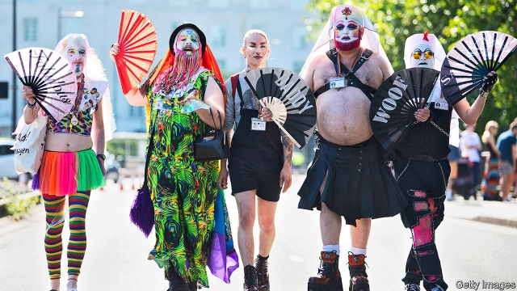

###### Genetics and sexuality

# A scientific study has established that there is no “gay gene” 

 

> print-edition iconPrint edition | Science and technology | Aug 31st 2019 

IN 1993 A region of the human genome called Xq28 was linked to male homosexuality, and the controversial notion of a “gay gene” was born. Those research findings have not been replicated. But it was never going to be that simple: decades of genetic research have shown that almost every human characteristic is a complex interplay of genes and environmental factors. A new study, published in Science this week, confirms that this is the case for human sexuality, too. 

The study, the largest ever into this difficult topic, was conducted by an international group of scientists working with 23andMe, a personal genomics firm. It used what is called a genome-wide association study (GWAS) on 408,995 individuals in the UK Biobank, a British health resource, and 68,527 American 23andMe users—all of whom remained anonymous and consented to the study. 

A GWAS involves scanning a person’s DNA for tiny variations in the genetic code (simple changes in the As, Ts, Gs or Cs) that correlate with a given trait. The participants were divided on the basis of whether they answered yes or no to the question “Have you ever had sex with someone of the same sex?”—a woolly proxy for sexual orientation, even in the absence of little white lies. The figures the GWAS produced, therefore, relate only to a single act, not to whether someone identifies as gay. 

The researchers found five genetic markers that were significantly associated with a reported homosexual act by one of the participants in the study. None of those markers was on the X or Y sex chromosomes and their total combined effect accounted for less than 1% of the variance. This is because the behaviour is the result of the aggregate effort of hundreds or thousands of genes, whose individual effects are infinitesimally weak. Totting up all the thousands of tested genetic variants accounted for between 8% and 25% of the variation in people’s self-reported homosexual acts. These variants also overlapped with other traits, such as a smoking and an openness to new experiences. 

Interestingly, only about 60% of the genetic variants identified in the study were shared by both sexes. Most behaviours show more overlap between the sexes than this, intimating that male and female homosexuality, or at least sexual adventures, may be quite different. David Curtis of University College London notes that what overlap there is “suggests that there could be specific factors affecting same-sex attraction rather than simply being attracted to males versus being attracted to females.” 

Conscious of the tricky subject matter, the scientists are at pains to anticipate any misunderstandings or backlash. They collaborated with LGBT advocacy groups throughout the study. 

Yet the research only scrapes the surface of the mysterious depths of human sexuality. Unravelling these riddles will be difficult and will inevitably beget misconception and controversy. But at least this study should add weight to the view that non-heterosexual behaviour is firmly within the normal, natural spectrum of human diversity and provide a firm foundation for future work.■ 

-- 

 单词注释:

1.sexuality[.sekʃu'æliti]:n. 性征, 性行为, 性欲 [医] 性别, 性欲 

2.Aug[]:abbr. 八月（August） 

3.genome['dʒi:nәum]:[化] 基因组 [医] 染色体组 

4.homosexuality[-'æliti]:n. 同性恋 [医] 同性性欲, 同性恋爱 

5.replicate['replikeit]:vt. 折叠, 折转, 复制 n. 复现试验, 复制品, 高八度音 a. 复现的, 复制的, 折转的, 弯回的 

6.interplay['intәplei]:n. 互相作用, 互相影响 vi. 互相作用 

7.environmental[in.vaiәrәn'mentәl]:a. 周围的, 环境的 [经] 环境的, 环保的 

8.genomics[dʒə'nəʊmɪks]: 基因组学 

9.GWAS[]:[网络] 全基因组关联研究(genome-wide association studies)；全基因组关联分析(Genome Wide Association Study)；全基因组关联分析研究 

10.UK[ju: 'kei]:n. 联合王国 

11.biobank[]:[网络] 生物银行；生物资料库；生物样本库 

12.anonymous[ә'nɒnimәs]:a. 姓氏不详的, 无名的, 无特色的 [计] 无记录 

13.DNA[]:脱氧核糖核酸 [计] 无效数据, 数字网络体系结构, 分布式网络体系结构 

14.T[ti:]:[计] 表, 终端, 测试, 磁道, 树, 真, 太, 万亿 [医] 温度, 胸的, 胸廓的, 眼球内压, 眼压, 垓, 千京, 兆兆 

15.G[dʒi:]:[计] 千兆, 吉, 图形, 网格, 接地 [化] 鸟苷 

16.C[si:]:[计] 调用, 访问, 呼叫；电容, 进位, 通道, 字符, 清除, 常数, 控制, 周期；C 程序设计语言 [化] 碳的化学符号; 胞苷 

17.correlate['kɒrәleit]:n. 有相互关系的东西, 相关物 vt. 使有相互关系 vi. 相关 

18.trait[treit]:n. 特征, 特性, 一笔, 少许 

19.participant[pɑ:'tisipәnt]:n. 参加者, 参与者 a. 有份的, 参加的, 参与的 

20.woolly['wuli]:a. 羊毛制的, 模糊的, 似羊毛的, 蓬乱的 

21.proxy['prɒksi]:n. 代理, 代理人, 委托书 [经] 代理人, 代表权, 授权书 

22.orientation[.ɒ:rien'teiʃәn]:n. 定方位, 适应, 向东方 n. 方向 [计] 方向 

23.marker['mɑ:kә]:n. 作记号的人, 记分员, 书签, 纪念碑, 里程碑, 标识物, 标记 [计] 标记 

24.significantly[]:adv. 值得注目地；意味深长地 

25.homosexual[.hɒmәu'sekjuәl]:a. 同性恋的 n. 同性恋者 

26.x[eks]:n. 未知数 [计] 交换, 变址, 索引, 传输 

27.Y[wai]:[计] 原型 [医] 钇(39号元素) 

28.chromosome['krәumәsәum]:n. 染色体 [化] 染色体 

29.les[lei]:abbr. 发射脱离系统（Launch Escape System） 

30.variance['vєәriәns]:n. 不一致, 变化, 变异, 分歧, 不和 [化] 方差; 变种 

31.aggregate['ægrigәt]:n. 合计, 总计, 聚集体 a. 合计的, 聚集的 v. 聚集, 集合, 合计达 [计] 聚合体; 聚集 

32.infinitesimally[ˌɪnfɪnɪ'tesɪməlɪ]:adv. 无限小地 

33.tot[tɒt]:n. 小孩, 少量, 合计 vi. 合计, 总计为 vt. 加 [计] 全体, 总数, 传送开销时间 

34.variant['vєәriәnt]:n. 变体, 异体 a. 不同的, 有差别的 [计] 变体型 

35.overlap[.әuvә'læp]:n. 重叠, 重复, 部分的同时发生 vt. 重叠, 重复, 与...同时发生 vi. 迭盖, 部分的同时发生 [计] 重叠 

36.openness['әupәnnis]:n. 公开；宽阔；率真 

37.interestingly['intristiŋli]:adv. 有趣地 

38.david['deivid]:n. 大卫；戴维（男子名） 

39.curtis['kә:tis]:n. 柯蒂斯（男子名） 

40.versus['vә:sәs]:prep. 对... [法] 诉, 对, 相形 

41.tricky['triki]:a. 狡猾的, 机敏的 

42.misunderstanding[.misʌndә'stændiŋ]:n. 误会, 误解 [法] 误解, 误会, 不和 

43.backlash['bæklæʃ]:n. 后冲, 强烈反对 [电] 反撞, 逆栅流 

44.lgbt[.el dʒiː biː 'tiː]:[网络] 同志；跨性别者；双性恋和跨性别 

45.advocacy['ædvәkәsi]:n. 拥护, 支持, 鼓吹, 辩护, 辩护术 [法] 辩护, 拥护, 提倡 

46.unravel[.ʌn'rævl]:vt. 阐明, 解决, 解开 vi. 散开 

47.inevitably[in'evitәbli]:adv. 不可避免地 

48.beget[bi'get]:vt. 为某人之生父, 招致, 产生, 引起 

49.misconception[.miskәn'sepʃәn]:n. 误解 

50.controversy['kɒntrәvә:si]:n. 论争, 辩论, 论战, 争论 [法] 论战, 争论, 争吵 

51.spectrum['spektrәm]:n. 光谱, 范围, 系列 [化] 光谱 

52.diversity[dai'vә:siti]:n. 差异, 多样性 [化] 多样性 

