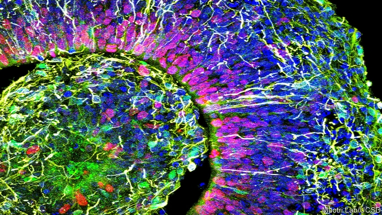

###### What is a brain?

# Cerebral organoids are becoming more brainlike 

 

> print-edition iconPrint edition | Science and technology | Aug 31st 2019 

AT WHAT POINT does a mass of nerve cells growing in a laboratory Petri dish become a brain? That question was first raised seriously in 2013 by the work of Madeline Lancaster, a developmental biologist at the Medical Research Council’s Laboratory of Molecular Biology, in Cambridge, Britain. That year Dr Lancaster and her colleagues grew the first human-derived “cerebral organoid”. They did so using pluripotent human stem cells, which are cells that have the potential to develop into any type of tissue in the human body. The researchers coaxed these cells into becoming nervous tissue that organised itself, albeit crudely, as structures which had some of the cell types and anatomical features of embryonic human brains. 

Since then, Dr Lancaster’s work has advanced by leaps and bounds. In March, for example, she announced that her organoids, when they are connected to the spinal cord and back-muscle of a mouse, could make that muscle twitch. This means cerebral organoids are generating electrical impulses. And other scientists are joining the fray. One such, Alysson Muotri of the University of California, San Diego, has published this week, in Cell Stem Cell, a study that looks in more detail at cerebral-organoid electrical activity. 

To carry out their study, Dr Muotri and his colleagues grew and examined hundreds of organoids, each a mere half-millimetre in diameter, over the course of ten months. To probe individual neurons within these they used tiny, fluid-filled pipettes that acted as electrodes small enough to maintain contact with the surface of an individual cell. 

Neurons probed in this way proved electrically active, so the researchers went on to employ arrays of electrodes inserted simultaneously into different parts of an organoid to study its overall activity. They looked in detail, once a week, at each of the organoids that were chosen for examination. This revealed that, by six months of age, the electrical activity in different parts of an individual organoid had become synchronised. 

Such synchronicity is also a feature of real brains, including those of preterm human infants of about the same age as Dr Muotri’s organoids. It is regarded as an important part of healthy brain function. So, to check how similar natural and organoid brain waves actually are, the research team ran those waves obtained from their organoids through a computer program that had previously been trained to recognise the electrical activity generated by the brains of premature babies. This algorithm proved able to predict to within a week the ages of laboratory-grown organoids 28 or more weeks old. That suggests those organoids are indeed growing in a manner similar to natural human brains. 

If further research confirms this opinion, then for medical science that conformity with natural development could be a boon. Neuroscientists have long been held back by the differences between human brains and those of other animals—particularly the brains of rodents, the analogue most commonly employed in medical research. The purpose of the work that Dr Lancaster, Dr Muotri and others involved in the field are engaged in has always been to produce better laboratory models of neurological and psychiatric diseases, so that treatments may be developed. 

And, although it may be some time in the future, there is also the possibility that organoids might one day be used as transplant material in people who have had part of their brains destroyed by strokes. 

For ethicists, however, work like this raises important issues. A sub-millimetre piece of tissue, even one that displays synchronised electrical pulsing, is unlikely to have anything which a full-grown human being would recognise as consciousness. But if organoids grown from human stem cells start to get bigger than that, then the question that was posed back in 2013 becomes pressing.■ 
<<<<<<< HEAD

-- 

 单词注释:

1.cerebral['seribrәl]:a. 脑的, 大脑的 [医] 小脑的 

2.organoids[]: 类器官（organoid的复数） 

3.brainlike[]:[网络] 分子能展现出类脑 

4.Aug[]:abbr. 八月（August） 

5.petri[pɛtrə]:abbr. petroleum 石油 

6.Madeline[]:n. 玛德琳（女子名） 

7.lancaster['læŋkәstә]:n. 兰开斯特（美国成市） 

8.developmental[di.velәp'mentәl]:a. 发展的, 进化的, 启发的 [医] 发育的 

9.biologist[bai'ɒlәdʒist]:n. 生物学家 [医] 生物学家 

10.molecular[mә'lekjulә]:a. 分子的, 由分子组成的 [医] 分子的 

11.Cambridge['keimbridʒ]:n. 剑桥 

12.cerebral['seribrәl]:a. 脑的, 大脑的 [医] 小脑的 

13.organoid['ɔ:^әnɔid]:n. 类器官 a. 器官状的 

14.pluripotent[pljә'ripәtәnt]:a. [生]多能(性)的 

15.coax[kәuks]:vt. 哄, 诱骗, 耐心地摆弄 vi. 哄骗 [计] 同轴电缆 

16.albeit[ɔ:l'bi:it]:conj. 尽管, 虽然 

17.crudely['kru:dli]:adv. 照自然状态, 未成熟地, 粗杂地 

18.anatomical[.ænә'tɒmikl]:a. 解剖的, 解剖学的, 构造上的 [医] 解剖学的 

19.embryonic[.embri'ɒnik]:a. 萌芽的, 初期的, 未成熟 [医] 胚胎的 

20.spinal['spainl]:a. 针的, 尖刺的, 尖刺状突起的, 脊骨的 [医] 棘折; 脊柱的 

21.twitch[twitʃ]:vi. 急拉, 抽搐, 阵痛 vt. 急拉, 攫取, 抽动 n. 急拉, 抽搐, 阵痛 

22.impulse['impʌls]:n. 冲动, 驱使, 刺激, 推动, 冲力, 建议, 脉冲 vt. 推动 

23.fray[frei]:n. 磨损, 打架, 争论 vt. 使磨损 vi. 被磨损 

24.California[.kæli'fɒ:njә]:n. 加利福尼亚 

25.san[sɑ:n]:abbr. 存储区域网（Storage Area Networking） 

26.diego[]:n. 迭戈（男子名） 

27.probe[prәub]:n. 探索, 调查, 探针, 探测器 v. 用探针探测, 调查, 探索 

28.neuron['njuәrɔn]:n. 神经原, 轴索, 神经细胞 [计] 神经元 

29.pipette[pi'pet]:n. 吸量管, 吸移管 [化] 吸移管 

30.electrode[i'lektrәud]:n. 电极 [化] 电极; 焊条; 电焊条 

31.electrically[i'lektrikәli]:adv. 电力地；有关电地 

32.array[ә'rei]:n. 排列, 衣服, 大批, 军队 vt. 布署, 打扮, 排列 [计] 数组; 阵列 

33.simultaneously[simәl'teiniәsly; (?@) saim-]:adv. 同时发生, 一齐, 同时, 同时存在 

34.synchronise['siŋkrәnaiz, 'sin-]:vi. (使)同时发生, (使)整步, (使)同步, (使)同速进行 vt. 使在时间上一致, 校准, 把钟表拨至相同的时间, 把...并列对照 

35.synchronicity[,siŋkrә'nisәti,,sin-]:n. [心]同步性,同时发生 

36.preterm[ˌpri:'tɜ:m]:a. 早产的 

37.premature[.premә'tjuә]:a. 早产的, 过早的, 不成熟的 n. 早产儿, 过早发生的事物 

38.algorithm['ælgәriðm]:n. 算法 [计] 算法 

39.conformity[kәn'fɒ:miti]:n. 遵照, 适合, 一致, 相似 [计] 符合度 

40.boon[bu:n]:n. 恩惠 

41.neuroscientist['njʊərəʊsaɪəntɪst]: [医]神经科学家：神经科学各分支的专家 

42.rodent['rәudәnt]:a. 咬的, 啮齿类的 n. 啮齿动物 

43.analogue['ænәlɒg]:n. 类似物, 相似情况 [医] 类似物, 同型物, 相似器官, 同功异质体 

44.alway['ɔ:lwei]:adv. 永远；总是（等于always） 

45.neurological[.njurә'lɒdʒikl]:a. 神经病学上的 

46.psychiatric[saiki'ætrik; (?@) si-]:a. 精神病学的, 医精神病的 [医] 精神病学的 

47.ethicist['eθisist]:伦理学家 
=======
>>>>>>> 50f1fbac684ef65c788c2c3b1cb359dd2a904378

