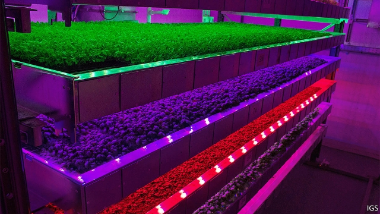

###### Growing higher

# New ways to make vertical farming stack up 

 

> print-edition iconPrint edition | Science and technology | Aug 31st 2019 

FROM THE outside it looks like a tall, metal-clad barn. But step in, through a large airlock designed to keep out the bugs, and a kaleidoscopic scene emerges. A central aisle is flanked by two pairs of towers. Each tower is stacked with a dozen or so trays on which are growing strawberries, kale, red lettuce and coriander. And each tray is bathed in vibrant light of different colours, mostly hues of blue and magenta. Douglas Elder, who is in charge of this artificial Eden, taps some instructions into an app on his mobile phone and, with a short whirr of machinery, a tray of lush, green basil slides out for his inspection.  

Mr Elder is product manager for Intelligent Growth Solutions (IGS), a “vertical farming” company based at Invergowrie, near Dundee, in Scotland. Each of the nine-metre-high towers in the demonstration unit that he runs occupies barely 40 square metres. But by stacking the trays one on top of another an individual tower provides up to 350 square metres of growing area. Using his phone again, Mr Elder changes the colours and brightness of the 1,000 light-emitting diodes (LEDs) strung out above each tray. The app can also control the temperature, humidity and ventilation, and the hydroponic system that supplies the plants, growing on various non-soil substrates, with water and nutrients. Armed with his trusty phone, Mr Elder says he can run the farm almost single-handedly. 

Vertical farming of this sort is not, of itself, a new idea. The term goes back to 1915, though it took a century for the first commercial vertical farms to be built. But the business is now taking off. SoftBank, a Japanese firm, Google’s former boss Eric Schmidt and Amazon’s founder Jeff Bezos have between them ploughed more than $200m into Plenty, a vertical-farming company based in San Francisco. And in June Ocado, a British online grocery, splashed out £17m ($21.3m) on vertical-farming businesses to grow fresh produce within its automated distribution depots. 

The interest of investors is growing just as technology promises to turn vertical-farming operations into efficient “plant factories”. The high-tech LEDs in IGS’s demonstration unit are optimised so that nary a photon is wasted. The hydroponics, and the recycling that supports them, mean the only water lost from the system is that which ends up as part of one of the plants themselves. And towers mean the system is modular, and so can be scaled up. Most of the systems which IGS hopes to start delivering to customers early next year will consist of ten or more towers. 

Some people, however, remain sceptical about how much vertical farms have to offer that good-old-fashioned greenhouses do not. Vertical farms are certainly more compact—a bonus in places like cities where land is expensive. Since sales of fresh produce to the urban masses are often touted as one of vertical farming’s biggest opportunities, that is important. But a greenhouse gets its light, and much of its heat, free, courtesy of the sun. And modern greenhouses can also use solar-powered supplementary LED lighting to extend their growing seasons and hydroponic systems to save water, says Viraji Puri, co-founder of Gotham Greens, an urban-farming company that operates greenhouses on the roofs of buildings in New York and Chicago. As for food miles, they could not get any shorter for Gotham Greens’s rooftop greenhouse in Brooklyn, which supplies the Whole Foods Market located downstairs. 

The biggest drawback of vertical farming is the high cost of the electricity required to run the large number of LEDS. This has meant that production has been commercially viable for high-value, perishable produce only, such as salad leaves and herbs. That, nevertheless, is a market not to be sniffed at. But for a broader range of produce, it can prove too expensive. In 2014 Louis Albright, an emeritus professor of biological and environmental engineering at Cornell University in America, calculated that a loaf of bread made from wheat grown in a vertical farm would be priced at about $23. 

One way of saving electricity is to use LEDs that generate only the colours that plants require, instead of the full spectrum of plain white light. Plants are green because their leaves contain chlorophyll, a pigment that reflects the green light in the middle of the spectrum while absorbing and using for photosynthesis the blue and red wavelengths at either end of it. 

The vertical farm at Invergowrie takes this idea further. It uses LEDs that are highly tuneable. Although the lights produce mostly blue and red wavelengths, researchers now know that other colours play an important role at various stages of a plant’s development, says David Farquhar, IGS’s chief executive. A dose of green at an appropriate moment produces a higher yield. A timely spot of infrared can improve the quality of foliage. The lights can also produce various blue/red mixes. 

To operate these LEDs efficiently, the company has developed a low-voltage power-distribution system. This, says Mr Farquhar, can cut energy costs to about half of those incurred by existing vertical farms. As a result, all four towers can produce 15-25 tonnes a year of herbs, salad leaves, fruit and vegetables. This, the company claims, is between two and three times more than a conventional greenhouse with an equivalent but horizontal growing area, and equipped with supplementary lighting and heating, could manage. And the system can grow all this produce at a similar cost-per-kilogram. 

One of the jobs of the Invergowrie unit is to develop lighting regimes tailored to individual crops. Another is to develop algorithms to control, in an equally bespoke way, the climatic conditions preferred by different crops. The idea is to design crop-specific weather “recipes” in order to boost the yield and quality of whatever varieties are grown in the vertical farm. All the processes involved are engineered to be efficient. Irrigation, for instance, relies on captured rainwater. This is cleaned and recycled, but only 5% gets used up by each harvest—and most of that as the water-content in the plants themselves. Ventilation is also a closed loop, harvesting surplus heat from the LEDs while managing humidity and oxygen levels. 

By reducing running costs, the system should make it profitable to grow a wider variety of produce vertically. The firm has already succeeded with some root vegetables, such as radishes and baby turnips. Bulk field crops, such as wheat and rice, may never make sense for a vertical farm, and larger, heavier vegetables would be tricky to raise. This means full-grown potatoes are probably off the menu, at least with existing technology. 

Seed potatoes, though, are a good candidate, says Colin Campbell, head of the James Hutton Institute, a plant-science research centre backed by the Scottish government. It is based next door to IGS and works with the company. Many fields around the world, Dr Campbell observes, are suffering a growing burden of pests and disease, such as potato-cyst nematode. In the controlled environment of a vertical farm, from which both pests and diseases can be excluded, seed potatoes could be propagated more efficiently than in the big, bad outdoor world. This would give them a head start when they were planted out in fields. 

The institute’s researchers are also looking at plant varieties that might do particularly well indoors, including old varieties passed over in the search for crops which can withstand the rigours of intensive farming systems. By dipping into the institute’s gene banks, Dr Campbell thinks it may find some long-forgotten fruits and vegetables that would thrive in the security of a vertical farm. 

All this could go down well with foodies, and unlock new and forgotten flavours. Shoppers might even find some exotic varieties growing in supermarket aisles. In Berlin a company called Infarm provides remotely controlled shelved growing cabinets for shops, warehouses and restaurants. Herbs and salad leaves, including exotics such as Genovese basil and Peruvian mint, are resupplied with seedlings from the company’s nursery as the mature plants are picked. 

Vertical farming then will not feed the world, but it will help provide more fresh produce to more people. It may even be that, as vertical-farming systems improve further, miniature versions will be designed for people to put in their kitchens—thus proving that there is nothing new under either the sun or the LED. Such things used once to be called window boxes.■ 

-- 

 单词注释:

1.Aug[]:abbr. 八月（August） 

2.airlock[]:n. 气塞, 气闸, 气密舱 [化] 风闸; 气封; 气窝(塑料表面的) 

3.bug[bʌg]:n. 错误, 虫, 病菌, 缺陷, 窃听器, 癖好, 防盗报警器, 双座小汽车, 要人 vt. 装防盗报警器, 装窃听器, 激怒 vi. 捉虫, 暴突 [计] 缺点, 错误 

4.kaleidoscopic[kә,laidә'skɔpik]:a. 万花筒似的, 千变万化的 

5.aisle[ail]:n. 走廊, 侧廊, 过道 [机] 走道 

6.flank[flæŋk]:n. 侧面, 侧腹, 胁, 腰窝肉 vt. 攻击侧面, 守侧面 vi. 侧面与...相接 

7.kale[keil]:n. 无头甘蓝类, 甘蓝菜, 蔬菜 [医] 羽衣甘蓝 

8.lettuce['letis]:n. 莴苣, 生菜, 纸币 [医] 莴苣 

9.coriander[,kɔri'ændә]:n. 芫荽 [医] 芫荽, 胡荽 

10.vibrant['vaibrәnt]:a. 振动的, 战栗的, 响亮的, 活跃的 

11.hue[hju:]:n. 样子, 色度, 色彩, 叫声, 色调 [计] 色调 

12.magenta[mә'dʒentә]:n. 品红色, 洋红 [化] (碱性)品红; 洋红 

13.douglas['dʌ^lәs]:n. 道格拉斯（男子名）；道格拉斯（英国马恩岛首府） 

14.Eden['i:dn]:n. 伊甸园, 乐园 

15.APP[]:[计] 应用, 应用程序; 相联并行处理器 

16.whirr[hwә:]:vi. 发呼呼声, 作飕飕声, 作呼呼声 vi.vt. 呼呼地飞 n. 呼呼声, 嗡嗡声, 飕飕声, 匆忙, 熙攘, 纷乱 

17.machinery[mә'ʃi:nәri]:n. 机器, 机械装置, 机构 [化] 机械 

18.lush[lʌʃ]:a. 苍翠繁茂的, 多青草的, 丰富的 n. 酒, 酒鬼 v. 饮 

19.basil['bæzil]:n. 罗勒属植物 [医] 罗勒, 矮糠 

20.ig[]:abbr. 监察主任（Inspector General） 

21.Dundee[dʌn'di:]:敦提[英国苏格兰东部港市](泰赛德区首府) 

22.demonstration[.demәn'streiʃәn]:n. 示范, 实证 [医] 示教, 实物教授 

23.brightness['braitnis]:n. 光亮, 明亮, 聪明 [计] 亮度 

24.diode['daiәud]:n. 二极管 [化] 二极管 

25.led[led]:lead的过去式和过去分词 [计] 发光二极管 

26.humidity[hju:'miditi]:n. 湿气, 潮湿, 湿度 [计] 湿度 

27.ventilation[.venti'leiʃәn]:n. 通风, 空气流通, 公开讨论 [医] 通风, 换气 

28.hydroponic[.haidrә'pɒnik]:a. 水耕法的 

29.substrate['sʌbstreit]:n. 底层, 地层, 衬底, 基底, 基质, 酶作用物, 酶解物 [计] 衬底; 基片 

30.nutrient['nju:triәnt]:a. 营养的, 滋养的 n. 营养物, 滋养物 

31.trusty['trʌsti]:a. 可信任的, 可信赖的, 可靠的 n. 可信任的人, 模范犯人 

32.softbank['sɒftbæŋk]: 日本最大的软件销售商 

33.eric['erik]:abbr. 科教资源信息中心（Educational Resources Information Center）；电子遥控与独立控制（Electronic Remote and Independent Control） 

34.schmidt[]:n. 施密特（姓氏） 

35.founder['faundә]:n. 创立者, 建立者 vt. 使沉没, 使摔倒, 弄跛, 浸水, 破坏 vi. 沉没, 摔到, 变跛, 倒塌, 失败 

36.jeff[dʒef]:n. 杰夫（男子名, 等于Jeffrey） 

37.bezos[]:贝索斯（人名） 

38.san[sɑ:n]:abbr. 存储区域网（Storage Area Networking） 

39.francisco[fræn'siskәu]:n. 弗朗西斯科（男子名, 等于Francis） 

40.Ocado[]:[网络] 奥卡多；奥克杜；油梨 

41.online[]:[计] 联机 

42.automate['ɔ:tәmeit]:vt.vi. (使)自动化 [计] 自动化 

43.depot['depәu]:n. 停车场, 车站, 贮藏所, 仓库 [医] 仓库, 贮存, 积存 

44.investor[in'vestә]:n. 投资者 [经] 投资者 

45.optimise['ɒptɪmaɪz]:vt. 使最优化, 使尽可能有效 

46.nary['nεәri]:a. 连…也没有的 

47.photon['fәutɒn]:n. 光子, 光量子, 光度 [化] 光量子; 光子 

48.recycling[]:[电] 再循环 

49.modular['mɒdjulә]:a. 模数的, 有标准组件的 [计] 积木式的; 模块化的 

50.tout[taut]:vi. 招徕顾客, 兜售物品 vt. 招徕, 刺探...情报 n. 兜售者, 侦查者 

51.courtesy['kә:tisi]:n. 礼貌, 谦恭, 好意 [法] 优待, 礼貌, 恩惠 

52.supplementary[.sʌpli'mentәri]:a. 补足的, 补充的, 追加的 [经] 追加的, 补充的, 增补的 

53.puri['pu:ri]:n. [印尼]宫, 宫殿 

54.gotham['gәutәm]:n. 哥谭镇(英传说中愚人村), (美国)纽约市 

55.york[jɔ:k]:n. 约克郡；约克王朝 

56.Chicago[ʃi'kɑ:gәu]:n. 芝加哥 

57.rooftop['ru:ftɒp]:n. 屋顶 

58.Brooklyn['bruklin]:n. 布鲁克林区(纽约行政区) 

59.commercially[]:adv. 商业上；通商上 

60.viable['vaiәbl]:a. 能养活的, 能生长发育的 [医] 有活力的, 有生机的 

61.perishable['periʃәbl]:a. 易腐坏的, 会枯萎的, 易毁灭的, 不经久的 n. 易腐坏的东西 

62.louis['lu(:)i, 'lu(:)is]:n. 路易斯（男子名） 

63.albright[]:奥尔布赖特 n. (Albright)人名；(英)奥尔布赖特 

64.emeritus[i'meritәs]:a. 名誉退休的, 退休后保留头衔的 

65.biological[.baiәu'lɒdʒikәl]:a. 生物学的 [医] 生物学的 

66.environmental[in.vaiәrәn'mentәl]:a. 周围的, 环境的 [经] 环境的, 环保的 

67.cornell[kɔ:'nel]:n. 康奈尔（姓氏） 

68.spectrum['spektrәm]:n. 光谱, 范围, 系列 [化] 光谱 

69.chlorophyll['klɔ:rәfil]:n. 叶绿素, 含有叶绿素的绿色蜡状物质 [化] 叶绿素 

70.pigment['pigmәnt]:n. 色素, 色质, 颜料 [化] 颜料 

71.photosynthesis[.fәutәu'sinθәsis]:n. 光合作用 [化] 光合作用 

72.tuneable['tju:nәbl]:a. 可协调的, 能调出和声的,谱好曲的 

73.david['deivid]:n. 大卫；戴维（男子名） 

74.farquhar[]: [男子名] [苏格兰人姓氏] 法夸尔来源于盖尔语人名+古凯尔特语，含义是“人+亲爱的”(man+dear,beloved) 

75.timely['taili]:a. 及时的, 适时的 adv. 及时地 

76.infrared[.infrә'red]:a. 红外线的 n. 红外线 

77.foliage['fәuliidʒ]:n. 树叶, 植物 

78.efficiently[i'fiʃәntli]:adv. 生效, 能胜任, 有能力, 效率高, 有效 

79.incur[in'kә:]:vt. 招致, 蒙受, 遭遇 [经] 招致, 蒙受, 担负 

80.tonne[tʌn]:n. 吨, 公吨 [经] 吨 

81.regime[rei'ʒi:m]:n. 政权, 当权期间, 政体, 社会制度, 体制, 情态 [医] 制度, 生活制度 

82.algorithm['ælgәriðm]:n. 算法 [计] 算法 

83.equally['i:kwәli]:adv. 相等地, 同样地, 平等地 

84.bespeak[bi'spi:k]:vt. 预约, 订, 表示 n. 预约 

85.climatic[klai'mætik]:a. 气候的 

86.rainwater['reinwɒ:tә]:n. 雨水 

87.ventilation[.venti'leiʃәn]:n. 通风, 空气流通, 公开讨论 [医] 通风, 换气 

88.vertically['vetikli]:adv. 垂直地 

89.tricky['triki]:a. 狡猾的, 机敏的 

90.colin['kɔlin]:n. 科林（男子名） 

91.campbell['kæmbl]:n. 坎贝尔（姓氏） 

92.jame[]: 灰岩井 

93.Hutton[]:[计] 赫顿 

94.nematode['nemәtәud]:n. 线虫 a. 线虫纲的 

95.propagate['prɒpәgeit]:vt. 繁殖, 传播, 传送 vi. 繁殖, 蔓延 

96.rigour['rigә]:n. 严格, 严厉, 苛刻, 严酷, 严密, 精确 

97.foody[]: [人名] 富迪 

98.unlock[.ʌn'lɒk]:vt. 开...的锁, 开启, 表露, 放出 vi. 被开启, 揭开, 解放 [计] 解出锁定 

99.shopper['ʃɒpә]:n. 购物者 [经] 顾客, 购物的人 

100.exotic[ig'zɒtik]:a. 异国的, 外来的 n. 外来人, 外来物, 舶来品 

101.Berlin[bә:'lin]:n. 柏林, (软质)柏林毛线 

102.remotely[]:adv. 极小地, 极细微地 

103.shelve[ʃelv]:vt. 放置架子上, 搁置 vi. 渐渐倾斜 

104.Genovese[,dʒenә'vi:z]:a. (=Genoese)热那亚(人)的 

105.Peruvian[pә'ru:viәn]:a. 秘鲁的, 秘鲁人的, 秘鲁文化的 n. 秘鲁人 

106.mint[mint]:n. 薄荷, 造币厂, 巨额 vt. 铸造, 铸币, 制造 

107.resupply[,ri:sә'plai]:v. 再供给, 再补给 

108.seedling['si:dliŋ]:n. 秧苗, 树苗 [医] 籽苗, 幼苗, 实生苗 

109.miniature['miniәtʃә]:n. 缩图, 小画像 a. 小规模的, 纤小的 

