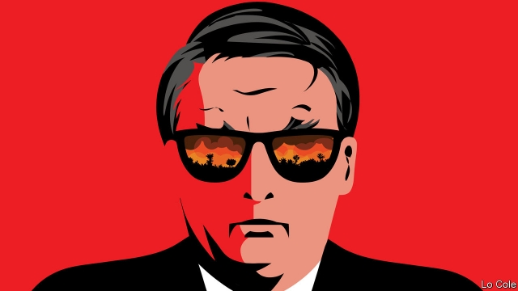

###### Bello

# The Amazon’s fires could burn Jair Bolsonaro 

 

> print-edition iconPrint edition | The Americas | Aug 29th 2019 

PICTURES OF FIRES raging in the rainforest. A social-media storm in which #AmazonIsBurning dominated what passes for the global conversation. A war of words in which Emmanuel Macron, France’s president, branded as a liar his Brazilian counterpart, Jair Bolsonaro, who in turn accused Mr Macron of colonialism and mocked his wife’s looks. An offer of $22m from the G7 countries to help fight the fires, which Mr Bolsonaro rejected unless Mr Macron ate his words. It has been an extraordinary ten days for Brazil. Through the smoke, two things are clear: Mr Bolsonaro’s policies are profoundly destructive of the Amazon rainforest, and deterring him will take much more subtlety abroad and more determination from opponents and even allies at home. 

A former army captain of far-right views, Mr Bolsonaro won Brazil’s presidency last year partly on a platform of reviving a moribund economy by sweeping away left-wingery and green regulation. He promised to end fines for violations of environmental law, shrink the protected areas that account for half of the Brazilian Amazon and fight NGOs, for which he has a visceral hatred. In office, his government has gutted the environment ministry and Ibama, the quasi-autonomous environmental agency. Six of the ten senior posts in the ministry’s department of forests and sustainable development are vacant, according to its website. The government talks of “monetising” the Amazon but sabotaged a $1.3bn European fund that aims to give value to the standing forest. 

Ranchers, illegal loggers and settlers in the Amazon have taken all this as encouragement to power up their chainsaws. Deforestation in the first seven months of this year rose by 67% compared with the same period last year, according to INPE, the government’s space research agency. Mr Bolsonaro called INPE’s data lies and fired its director. His initial reaction was, preposterously, to blame the fires on NGOs. 

Mr Bolsonaro’s approach is driven by prejudice and nationalism. “He deeply, ideologically, believes that environmentalism is part of a left-wing view of the world,” says Matias Spektor, at Fundação Getulio Vargas, a university in São Paulo. Brazil’s armed forces have long thought that outsiders have designs on the Amazon, and that they must develop it or risk losing it. The generals in Mr Bolsonaro’s cabinet, usually a force for restraint, are not on this issue. Behind his tirades against Mr Macron is the expectation that Brazilians will rally round the flag. That is why the world needs to tread carefully. 

Mr Bolsonaro is right about some things. Mr Macron was high-handed in discussing the Amazon at the G7 without inviting Brazil. While the world has a legitimate interest in the rainforest’s fate, it doesn’t own it (though French Guiana has a chunk). Mr Bolsonaro is right, too, that fires were worse in some past years. Many maps exaggerate their extent. 

Brazil has some of the world’s most stringent controls on deforestation. From 2005 these slowed the forest’s destruction dramatically, before they were undermined by budget cuts and now by Mr Bolsonaro. 

Like Janus, his government faces two ways on this issue. Brazilian diplomats abroad present their country as committed to halting deforestation. At home, the president winks at those who practise it. That is why it is important to hold his government to its word. 

“The main issue is how to get to a rational discussion about what’s happening,” says Marcos Jank of the Centre for Global Agribusiness at Insper, a university in São Paulo. That is something Brazil’s modern farmers want. They persuaded Mr Bolsonaro not to pull out of the Paris agreement on climate change, or abolish the environment ministry. They fear consumer boycotts and the EU pulling out of a recently concluded trade agreement, as Mr Macron threatened. In fact, both would have limited effect. Mr Jank notes that 95% of Brazil’s $102bn-worth of agricultural exports are commodities that don’t go directly to consumers; 60% go to Asia. But Brand Brazil has certainly been damaged. 

Politically, too, Mr Bolsonaro is on treacherous ground. Although Brazilian nationalism should not be under-estimated, most Brazilians worry about climate change. As the president spoke on television on August 23rd about the fires, there were pot-banging protests in prosperous parts of cities, which helped to elect him. But halting his scorched-earth practices will require organised political action as well as protest. ■ 

-- 

 单词注释:

1.bello[]:n. 贝罗（姓氏） 

2.jair[]:[网络] 睚珥；贾伊尔；睢珥 

3.Aug[]:abbr. 八月（August） 

4.rainforest['rein'fɔrist]:[生态]雨林 

5.emmanuel[i'mænjuәl]:n. 以马内利（耶稣基督的别称）；伊曼纽尔（男子名, 等于Immanuel） 

6.macron['mækrәn]:n. 长音符号 

7.Brazilian[brә'ziljәn]:n. 巴西人 a. 巴西的, 巴西人的 

8.counterpart['kauntәpɑ:t]:n. 副本, 复本, 配对物, 相应物 [经] 副本, 正副二份中之一 

9.colonialism[kә'lәunjәlizm]:n. 殖民主义 

10.mock[mɒk]:n. 嘲笑, 戏弄, 模仿 a. 假的, 伪造的, 模拟的 adv. 虚伪地 vt. 嘲弄, 模仿, 使失望, 欺骗, 挫败 vi. 嘲弄 

11.Brazil[brә'zil]:n. 巴西 

12.profoundly[prә'fajndli]:adv. 深深地, 深切地 

13.amazon['æmәzɒn]:n. 亚马孙河 [医] 无乳腺者 

14.deter[di'tә:]:vt. 制止, 吓住, 威慑 

15.subtlety['sʌtlti]:n. 微妙, 精明 

16.ally['ælai. ә'lai]:n. 同盟者, 同盟国, 助手 vt. 使联盟, 使联合, 使有关系 vi. 结盟 

17.presidency['prezidәnsi]:n. 总统职权, 总裁职位 

18.revive[ri'vaiv]:vt. 使苏醒, 使复兴, 使振奋, 回想起, 重播 vi. 苏醒, 复活, 复兴, 恢复精神 

19.moribund['mɒ:ribʌnd]:a. 垂死的 n. 垂死的人 

20.violation[.vaiә'leiʃәn]:n. 违反, 违背, 妨碍 [法] 违犯, 违背, 违反 

21.environmental[in.vaiәrәn'mentәl]:a. 周围的, 环境的 [经] 环境的, 环保的 

22.ngos[]:abbr. non-government organization 非政府组织，非政府机构 

23.visceral['visәrәl]:a. 内脏的 [医] 内脏的 

24.gut[gʌt]:n. 剧情, 内容, 内脏, 肚子, 海峡, 勇气 vt. 取出内脏, 毁坏...的内部 

25.ibama[]:[网络] 巴西环保署；巴西再生资源及环保局；可再生自然资源协会 

26.sustainable[sә'steinәbl]:a. 足可支撑的, 养得起的, 可以忍受的 

27.monetise['mʌnitaiz]:vt. 使货币化；把…定位法定货币（等于monetize） 

28.sabotage['sæbәtɑ:ʒ]:n. 怠工, 破坏活动, 破坏 vi. 从事破坏活动 vt. 妨害, 破坏 

29.rancher['ræntʃә]:n. 大农场经营者, 牧场工人 

30.logger['lɒgә]:n. 樵夫, 圆木装车机 [计] 记录器; 注册器; 登记器 

31.chainsaw['tʃeinsɔ:]:vt.用链锯割,<喻>肢解 

32.deforestation[di:.fɒ:ri'steiʃәn]:n. 采伐森林, 森林开伐 [法] 砍伐森森 

33.inpe[]:[网络] 巴西国家太空署；巴西国家空间研究院；巴西国家空间研究所 

34.datum['deitәm]:n. 论据, 材料, 资料, 已知数 [医] 材料, 资料, 论据 

35.preposterously[prɪ'pɒstərəslɪ]:adv. 反常地; 荒谬地; 荒谬可笑地; 不合理地 

36.nationalism['næʃәnәlizm]:n. 民族主义, 民族特性 

37.ideologically[]:adv. 思想上, 思想体系, 意识形态, 观念形态 

38.environmentalism[in,vaiәrәn'mentlizm]:n. 环境保护论, 环境论 

39.matia[]: [地名] [肯尼亚] 马蒂亚河 

40.spektor[]:n. (Spektor)人名；(俄)斯佩克托尔 

41.getulio[]:[网络] 格图利奥；格图柳 

42.VARGAS[]:瓦尔加斯, 瓦格斯（人名） 巴尔加斯（地名, 在阿根廷、巴拿马、玻利维亚、古巴、洪都拉斯） 

43.paulo[]:n. 保罗（男子名） 

44.outsider[' aut'saidә]:n. 外人, 局外人, 非会员, 外行, 门外汉, 比赛中获胜可能性不大的选手 [经] 外船公司 

45.tirade['taireid]:n. 激烈的长篇演说 

46.Brazilian[brә'ziljәn]:n. 巴西人 a. 巴西的, 巴西人的 

47.rally['ræli]:n. 重振旗鼓, 集合, 群众集会, 跌停回升 v. 重整旗鼓, 集合, 恢复精神, 团结, 挖苦, 嘲笑 

48.tread[tred]:n. 踏, 步态, 梯级, 交尾, 鞋底 vi. 踏, 行走, 交尾 vt. 踩, 踏, 践踏, 跳(舞) 

49.carefully['kєәfuli]:adv. 小心地, 谨慎地 

50.legitimate[li'dʒitimәt]:a. 合法的, 正当的, 婚生的 vt. 认为正当, 立为嫡嗣, 使合法 

51.guiana[^ai'ænә, ^i'ænә]:n. 圭亚那地区（包括圭亚那共和国及荷属、法属圭亚那） 

52.chunk[tʃʌŋk]:n. 大块, 矮胖的人(或物) [经] 定样 

53.stringent['strindʒәnt]:a. 迫切的, 严厉的, 银根紧的 [医] 约束的, 紧迫的 

54.deforestation[di:.fɒ:ri'steiʃәn]:n. 采伐森林, 森林开伐 [法] 砍伐森森 

55.dramatically[drә'mætikli]:adv. 戏剧地, 引人注目地, 突然地 

56.undermine[.ʌndә'main]:vt. 在...下面挖, 渐渐破坏, 暗地里破坏 [法] 暗中破坏, 以阴谋中伤伤害 

57.Janus['dʒeinәs]:n. 杰纳斯两面神 [医] 双面联胎 

58.diplomat['diplәmæt]:n. 外交官, 有外交手腕的人 [法] 外交家, 外交官, 有权谋的人 

59.wink[wiŋk]:n. 眨眼, 使眼色, 瞬间 vi. 眨眼, 使眼色, 闪烁 vt. 眨 

60.Marcos[]:n. 马科斯（姓氏） 

61.jank[dʒæŋk]:vi.<美军俚>(为躲避地面高射炮火而)同时改变飞行高度和方向, 闪避 

62.agribusiness['ægri.bizinis]:n. 农业综合经营 [经] 农产品行业 

63.Insper[]:[网络] 斯佩尔 

64.EU[]:[化] 富集铀; 浓缩铀 [医] 铕(63号元素) 

65.commodity[kә'mɒditi]:n. 农产品, 商品, 有用的物品 [经] 商品, 货物, 日用品 

66.politically[]:adv. 政治上 

67.treacherous['tretʃәrәs]:a. 不可信任的, 危险的, 背叛的, 不可靠的 [法] 奸诈的, 背叛的, 背信弃义的 

