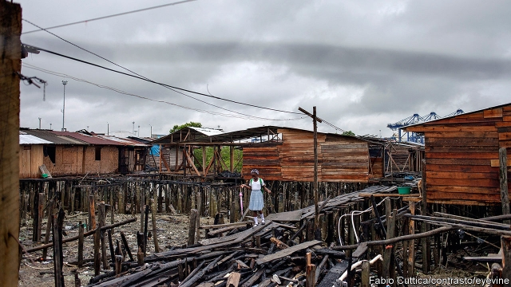
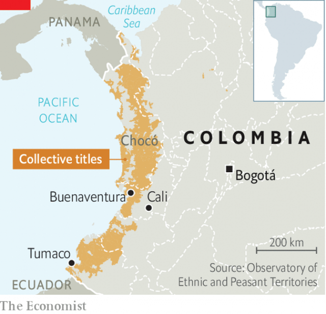

###### No-man’s land

# Why Colombia’s Pacific coast is so poor 

 

> print-edition iconPrint edition | The Americas | Aug 31st 2019 

CITIES BUILT around seaports are often prosperous. Not so Buenaventura, on Colombia’s Pacific coast. Its four ports collect more customs revenue than those of any other city in the country. Yet two-thirds of Buenaventura’s 400,000 inhabitants are poor, according to a government measure. Few have access to piped drinking water or sewerage. Rows of metal shacks on stilts jut into the sea. Vegetation devours the only public hospital, which lacks equipment to perform even minor operations. 

Conditions are no better elsewhere in the Pacific region. Three-quarters of the workforce in Tumaco, the second-busiest Pacific port, is unemployed. The poverty rate in Chocó department exceeds 60%. Colombia is the only South American country with Pacific and Caribbean coasts. Whereas the Caribbean attracts tourists and enterprise, the Pacific has been a backwater. 

Corruption is partly responsible. The four previous mayors of Buenaventura, the region’s largest city, are or recently were in prison. But the central government in Bogotá bears much of the blame. Since independence in 1810 it has invested in the Caribbean ports to encourage trade with Europe and the United States. The rise of trade with Asia since the 1990s should have enriched the Pacific. But the government imposes conditions that thwart the building of infrastructure and investment. 

 

Among the most important (and least known) is Ley (Law) 70 of 1993, under which 60% of the land on the Pacific coast—6m hectares—is communally owned (see map). Colombia enacted it to benefit the region’s mainly Afro-Colombian people. The area was settled by fugitives from slavery, then by freed slaves after abolition in 1851. Ley 70 gave their descendants rights similar to those of indigenous peoples, including the right to form councils that can claim title to government lands they have long occupied. Unlike indigenous reserves, this land cannot be transferred to third parties even if a community agrees. Borrowers cannot offer it as collateral. 

The law’s defenders say it preserves the environment and Afro-Caribbean culture. Families dwell in huts made from wood gathered nearby, cultivate plantains and coconuts and hunt iguanas and turtles. Some bury a baby’s umbilical cord to affirm their ties to the land. Juan Camilo Cárdenas, an economist at the University of the Andes in Bogotá, contends that families on communally owned land have lower levels of extreme poverty than others in the region. Collective titling discourages deforestation, which has soared elsewhere. Graciano Caicedo, a leader of the Yurumanguí river community, claims that a return to a way of life that pre-dates white settlement would make hospitals unnecessary. 

But in some ways Ley 70 and the related right of communities to be consulted on projects that affect them, derived from the International Labour Organisation’s (ILO’s) convention on indigenous peoples, hold back the region’s people. The effect is made worse by the government’s failure to issue rules that define the application of both rights. That makes unclaimed land subject to an eventual claim by a community. Uncertainty about property rights turns much of the coast into “no-man’s land”, says Juan Esteban Carranza, head of the Cali branch of Colombia’s central bank. In the absence of rules, 10,000 prior consultations are taking place across Colombia, a large share of them in the Pacific. Peru, also a signatory to the ILO convention, has two. 

No one knows how many people live on collectively owned land (communities are supposed to conduct their own census, but many fail to). Perhaps 1.5m people in the wider region are affected by Ley 70. Indirect costs are felt across the country. Colombia’s president, Iván Duque, wants to create a port and duty-free zone in Chocó plus roads to coffee-growing areas as part of his national development plan. But the government has no way to acquire the land. 

Firms that would benefit from proximity to the ports, such as food importers, set up instead in Cali, 100km (60 miles) inland. Companies “are always on alert” about potential land claims and consultations, says Alexander Micolta, the president of Buenaventura’s chamber of commerce. 

Demands for consultations are blocking a project from 2006 to widen to four lanes the congested road from Buenaventura to Cali. A proposal in 2012 to build a power line to the city from a dam 60km away fell apart. Hundreds of wooden huts appeared along the planned route. Their owners demanded 30m pesos ($10,000) per hut. These and other demands raised the scheme’s projected cost by 83%. 

Mr Duque promises to mitigate the effects of both Ley 70 and prior consultations by issuing rules next year. But they need the approval of ethnic communities. Some do not share his idea of progress.■ 

