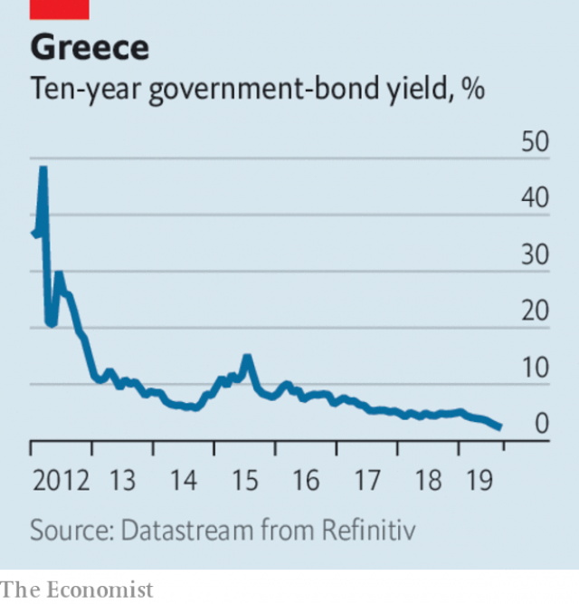

###### Populism

# Business this week 

> Aug 31st 2019 

A judge in Oklahoma ruled that Johnson & Johnson had broken the state’s “public nuisance” law with its aggressive marketing of opioids and ordered it to pay $572m. It was the first time a drugmaker had stood trial for its part in creating America’s opioid-addiction crisis; others have so far elected to settle rather than face a courtroom. Oklahoma had sought $17bn in damages. J&J said it would nevertheless appeal against the judgment, arguing it followed the rules. See article. 

Following the judge’s ruling it was reported that Purdue Pharma, the maker of OxyContin, was in talks to settle its exposure to 2,500 outstanding opioid lawsuits. The negotiations involve the Sackler family, which owns Purdue and has seen some of its donations to museums returned over the opioid issue. See article. 

Google laid out new staff guidelines in an effort to curb the disruptive internal political debates that have come to characterise its workforce. Its employees often take strident positions on social issues and have pressed management to cancel contracts, most notably with the Pentagon for an image-recognition system. This has left Google open to the charge that it has a leftish bias and stifles conservative views. Its latest rules ask staff “to do the work we’ve each been hired to do, not to spend working time on debates about non-work topics”. 

The latest escalation of the trade war saw China announcing new tariffs on $75bn-worth of American goods from September 1st. Donald Trump responded by announcing a five-percentage-point increase on existing and planned tariffs on Chinese exports. See article. 

In a Twitter outburst, Mr Trump described Jerome Powell, the chairman of the Federal Reserve, as an “enemy”, after he dodged mentioning any further cuts to interest rates in his speech to central bankers at Jackson Hole. See article. 

More concerns were raised about the independence of India’s central bank, after it transferred its entire annual net income and excess reserves to the government. The $25bn windfall, along with a set of stimulus measures, will help kick-start a slowing economy. The Reserve Bank of India has come under political pressure to do more for the economy; its previous governor, Urjit Patel, resigned amid a row with the government last year. See article. 

 

The Greek government said it would remove any remaining restrictions on the movement of capital from September 1st. Capital controls were introduced to avoid a run on the banks in 2015, when Greece failed to reach an agreement on extending its bail-out terms and was frozen out of international credit markets. The European Commission said ending capital controls was an “important milestone” for Greece, which now enjoys historically low borrowing costs in bond markets. 

Argentina will delay payments on short-term debt held by institutional investors. It will also seek to replace another $50bn of securities with later-dated paper and reschedule $44bn owed to the IMF. That will leave it more money to defend the peso, which has fallen steeply on fears the government will lose the election in October to a Peronist opposition that may be even tougher on creditors. 

With Germany’s economy in the doldrums, a poll of German executives found that business confidence had dropped to levels last seen in 2009, during the financial crisis. In a gloomy prognosis, the IFO survey said “Not a single ray of light was to be seen in any of Germany’s key industries.” 

 BP decided to dispose of its business in Alaska, bringing an end to the company’s 60-year association with the state. In a $5.6bn deal, BP is selling its assets, which include holdings in Prudhoe Bay on Alaska’s Arctic coast, to Hilcorp. Alaska was once a powerhouse in the oil industry, but it is now just America’s sixth-largest oil-producing state. 

Boeing faced its first lawsuit from a customer over the grounding of its 737  max fleet following two fatal crashes. Avia, a Russian firm that leases aircraft, wants to cancel its order for the 737 MAX, arguing that Boeing misrepresented the safety design of the plane. 

Philip Morris International confirmed it was holding merger talks with Altria, which, if successful, would create a behemoth in the tobacco industry. See article. 

Tributes were paid to Ferdinand Piëch, who died aged 82. Mr Piëch ran Volkswagen during its transformation into one of the world’s biggest car companies, heading the supervisory board until his departure in 2015 amid the dieselgate scandal. Mr Piëch was a brilliant engineer. His achievements included the Porsche 917, the most influential racing car of its time, and the Quattro, a four-wheel-drive sports car that turned Audi into a rival to BMW and Mercedes. 
<<<<<<< HEAD

-- 

 单词注释:

1.Populism['pɒpjulizm]:n. 平民主义, 民粹主义 

2.Aug[]:abbr. 八月（August） 

3.Oklahoma[.әuklә'hәumә]:n. 俄克拉何马 

4.johnson['dʒɔnsn]:n. 约翰逊（姓氏） 

5.marketing['mɑ:kitiŋ]:n. 行销, 买卖 [经] 推销, 在市场买卖, 销售 

6.opioid[əʊ'pi:əʊɪd]:a. 类鸦片（引起）的 n. 类鸦片活性肽 

7.drugmaker['drʌ^,meikә(r)]:制药者 

8.courtroom['kɒ:trum]:n. 法庭, 审判室 [法] 法庭, 审判室 

9.judgment['dʒʌdʒmәnt]:n. 裁判, 宣告, 判决书 [医] 判断 

10.purdue[]:n. 普杜大学（美国一所大学） 

11.pharma[]:n. 制药公司 

12.maker['meikә]:n. 制造者, 上帝 [经] 制造者, 出票人 

13.oxycontin[]: [医]盐酸羟考酮控释片剂<镇痛药> 

14.lawsuit['lɒ:sju:t]:n. 诉讼 [法] 诉讼, 诉讼案件 

15.negotiation[ni.gәuʃi'eiʃәn]:n. 谈判, 磋商, 交涉 [经] 谈判, 协商 

16.sackler[]: [人名] 萨克勒 

17.donation[dәu'neiʃәn]:n. 捐赠物, 捐款, 捐赠 [经] 赠品, 捐款, 捐赠 

18.google[]:谷歌；搜索引擎技术；谷歌公司 

19.guideline['gaidlain]:n. 指导路线, 方针, 指标 [经] 指导路线, 方针, 准则 

20.curb[kә:b]:n. 抑制, 勒马绳, 边石 vt. 抑制, 束缚, 勒住 

21.disruptive[dis'rʌptiv]:a. 分裂的, 破坏(性)的 [计] 击穿的, 中断的 

22.characterise['kærәktәraiz]:vt. 表示...的特性, 成为/是...的特性, 刻划/描述...的性格 vi. 在文艺作品中塑造人物, 描绘性格 

23.strident['straidnt]:a. 刺耳的, 吱吱尖叫的, 尖锐的, 刺眼的 [医] 喘鸣性的 

24.notably['nәjtbәli]:adv. 显著地, 著名地, 尤其, 特别 

25.pentagon['pentәgәn]:n. 五角形, 五边形 [经] 五角平台 

26.leftish['leftɪʃ]:a. 左派的, 左倾的 

27.bias['baiәs]:n. 偏见, 斜纹 a. 偏斜的 adv. 偏斜 vt. 使有偏见 [计] 偏流; 偏压; 偏磁; 偏离 

28.stifle['staifl]:vt. 使窒息, 抑止, 扼杀 vi. 窒息, 被扼杀 

29.escalation[.eskә'leiʃәn]:n. 扩大, 增加 [经] 调查, 价格调整 

30.tariff['tærif]:n. 关税, 关税表, 价格表, 收费表 vt. 课以关税 [计] 价目表 

31.twitter['twitә]:n. 啁啾, 唧唧喳喳声 vi. 啭, 啁啾, 颤抖 vt. 嘁嘁喳喳地讲, 抖动 

32.outburst['autbә:st]:n. 爆发, 突发, 破裂, 暴乱 

33.jerome[dʒә'rәum]:n. 杰罗姆（男子名） 

34.powell['pәuәl, 'pauәl]:n. 鲍威尔（英国物理学家） 

35.dodge[dɒdʒ]:v. 避开, 躲避 n. 诡计, 躲藏 

36.banker['bæŋkә]:n. 银行家, 庄家 [经] 银行业者, 银行家 

37.jackson['dʒæksn]:n. 杰克逊（男子名）；杰克逊（美国密西西比州的城市） 

38.windfall['windfɒ:l]:n. 被风吹落的果子, 横财 [经] 意外损失 

39.stimulus['stimjulәs]:n. 刺激, 激励, 刺激品 [医] 刺激特, 刺激 

40.Patel[]:n. 帕特尔（姓氏） 

41.amid[ә'mid]:prep. 在其间, 在其中 [经] 在...中 

42.milestone['mailstәun]:n. 里程碑, 里程石, 里程标 

43.historically[his'tɔrikәli]:adv. 历史上地；从历史观点上说 

44.Argentina[.ɑ:dʒәn'ti:nә]:n. 阿根廷 

45.institutional[.insti'tju:ʃәnәl]:a. 制度的, 公共机构的, 学会的 [法] 组织机构的, 制度的, 公共机构的 

46.investor[in'vestә]:n. 投资者 [经] 投资者 

47.reschedule[ri:ʃedju:l]:[计] 重安排, 重调度 [化] 修订计划 

48.IMF[]:国际货币基金组织 [经] 国际货币基金 

49.peso['peisәu]:n. 比索 [经] 比索 

50.steeply['sti:pli]:adv. 险峻地 

51.Peronist[pә'rәjnist]:a. (阿根廷总统)庇隆的,庇隆主义的, 庇隆主义者的 

52.opposition[.ɒpә'ziʃәn]:n. 反对, 敌对, 相反, 在野党 [医] 对生, 对向, 反抗, 反对症 

53.creditor['kreditә]:n. 债权人 [法] 债权人, 债主, 贷方 

54.doldrum['dɒldrəm]: [医]赤道无风带 

55.prognosis[prɒg'nәusis]:n. 预测, 预后 [医] 预后 

56.IFO[]:abbr. 已识别的飞行物（identified flying object） 

57.bp[]:[化] 碱基对 

58.Alaska[ә'læskә]:n. 阿拉斯加州 

59.asset['æset]:n. 资产, 有益的东西 

60.holding['hәuldiŋ]:n. 把持, 支持, 保持 [法] 租借地, 占有物, 拥有的财产 

61.Prudhoe['pru:dhәj]:Bay 普拉德霍湾(靠美国阿拉斯加州北部,附近地区富石油和天然气) 

62.powerhouse['pauәhaus]:n. 发电所, 动力室, 精力旺盛的人, 办事效率高的机构 

63.boe[bəu]:abbr. back outlet eccentric 后偏心（轮）出口 

64.grounding['graundiŋ]:n. 基础教学, 基础训练 [经] 搁浅 

65.MAX[mæks]:[计] 最大 

66.avia[]:n. 阿维亚（手表品牌名或汽车品牌名） 

67.lease[li:s]:n. 租约, 租期, 租 vt. 出租, 租出, 租得 

68.MAX[mæks]:[计] 最大 

69.misrepresent['mis.repri'zent]:vt. 不如实地叙述(或说明), 不称职地代表 

70.philip['filip]:n. 菲利普（男子名） 

71.morris['mɒ:ris]:n. 莫里斯舞 

72.merger['mә:dʒә]:n. 合并, 归并 [经] 购并 

73.altria[]:[网络] 奥驰亚；奥驰亚集团；奥驰亚公司 

74.behemoth[bi'hi:mɔθ]:n. 庞然大物 

75.tribute['tribju:t]:n. 贡物, 礼物, 颂辞 

76.Ferdinand['fә:dinәnd]:n. 男子名 

77.volkswagen['fɔ:lks,vɑ:^әn]:n. 大众汽车（财富500强公司之一） 

78.supervisory[.sju:pә'vaizәri]:a. 管理的, 监督的, 管理人的 [经] 监督的, 管理的 

79.porsche[]:n. 保时捷（德国知名汽车厂商或其出产的轿车品牌名） 

80.QUATTRO[]:n. 卡特罗牌汽车；四轮驱动系统 

81.audi[]:n. 奥迪公司；奥迪汽车 

82.bmw[]:abbr. 德国宝马汽车公司（Bavarian Motor Works） 

83.mercedes['mә:sidi:z]:n. 梅塞德斯（人名）；梅赛德斯（公司名） 
=======
>>>>>>> 50f1fbac684ef65c788c2c3b1cb359dd2a904378

