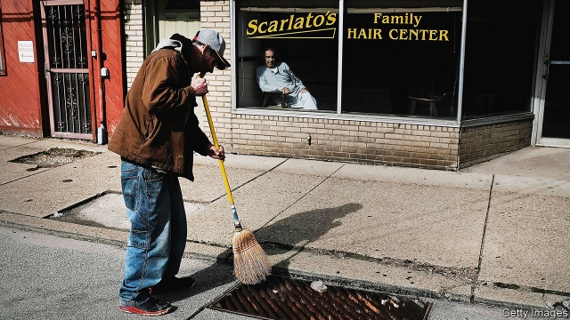
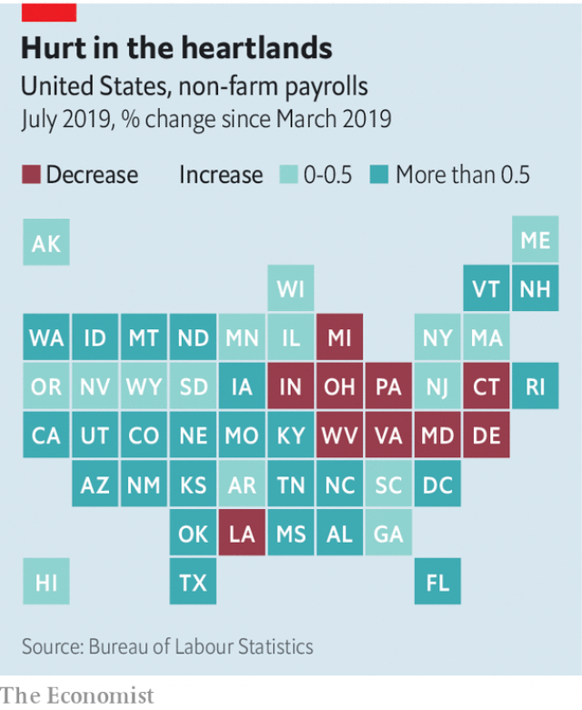

###### Areas of concern

# Parts of America may already be facing recession 

 

> print-edition iconPrint edition | United States | Aug 31st 2019 

IT CAN BE hard to know when isolated announcements become something more. Since last November General Motors has cut several thousand factory jobs at plants across the Midwest. In early August US Steel said it would lay off 200 workers in Michigan. Sales of camper vans dropped by 23% in the 12 months ending in July, threatening the livelihoods of thousands of workers in Indiana, where many are made. Factory workers are not the only ones on edge. Lowes, a retailer, recently said it would slash thousands of jobs. Halliburton, an oil-services firm, is cutting too. 

In any given month, even at the height of a boom, more than 5m Americans leave a job; nearly 2m are laid off. Most of the time, however, overall employment grows. But not all the time. America may or may not be lurching towards a recession now. For the time being employment and output continue to grow. But in the corners of the economy where trouble often rears its head earliest, there are disconcerting portents. 

Recessions are synchronised declines in economic activity; weak demand typically shows up in nearly every sector in an economy. But some parts of the economic landscape are more cyclical than others—that is, they have bigger booms and deeper slumps. Certain bits tend to crash in the earliest stages of a downturn whereas others weaken later. Every downturn is different. Those caused by a spike in oil prices, for example, progress through an economy in a different way from those precipitated by financial crises or tax increases. 

But most recessions follow a cycle of tightening monetary policy, during which the Federal Reserve raises interest rates in order to prevent inflation from running too high. The first rumblings of downturns usually appear in areas in which growth depends heavily on the availability of affordable credit. Housing is often among the first sectors to wobble; as rates on mortgages go up, this chokes off new housing demand. In a paper published in 2007 Edward Leamer, an economist at the University of California, Los Angeles, declared simply that “housing is the business cycle”. Recent history agrees. 

Residential investment in America began to drop two years before the start of the Great Recession, and employment in the industry peaked in April 2006. Conditions in housing markets were rather exceptional at the time. But in the downturn before that, typically associated with the implosion of the dotcom boom, housing also sounded an early alarm. Employment in residential construction peaked precisely a year before the start of the downturn. And now? Residential investment has been shrinking since the beginning of 2018. Employment in the housing sector has fallen since March. 

Things may yet turn around. The Fed reduced its main interest rate in July and could cut again in September. If buyers respond quickly it could give builders and the economy a lift. But housing is not the only warning sign. Manufacturing activity also tends to falter before other parts of an economy. When interest-rate increases push up the value of the dollar, exporters’ competitiveness in foreign markets suffers. Durable goods like cars or appliances pile up when credit is costlier. 

In the previous cycle, employment in durable-goods manufacturing peaked in June 2006, about a year and a half before the onset of recession. This year has been another brutal one for industry. An index of purchasing managers’ activity registered a decline in August. Since last December manufacturing output has fallen by 1.5%. Rather ominously, hours worked—considered to be a leading economic indicator—are declining. Some of this is linked to President Donald Trump’s trade wars, which have hurt manufacturers worldwide. But not all. Domestic vehicle sales have fallen in recent months, suggesting that Americans are getting more nervous about making big purchases. 

In some sectors, technological change makes it difficult to interpret the data. Soaring employment in oil industries used to be a bad sign for the American economy, since hiring in the sector tended to accompany consumer-crushing spikes in oil prices. But America now produces almost as much oil as it consumes, thanks to the shale-oil revolution. A recent fall in employment and hours in oil extraction may be a bad omen rather than a good one. By contrast, a fall in retail employment was once unambiguously bad news. But retail work in America has been in decline for two and a half years; ongoing shrinkage may not signal recession, but the structural economic shift towards e-commerce. 

Other signals are less ambiguous. In recent decades employment in “temporary help services”—mostly staffing agencies—has reliably peaked about a year before the onset of recession. The turnaround in temporary employment in 2009 was among the “green shoots” taken to augur a long-awaited labour-market recovery. Since December it has fallen by 30,000 jobs. 

 

Even if America avoids a recession, the present slowdown may prove politically consequential. Weakness in some sectors, like retail, is spread fairly evenly across the country. But in others, like construction or, especially, manufacturing, the nagging pain of the moment is more concentrated (see map). Indiana lost over 100,000 manufacturing jobs in the last downturn, equal to nearly 4% of statewide employment. It is now among a modest but growing number of states experiencing falling employment: a list which also includes Ohio, Pennsylvania and Michigan. 

Those four states, part of America’s manufacturing heartland, suffered both early and deeply during the Great Recession. In 2016 all delivered their electoral-college votes to Mr Trump, handing him the presidency. The president’s trade war might have been expected to play well in such places. But if the economic woe continues, voters’ faith in Mr Trump is anything but assured. Choked states might well turn Democrat-blue.■ 

