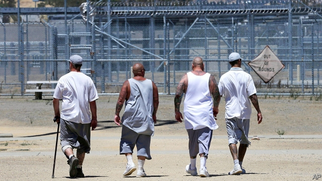

###### Righting the battleship

# Real criminal-justice reform is local, and not easy 

 

> print-edition iconPrint edition | United States | Aug 31st 2019 

AFTER DAN CONLEY announced last year that he would not seek re-election as the district attorney (DA) for Suffolk County, Massachusetts, which includes Boston and a few surrounding towns, five Democrats and an independent vied to replace him. Mr Conley endorsed Greg Henning, who worked for him for ten years. Mr Henning also received endorsements, and plenty of campaign contributions, from local police unions. Such support usually creates a glide-path to victory. 

In this case it did not. Mr Henning lost to Rachael Rollins, one of a wave of DAs trying to reform the criminal-justice system from within. Ms Rollins has identified 15 charges—including shoplifting, receiving stolen property, drug possession and trespassing—“best addressed through diversion or declined for prosecution entirely”. Her office requests cash bail only when the accused is a flight risk. She has created a panel that includes a defence lawyer and a public-health expert to review all fatal shootings by police. These positions are all unusual for an elected DA; traditionally, the toughest-on-crime candidate wins. But the American conversation on criminal justice is changing. Ms Rollins may be in the vanguard, but she is not alone. 

Her companions come from both parties. For 12 years Right on Crime, an advocacy campaign run by the conservative Texas Public Policy Foundation and the American Conservative Union Foundation, has advanced conservative arguments for criminal-justice reform. The Trump administration’s only significant bipartisan legislative achievement has been passing the First Step Act, championed by Jared Kushner, Donald Trump’s adviser and son-in-law. That bill, passed in December, among other things banned the shackling of pregnant prisoners and made thousands of prisoners eligible for early release. 

Democratic presidential candidates have sought to build on this momentum; Bernie Sanders and Elizabeth Warren have released particularly ambitious reform plans aimed at reducing mass incarceration. But much of what they propose will either not work or be impossible without Democrats taking control of both houses of Congress, which seems unlikely. 

Mr Sanders, for example, wants to spend $14bn a year on public defence lawyers. That is an admirable idea, but one that a Republican-controlled Senate is unlikely to approve. Ms Warren wants to repeal most of the 1994 crime bill, which increased incarceration rates. But one of the ways it did that was by incentivising states to pass “truth in sentencing” laws, which require prisoners to serve at least 85% of their sentences. Repealing a federal bill will not change those state-level laws. Both candidates want to ban private prisons, but say nothing about prison-guards’ unions, which are more effective drivers of mass incarceration. The work being done by DAs like Ms Rollins show how real criminal-justice reform can be achieved. 

The primary lesson is that reform produces resistance. Kevin Graham, who heads the police union in Chicago—home to Kim Foxx, another reformist prosecutor—says he does not believe that “a prosecutor is going to achieve social justice in America…The job of a prosecutor is to prosecute people. We have defence attorneys. If we choose not to prosecute…then the laws don’t mean anything.” Others think that Ms Rollins is making decisions that should be left to legislatures. “If your idea is to basically…decriminalise certain statutes, run for your state general assembly,” says Duffie Stone, a prosecutor who heads the National District Attorneys Association. 

Ms Rollins replies that her predecessors often declined to prosecute low-level cases; she just made practice into policy. And that policy is not absolute. She distinguishes between three hypothetical trespassers: a homeless person sleeping on public property, someone who falls asleep while high in a city hospital, and a violent felon caught with a gun outside his ex-girlfriend’s house. The first two, she argues, need help, not a criminal record; the third deserves the charge. 

In a speech to police officers on August 12th, William Barr, the attorney-general, derided “anti-law-enforcement DAs” who refuse to enforce “broad swathes of criminal law. Most disturbing is that some are refusing to prosecute cases of resisting police.” As it happens, resisting arrest, when not combined with more serious charges, is on Ms Rollins’s do-not-prosecute list. Here too she draws a distinction: “If you’re charged with armed robbery and resisting arrest, that’s very different than a stand-alone resisting-arrest charge, which is often just, you’ve pissed this police officer off.” Annoying a police officer may not be good practice, but it is not a crime. 

The results of Ms Rollins’s approach, Mr Barr warns, “will be predictable. More crime; more victims.” Most reformist prosecutors have not been in office long enough to tell. But Ms Rollins does not pretend to be a fortune-teller. Like many reformers, she has invested in data—her department has hired a technologist to update the creaky computer system. And she promises to be responsive to it. “If my policies, through data, show things are getting worse, why in God’s name would I want to make anything worse than it is?... And if the Boston Patrolmen’s Association wants…to say, ‘See, we told you,’ I’m going to say, ‘You’re right’.”■ 

-- 

 单词注释:

1.battleship['bætlʃip]:n. 战列舰, 主力舰 

2.Aug[]:abbr. 八月（August） 

3.dan[dæn]:n. 段(柔道、围棋运动员的等级) [建] 小车, 空中吊运车, 杓 

4.Conley[]:康利（人名） 

5.attorney[ә'tә:ni]:n. 代理人, 律师 [经] 律师, 代理人 

6.DA[,di:'ei]:美国地方检察官 [计] 数据采集, 数据管理员, 数据分析, 设计自动化 

7.suffolk['sʌfәk]:n. 萨福克（英国东部一郡）；萨克福马；萨福克羊 

8.Massachusetts[.mæsә'tʃu:sits]:n. 麻萨诸塞州 

9.Boston['bɒstәn]:n. 波士顿 

10.democrat['demәkræt]:n. 民主人士, 民主主义者, 民主党党员 [经] 民主党 

11.vie[vai]:vi. 争, 竞争, 争胜 vt. 提出...来竞争, 以...作较量 

12.Conley[]:康利（人名） 

13.endorse[in'dɒ:s]:vt. 支持, 赞同, 背书于, 签署 [经] 赞成, 背书 

14.greg[greg]:n. 格雷格（男子名, 等于Gregory） 

15.Henning[]:n. 亨宁（男子名） 

16.endorsement[in'dɒ:smәnt]:n. 支持, 认可, 背书 [经] 背书, 担保, 保证 

17.Rachael[]:n. 蕾切尔（女子名） 

18.rollin['rɔlin]:n. 转入（返回） n. (Rollin)人名；(英、德、西、意、葡、瑞典、芬)罗林；(法)罗兰 

19.DA[,di:'ei]:美国地方检察官 [计] 数据采集, 数据管理员, 数据分析, 设计自动化 

20.shoplifting['ʃɒp.liftiŋ]:n. 入店行窃 [法] 冒充顾客进入商店行窃 

21.diversion[dai'vә:ʒәn]:n. 转移 [医] 转向 

22.prosecution[.prɒsi'kju:ʃәn]:n. 执行, 经营, 起诉 

23.entirely[in'taiәli]:adv. 完全, 全然, 一概 

24.bail[beil]:n. 保释, 拎环, 杓, 栅栏 vt. 保释, 舀水 

25.traditionally[]:adv. 传统上；传说上；习惯上 

26.vanguard['vængɑ:d]:n. 前锋, 先锋, 先驱 

27.advocacy['ædvәkәsi]:n. 拥护, 支持, 鼓吹, 辩护, 辩护术 [法] 辩护, 拥护, 提倡 

28.Texas['teksәs]:n. 德克萨斯 

29.bipartisan[bai,pɑ:ti'zæn]:a. 两党连立的 

30.legislative['ledʒislәtiv]:n. 立法机构 a. 立法的, 有立法权的 

31.jare[]:abbr. Japanese Antarctic Research Expedition 日本南极科学考察队 

32.kushner[]: [人名] 库什纳 

33.adviser[әd'vaizә]:n. 顾问, 劝告者, 指导教师 [法] 顾问, 劝告者 

34.shackle['ʃækl]:n. 桎梏, 束缚物 vt. 加枷锁, 束缚 

35.eligible['elidʒәbl]:a. 有资格当选的, 合格的 n. 有资格者, 合格者, 适任者 

36.presidential[.prezi'denʃәl]:a. 总统制的, 总统的, 首长的, 统辖的 [法] 总统的, 议长的, 总经理的 

37.momentum[mәu'mentәm]:n. 动力, 动量 [化] 动量 

38.bernie['bә:ni]:n. 伯尼（男子名）；[俚]可卡因（等于cocaine） 

39.sander['sændә]:[电] 散沙 

40.elizabeth[i'lizәbәθ]:n. 伊丽莎白（女子名） 

41.warren['wɒrәn]:n. 养兔场, 拥挤的地区 

42.ambitious[æm'biʃәs]:a. 有野心的, 抱负不凡的, 雄心勃勃的 

43.incarceration[in.kɑ:sә'reiʃәn]:n. 下狱, 监禁, 禁闭 [医] 箝闭 

44.repeal[ri'pi:l]:n. 废止, 撤消 vt. 废止, 撤消, 放弃 

45.incentivising[]:[网络] 激励 

46.kevin['kenin]:n. 凯文（男子名） 

47.graham['ɡreiәm]:a. 全麦的；粗面粉的；全麦粉制成的 

48.kim[]:n. 金姆（人名） 

49.foxx[]:[网络] 钰莹 

50.reformist[ri'fɒ:mist]:n. 改良主义者, 改革者 

51.prosecutor['prɒsikju:tә]:n. 实行者, 告发者, 公诉人 [法] 原告, 起诉人, 检举人 

52.prosecute['prɒsikju:t]:vt. 告发, 起诉, 彻底进行, 执行, 从事 vi. 告发, 起诉, 作检察官 

53.legislature['ledʒisleitʃә]:n. 立法机关, 议会, 立法院 [法] 立法机构, 立法机关 

54.duffie[]: [人名] [爱尔兰人、苏格兰人姓氏] 达菲 Duffy的变体 

55.predecessor[.predi'sesә]:n. 前任, 先辈, 前身 [医] 初牙, 前辈, 祖先 

56.hypothetical[,haipәu'θetikәl]:a. 假设的, 有待证实的, 假定的, 有前提的 [计] 理想的 

57.homeless['hәumlis]:a. 无家的, 无养主的 

58.felon['felәn]:n. 重罪犯, 恶棍, 瘭疽 [医] 瘭疽, 指头脓炎 

59.william['wiljәm]:n. 威廉（男子名）；[常作W-][美俚]钞票, 纸币 

60.barr[]:abbr. 翻转形态（Bump and Run Reversal） 

61.deride[di'raid]:vt. 嘲弄, 嘲笑 

62.swathe[sweiθ]:vt. 绑, 裹, 包围 n. 带子, 绷带 

63.piss[pis]:vi. 小便, 下大雨, 抱怨 vt. 撒尿弄脏, 尿在...上 n. 小便 

64.predictable[pri'diktәbl]:a. 可预言的 

65.reformer[ri'fɒ:mә]:n. 改革家, 改革运动者 [化] 转化炉; 转化器; 重整器; 重整炉 

66.technologist[tek'nɒlәdʒist]:n. 工艺师, 技术员 [医] 技术员 

67.update[ʌp'deit]:vt. 更新, 使现代化 n. 更新 [计] 更新 

68.creaky['kri:ki]:a. 嘎吱嘎吱的 

69.responsive[ri'spɒnsiv]:a. 回答的, 应答的, 易感应的 

70.datum['deitәm]:n. 论据, 材料, 资料, 已知数 [医] 材料, 资料, 论据 

