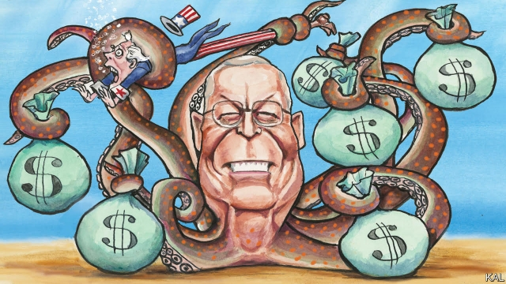

###### Lexington

# The Kochtopus’s garden 

 

> print-edition iconPrint edition | United States | Aug 31st 2019 

FEW INDUSTRIALISTS have been as cruelly self-serving as Andrew Carnegie. Fatal accidents at his steel mills accounted for a fifth of all male deaths in Pittsburgh in the 1880s. Most of his surviving employees, ground down by 12-hour shifts, seven days a week, were discarded by the age of 40. Carnegie did not much mind such human wastage. Influenced by an extreme version of Darwinism, he considered the winnowing of the feeble and thriving of the ablest—in this case, himself—to be progress. Yet he was also a great philanthropist, responsible for endowing thousands of charities, libraries and, in a sense, your columnist. A Carnegie scholarship to medical school was the lifeline that enabled one of his grandfathers to escape his Glasgow tenement and get on. 

David Koch, who died last week, presents a similar study in contrasts. On the one hand, the richest resident of Manhattan and more visible of the fraternal owners of Koch Industries did a lot of good. He donated a fraction of his $50bn fortune to hospitals and universities—especially for research into cancer, the disease that killed him at 79—and the arts. In recent years he and his elder brother Charles, the mastermind behind the Wichita-based energy and chemicals behemoth, also splurged on campaigns to help poor migrants and for criminal-justice reform. Yet they are better-known for their more divisive political activism. 

As the vice-presidential candidate for the Libertarians in 1980, Mr Koch’s ticket attracted only 1% of the vote. Yet the brothers’ lobbying against regulation, unions and entitlements—in almost any circumstance, a position so extreme that William F. Buckley derided it as “anarcho-totalitarianism”—helped push the Republican Party much further to the right than most of its supporters knew or wanted to go. And on climate change in particular this effort was underhand. While acknowledging the reality of global warming, the brothers, both MIT graduates, funded lobbyists, junk scientists and conspiracy theorists to propagate an alternative reality in which climate science is always contestable, and any policy response to it a socialist power-grab. A new book on the brothers’ operations by Christopher Leonard suggests this disinformation campaign began as early as 1991, in a successful bid to prevent George H.W. Bush fulfilling his pledge to curb carbon emissions. Thereby the brothers helped corrupt the American right, mislead the public and destroy a healthy bipartisan consensus on the issue. 

Mr Koch’s obituarists have tended to stress either the good or bad he did, according to their politics. The settled view of Carnegie—that his philanthropy was great and his business practices unconscionable—suggests history’s judgment will be more clear-eyed. No amount of charity can negate the damage the brothers have done to Americans’ trust in expert opinion, as well as to the environment. Moreover Mr Koch’s philanthropy, like Carnegie’s, was to some degree expedient. The brothers’ work on migrants and criminal justice, though in earnest, was part of a broader effort to improve their awful public image. 

Carnegie is also a reminder that the plutocratic tendency the Kochs represent is not new, but cyclical. It reflects America’s enduring ability to generate huge fortunes, complacency about concentrations of power, and the many opportunities its diffuse and multilayered democracy provides for influence-peddling. The steel magnate and other robber barons warded off political challenges to their monopolies for decades before Woodrow Wilson ended them. That led to a period of populist ferment hostile to fat cats, including mass strikes and ultimately the New Deal of the 1930s. But the growth and changes in business culture of the 1970s, re-establishing the power of owners over workers, fuelled a new wave of corporate activism, which the Kochs illustrate. 

They were more consistent in their beliefs than Carnegie (a protectionist until he sold his steel mills, then a free-trader). Yet their war on regulation, especially of carbon emissions, was squarely in the interests of their shareholders (themselves). As a private company, they were freer than their rivals to make long-term investments in such efforts; the “Kochtopus”, as the brothers’ political network is known, is believed to have 1,200 employees, three times as many as the Republican National Committee. This represents the broader trend: a relentless and generally effective increase in corporate lobbying. But is the tide now turning against it? 

The extent to which the Kochs’ priorities have been subsumed by Donald Trump’s populism suggests it could be. The president’s apprehension that the brothers’ anti-government views were not shared by many Republican voters was his major insight. And though he has brought about some things they like, chiefly tax cuts and the dismantling of the Environmental Protection Agency, he has also given them protectionism and insults; last year he called them “a total joke”. Meanwhile, in the Democratic primaries, Elizabeth Warren and others promise a new campaign against billionaire influencers—which polls suggest would be wildly popular. Yet though neither party seems likely to revert to the Republicans’ former state of corporate vassalage, a sweeping corporate retreat is unlikelier still. 

In part, that is because the left is almost as beholden to rich people as the right. Its most free-spending presidential candidate, Tom Steyer, is a billionaire financier—who also promises to smite the “powerful and well-connected”. Yet it is mainly because the political economy is vastly more complicated than a century ago, and its institutions, including political parties and the media, weaker. The opportunities for buying influence this throws up would be legion even if a Democratic administration reformed campaign-finance laws. The Kochs’ effort to spread climate-change scepticism also illustrates this. It is said to have cost them around $120m. That is pocket-change for Charles Koch, whose political commitments will in no way be lessened by his brother’s demise.■ 

