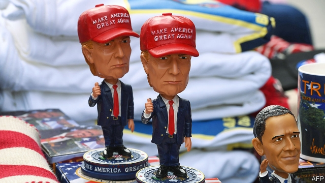

###### The first straw

# What Donald Trump’s campaign swag says about his presidency 

 

> print-edition iconPrint edition | United States | Aug 31st 2019 

WILLIAM HENRY HARRISON was 66 in 1839 when he became the Whigs’ presidential candidate. His rivals mocked his advanced age, calling him Granny and joking, “Give him a barrel of hard cider, and…a pension of two thousand [dollars] a year…and…he will sit the remainder of his days in a log cabin.” Harrison ran with the insult. Though born to a wealthy family, he styled himself the log-cabin-and-cider candidate, a man of the people. He cast his opponent, Martin Van Buren, as an out-of-touch elitist. His supporters sold trinkets—plates, lamps and handkerchiefs—with log-cabin designs. 

Thus began the American political tradition of producing and distributing campaign merchandise. Usually a campaign hands out yard signs, buttons and stickers with the candidate’s name and perhaps an anodyne slogan such as “Kamala Harris For the People” or “Warren Has a Plan for That”. Donald Trump’s campaign takes a different approach. 

Rather than bland slogans designed not to offend, his campaign prefers red meat for the base. Earlier this summer, the president’s campaign began selling branded Trump plastic straws after his campaign manager grew frustrated with a flimsy paper one. They cost $15 for a pack of ten, but sold out quickly. 

The straws are not just straws. They express the sort of cultural grievance that has defined Mr Trump’s presidency. “Liberals want to ban us,” the straws say to his supporters, “but we work better than the politically correct alternative. You like us and using us lets you show your support while triggering the libs.” Mr Trump’s party has followed suit: a few days after Mr Trump baffled the world by musing about buying Greenland, the National Republican Congressional Committee began flogging T-shirts depicting the island as part of America. 

His campaign also sells material such as “Pencil-Neck Adam Schiff” T-shirts, which depict the chairman of the House Intelligence Committee as a clown, and “Fredo Unhinged” shirts, which show Chris Cuomo, a television anchor, mid-meltdown. Campaigns usually leave such mean stuff, such as Bill Clinton corkscrews (you can guess where the screw protrudes) or Hillary Clinton nutcrackers, to third parties. 

Mr Trump’s campaign is nimble. The Cuomo shirts were on sale a day after the anchor threatened to shove someone down a flight of stairs for calling him Fredo, the weak brother in the Godfather films. Politico, which covers Washington politics, reported that the campaign manager’s straw broke as he was boarding a flight. By the time he landed, the campaign was already advertising the Trump straws. They were not focus-grouped or run through committees, just made and sold. That works for trinkets. It may be less effective for policy.■ 

-- 

 单词注释:

1.swag[swæg]:n. 摇晃, 赃物, 洼地, 珍贵物, 垂花饰 vi. 摇晃, 垂下 

2.presidency['prezidәnsi]:n. 总统职权, 总裁职位 

3.Aug[]:abbr. 八月（August） 

4.william['wiljәm]:n. 威廉（男子名）；[常作W-][美俚]钞票, 纸币 

5.henry['henri]:n. 亨利 [医] 亨[利](电感应单位) 

6.Harrison['hærisn]:n. 哈里森（男子名, 哈里之子） 

7.presidential[.prezi'denʃәl]:a. 总统制的, 总统的, 首长的, 统辖的 [法] 总统的, 议长的, 总经理的 

8.mock[mɒk]:n. 嘲笑, 戏弄, 模仿 a. 假的, 伪造的, 模拟的 adv. 虚伪地 vt. 嘲弄, 模仿, 使失望, 欺骗, 挫败 vi. 嘲弄 

9.cider['saidә]:n. 苹果汁, 苹果酒 [建] 苹果汁 

10.remainder[ri'meindә]:n. 剩余物, 其他人, 残余, 余数 v. 削价出售(图书) a. 剩余的, 出售削价剩书的 [计] 余数 

11.Harrison['hærisn]:n. 哈里森（男子名, 哈里之子） 

12.Martin['mɑ:tin]:n. 马丁, 圣马丁鸟 

13.buren[]:布伦（人名） 

14.elitist[ei'litist]:n. 优秀人材, 杰出人材 a. 优秀人材的, 杰出人材的 

15.supporter[sә'pɒ:tә]:n. 支持者, 后盾, 迫随者, 护身织物 [法] 支持者, 赡养者, 抚养者 

16.merchandise['mә:tʃәndaiz]:n. 商品, 货物 v. 交易, 买卖 

17.sticker['stikә]:n. 屠夫, 尖刀, 刺, 芒, 尖物, 携带尖刀者, 张贴物, 滞销品, (非正式)难题 [经] 呆滞商品 

18.anodyne['ænәudain]:n. 止痛药, 镇痛剂 a. 止痛的 

19.kamala[kә'meilә]:n. [植] 粗糠柴 

20.harris['hæris]:n. 哈里斯（英国苏格兰一地区）；哈里斯（姓氏） 

21.warren['wɒrәn]:n. 养兔场, 拥挤的地区 

22.bland[blænd]:a. 温和的, 乏味的, 冷漠的 [医] 温和的, 淡的 

23.flimsy['flimzi]:a. 易坏的, 脆弱的, 浅薄的 n. 易损坏的东西(或材料), 薄纸, 描图用薄纸, 薄纸稿纸 

24.quickly['kwikli]:adv. 很快地 

25.cultural['kʌltʃәrәl]:a. 文化的, 教养的, 修养的 [医] 培养的 

26.grievance['gri:vәns]:n. 委屈, 冤情, 苦况 [经] 不满(对雇用条件的) 

27.politically[]:adv. 政治上 

28.trigger['trigә]:n. 触发器, 扳机 vt. 触发, 发射, 引起 vi. 松开扳柄 [计] 切换开关 

29.lib[lib]:a. [口]解放的（等于liberal）；解放论者的 

30.baffle['bæfl]:vt. 困惑, 为难, 使挫折 vi. 徒作挣扎 n. 迷惑, 挡板 

31.muse[mju:z]:n. 沉思, 冥想 v. 沉思, 冥想, 若有所思地凝望或说 

32.Greenland['gri:nlәnd]:n. 格陵兰 

33.congressional[kәn'greʃәnl]:a. 会议的, 议会的, 国会的 [法] 代表大会的, 大会的, 议会的 

34.flog[flɒg]:vt. 鞭打, 鞭策, 严厉的批评, 迫使 

35.depict[di'pikt]:vt. 描述, 描写 

36.Adam['ædәm]:n. 亚当 [计] 自动直接存取管理 

37.Schiff[]:n. 希夫（姓氏） 

38.clown[klaun]:n. 小丑, 乡下人 

39.fredo[]:[网络] 莱多；雷多；弗雷多 

40.unhinge[.ʌn'hindʒ]:vt. 取下...的绞链, 拉开, 搅乱, 使分开 

41.chris[kris]:n. 克里斯（男子名）；克莉丝（女子名） 

42.cuomo[]: [人名] 科莫 

43.clinton['klintәn]:n. 克林顿（男子名） 

44.corkscrew['kɒ:kskru:]:n. 拔塞钻 a. 螺旋形的 vt. 硬拉出, 探听 vi. 曲折行进 

45.protrude[prәu'tru:d]:vi. 伸出, 突出 vt. 使伸出, 使突出 

46.Hillary['hiləri:]:n. 希拉里（美国现任国务卿） 

47.nutcracker['nʌt.krækә]:n. 轧碎坚果的钳子, 星鸦 

48.nimble['nimbl]:a. 敏捷的, 伶俐的, 聪明的 

49.shove[ʃʌv]:n. 推, 挤 vt. 推挤, 猛推, 强使 vi. 推 

50.godfather['gɒdfɑ:ðә]:n. 教父 vt. 当教父 

51.politico[pә'litikәu]:n. 政客 

52.Washington['wɒʃiŋtn]:n. 华盛顿 

53.politic['pɒlitik]:a. 精明的, 明智的, 策略的 

54.advertising['ædvәtaiziŋ]:n. 广告业, 广告 a. 广告的 [计] 发广告 

55.trinket['triŋkit]:n. 小件饰物, 无价值的琐碎东西, 小玩意儿 

56.les[lei]:abbr. 发射脱离系统（Launch Escape System） 

