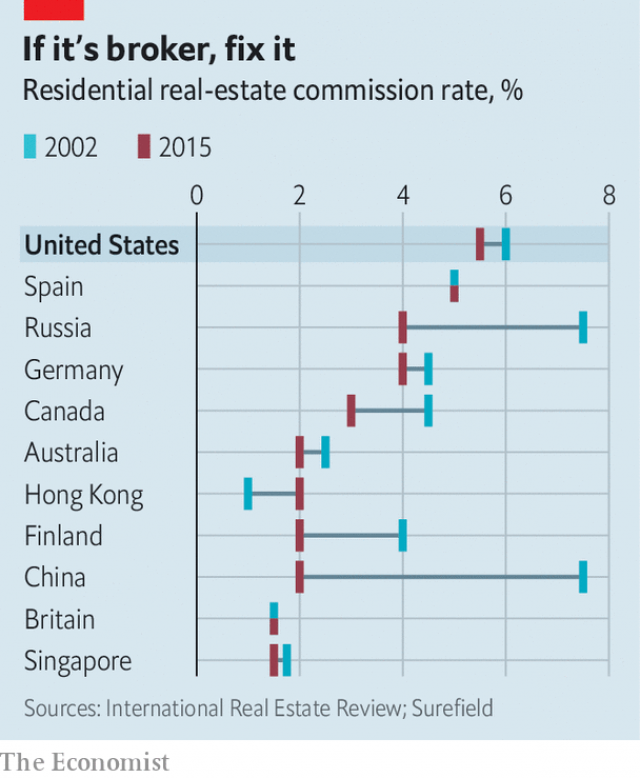

###### Sellers beware

# Why America’s real-estate brokers are such a rip-off 

 

> print-edition iconPrint edition | United States | Aug 31st 2019 

THE PAST decade has not been great for middlemen, who match buyers and sellers for a slice of the transaction value. Travel agents have had their margins crushed by flight-search and hotel-booking websites. Stockbrokers have been squeezed out by whizzy algorithms that carry out transactions for a fraction of the cost. Taxi dispatchers have been replaced by Uber and Lyft. 

There is an exception, however. Even though there are plenty of sites, like Zillow and Redfin, which offer home-buyers in America the chance to search for properties, commission rates for real-estate brokers (estate agents in Britain) have not fallen much, staying close to 6% (3% for the buyer’s agent, 3% for the seller’s). Americans pay twice as much as people in most other developed markets, where similar sites have done much to depress residential-property transaction fees (see chart). 

 

This irks many. “Why is it that residential real-estate brokers’ fees are two to three times higher in the US than in any other developed country in the world?” asks Jack Ryan, who founded REX Homes, a property brokerage that offers to sell homes for just 2% commission. He believes the problem lies in the anti-competitive practices of the Multiple Listing Service (MLS), through which nearly every broker in America lists and searches for homes, and the National Association of Realtors (NAR), a trade association with 1.3m broker members in America, which regulates it. 

That opinion is growing in popularity. Two class-action lawsuits have been filed against the NAR and some of the largest real-estate brokerages, such as Realogy and Keller Williams. In America, a practice called “tying” is common, whereby home-sellers are forced to agree upfront on the rate they will pay the buyer’s broker. The lawsuits allege that sellers’ brokers put pressure on homeowners to offer the industry standard of 3%. If they refuse, buyers’ brokers may refuse to show their home to clients. 

This is possible because of the MLS. In April, the Department of Justice (DoJ) began to subpoena information about how brokers use the system, looking for evidence that they search for homes by commission rate. If found, it would corroborate the idea that buyers’ brokers invariably steer buyers to homes that offer the juiciest commission. The NAR moved to dismiss both suits in early August. John Smaby, the President of the National Association of Realtors, says the lawsuits are “wrong on the facts, wrong on the economics and wrong on the law”. 

But the market seems to think there is plenty to worry about. Many large real-estate brokerages are privately held, but the share price of Realogy, one of the brokerages named in the suit, has fallen by half since the end of April, just after news of the DoJ investigation leaked. The value of RE/MAX, another listed brokerage, has fallen 40% over the same period. 

If transaction fees are being kept artificially high by these practices, that is bad news for homeowners. Some $1.5trn worth of homes change hands every year. If anticompetitive practices are elevating American brokerage fees by two to three percentage points above where they might be otherwise, this is costing consumers as much as $70bn per year, or 0.25% of GDP. 

The costs to the American economy are probably higher than that. When moving house is so expensive, many people may not bother. That means less spending on services associated with moving home, such as gardening and decorating. Worse, it may also be suppressing mobility in America. Ben Harris, who was the chief economist for Joe Biden when he was vice-president, argues that average incomes in poorer cities are not catching up with those in rich ones, “in part because people aren’t moving any more”. Extortionate real-estate commissions are hardly the only problem—wealthy cities such as San Francisco need to build new housing if people are to move to better-paying jobs there. But they certainly do not help.■ 

-- 

 单词注释:

1.beware[bi'wєә]:v. 小心, 谨防 

2.broker['brәukә]:n. 掮客, 经纪人 [经] 经纪人, 掮客 

3.Aug[]:abbr. 八月（August） 

4.middleman['midlmæn]:n. 中间人 [法] 调解人, 中间人, 中人 

5.buyer['baiә]:n. 买主, 买方 [经] 买主, 买方, 买手 

6.transaction[træn'sækʃәn]:n. 交易, 办理, 学报, 和解协议 [计] 事务处理 

7.stockbroker['stɒk.brәukә]:n. 股票经纪人 

8.whizzy[ˈwɪzi]:a. 采用最新技术的 

9.algorithm['ælgәriðm]:n. 算法 [计] 算法 

10.dispatcher[dis'pætʃә]:n. 发送者, 配车员, 调度员 [计] 调度程序; 调度器 

11.uber['ju:bә]:[医] 乳房 

12.lyft[]:[网络] 散落 

13.redfin['redfin]:n. [鱼]红鳍淡水■鱼 

14.irk[ә:k]:vt. 使厌倦, 使苦恼 

15.residential[.rezi'denʃәl]:a. 住宅的, 与居住有关的 [法] 有关居住的, 房产的:居所的, 适于居住的 

16.jack[dʒæk]:n. 插座, 千斤顶, 男人 vt. 抬起, 提醒, 扛举, 增加, 提高, 放弃 a. 雄的 [计] 插座 

17.ryan['raiәn]:n. 赖安（男子名） 

18.rex[reks]:n. 雷克斯（男子名）；国王；君主 

19.brokerage['brәukәridʒ]:n. 经纪人, 回扣, 佣金, 中间人业务 [经] 经纪业, 佣金, 手续费 

20.ML[]:法学硕士, 摩托艇, 汽艇 [医] 毫升 

21.realtor['riәltә]:n. 房地产经纪人 [法] 房地产经纪人 

22.nar[nɑ:]:一种双浮体小艇 

23.popularity[.pɒpju'læriti]:n. 名声, 受大众欢迎, 流行 

24.lawsuit['lɒ:sju:t]:n. 诉讼 [法] 诉讼, 诉讼案件 

25.Keller['kelə]:n. 凯勒（男子名） 

26.williams['wiljәmz]:n. 威廉姆斯（男子名） 

27.whereby[(h)weә'bai]:adv. 靠什么, 如何, 为何, 靠那个, 因此, 由此 [法] 因此, 由是 

28.upfront[ˌʌpˈfrʌnt]:a. 正直的, 坦率的; 最前面的, 首要的; 在前面的; 预先的 adv. 在最前面; 提前支付（工资） 

29.allege[ә'ledʒ]:vt. 宣称, 主张, 提出, 断言 [法] 断言, 指称, 指证 

30.homeowner['hәum.әunә]:n. 私房屋主；自己拥有住房者 

31.client['klaiәnt]:n. 客户, 顾客, 委托人 [计] 客户, 客户机, 客户机程序 

32.doj[]:abbr. Department of Justice <美国>司法部 

33.subpoena[sәb'pi:nә]:n. 传票 vt. 传审, 传唤 

34.corroborate[kә'rɒbәreit]:vt. 巩固, 确证 [法] 确证, 确定, 证实 

35.invariably[in'vєәriәbli]:adv. 不变化地, 恒定地, 始终如一地 

36.john[dʒɔn]:n. 盥洗室, 厕所, 嫖客 

37.smaby[]: [人名] 斯梅比 

38.privately[]:adv. 秘密地；私下地 

39.artificially[.ɑ:ti'fiʃәli]:adv. 人工地, 人为地, 不自然地 

40.anticompetitive[,æntikəm'petətiv]:a. 反竞争的 

41.elevate['eliveit]:vt. 举起, 提拔, 鼓舞 

42.bother['bɒðә]:vt. 烦扰, 迷惑 vi. 烦恼, 操心 n. 麻烦, 纠纷, 讨厌的人 

43.les[lei]:abbr. 发射脱离系统（Launch Escape System） 

44.suppress[sә'pres]:vt. 镇压, 使止住, 禁止, 抑制, 查禁 [法] 镇压, 平定, 禁止出版 

45.mobility[mәu'biliti]:n. 可动性, 流动性, 机动性 [化] 迁移率 

46.ben[ben]:n. 内室 [医] 贝昂(俗名,一般指辣木Moringa oleifera,有时也指一些不同属的植物) 

47.harris['hæris]:n. 哈里斯（英国苏格兰一地区）；哈里斯（姓氏） 

48.economist[i:'kɒnәmist]:n. 经济学者, 经济家 [经] 经济学家 

49.joe[dʒәu]:n. 乔（男子名） 

50.biden[baidən]: [人名] 拜登 

51.extortionate[ik'stɒ:ʃәnәt]:a. 敲诈的, 勒索的, 过度的, 昂贵的 [法] 勒索的, 敲诈的, 强夺的 

52.san[sɑ:n]:abbr. 存储区域网（Storage Area Networking） 

53.francisco[fræn'siskәu]:n. 弗朗西斯科（男子名, 等于Francis） 

