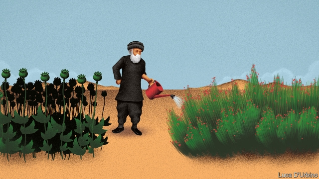

###### Meth in the madness

# Afghan drug barons are branching out into methamphetamines 

 

> print-edition iconPrint edition | Asia | Sep 7th 2019 

DRUG PRODUCERS in Afghanistan have a new line. The country responsible for growing around three-quarters of the world’s opium, as well as mountains of hashish, is diversifying into methamphetamine. The amount seized by the Afghan authorities is increasing exponentially, says the UN’s Office on Drugs and Crime. Police hauled in a meagre 4kg in both 2013 and 2014. In the first six months of this year the tally was 650kg. 

This sudden rise has caught authorities by surprise. Afghanistan’s meth boom appears to have begun in its western neighbour. Iran has long had its own meth problem, but a crackdown there has hobbled producers. Some may have relocated to the lawless western deserts of Afghanistan. Afghan migrant labourers have probably learned the meth business in Iran, then brought it home. 

Afghan meth operations have a twist, says David Mansfield of the London School of Economics. Drug producers normally extract meth’s main precursor, pseudoephedrine, from over-the-counter medicine for colds and flu. But governments are trying to track and restrict sales of such medicines, which have become a lot more costly and difficult to obtain. So Afghan producers have switched to another source: the ephedra bush. These red-berried shrubs grow widely in arid parts of Asia and have long been a staple of herbal medicine to treat asthma, congestion and other breathing problems, since they are a natural source of pseudoephedrine. 

These days, Mr Mansfield says, many heroin factories in Farah province, on the border with Iran, are also cluttered with buckets full of soaking ephedra leaves, in preparation for making meth. Switching to this plant-based method has halved production costs, he reckons. Meanwhile, farmers tell him, the price of ephedra leaves has tripled in a year. 

Where the meth is going is not clear. Much probably travels back to Iran. In July Brigadier-General Masoud Zahedian, Iran’s counter-narcotics chief, complained that four tonnes of the stuff had been seized on his country’s border with Afghanistan since March. But Afghanistan also has its own domestic demand. Meth is popular in Pakistan, too. Some might find its way farther afield. 

How might this new drug affect Afghanistan’s war economy? Opium and its profits permeate the conflict, providing not just livelihoods for poor farmers, but also funding for insurgents and easy money for corrupt officials. Ephedra, known locally as oman, could be a new source of wealth in areas which have so far not cashed in on opium. The bush grows best above 2,500 metres (8,200 feet), and is thus suited to different provinces from opium. But no one knows for sure where ephedra is being farmed in Afghanistan or in what quantities. The UN plans to start satellite and ground surveys to measure the crop, just as it does with opium poppies. 

Afghanistan’s innovative producers are not the first to use ephedra to make meth. Chinese and Burmese villagers have been known to do so as well. But Afghanistan’s lawlessness and its ready-made distribution networks, thanks to the other drugs produced in the country, along with the extremely low cost of farming, could soon make it a fearsome competitor in the global meth business. ■. 
<<<<<<< HEAD

-- 

 单词注释:

1.meth[meθ]:n. 甲安菲他明（一种兴奋剂） 

2.madness['mædnis]:n. 疯狂, 愚蠢的行为 [医] 狂, 疯狂 

3.Afghan['æfgæn]:a. 阿富汗的, 阿富汗人的 n. 阿富汗人, 阿富汗语, 阿富汗毛毯 

4.baron['bærәn]:n. 男爵 [法] 男爵, 贵族, 大王 

5.methamphetamine[,meθæ'fetәmin]:[化] 脱氧麻黄碱 

6.Sep[]:九月 

7.producer[prә'dju:sә]:n. 生产者, 制作者, 制作人 [化] 发生器; (炉煤气)发生炉; 制气炉; 生产者 

8.Afghanistan[æf'gænistæn]:n. 阿富汗 

9.opium['әupjәm]:n. 鸦片 [化] 阿片; 鸦片 

10.hashish['hæʃi:ʃ]:n. 大麻麻醉剂 [化] (印度)大麻; (印度)大麻浸膏 

11.diversify[dai'vә:sifai]:vt. 使多样化, 使变化 

12.exponentially[ˌekspə'nenʃəlɪ]:adv. 以指数方式 

13.haul[hɒ:l]:n. 用力拖拉, 拖运, 强拉, 捕获量, 拖运距离 vi. 拖, 拉, 改变方向, 改变主意 vt. 拖拉, 拖运 

14.meagre['mi:^ә(r)]:a. 瘦的, 不毛的, 贫乏的, 贫弱的, 少量的, 力量不够的, 质不高的, 量不足的 

15.tally['tæli]:n. 符木, 记账, 得分, 比分, 计数器, 标签, 符合, 对应物 vt. 记录, 点数, 计算, 加标签于, 使符合 vi. 记帐, 符合, 吻合, 记分 [计] 计数 

16.meth[meθ]:n. 甲安菲他明（一种兴奋剂） 

17.Iran[i'rɑ:n]:n. 伊朗 

18.crackdown['krækdaun]:n. 制裁, 镇压, 痛击 

19.hobble['hɒbl]:vi. 蹒跚 vt. 使跛行, 阻碍 n. 跛行 

20.relocate[ri:'lәukeit]:vt. 重新安置, 再配置, 放在新地方 [计] 再定位; 浮动 

21.lawless['lɒ:lis]:a. 非法的, 违法的 

22.migrant['maigrәnt]:n. 候鸟, 移居者 [法] 移居者 

23.david['deivid]:n. 大卫；戴维（男子名） 

24.mansfield['mænsfi:ld]:n. 曼斯菲尔德（姓氏） 

25.extract[ik'strækt]:n. 榨出物, 精汁, 摘录, 选段 vt. (费力地)取出, 采掘, 榨取, 摘录, 吸取 [计] 提取 

26.precursor[.pri:'kә:sә]:n. 先驱者, 前导, 前兆 [化] 前体; 前身; 产物母体 

27.pseudoephedrine[]:[医] 假麻黄硷 

28.ephedra[i'fedrә]:[化] 麻黄 

29.shrub[ʃrʌb]:n. 矮树, 灌木, 果汁甜酒 

30.arid['ærid]:a. 干燥的, 不毛的 

31.staple['steipl]:n. 主要产物, 常用品, 主要要素, 原料, 订书钉, 钩环 a. 主要的, 重要的 vt. 分级, 钉住 

32.herbal['hә:bәl]:a. 草药的 [医] 本草书 

33.asthma['æsmә]:n. 哮喘 [医] 气喘 

34.congestion[kәn'dʒestʃәn]:n. 拥挤, 充血 [计] 拥挤, 拥塞 

35.heroin['herәuin]:n. 海洛因, 吗啡 [化] 海洛因; 二醋吗啡; 二乙酰吗啡 

36.Farah[]:n. 法拉赫, 阿富汗西部河流 pers. 法拉, 法拉赫 

37.clutter['klʌtә]:n. 杂乱 vt. 弄乱, 使凌乱 

38.halve[hɑ:v]:vt. 二等分, 对半分享, 把...减半 

39.reckon['rekәn]:vt. 计算, 总计, 估计, 认为, 猜想 vi. 数, 计算, 估计, 依赖, 料想 

40.triple['tripl]:n. 三倍数, 三个一组 a. 三倍的 vt. 使增至三倍 vi. 增至三倍 

41.Masoud[]:[网络] 马苏德；马苏特 

42.tonne[tʌn]:n. 吨, 公吨 [经] 吨 

43.Pakistan[.pɑ:ki'stɑ:n]:n. 巴基斯坦 

44.afield[ә'fi:ld]:adv. 离开着, 偏离着, 在战场上 

45.opium['әupjәm]:n. 鸦片 [化] 阿片; 鸦片 

46.permeate['pә:mieit]:vt. 弥漫, 渗透, 充满, 影响, 感染 vi. 透入, 散布 

47.livelihood['laivlihud]:n. 生计, 营生, 生活 

48.insurgent[in'sә:dʒәnt]:a. 谋叛的, 起义的, 澎湃的 n. 起义者, 叛乱者 

49.ephedra[i'fedrә]:[化] 麻黄 

50.locally['lәukәli]:adv. 地方性地, 局部性地, 在当地 

51.Oman[әu'mɑ:n]:n. 阿曼 

52.UN[ʌn]:pron. 家伙, 东西 [经] 联合国 

53.poppy['pɒpi]:n. 罂粟 [医] 罂粟 

54.innovative['inәjveitiv]:a. 革新的, 创新的, 富有革新精神的 

55.Burmese[.bә:'mi:z]:n. 缅甸人, 缅甸语 a. 缅甸的, 缅甸人的, 缅甸语的 

56.lawlessness['lɔ:ləsnəs]:n. 不服从法律; 不受法律制约; 未实施法律; 目无法纪 

57.fearsome['fiәsәm]:a. 吓人的, 可怕的, 害怕的 
=======
>>>>>>> 50f1fbac684ef65c788c2c3b1cb359dd2a904378

