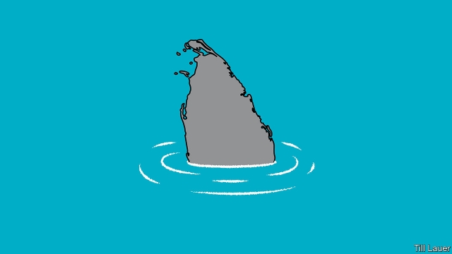

###### Banyan

# An election campaign in Sri Lanka stirs old ghosts 

 

> print-edition iconPrint edition | Asia | Sep 7th 2019 

THE FRONT-RUNNER in Sri Lanka’s presidential election in November has a boring message. It is designed to be wonderfully soothing to those alarmed by the political chaos of the past couple of years, as the president and prime minister have feuded—and indeed to those for whom the brutal civil war that ended only a decade ago still casts a frightening shadow. 

Gotabaya Rajapaksa, who declared his candidacy last month, assures voters that the future is one of peaceful, “knowledge-based” development for all. It will be led by technocrats, and be free of the curse of politicking. His years as an army officer, “Gota” says, will ensure crisp, meritocratic efficiency. 

The blandness of Mr Rajapaksa’s campaign is the message. For there is another Gotabaya, from under whom Sri Lanka has already once had to crawl. Ten years ago a horrendous civil war ended in a massive government assault on Tamil rebels on a narrow strip of beach in the north of the island, overseen by Mr Rajapaksa, who was secretary of defence at the time. There, Tamil commanders and their families were killed by troops meant to be accepting their surrender, but not before thousands of civilians trapped in the fighting had perished too. 

A 26-year-old war had ended, with unspeakable crimes on both sides. But when the victorious government was returned in a landslide in 2010, it continued to see enemies everywhere. It grew ever more authoritarian as it championed a Buddhist Sinhalese chauvinism at the expense of Hindu, Muslim and Christian minorities. A notable critic, Lasantha Wickrematunge, a newspaper editor, had been murdered in 2009. Others began to disappear in Colombo, the capital, into white vans driven by pro-government goons. The chief justice was impeached and the rest of the judiciary brought into line. Meanwhile, Tamils in the north still lived in fear of the security forces. It was a huge relief to many when the government lost power in an electoral upset in 2015. 

All this matters because the ousted government was a Rajapaksa family business. Mr Rajapaksa’s brother, Mahinda, was president; another brother, Basil, oversaw the economy; a fourth was speaker of parliament. Gota wanted credit for winning the war, and bridled at claims of war crimes. He ran the security services during the era of white-van terror. He had a foul temper and a threatening tongue. 

Both Basil and Mahinda are frank enough, when asked, to admit that Gota needs to keep talking about policies, not the past. Yet again and again he seems drawn back to that other country in which part of him still dwells, arguing that his achievements in ending the war and rebuilding the north have never been fully acknowledged. His greatest regret, he says, is not being properly understood. Even reports that he kept sharks in tanks are unfair: they helped to soothe his nerves and anyway, he says, stretching out his hands, they weren’t that big. 

There is another worrying aspect to Gota’s prospective return. It comes with the full Rajapaksa package. Basil is overseeing an efficient, high-tech campaign—dreamt up, he says, while serving time in prison for corruption. Mahinda, who sparked a constitutional crisis last year by attempting to supplant the prime minister in a parliamentary coup, now intends to win the post via parliamentary elections next year. 

Should the Rajapaksas make a comeback, they may suffer from new flaws as well as old. Although they pooh-pooh the idea, it seems quite possible that Gota and Mahinda will fight over every bit of power at the country’s expense. Mahinda, the oldest brother, is a sun king, his chair in his meeting room a hand-span wider than the others. He says the post of prime minister will be the crucial one in government. Across town, Gota argues for a strong executive presidency. 

If there is an alternative to Rajapaksa rule, it is taking an excruciating time to declare itself. It is in the power of Ranil Wickremesinghe, the prime minister, as head of one of the country’s two big parties, to anoint a challenger. The 70-year-old seems to have thought of himself as the ideal candidate. But after a dismal term as prime minister, no one in his party shares his view. He has not yet come round to endorsing the ally with the best numbers in the polls, Sajith Premadasa, son of Sri Lanka’s third president. Mr Premadasa’s chief backers admit that not even the candidate himself really knows what he believes in. But he is popular enough—and, better yet, his name is not Rajapaksa.■ 

