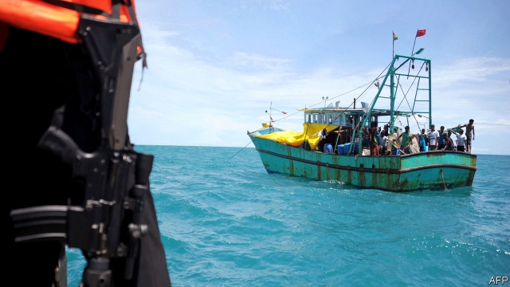

###### Winging it

# Far more would-be refugees arrive in Australia by plane than by boat 

 

> print-edition iconPrint edition | Asia | Sep 7th 2019 

NO AUSTRALIAN GOVERNMENT wants to look weak on “border security”. Since 2001, when John Howard, a conservative prime minister, turned back a ship which had rescued hundreds of asylum-seekers from a sinking vessel, most of them have policed the country’s borders with ferocity. Asylum-seekers who arrive illegally by boat are carted off to camps in the Pacific outposts of Nauru and Papua New Guinea. Australia refuses to admit them, even if they are found to be genuine refugees. 

The “Pacific solution”, as this policy is known, is popular with ordinary Australians, who fear armadas of Asian immigrants. When they learn the details of individual cases, however, they often want the government to be more lenient. For instance, the government’s attempt, so far blocked by the courts, to deport a happily settled Sri Lankan family who arrived by boat has prompted a public outcry. The government insists that clemency would only encourage human-trafficking. By the same token, it argues that a law passed earlier this year that allows sick asylum-seekers in Nauru and Papua New Guinea to travel to Australia for treatment will beget more boat people. It hopes to repeal it when parliament reconvenes this month. 

The government normally refuses to release information about “on-water matters”. Yet this week, to keep “the ever-present threat of illegal arrivals to Australia foremost in the public’s mind”, as Scott Morrison, the prime minister, put it, it disclosed that a boat of asylum-seekers from Sri Lanka had been intercepted off Australia’s coasts—reportedly the sixth from the country to be turned back since May. 

In fact, the threat is more of a trickle. Parliamentary statistics show that maritime patrols turned back 33 vessels trying to reach Australia, with a total of 810 passengers, between 2013, the year the current government came to power, and June 2018, when it last published any data. One hundred times as many people—some 80,000—have entered Australia as students or tourists during the government’s tenure, only to claim asylum once inside the country. This influx exceeds even the surge in arrivals of boat people when a government led by the Labor party, now in opposition, called off the Pacific solution between 2008 and 2012. 

Most “plane people” hail from either China or Malaysia, and unlike those who brave the seas, few turn out to be real refugees. But instead of being dumped in offshore detention centres, they can live and work in Australia for the years it takes their applications to be processed. This has given organised syndicates a reason to orchestrate many such applications, knowing they can funnel the applicants into low-wage jobs in restaurants, farms and brothels while their cases are reviewed. 

The government points out that most plane people are eventually sent home. But processing times have lengthened under its watch, strengthening the people-smugglers’ business model, notes Abul Rizvi, a former immigration official. It does not help that the tribunal to which asylum-seekers can appeal has been stripped of lawyers and filled with former political staffers. Its backlog has more than tripled over the past three years, to 22,000 cases, says Simon Jeans, a former employee. 

For years, Mr Jeans argues, politicians on both sides “have accepted the leakage because the benefits of mass tourism outweigh the costs.” But Labor, which is trying to convince voters that it is not soft on illegal immigrants, is suddenly keen to make hay. “If the government was serious about securing our borders”, gripes Kristina Keneally, its home-affairs spokesperson, “it would be doing something about the blowout in airplane arrivals.” ■ 
<<<<<<< HEAD

-- 

 单词注释:

1.refugee[.refju'dʒi:]:n. 难民, 流亡者 [法] 避难者, 流亡者, 难民 

2.Sep[]:九月 

3.john[dʒɔn]:n. 盥洗室, 厕所, 嫖客 

4.howard['hauәd]:n. 霍华德（男子名） 

5.ferocity[fә'rɒsiti]:n. 凶猛, 残忍, 狂暴的行为 

6.illegally[]:[法] 非法地, 不合法地, 违法地 

7.outpost['autpәust]:n. 前哨, 前哨部队, 前哨基地 

8.Nauru[nɑ:'u:ru:]:瑙鲁(岛)[西太平洋岛国](在赤道附近) 

9.Papua['pæpjuә]:n. 巴布亚岛 

10.guinea['gini]:n. 几内亚 

11.armada[ɑ:'mɑ:dә]:n. 舰队 

12.lenient['li:njәnt]:a. 宽大的, 温和的, 慈悲为怀的 [法] 宽大的, 仁慈的 

13.deport[di'pɒ:t]:vt. 举止, 驱逐出境 [法] 放逐, 驱逐, 递解 

14.sri[sri]:n. 斯里兰卡（Sri Lanka）；（拉）神圣罗马帝国（Sacrum Romanum Imperium） 

15.lankan[]:[网络] 斯里兰卡南部的兰坎市 

16.outcry['autkrai]:n. 尖叫, 倒彩, 强烈抗议, 喊价 vi. 喊叫 vt. 叫得比...响 

17.clemency['klemәnsi]:n. 仁慈, 宽厚, 仁厚 

18.token['tәukәn]:n. 表征, 记号, 代币 a. 象征的, 表意的 [计] 记号 

19.beget[bi'get]:vt. 为某人之生父, 招致, 产生, 引起 

20.repeal[ri'pi:l]:n. 废止, 撤消 vt. 废止, 撤消, 放弃 

21.reconvene[.ri:kәn'vi:n]:vi. 再聚会；再集会 

22.scott[skɔt]:n. 斯科特（男子名） 

23.morrison['mɔrisn]:n. 莫里森（姓氏） 

24.lanka[]:n. 兰卡；楞伽 

25.intercept[.intә'sept]:n. 截取, 妨碍, 截距 vt. 拦截, 阻止, 截取 

26.trickle['trikl]:n. 滴, 细流 vi. 滴, 细细地流 vt. 使滴, 使小量流动 [计] 信息透露 

27.parliamentary[.pɑ:lә'mentәri]:a. 国会的, 议会的, 议会制度的 

28.statistic[stә'tistik]:n. 统计量 a. 统计的, 统计学的 

29.maritime['mæritaim]:a. 海的, 海上的, 海事的, 沿海的, 海员的 [经] 海事的, 海上的, 海员的 

30.patrol[pә'trәul]:n. 巡逻, 巡逻员, 侦察队 v. 巡逻, 巡视 

31.datum['deitәm]:n. 论据, 材料, 资料, 已知数 [医] 材料, 资料, 论据 

32.tenure['tenjuә]:n. 享有, 保有期 [经] (财产,职位等的)占有, 占有权 

33.asylum[ә'sailәm]:n. 庇护, 收容所 [医] 养育院 

34.influx['inflʌks]:n. 流入, 河口, 汇集 [医] 注入, 流入 

35.surge[sә:dʒ]:n. 巨涌, 汹涌, 澎湃 vi. 汹涌, 澎湃, 颠簸, 猛冲, 突然放松 vt. 使汹涌奔腾, 急放 [计] 电压尖峰 

36.labor['leibә]:n. 劳动, 努力, 工作, 劳工, 分娩 vi. 劳动, 努力, 苦干 vt. 详细分析, 使厌烦 

37.opposition[.ɒpә'ziʃәn]:n. 反对, 敌对, 相反, 在野党 [医] 对生, 对向, 反抗, 反对症 

38.hail[heil]:n. 冰雹, 致敬, 欢呼, 招呼 vt. 向...欢呼, 致敬, 招呼, 使象下雹样落下 vi. 招呼, 下雹 interj. 万岁, 欢迎 

39.Malaysia[mә'leiziә]:n. 马来西亚 [经] 马来西亚 

40.detention[di'tenʃәn]:n. 阻止, 监禁, 拘留 [医] 隔离, 拘留, 滞留, 停滞 

41.syndicate['sindikit]:n. 企业联合, 辛迪加, 财团 v. 联合成辛迪加 

42.orchestrate['ɒ:kistreit]:v. 编管弦乐曲 

43.funnel['fʌnl]:n. 漏斗, 漏斗状的东西, 烟囱 [化] 漏斗 

44.brothel['brɒθәl]:n. 妓院 [法] 妓院 

45.lengthen['leŋθәn]:vt. 加长, 使延长 vi. 变长 

46.abul[]:n. (Abul)人名；(阿拉伯)阿布 

47.rizvi[]:[网络] 里兹唯 

48.tribunal[trai'bju:nl]:n. 法庭, 法官席, 裁决 [法] 法庭, 裁判所, 裁判 

49.staffer['stɑ:fә]:n. (一名)职员(尤指编辑或记者) 

50.backlog['bæklɔ^]:n. 积压待办的事务, 积压而未交付的订货, 积压的工作 vt. 储备, 把...积压起来 [计] 储备, 后备, 积压 

51.triple['tripl]:n. 三倍数, 三个一组 a. 三倍的 vt. 使增至三倍 vi. 增至三倍 

52.simon['saimәn]:n. 西蒙（男子名） 

53.jean[dʒi:n]:n. 牛仔裤, 牛仔布, 斜纹棉布 

54.leakage['li:kidʒ]:n. 漏, 漏出物, 泄漏 [化] 漏电; 漏水; 漏气; 渗漏; 漏失量; 漏出量 

55.outweigh[.aut'wei]:vt. 比...重, 比...重要, 比...有价值 

56.voter['vәutә]:n. 选民, 投票人 [法] 选民, 选举人, 投票人 

57.gripe[graip]:n. 紧握, 柄, 把手, 控制 vt. 抓紧, 抱住, 使肠痛, 激怒 vi. 肠绞痛, 抱怨 

58.kristina[]:n. 克里斯蒂娜（女子名） 

59.keneally[]:[网络] 基尼利；肯尼莉；肯尼利 

60.spokesperson['spәukspә:sn]:n. 发言人, 代言人 

61.blowout['blәuaut]:n. 爆裂, 喷出 [经] 井喷 
=======
>>>>>>> 50f1fbac684ef65c788c2c3b1cb359dd2a904378

