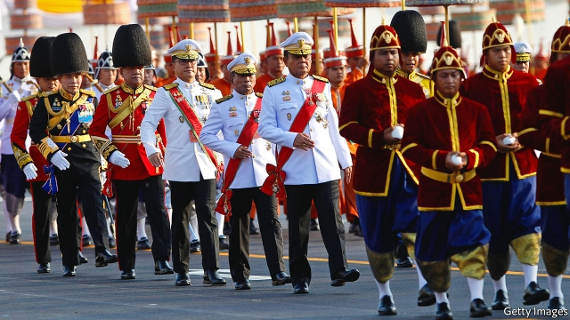

###### Changing of the guard

# Relations between Thailand’s army and king are becoming one-sided 

 

> print-edition iconPrint edition | Asia | Sep 7th 2019 

RIGID AND austere, King Chulalongkorn, the fifth monarch of Thailand’s Chakri dynasty, gazes across Bangkok’s Royal Plaza from a gleaming steed. The bronze statue is just one immovable legacy of the Thai monarchy. The mindset of the country’s armed forces is another. The king overhauled them late in the 19th century, founding a military and naval academy, creating a ministry of defence and indelibly associating them with the crown. 

Thailand’s generals have seized power 12 times since a revolution brought an end to absolute monarchy in 1932. The most recent coup was in 2014. The general who led it, Prayuth Chan-ocha, has remained prime minister ever since. But his authority over the army he once commanded is fading. Instead it is King Maha Vajiralongkorn who is fast becoming the biggest influence over Thailand’s men and women in uniform. 

The armed forces have never really proved themselves in war. Instead they have focused on battling their country’s politicians. Their most fearsome foe was Thaksin Shinawatra, whom they ousted as prime minister in 2006. The feud between his supporters and opponents has tortured Thai politics ever since. But the army appears finally to have bested its enemy, presiding over a rigged election in March that relegated the Thaksinites to a parliamentary minority for the first time since 2001. Politicians backing the army have formed a coalition government led by Mr Prayuth. But the coalition is a rickety one, composed of 18 different parties. That leaves Mr Prayuth ever more dependent on the veneer of legitimacy provided by the king. 

The army’s penchant for politics has always been tied to the prestige of the monarchy. “The consent of the governed is less important than the imprimatur of the monarch,” explains Gregory Raymond of the Australian National University. Military regimes bolster their legitimacy by slavish devotion to the crown. A symbiotic relationship between the barracks and the palace has endured since the 1950s, each defending the other’s standing. 

Close ties to the royals help the armed forces avoid change. The last coup voided a constitution which had established legislative scrutiny over defence policy. Modest reforms occurred after soldiers killed dozens of democratic protesters in 1992 and again after the Asian financial crisis of 1997. Mr Thaksin managed to reduce the army’s budget and placed allies in senior military posts, but achieved little lasting change. Governments which make serious attempts to clip the army’s wings tend to get ousted, as Mr Thaksin’s was. Even so, a popular new party, Future Forward, wants to reduce the number of generals, end conscription and cut military budgets. 

The main impetus for change is coming from the palace itself, however. King Vajiralongkorn, who attended an Australian military academy, served in the army and holds the ranks of field marshal, admiral and air marshal, is obsessed with military titles, training and hierarchy. He expects others to share his passion. The queen, a former flight attendant, has risen through the ranks of his personal guard. Her ascent was not purely a show of grace and favour: she had to complete gruelling training with her men. She now holds the rank of general. His official concubine, a former nurse, was promoted to major-general this year. While crown prince, the king made his pet poodle, since deceased, an air marshal. 

Since he came to the throne almost three years ago, the king has increased the clout of the monarchy in various ways, dispensing with a regent when he is abroad and taking direct control over the administration of all crown property. He has also inserted himself into the administration of the army. A new unit, the Royal Command Guard, has been created at his behest. It includes many of his former bodyguards. Its 5,000-odd soldiers will be under the direct command of the monarch and will be stationed in the heart of Bangkok. At the same time, an infantry regiment and a cavalry battalion that were instrumental in past coups have been ordered out of the capital. This will make it much harder for the army to launch coups without securing the support of the king in advance. 

King Vajiralongkorn has stoked factionalism, too, weakening the bond between the army and the government that it installed. Mr Prayuth and his deputy prime minister, Prawit Wongsuwan, are both former army chiefs. They rose up through the Queen’s Guard, elite troops from a regiment within the army’s Second Infantry Division. The current army chief, Apirat Kongsompong, belongs to the King’s Guard, a faction nestled instead within the First Infantry Division. The king himself once served in it. General Apirat must retire next year and his most likely successor is also from the King’s Guard. 

During the reign of the king’s father, Bhumibol, the relationship between the armed forces and the monarchy was ambiguous. The king’s advisers had a role in the appointment of senior generals, but then again, most of them were former generals themselves. The king never visibly opposed the many coups that took place during his reign, but he did once give a dressing down to a coup leader who had violently suppressed public protests, causing the offending general to resign. 

Under King Vajiralongkorn, the ambiguity has diminished. Mr Prayuth has meekly complied with even the most awkward of the king’s demands, agreeing, for instance, to change the text of the new constitution even after Thai voters had signed off on it. The king left the generals squirming by declining to accept the crown for almost two months after his father’s death, in an unexpected show of modesty. “Prayuth’s days are numbered,” predicts Paul Chambers of Naresuan University. And when the inevitable happens and the army next mounts a coup, the king will be in a commanding position. ■ 

-- 

 单词注释:

1.Sep[]:九月 

2.austere[ɒ'stiә]:a. 严峻的, 禁欲的, 简朴的 

3.chulalongkorn[]:[网络] 朱拉隆功；拉玛五世朱拉隆功；泰国朱拉隆功 

4.monarch['mɒnәk]:n. 帝王, 统治者, 元首 [医] 单原型(植) 

5.plaza['plɑ:zә]:n. 广场, 市场, 购物区 

6.gleam[gli:m]:n. 光束, 微光, 反光 vi. 闪烁, 隐约地闪现 vt. 使发微光, 使闪烁 

7.steed[sti:d]:n. 战马 

8.immovable[i'mu:vәbl]:a. 固定的, 不动的, 不改变的 [经] 固定的, 不可移动的 

9.legacy['legәsi]:n. 祖先传下来之物, 遗赠物 [经] 遗产, 遗赠物 

10.Thai[tai]:n. 泰国人, 泰语 

11.monarchy['mɒnәki]:n. 君主政体, 君主国, 君主政治 [法] 君主政体, 君主制度, 君主国 

12.mindset[]:n. 心态；倾向；习惯；精神状态 

13.overhaul[.әuvә'hɒ:l]:vt. 分解检查, 翻修, 精细检查, 彻底革新 n. 分解检查, 精细检查, 大检修 

14.indelibly[]:adv. 去不掉, 擦不掉, 洗不掉, 持久 

15.coup['ku:]:n. 砰然的一击, 妙计, 出乎意料的行动, 政变 [医] 发作, 中, 击 

16.Prayuth[]:[网络] 巴狱 

17.maha['mɑ:hɑ:]:n. 紫面叶猴 

18.Vajiralongkorn[]:[网络] 王储哇集拉隆功；哇集拉隆功王储；玛哈·哇集拉隆功王储 

19.fearsome['fiәsәm]:a. 吓人的, 可怕的, 害怕的 

20.foe[fou]:n. 仇敌, 反对者, 敌人, 对手 

21.thaksin[]: 塔克辛; 塔辛（人名） 

22.shinawatra[]:[网络] 西那瓦；那越；钦那瓦 

23.oust[aust]:vt. 逐出, 罢黜, 剥夺, 驱逐 [法] 驱逐, 剥夺, 免职 

24.feud[fju:d]:n. 不和, 封地, 争执 vi. 长期不和, 擦亮 

25.supporter[sә'pɒ:tә]:n. 支持者, 后盾, 迫随者, 护身织物 [法] 支持者, 赡养者, 抚养者 

26.politic['pɒlitik]:a. 精明的, 明智的, 策略的 

27.best[best]:a. 最好的 adv. 最好地 n. 最好的人 

28.preside[pri'zaid]:vi. 统辖, 当主人, 主持 [法] 主持, 负责, 指挥 

29.rig[rig]:n. 装备, 帆装 vt. 装配, 装扮, 给船装帆, 垄断, 操纵 

30.relegate['religeit]:vt. 驱逐, 使降低地位, 把...归类, 把...委托给 [法] 流放, 判流放刑, 驱逐 

31.parliamentary[.pɑ:lә'mentәri]:a. 国会的, 议会的, 议会制度的 

32.coalition[.kәuә'liʃәn]:n. 结合体, 结合, 联合 [经] 联合, 联盟 

33.rickety['rikәti]:a. 患佝偻病的, 虚弱的, 摇摆的 [医] 佝偻病的 

34.veneer[vә'niә]:n. 饰面薄板, 饰面, 外表 vt. 镶饰, 胶合, 虚饰 

35.legitimacy[li'dʒitimәsi]:n. 合法, 正统, 正当 [法] 合法性, 正统性, 婚生 

36.penchant['pә:ŋʃә:ŋ]:n. 爱好, 嗜好 

37.alway['ɔ:lwei]:adv. 永远；总是（等于always） 

38.prestige[pre'sti:ʒ]:n. 声望, 威望, 威信 [经] 商誉, 声誉 

39.les[lei]:abbr. 发射脱离系统（Launch Escape System） 

40.imprimatur[,impri'meitә]:n. 出版许可, 赞许 [法] 出版许可, 出版许可, 批准 

41.gregory['^re^әri]:n. 格雷戈里（男子名, 古代罗马教皇之名） 

42.raymond['reimɔnd]:n. 雷蒙德（男子名） 

43.regime[rei'ʒi:m]:n. 政权, 当权期间, 政体, 社会制度, 体制, 情态 [医] 制度, 生活制度 

44.bolster['bәulstә]:n. 支持, 长枕 vt. 支持, 支撑 

45.slavish['sleiviʃ]:a. 奴隶的, 奴性的, 盲从的 

46.symbiotic[.simbai'ɒtik]:a. 共栖的, 共生的 [医] 共生的 

47.barrack['bærәk]:n. 兵舍, 军营 vt. 使驻兵营内 

48.void[vɒid]:n. 空虚, 空间, 空白, 空隙, 空虚感 a. 空的, 无效的, 无人的, 没有的, 无用的 [计] 脱墨; 空白点 

49.legislative['ledʒislәtiv]:n. 立法机构 a. 立法的, 有立法权的 

50.scrutiny['skru:tini]:n. 细看, 仔细检查, 监视, 选票检查 [经] 复查, 评核, 仔细检查 

51.protester[]:n. 抗议者, 持异议者, 拒付者 [经] 反对者 

52.ally['ælai. ә'lai]:n. 同盟者, 同盟国, 助手 vt. 使联盟, 使联合, 使有关系 vi. 结盟 

53.clip[klip]:n. 修剪, 夹子, 回形针, 剪下来的东西 vt. 修剪, 痛打, 夹牢, 剪报 vi. 剪报 

54.conscription[kәn'skripʃәn]:n. 征兵, 募兵, 征用(制度) [法] 征兵, 征用 

55.impetus['impitәs]:n. 动力, 推动力, 动量 [医] 冲动, 动能, 起始(病) 

56.marshal['mɑ:ʃәl]:n. 元帅, 陆空军高级将官, 典礼官, 执法官 vt. 整理, 引领, 统率 vi. 排列, 各就各位 

57.admiral['ædmәrәl]:n. 舰队司令, 海军上将, 旗舰 

58.obsess[әb'ses]:vt. 迷住, 使困扰 

59.hierarchy['haiәrɑ:ki]:n. 等级制度, 僧侣统治, 等级体系 [计] 分级结构; 分层结构; 新闻组, 新闻组分层 

60.attendant[ә'tendәnt]:n. 随从, 侍者, 出席者 a. 侍候的, 伴随的, 出席的, 在场的 

61.ascent[ә'sent]:n. 上升, 提高, 攀登, 上坡路 

62.gruelling[]:a. 折磨人的, 使人精疲力尽的 n. 痛打, 惩罚 

63.concubine['kɒŋkjubain]:n. 妾, 姘妇 [法] 妾, 姘妇, 情妇 

64.poodle['pu:dl]:n. 鬈毛狗, 追随者 vt. 把(狗)的毛修剪成拳曲状 

65.decease[di'si:s]:n. 死亡 vi. 死亡 

66.clout[klaut]:n. 敲击, 破布 vt. 打补钉 

67.dispense[dis'pens]:vt. 分发, 分配 vi. 特许, 豁免 

68.regent['ri:dʒәnt]:n. 摄政者, 摄政王 a. 摄政的 

69.behest[bi'hest]:n. 命令 

70.bodyguard['bɒdigɑ:d]:n. 保镖, 护卫 

71.Bangkok['bæŋkɒk]:n. 曼谷 

72.infantry['infәntri]:n. 步兵, 步兵团 

73.regiment['redʒimәnt]:n. （军队）团, 大量（人或物） v. 组编成团，组织，严格管制 

74.cavalry['kævәlri]:n. 骑兵 

75.battalion[bә'tæljәn]:n. 营, 军队, 集团 

76.instrumental[.instru'mentәl]:a. 仪器的, 器具的, 可作为手段的 [医] 器械的 

77.stoke[stәuk]:v. 司炉, (使)大吃 

78.factionalism['fækʃәnәlizm]:n. 党派性, 党派活动, 派系分裂倾向 

79.Prawit[]:巴维 

80.elite[ei'li:t]:n. 精华, 精锐, 中坚分子 

81.infantry['infәntri]:n. 步兵, 步兵团 

82.faction['fækʃәn]:n. 小派系, 内讧 [法] 宗派, 派别, 小集团 

83.nestle['nesl]:vi. 舒适地坐定, 挨靠, 偎依 vt. 抱, 安置 

84.successor[sәk'sesә]:n. 继承者, 接任者 [计] 后继 

85.bhumibol[]:n. (Bhumibol)人名；(泰)普密蓬 

86.adviser[әd'vaizә]:n. 顾问, 劝告者, 指导教师 [法] 顾问, 劝告者 

87.visibly['vizәbli]:adv. 看得见地, 明显地, 明白地 

88.violently['vaiәlәntli]:adv. 猛烈地, 激烈地, 极端地 

89.suppress[sә'pres]:vt. 镇压, 使止住, 禁止, 抑制, 查禁 [法] 镇压, 平定, 禁止出版 

90.ambiguity[.æmbi'gju:iti]:n. 不明确, 含糊 [计] 二义性; 多义性 

91.diminish[di'miniʃ]:v. (使)减少, (使)变小 

92.meekly['mi:kli]:adv. 温顺地, 柔和地, 忠厚地 

93.comply[kәm'plai]:vi. 顺从, 依从 [法] 遵守, 承诺, 照做 

94.voter['vәutә]:n. 选民, 投票人 [法] 选民, 选举人, 投票人 

95.squirm[skә:m]:vi. 蠕动, 辗转不安 n. 蠕动 

96.unexpect[]:[网络] 意想不到；使意外 

97.modesty['mɒdisti]:n. 谦逊, 质朴, 羞怯 

98.paul[pɔ:l]:n. 保罗（男子名） 

99.Naresuan[]:纳腊萱 

