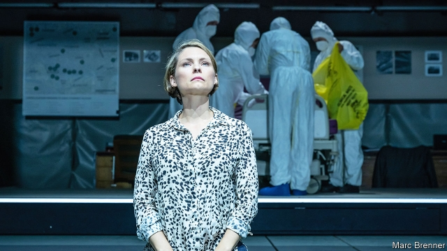

###### Laughter in the dark

# A bold new play about Alexander Litvinenko’s murder 

 

> print-edition iconPrint edition | Books and arts | Sep 7th 2019 

A MAN LIES in a hospital bed, dying. But in his final days, he helps unravel his own murder; the solution links his grim fate to a lurid world of violence and corruption. With its ticking clock, and mix of private agony and grand themes, the case of Alexander Litvinenko was inherently theatrical. Now, in “A Very Expensive Poison”, it has been ingeniously reimagined on the stage of the Old Vic in London. 

In an operation so inept it might be comic were it not so cruel, in 2006 two Russian assassins poisoned Litvinenko with polonium in a London hotel, leaving a trail of radioactive smears. Under guard, their victim accused Vladimir Putin of orchestrating the hit. The play by Lucy Prebble, who turned another twisty news saga into zany drama in “Enron” (2009), begins with Marina Litvinenko pondering a push for a public inquiry into her husband’s death, in the face of obstructive British ministers. “It will stop it happening again, yes?” she asks—ironically, given the botched poisoning of Sergei Skripal in Salisbury in 2018. “I was really struck by the bald-faced lies and denials [from Russia],” Ms Prebble says, but also “by the shabby cowardice of the British response…There was something in it that was a harbinger for now.” 

Her play traces Litvinenko’s past as an agent of the FSB, Russia’s main security service, and his family’s flight to London after he alleged, among other things, that his colleagues had schemed to kill Boris Berezovsky. (The oligarch sought refuge in Britain, too, and died murkily in 2013.) At the same time it dramatises the sleuthing that led to the culprits. “He has to work harder to be trusted, because he’s seen as too trustworthy,” notes a detective grappling with the FSB’s warped code, in which honesty is a liability—speaking for the many Britons who were stunned by the irruption in their capital of these reckless conspiracies. 

“A Very Expensive Poison” weaves a moving portrait of a marriage—“You’re in a bad mood because you’re hungry,” Marina tells Alexander—with self-referential jokes and escalating high-jinks. Berezovsky sings a vaudeville number; the origins of polonium are outlined in verse. The antics are meant “to capture how overwhelming and tonally inconsistent life feels,” the playwright says. “Just like on your social-media feed; a funny cat next to a terrorist attack next to a dear friend’s depression.” The helter-skelter spectacle is also an insightful commentary on the way power is now wielded, in Russia and beyond. 

Apart from the Litvinenkos, the main character is Mr Putin, who emerges as a kind of sinister ringmaster. His creepy persona reflects the winking mendacity and distracting stunts that typify his real-life rule. Stagecraft mimics statecraft—which is itself a distorted form of entertainment. In a bold scene, the Putin of the play recounts the theatre siege in Moscow in 2002 in which 130 hostages died. “As soon as anyone starts telling a story,” he warns, “they start telling a lie.” The role is “an expression of how easy it is to manipulate and control a population,” says Ms Prebble. “In this case, an audience.” 

It was over nine years before a judge in the eventual public inquiry found that Mr Putin had “probably” approved Litvinenko’s murder. As Luke Harding, a journalist who wrote the gripping book on which the play is based, says, there is no prospect that the assassins will be extradited from Russia (where one is an MP). But art, he thinks, offers its own form of justice. 

If so, the reckoning will continue next year, when an opera about the case opens at Grange Park Opera in Surrey. It will allude to Tchaikovsky and Russian football chants, says Wasfi Kani, the company’s boss. And, like the play, it will invoke the “love and betrayal and jeopardy” that all drama craves—and that make Litvinenko’s story enduringly tragic. ■ 

-- 

 单词注释:

1.alexander[,æli^'zɑ:ndә]:n. 亚历山大（男子名） 

2.Sep[]:九月 

3.unravel[.ʌn'rævl]:vt. 阐明, 解决, 解开 vi. 散开 

4.grim[grim]:a. 冷酷的, 坚强的, 残忍的, 可怕的, 讨厌的 

5.lurid['luәrid]:a. 火烧似的, 苍白的, 华丽的, 可怕的 

6.corruption[kә'rʌpʃәn]:n. 腐败, 堕落, 贪污 [计] 论误 

7.litvinenko[]:[网络] 利特维年科；俄罗斯间谍李维南科；特工利维年科 

8.inherently[in'hiәrәntli]:adv. 内在地, 生来地, 固有地 [计] 固有的 

9.theatrical[θi'ætrikl]:a. 剧场的, 夸张的, 戏剧性的 n. 戏剧演出 

10.ingeniously[ɪn'dʒi:nɪəslɪ]:adv. 有才能地, 贤明地 

11.reimagine[]:[网络] 再定义 

12.vic[vik]:n. 飞机V字队形编队 

13.inept[in'ept]:a. 不适当的, 不理智的, 笨拙的 [法] 不称职者, 无能的, 不符要求的 

14.comic['kɒmik]:n. 连环漫画, 喜剧演员, 滑稽的人 a. 滑稽的, 有趣的, 喜剧的 

15.assassin[ә'sæsin]:n. 暗杀者, 刺客 [法] 暗杀者, 行刺者 

16.polonium[pә'lәuniәm]:n. 钋 [化] 钋Po 

17.smear[smiә]:vt. 涂, 擦上, 玷污, 把...擦模糊 vi. 被弄脏 n. 污点, 污迹, 污蔑 

18.Vladimir[vlɑ'dimɪr]:n. 弗拉基米尔（古罗斯弗拉基米尔-苏兹达里公国的古都） 

19.putin['putin]:n. 普京（人名） 

20.orchestrate['ɒ:kistreit]:v. 编管弦乐曲 

21.lucy['lu:si]:n. 露西（女子名） 

22.prebble[]: [人名] 普雷布尔 

23.twisty['twisti]:a. 扭曲的, 狡猾的, 不老实的 [法] 歪曲事实的, 不正直的 

24.saga['sɑ:gә]:n. 传说, 英雄传奇, 冒险故事 

25.zany['zeini]:n. 小丑, 笨人, 马屁精 a. 滑稽的, 滑稽愚蠢的 

26.enron[]:n. 安然公司（财富500强公司之一） 

27.marina[mә'rinә]:n. 码头 

28.ponder['pɒndә]:v. 沉思, 考虑 

29.obstructive[әb'strʌktiv]:a. 引起阻塞的, 阻碍的, 妨碍的 n. 妨碍物 

30.botch[bɒtʃ]:v. 拙笨地修补, 糟蹋 n. 拙笨的修补, 难看的补缀 

31.Sergei[]:塞奇（人名） 

32.salisbury['sɔ:lzbәri]:n. 索尔兹伯里市（津巴布韦, 原罗得西亚首都） 

33.denial[di'naiәl]:n. 否认 [法] 否定, 否认, 拒绝接受 

34.cowardice['kauәdis]:n. 懦弱 

35.harbinger['hɑ:bindʒә]:n. 通告者, 预告者, 先驱, 预兆 vt. 预告, 充做...的前驱 

36.FSB[]:[医] 甲醛磺胺苯胺 

37.allege[ә'ledʒ]:vt. 宣称, 主张, 提出, 断言 [法] 断言, 指称, 指证 

38.boris['bɔris]:n. 鲍里斯（男子名） 

39.berezovsky[]:[网络] 别列佐夫斯基；贝莱佐维斯基 

40.oligarch['ɒligɑ:k]:n. 寡头政治执政者 

41.murkily['mә:kili]:adv. 黝暗地, 阴沉地 

42.dramatise['dræmәtaiz]:vt.vi. 改编为剧本, 戏剧化, 戏剧般地假装, 装假, 具有戏剧性, 使惹人注目 

43.sleuthing[ˈslu:θɪŋ]:n. （非警方人员所做的）调查, 侦察 

44.culprit['kʌlprit]:n. 犯人, 罪犯, 刑事被告 [法] 犯罪者, 犯人, 罪犯 

45.trustworthy['trʌst.wә:ði]:a. 可信赖的 [法] 可信任的, 可靠的, 可信赖的 

46.grapple[græpl]:v. 抓住, 掌握 n. 抓住, 系紧, 掌握, 与...扭打 

47.warp[wɒ:p]:n. 变形, 弯曲, 歪曲, 乖僻, 偏差, 偏见 vt. 使变形, 弄歪, 使翘曲, 使不正常, 歪曲, 使有偏见 vi. 变弯, 变歪 

48.Briton['britәn]:n. 大不列颠人, 英国人 

49.stun[stʌn]:vt. 使昏迷, 使震惊, 打昏 n. 昏迷, 猛击 

50.irruption[i'rʌpʃ(ә)n]:n. 侵入, 闯进, 激剧繁殖 

51.reckless['reklis]:a. 不介意的, 大意的, 鲁莽的, 不顾后果的 [法] 不注意的, 粗心大意的, 鲁莽的 

52.conspiracy[kәn'spirәsi]:n. 同谋, 阴谋, 阴谋集团 [法] 阴谋, 通谋, 共谋 

53.escalate['eskәleit]:vi. 逐步扩大, 逐步升高, 逐步增强 vt. 使逐步上升 

54.vaudeville['vәudәvil]:n. 杂耍, 轻歌舞剧 

55.verse[vә:s]:n. 诗, 韵文, 诗句 vt. 用诗表达 vi. 作诗 

56.antic['æntik]:n. 滑稽动作 a. 古怪的 

57.overwhelm[.әuvә'hwelm]:vt. 淹没, 受打击, 制服, 压倒, 使不知所措 [法] 打翻, 倾覆, 覆盖 

58.tonally['tәunәli]:adv. 在调子上, 就音色方面 

59.inconsistent[.inkәn'sistәnt]:a. 不一致的, 易变的, 前后矛盾的 [法] 矛盾的, 不一致的, 不协调的 

60.playwright['pleirait]:n. 剧作家 

61.terrorist['terәrist]:n. 恐怖分子 [法] 恐怖份子, 恐怖主义 

62.insightful['in.saitful]:a. 有深刻见解的, 富有洞察力的 

63.commentary['kɒmәntәri]:n. 注释, 评论, 说明 [法] 注释, 评注, 评论 

64.wield[wi:ld]:vt. 挥舞, 运用 

65.sinister['sinistә]:a. 不吉利的, 凶恶的, 左边的 [医] 左的 

66.ringmaster['riŋmɑ:stә]:n. 马戏演出指挥, 导演 

67.creepy['kri:pi]:a. 爬行的, 令人毛骨悚然的 

68.persona[pә:'sәunә]:n. 人, 人物, 角色, 外表印象, 人格面具 [医] 伪装人格 

69.wink[wiŋk]:n. 眨眼, 使眼色, 瞬间 vi. 眨眼, 使眼色, 闪烁 vt. 眨 

70.mendacity[men'dæsiti]:n. 虚伪, 谎话, 说谎癖 [医] 谎言癖, 谎言 

71.distract[dis'trækt]:vt. 转移, 分心, 使发狂 

72.stunt[stʌnt]:n. 特技, 绝技, 花招, 噱头, 手腕, 发育不良 vt. 阻碍成长 vi. 表演特技 

73.typify['tipifai]:vt. 代表, 象征, 为...之典型 

74.stagecraft['steidʒkrɑ:ft; -kræft]:n. 演剧技巧 

75.mimic['mimik]:a. 模仿的, 摹拟的 n. 效颦者, 模仿者, 小丑, 仿制品 vt. 模仿, 摹拟 

76.distort[dis'tɒ:t]:vt. 扭曲, 歪曲 [法] 歪区, 曲解, 纂改 

77.recount[ri'kaunt]:vt. 详述, 叙述, 重新计算 n. 重新计算 

78.siege[si:dʒ]:n. 包围, 围攻, 再三的努力 vt. 包围, 围攻 

79.hostage['hɒstidʒ]:n. 人质, 抵押品 [经] 人质, 抵押品 

80.manipulate[mә'nipjuleit]:vt. 操纵, 利用, 操作, 巧妙地处理, 假造 

81.eventual[i'ventʃuәl]:a. 最后的, 终于的 

82.luke[lu:k]:n. 卢克（男子名）；路加（基督教早期信徒之一）；[圣经]路加福音 

83.harding['hɑ:diŋ]:n. 哈丁（姓氏）；哈丁（美国前总统） 

84.MP[]:国会议员, 下院议员 [计] 宏处理程序, 维护程序, 线性规划, 微程序, 多处理器 

85.reckon['rekәn]:vt. 计算, 总计, 估计, 认为, 猜想 vi. 数, 计算, 估计, 依赖, 料想 

86.grange['greindʒ]:n. 农庄, 田庄 

87.surrey['sʌri]:n. 四轮双座轻便游览马车 

88.allude[ә'lu:d]:vi. 暗指, 提及 

89.Tchaikovsky[tʃai'kɔfski]:n. 柴可夫斯基（人名, 俄国作曲家, 1840-1893） 

90.wasfi[]:n. (Wasfi)人名；(阿拉伯)瓦斯菲 

91.kani[]: [地名] [科特迪瓦] 卡尼 

92.invoke[in'vәuk]:vt. 祈求, 恳求, 实行, 援引, 引起 [计] 调用; 请求 

93.betrayal[bi'treiәl]:n. 背叛, 辜负 [法] 背叛, 通敌, 背信 

94.jeopardy['dʒepәdi]:n. 危难, 危险 [法] 危险, 危难, 危险处境 

95.enduringly[ɪn'djʊərɪŋlɪ]:adv. 耐久地, 永久地 

96.tragic['trædʒik]:a. 悲惨的, 悲剧的 

