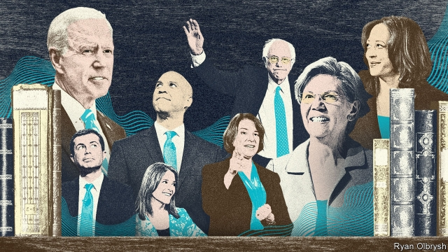

###### Campaigning in prose

# Even when they say nothing new, candidates’ books can be revealing 

 

> print-edition iconPrint edition | Books and arts | Sep 7th 2019 

VOTERS DO NOT care much about policy. They pick candidates because they like them, and feel they care. Skilful politicians know how to deploy policy to signal affinity between themselves and their audience. “Build a wall” did not mean simply, “I’m going to erect an impenetrable barrier along our southern border”; it was also Donald Trump’s way of telling voters that, like some of them, he preferred an America with fewer immigrants. Similarly, “Medicare for all” does not just mean, “I will immediately abolish all private insurance and move people to a state programme”; it is a way for Bernie Sanders and Elizabeth Warren to communicate that they aspire to a more activist government. As well as liking and aligning with candidates, ideally voters should feel they know them well, too. 

Political-campaign books are a sign of seriousness to activists and donors. In the best ones, candidates tell voters what they think, who they are, where they come from and what they want to do in office. Rallies, debates and adverts reach more people, but books give politicians space. They can introduce themselves and their ideas without interruption and at length. These works all follow certain conventions: parents and teachers are praised, every remembered interaction offers a lasting lesson, obstacles are overcome and doubters vanquished. But each is also an artefact of the candidacy it promotes. 

Each chapter in Bernie Sanders’s book, for instance, is headlined with a date. “Where We Go From Here” reads as though, on those particular dates, he turned on the recording function on his smartphone, shouted into it for a while, and then got an intern to transcribe everything. Most candidates edit and present their earliest memories. Not Mr Sanders. In passing readers learn that he has children, grandchildren and a brother, and that he first ran for the Senate as a third-party candidate in 1971. During a visit to Missouri, a colleague slept in a bed that Margaret Thatcher had used, whereas Mr Sanders “opted for a room across the hall” (whether out of principle or for convenience is unclear). 

Mr Sanders’s aversion to personal details extends beyond his own. He says he got “goose-bumps” from talking to a D-Day veteran, and “will never forget” meeting him, but fails to note what the man actually said. In his world there are no individuals, just victims of malign historical forces that must be defeated through revolution. Readers will learn nothing about him that they did not already know. That itself tells them something valuable: like President Trump, Mr Sanders is a factional candidate uninterested in expanding his base. He will happily accept more votes, but from people whose eyes have become unscaled. The grubby business of persuasion and compromise is beneath him. 

By contrast, Ms Warren, Mr Sanders’s rival on the left of the Democratic field, turns out to be quite good at persuasion. It is not an endorsement of her policies to note that she is conspicuously better than any other candidate at explaining why she favours them, and why they matter to ordinary people. She has a rationale for running: she wants to rebuild the American middle class by reviving New Deal regulations and adding more. In “This Fight Is Our Fight”, she connects everything back to that mission. 

She turns her upbringing into a discourse on wage stagnation. Gina, a woman Ms Warren met soon after she began writing her book, exemplifies the struggles of middle-class Americans. People are individuals, not oppressed, indistinguishable masses (Gina is “the kind of woman who talks to people around her in the grocery-store line and who knows every clerk by name”). At times, Ms Warren’s political platform seems a sort of leftist Trumpism, with corporations rather than immigrants as the villains responsible for all ills. But if Democratic primary voters decide they want a fighter rather than a conciliator or sloganeer, she might be the choice. 

The other front-runner, Joe Biden, leads with his heart. Mr Biden has suffered terrible loss: when he was 30, just weeks after he was first elected as a senator, his wife and infant daughter died in a car crash. “Promise Me, Dad” centres on his last years as vice-president, when he was deciding whether to run in 2016 and his older son, Beau, was struggling with the cancer that ultimately killed him. Even Mr Biden’s most ardent opponents might find themselves moved, though the most emotive section is the eulogy for Beau delivered by Barack Obama—a reminder, like the rest of these books, that no president, except perhaps Ulysses Grant, has written as well as Mr Obama. 

By contrast, readers of “The Truths We Hold” by Kamala Harris are at no risk of an emotional response. Ms Harris is for all the good things and against all the bad ones. She has a lawyer’s gift for framing debates. Her slogan, “We must speak truth”, implies that other politicians do not. She became a prosecutor, she claims, not out of political ambition—though that is no sin, as unambitious politicians tend not to win, and they certainly do not run for president—but “to be on the front lines of criminal-justice reform…to protect the vulnerable.” Throughout, her thoughts are farther left than her actions, which will strike some readers as prudent and others as insincere. 

Her fellow ex-prosecutor, Amy Klobuchar, has produced a much stranger book. She calls herself (and her book) “The Senator Next Door”, which, like the cover image of her with a cup of coffee and a newspaper, is meant to convey everyday relatability. And indeed, Ms Klobuchar did have a modest upbringing. Yet her prose seems most alive when she is listing the impressive jobs held by her friends or rehashing old grievances. Readers will learn the names of the school principal who sent her home in fourth grade for wearing trousers, of the neighbours who failed to chain their scary dog and of a teacher who predicted an average future because young Amy coloured in a bunch of grapes poorly. 

Pete Buttigieg, Cory Booker and Marianne Williamson have written kinder books. Mr Buttigieg says he would have been a novelist had he not run for office, and it shows in his eye for character and detail in “Shortest Way Home”. Mr Booker defies literary conventional wisdom: making nice people interesting is notoriously hard, and even harder when the nice person himself is narrating, but in “United” Mr Booker comes across as both generous and a shrewd observer. He seems to lack ruthlessness, which speaks well of him as a man but less so as a contender. 

Ms Williamson does not lack ruthlessness so much as experience, attention to detail and (in “A Politics of Love”) an ability to speak in anything other than patchouli-scented clichés. “Spirituality is the path of the heart” and “love is the nutrition of the gods” are phrases more worthy of a fortune cookie than of a would-be president. As for her plea to “break free of the rationalism constraining our politics”, the current occupant of the White House has accomplished that neatly already. ■ 
<<<<<<< HEAD

-- 

 单词注释:

1.prose[prәuz]:n. 散文 v. 写散文 a. 散文的, 平凡的 

2.Sep[]:九月 

3.voter['vәutә]:n. 选民, 投票人 [法] 选民, 选举人, 投票人 

4.skilful['skilful]:a. 灵巧的, 熟练的, 制作精巧的 

5.deploy[di'plɒi]:v. 展开, 配置 

6.affinity[ә'finiti]:n. 吸引, 姻亲关系, 类同 [化] 亲合力; 亲合能; 亲合势; 近似; 类似 

7.impenetrable[im'penitrәbl]:a. 不能通过的, 不可理喻的, 费解的, 顽固的 

8.medicare['medi,keә]:n. 医疗照顾方案, 医疗照顾项目 [法] 公办的医疗保险制 

9.bernie['bә:ni]:n. 伯尼（男子名）；[俚]可卡因（等于cocaine） 

10.sander['sændә]:[电] 散沙 

11.elizabeth[i'lizәbәθ]:n. 伊丽莎白（女子名） 

12.warren['wɒrәn]:n. 养兔场, 拥挤的地区 

13.aspire[ә'spaiә]:vi. 渴望, 立志于 

14.activist['æktivist]:n. 激进主义分子 

15.align[ә'lain]:vi. 排列, 排成一行, 结盟 vt. 使结盟, 使成一行, 校正 

16.ideally[ai'diәli]:adv. 完美地, 理想地 

17.seriousness['siәriәsnis]:n. 严肃, 认真, 严重性 

18.donor['dәunә]:n. 捐赠人 [化] 给体; 供体 

19.rally['ræli]:n. 重振旗鼓, 集合, 群众集会, 跌停回升 v. 重整旗鼓, 集合, 恢复精神, 团结, 挖苦, 嘲笑 

20.advert[әd'vә:t]:vi. 提出看法, 引起注意, 留意 n. 广告 

21.doubter['dautә]:n. 抱怀疑态度的人；不信宗教的人；怀疑论者 

22.vanquish['væŋkwiʃ]:vt. 打败, 征服, 克服 [法] 征服, 战胜, 击败 

23.artefact['ɑ:tifækt]:n. 人工制品, 制造物, 人为现象, 膺象, 矫作物, 古代文物 [医] 人为现象, 人工产物 

24.candidacy['kændidәsi]:n. 候选人的地位, 候选资格 [法] 候选人的身份, 资格 

25.smartphone[]:n. 智能手机 

26.transcribe[træn'skraib]:vt. 抄写, 译, 意译, 录制, 改编 [计] 转录 

27.edit['edit]:vt. 编辑, 编校, 修订, 剪辑 [计] 编辑; DOS外部命令:该命令是一个用于编辑文本文件的全屏幕编辑程序 

28.Missouri[mi'zuәri]:n. 密苏里州 

29.margaret['mɑ:^әrit]:n. 玛格利特（女子名） 

30.thatcher[]:n. 盖屋顶者 

31.opt[ɒpt]:vi. 选择 

32.unclear[.ʌn'kliә]:a. 不易了解的, 不清楚的, 含混的 

33.aversion[ә'vә:ʃәn]:n. 厌恶, 讨厌的事, 讨厌的人 [医] 厌恶, 移转, 移位 

34.malign[mә'lain]:a. 有害的, 恶性的, 有恶意的 vt. 诽谤, 说坏话 

35.factional['fækʃәnәl]:a. 派系, 小派别的 

36.uninterested[.ʌn'intәristid]:a. 不感兴趣的, 无利害关系的 

37.unscaled[]:[网络] 固定模式；没有分支长度的标注；未标度化 

38.grubby['grʌbi]:a. 污秽的, 肮脏的, 生蛆的 

39.persuasion[pә'sweiʒәn]:n. 说服, 信念, 派别, 说服力 

40.endorsement[in'dɒ:smәnt]:n. 支持, 认可, 背书 [经] 背书, 担保, 保证 

41.conspicuously[kən'spɪkjʊəslɪ]:adv. 显著地, 超群地 

42.rationale[.ræʃә'nɑ:li]:n. 基本原理 [医] 原理, 理论 

43.revive[ri'vaiv]:vt. 使苏醒, 使复兴, 使振奋, 回想起, 重播 vi. 苏醒, 复活, 复兴, 恢复精神 

44.upbringing['ʌp.briŋiŋ]:n. 教养 

45.discourse['diskɒ:s]:n. 谈话, 演讲 vi. 谈话, 讲述 

46.stagnation[stæg'neiʃәn]:n. 淤塞, 停滞 [医] 停滞, 滞留, 郁积 

47.gina['dʒi:nә]:n. 吉娜（男子名） 

48.exemplify[ig'zemplifai]:vt. 例证, 例示 [法] 制作经公章证明的誊本, 例证 

49.indistinguishable[.indis'tiŋgwiʃәbl]:a. 不能辨别的, 不能区别的 

50.leftist['leftist]:n. 左翼的人, 左派 a. 左派的 

51.Trumpism[]:n. 特朗普主义 

52.villain['vilәn]:n. 坏人, 恶棍 [法] 歹徒, 恶棍, 恶徒 

53.conciliator[kәn'silieitә]:n. 抚慰者, 调和人 [经] 调解人 

54.sloganeer[.slәugә'niә]:vi. 使用标语口号 n. 标语口号作者 

55.joe[dʒәu]:n. 乔（男子名） 

56.biden[baidən]: [人名] 拜登 

57.senator['senәtә]:n. 参议员, (某些大学的)理事 [法] 参议员, 上议员 

58.beau[bәu]:n. 花花公子, 情郎, 求爱者 

59.ardent['ɑ:dnt]:a. 热心的, 激动的, 燃烧般的 [医] 灼热的; 热心的 

60.emotive[i'mәutiv]:a. 使感动的, 动感情的, 感情的 [医] 情绪的, 动感情的 

61.eulogy['ju:lәdʒi]:n. 赞词, 称颂 

62.barack[bɑ:'ræk]:n. 巴拉克（男子名） 

63.reminder[ri'maindә]:n. 提醒的人, 暗示 [经] 催单 

64.ulysses[ju(:)'lisi:z]:n. 尤里西斯（希腊神话中男子名, 也是爱尔兰意识流文学作家詹姆斯·乔伊斯小说名） 

65.obama[]:n. 奥巴马(姓) 

66.kamala[kә'meilә]:n. [植] 粗糠柴 

67.harris['hæris]:n. 哈里斯（英国苏格兰一地区）；哈里斯（姓氏） 

68.prosecutor['prɒsikju:tә]:n. 实行者, 告发者, 公诉人 [法] 原告, 起诉人, 检举人 

69.unambitious[.ʌnæm'biʃәs]:a. 无名利心的, 无野心的, 谦虚的 

70.vulnerable['vʌlnәrәbl]:a. 易受伤害的, 有弱点的, 易受影响的, 脆弱的, 成局的 [医] 易损的 

71.prudent['pru:dnt]:a. 审慎的, 三思而后行的, 精明的, 节俭的 

72.insincere[.insin'siә]:a. 不诚实的, 无诚意的, 伪善的 

73.amy['eimi]:n. 艾米（女子名） 

74.klobuchar[]:[网络] 克罗布歇 

75.senator['senәtә]:n. 参议员, (某些大学的)理事 [法] 参议员, 上议员 

76.relatability[]:[网络] 关联性；相关性 

77.rehash[.ri:'hæʃ]:vt. 重讲, 改头换面地重复 n. 改头换面的作品 

78.grievance['gri:vәns]:n. 委屈, 冤情, 苦况 [经] 不满(对雇用条件的) 

79.trouser['trauzә]:a. 裤子的 

80.scary['skєәri]:a. 容易受惊的, 胆小的, 提心吊胆的 

81.poorly['puәli]:adv. 贫穷地, 不充分地, 贫乏地 a. 身体不舒服的 

82.Pete[pi:t]:n. 皮特（等于Peter, 男子名） 

83.buttigieg[]:布蒂吉格 

84.cory[]:n. 克里, 科里（人名） 

85.booker['bukә]:n. （旅馆车票, 戏票等的）登记人；寻选模特儿的人 

86.marianne[,meәri'æn, mɑ:'rjɑ:n]:n. 玛丽安（法兰西共和国或其政府的绰号, 因以女性为其化身, 故名） 

87.williamson['wiljәmsn]:n. 威廉姆森（姓氏名） 

88.defy[di'fai]:vt. 藐视, 挑衅, 使落空 n. 挑战 

89.notoriously[]:adv. 臭名昭著的, 声名狼藉的 

90.narrate[nә'reit]:v. 说故事, 说明, 叙述 

91.shrewd[ʃru:d]:a. 精明的, 锐利的, 剧烈的, 机灵的, 厉害的 

92.ruthlessness[]:n. 无情；冷酷；残忍 

93.les[lei]:abbr. 发射脱离系统（Launch Escape System） 

94.contender[kәn'tendә(r)]:n. 参赛者, 争论者, 斗争者, 竞争者 

95.politic['pɒlitik]:a. 精明的, 明智的, 策略的 

96.spirituality[,spiritju'æliti]:n. 精神性, 灵性, 教士, 牧师 

97.plea[pli:]:n. 恳求, 辩解, 抗辩, 诉讼, 请愿, 托词 [法] 抗辩, 申诉案件, 答辩 

98.rationalism['ræʃәnәlizm]:n. 合理主义, 理性论, 纯理论 

99.constrain[kәn'strein]:vt. 强迫, 限制, 关押 

100.occupant['ɒkjupәnt]:n. 占有者, 居住者, 占用者 

101.neatly['ni:tli]:adv. 整洁地, 干净地, 匀称地 
=======
>>>>>>> 50f1fbac684ef65c788c2c3b1cb359dd2a904378

