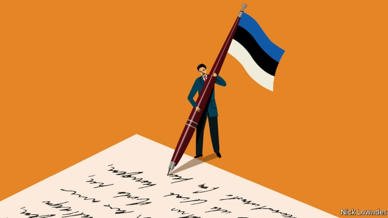

###### Johnson

# Languages are a battleground for nationalists 

 

> print-edition iconPrint edition | Books and arts | Sep 7th 2019 

THE MUSEUM that honours Johannes Aavik in Kuressaare, a small town on an Estonian island, may not seem impressive. Outside, the national flag is desultorily tangled in a tree. Inside the small building, an attendant jumps up in surprise to turn on the lights for the only visitor. Of the two rooms, just one is devoted to Johannes (the other deals with his brother Joosep, a musician). 

Yet Aavik deserves his museum. Few people have ever coined more words that subsequently came to be used. Over the centuries Estonia was dominated by Danes, Germans, Swedes and Russians. It is estimated that a third of its vocabulary is borrowed. So in the early years of the 20th century, when Estonia was still part of the Russian empire—and then after it declared its independence in 1918—Aavik set about coining Estonian replacements for some of those borrowings. Some he took from rural dialects; others were created on the model of Finnish (which, unlike most European languages, is related to Estonian). 

But quite a few, he simply made up. A modern scholar thinks he might have coined roim, “crime”, with the English word at the back of his mind. Aavik himself claimed that he merely sought short words that sounded beautiful and seemed Estonian, even though they were, at least at the moment he invented them, nonsense. 

Aavik was part of a wave of linguistic purism that was then sweeping Europe. In the medieval period, Latin had been thought the only language worth writing. But gradually authors in France and Italy began to see their own tongues—descendants of Latin—as worthy of literature, too. The trend was boosted by Protestantism, which preached that everyone should have access to scripture in their own languages. The “vernaculars” became respectable. 

Or some of them did. A few big languages, backed by states, gained kudos. Small, stateless ones were still belittled. Only Russian and German could be spoken at Aavik’s school. Little wonder that the atmosphere nurtured a nationalist. 

Aavik’s efforts mostly predated independence. Other language reformers have begun their work only after they had a state at their disposal. The new republic of Turkey, under Kemal Ataturk, had lost many of the Ottoman empire’s provinces; its pride was wounded and its population now far more Turkish. Ataturk decreed a switch from the Arabic to the Latin alphabet and, in an extraordinary purge, sought to get rid of Arabic and Persian borrowings, replacing them with new coinages. One scholar calls this a “catastrophic success”: modern Turks need special training to read the Turkish of a hundred years ago. 

Purist engineering has also been used to distance a language from an overly close relative. Standard Norwegian was once too similar to Danish for some Norwegians; hence the creation of “new Norwegian” (nynorsk), cobbled together from dialects and avoiding Danish echoes, which today is co-official alongside the older Dano-Norwegian (bokmal). Hindi and Urdu are close enough that some consider them a single language, but since Indian and Pakistani independence, new Hindi coinages and borrowings have tended to come from Sanskrit, Urdu ones from Arabic and Persian. The languages are growing apart. 

In fact, places that accept foreign words with a live-and-let-live attitude are the exceptions. Centuries ago, English, which seems undogmatic, itself experienced the “inkhorn controversy”, in which some intellectuals freely coined words from Greek and Latin, such as “educate” and “ostracise”. (Some, such as “suppediate”, meaning “to supply”, never made it.) Aavik-like, purists fought back, coining terms like “witcraft” to replace borrowings like “reason”. Their attitude was exemplified by Sir John Cheke, who in 1557 wrote: “I am of the opinion that our tung should be written cleane and pure, vnmixt and vnmangled with borowing of other tunges.”  

Most of the inkhornisms survived. These days, English has become so robust that it is no longer the polluted but the polluter. That it now lacks a purist tendency of its own may be less because the British are naturally laissez-faire liberals than because English is the world’s top linguistic dog. It exports words around the globe, often to the alarm of nationalists overseas. They might take some comfort from the fact that English thrived after its controversial mangling. Objectively, borrowing does no harm. But then, such worries are rarely objective to begin with.■ 
<<<<<<< HEAD

-- 

 单词注释:

1.johnson['dʒɔnsn]:n. 约翰逊（姓氏） 

2.nationalist['næʃәnәlist]:n. 国家主义者, 民族主义者 

3.Sep[]:九月 

4.Johanne[]:n. (Johanne)人名；(德、丹)约翰妮 

5.Kuressaare[]:[地名] 库雷萨雷 ( 爱沙 ) 

6.Estonian[es'tәuniәn]:a. 爱沙尼亚的 n. 爱沙尼亚人, 爱沙尼亚语 

7.desultorily['desәltәrili]:adv. 杂乱无章地, 散漫地 

8.tangle['tæŋgl]:n. 缠结, 纠结的一团, 困惑, 纠纷, 混乱 vt. 使缠结, 缠住 vi. 缠结, 乱作一团 

9.attendant[ә'tendәnt]:n. 随从, 侍者, 出席者 a. 侍候的, 伴随的, 出席的, 在场的 

10.subsequently['sʌbsikwәntli]:adv. 后来, 随后 

11.Estonia[es'tәuniә]:n. 爱沙尼亚 

12.Dane[dein]:n. 丹麦人 

13.Swede[swi:d]:n. 瑞典人 

14.replacement[ri'pleismәnt]:n. 归还, 更换, 代替者 [医] 复位, 置换 

15.borrowing['bɔrәuiŋ]:[经] 借款, 贷款 

16.Finnish['finiʃ]:n. 芬兰语 a. 芬兰的, 芬兰人的, 芬兰语的 

17.linguistic[liŋ'^wistik]:a. 语言的, 语言学的 [计] 语言的, 语言学的 

18.purism['pjuәrizm]:n. 语言纯正主义, 纯粹派 

19.medieval[.medi'i:vl]:a. 中古的, 中世纪的 

20.Protestantism['prɒtistәntizm]:n. 新教, 新教教义, 新教徒 

21.preach[pri:tʃ]:v. 传道, 讲道, 说教, 宣讲, 鼓吹 n. 说教, 布道 

22.scripture['skriptʃә]:n. 圣经, 圣经的一节, 圣经的一句, 铭文 

23.vernacular[vә'nækjulә]:n. 本地话, 方言 a. 地方的, 用本地语写成的 

24.respectable[ri'spektәbl]:a. 值得尊重的, 人格高尚的, 相当数量的 n. 品格高尚的人 

25.kudo['kju:dәu]:n. 奖赏, 光荣, 荣誉 

26.stateless['steitlis]:a. 没有国家的 [法] 无国籍的, 无国家主权的 

27.belittle[bi'litl]:vt. 轻视, 贬低 

28.nurture['nә:tʃә]:n. 养育, 营养物, 培育 vt. 养育, 供给营养物, 教养 

29.predate['pri:'deit]:vt. 倒填...的日期, 把...的日期填早, 在日期上早于, 在日期上先于 [经] 提前日期 

30.reformer[ri'fɒ:mә]:n. 改革家, 改革运动者 [化] 转化炉; 转化器; 重整器; 重整炉 

31.Kemal[]:n. (Kemal)人名；(葡)克马尔；(阿拉伯、印尼)卡迈勒；(土、阿塞、土库)凯末尔 

32.Ataturk[]:阿塔图尔克（人名） 

33.ottoman['ɔtәmәn]:a. 土耳其人的；土耳其民族的；土耳其帝国的（等于Turkish） 

34.Turkish['tә:kiʃ]:n. 土耳其语 a. 土耳其的, 土耳其人的, 土耳其语的 

35.decree[di'kri:]:n. 法令, 判决, 天意 vt. 颁布, 判决 vi. 发布命令 

36.purge[pә:dʒ]:n. 净化, 清除, 泻药 v. (使)净化, 清除, (使)通便 [计] 服务器文件删除实用程序 

37.Persian['pә:ʃәn]:n. 波斯人, 波斯语 

38.coinage['kɒinidʒ]:n. 造币 [经] 造币, 货币制度 

39.catastrophic[.kætә'strɒfik]:a. 悲惨的, 灾难的 

40.Turk[tә:k]:n. 土耳其人, 土耳其马 

41.purist['pjuәrist]:n. 纯粹主义者 

42.overly['әuvәli]:adv. 过度地, 极度地 

43.Norwegian[nɒ:'wi:dʒәn]:n. 挪威人, 挪威语 a. 挪威的, 挪威人的, 挪威语的 

44.Danish['deiniʃ]:n. 丹麦文 a. 丹麦的, 丹麦人的, 丹麦文的 

45.Norwegian[nɒ:'wi:dʒәn]:n. 挪威人, 挪威语 a. 挪威的, 挪威人的, 挪威语的 

46.creation[kri:'eiʃәn]:n. 创造, 创作物, 发明 [化] 产生 

47.Nynorsk['nju:nɔ:sk]:n. 尼诺斯克语(指以口语为基础的挪威书面语) 

48.cobble['kɒbl]:n. 圆石, 鹅卵石 vt. 铺鹅卵石, 修, 粗粗地修补 

49.Bokmal['bjkmɔ:l]:n. 博克马尔语(由逐渐改革的丹麦书面语发展而成的挪威书面语) 

50.Hindi['hindi:]:a. 印地语的, 印度北部的 n. 印地语 

51.urdu['uәdu:]:n. 乌尔都语 

52.Pakistani[.pɑ:ki'stɑ:ni]:a. 巴基斯坦的 n. 巴基斯坦人 

53.Sanskrit['sænskrit]:n. 梵语 a. 梵语的 

54.undogmatic[,ʌndɔ^'mætik; -dɔ:^-]:a. 非教条的, 非武断的 

55.inkhorn['iŋkhɒ:n]:n. 墨水瓶 

56.controversy['kɒntrәvә:si]:n. 论争, 辩论, 论战, 争论 [法] 论战, 争论, 争吵 

57.ostracise['ɔstrәsaiz]:vt. 流放, 与...绝交, 隔离, 孤立, 排斥 

58.purist['pjuәrist]:n. 纯粹主义者 

59.witcraft[]:[网络] 智慧 

60.exemplify[ig'zemplifai]:vt. 例证, 例示 [法] 制作经公章证明的誊本, 例证 

61.john[dʒɔn]:n. 盥洗室, 厕所, 嫖客 

62.cheke[]: [人名] [英格兰人姓氏] 奇克 Cheek的变体 

63.tung[tʌŋ]:n. 油桐 

64.cleane[]:[网络] 清除 

65.inkhornisms[]:[网络] 油画爱好者 

66.robust[rәu'bʌst]:a. 健康的, 强健的, 要用力气的, 坚定的, 粗野的 [计] 健壮性 

67.polluter[]:n. 污染者, 污染物质 

68.les[lei]:abbr. 发射脱离系统（Launch Escape System） 

69.oversea['әuvә'si:]:adv. 海外, 向国外, 向海外, 国外 a. 外国的, 在国外的, 在海外的, 舶来的 

70.mangle['mæŋgl]:vt. 乱砍, 损坏, 轧布 n. 轧布机 

71.objectively[әb'dʒektivli,ɔb-]:adv. 客观地 
=======
>>>>>>> 50f1fbac684ef65c788c2c3b1cb359dd2a904378

