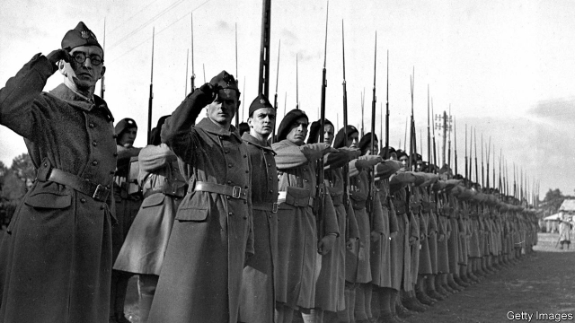

###### A killing field

# Poland’s forgotten heroism and suffering 

 

> print-edition iconPrint edition | Books and arts | Sep 7th 2019 

First to Fight: The Polish War 1939. By Roger Moorhouse.Bodley Head; 400 pages; £25. 

EVERYONE AGREES that the second world war was seismic. Ask when it started, however, and views differ, revealingly. For Chinese, it was the Japanese attack of July 1937. Soviet and Russian histories mark June 22nd 1941, when the perfidious Nazi invasion began. Britain and France regard the period between the declaration of hostilities in 1939 and May 1940 as the “phoney war”, or drôle de guerre. 

But as Roger Moorhouse, a British historian, notes, there was nothing phoney about the war in Poland. The opening five weeks of slaughter were a gory template for the 300 that followed: 200,000 people died, the overwhelming majority of them Poles, and mostly civilians. Poles would be “exposed to every horror that modern conflict could devise”, including indiscriminate aerial bombing, and massacres of civilians and POWs. 

Yet the campaign fought by Nazi Germany from September 1st 1939, the associated Soviet invasion on September 17th, and the brave, chaotic and doomed defence launched by Poland, are strangely absent from standard histories, in any language. The last serious British study of this aspect of the war was published in 1972. The biggest television history of the conflict, “The World at War”, a 26-part documentary broadcast in 1973, interviewed most of the surviving decision-makers—but did not include a single Polish contributor. 

Mr Moorhouse’s book remedies that gap, weaving together archival material, first-hand accounts, perceptive analysis and heartbreaking descriptions of Poland’s betrayal, defeat and dismemberment. Pre-war Poland was a big country, with the world’s fifth-largest armed forces. But it was an economic weakling. The combined Polish defence budget for the five years before the outbreak of war was just one-tenth of the Luftwaffe’s allocation for 1939 alone. The Poles had courage, flair and grit. But they lacked the decisive elements: armour and air-power. Military planning was plagued by secrecy and mistaken assumptions. Some of the top commanders were notable duds. 

Despite that, Hitler’s stuttering war machine was repeatedly halted, bloodied and on occasion even defeated by the Polish defenders. The myth of invincible Blitzkrieg was burnished, self-interestedly, by the Nazis themselves. For their part, the Western allies, Britain and France, portrayed Poland as a hopeless cause to justify their defence of their ally “using vowels and consonants alone”. One of many striking anecdotes on this score concerns Britain’s reluctance to bomb Germany—on the ground (seriously) that it risked damaging private property. 

Kremlin self-interest skewed the story, too. Stalin’s march into eastern Poland, under a secret deal with Hitler, was justified on the (fictitious) basis that the Polish state had already ceased to exist, and that only Soviet intervention could restore order. In fact, the savagery of the Soviet occupiers matched, and sometimes even exceeded, that of the Nazis. Both invaders, writes Mr Moorhouse, applied a “brutal, binary, totalitarian logic: a racist binary in the German case, a class binary in the Soviet.” In the eyes of the Nazis, a circumcised penis justified execution. For the Soviets, a soft, uncallused palm signalled an intellectual who ought to be eliminated. In all, 5.5m Polish citizens (including 3m Jews), or a fifth of the entire pre-war population, would perish. 

The surrender of Poland’s regular forces on October 6th did not mark the end of the fighting. A well-organised underground army, reporting to the government-in-exile in London, continued the struggle until the further and final betrayal of Poland’s interests by the Western allies at Yalta. It all deserves more than the simplistic but widespread caricature of a country which met the invading tanks with a cavalry charge. As Mr Moorhouse admirably explains, Poland’s cavalry was in fact remarkably effective. The blame for defeat, and for the subsequent distortion and neglect of Poland’s story, lies elsewhere. ■ 
<<<<<<< HEAD

-- 

 单词注释:

1.heroism['herәuizm]:n. 英勇, 勇敢事迹, 豪侠行为 

2.Sep[]:九月 

3.roger['rɔdʒә]:interj. 对!, 行!, 好! 

4.seismic['saizmik]:a. 地震的 

5.revealingly[ri'vi:liŋli]:adv. 启发人地；袒胸露肩地 

6.perfidious[pә'fidiәs]:a. 不忠贞的, 背信的, 有异心的 

7.Nazi['nɑ:tsi]:n. 纳粹党人 a. 纳粹党的 

8.declaration[.deklә'reiʃәn]:n. 宣告, 说明, 宣布 [计] 说明 

9.hostility[hɒs'tiliti]:n. 敌意, 敌对, 反对 

10.phoney['fәuni]:a. 假的, 假冒的, 伪造的 n. 骗子, 假货, 假冒者 

11.de[di:]:[化] 非对映体过量 [医] 铥(69号元素铥的别名,1916年Eder离得的假想元素) 

12.guerre[]:[网络] 战争；盖赫；战争风云 

13.moorhouse[]: [人名] [英格兰人姓氏] 穆尔豪斯住所名称，来源于古英语，含义是“沼泽+房屋”(marsh+house) 

14.historian[hi'stɒ:riәn]:n. 历史学家, 记事者 

15.Poland['pәulәnd]:n. 波兰 

16.slaughter['slɒ:tә]:n. 残杀, 屠杀, 杀戮 vt. 残杀, 屠杀, 亏本出售 

17.gory['gɒ:ri]:a. 血淋淋的, 满是血的, 血污的 

18.template['templit]:n. 样板, 模板, 垫木 [计] 模板 

19.overwhelm[.әuvә'hwelm]:vt. 淹没, 受打击, 制服, 压倒, 使不知所措 [法] 打翻, 倾覆, 覆盖 

20.indiscriminate[.indis'kriminit]:a. 无差别的, 任意的, 杂乱的 [医] 无差别的, 普遍的 

21.aerial['єәriәl]:a. 空中的, 航空的, 空气的, 空想的 n. 天线 

22.massacre['mæsәkә]:n. 大屠杀 vt. 大屠杀, 残杀 

23.pow[pau]:n. 战俘 

24.chaotic[kei'ɒtik]:a. 混乱的, 无秩序的 [法] 混乱的, 混沌的 

25.doom[du:m]:n. 厄运, 不幸, 法律, 宣告, 判决, 死亡 vt. 命中注定, 判决 

26.strangely['streindʒli]:adv. 奇妙地, 奇怪地, 不可思议地 

27.documentary[.dɒkju'mentәri]:n. 记录片 a. 文件的 

28.contributor[kәn'tribjutә]:n. 贡献者, 捐助者, 赠送者, 投稿者 [法] 捐助人, 捐赠人, 投搞人 

29.archival[ɑ: 'kaivәl]:a. 档案的, 档案中的 

30.perceptive[pә'septiv]:a. 知觉的, 有知觉力的, 感知的 [医] 知觉的 

31.heartbreaking['hɑ:tbreikiŋ]:a. 令人悲伤的, 极其累人的, 令人动情的 

32.betrayal[bi'treiәl]:n. 背叛, 辜负 [法] 背叛, 通敌, 背信 

33.dismemberment[]:[医] 肢体[部分]切断 

34.weakling['wi:kliŋ]:n. 虚弱的人, 弱小的动物, 低能儿 a. 虚弱的, 懦弱的 

35.outbreak['autbreik]:n. 爆发, 暴动 [医] 暴发 

36.allocation[.ælәu'keiʃәn]:n. 配置, 分配, 拨给 [经] 分配, 拨款, 分摊 

37.flair[fleә]:n. 鉴别力, 才能, 天资, 资质, 眼光 

38.grit[grit]:n. 砂砾, 粗砂石 vt. 覆以砂砾, 咬牙切齿地说 vi. 摩擦作声 

39.decisive[di'saisiv]:a. 决定性的, 坚定的, 果断的 

40.armour['ɑ:mә]:n. 甲胄, 装甲, 潜水服 

41.plague[pleig]:n. 瘟疫, 天罚, 麻烦, 灾祸 vt. 折磨, 使苦恼, 使得灾祸 

42.secrecy['si:krisi]:n. 秘密, 保密 [法] 秘密, 秘密状态, 保密 

43.notable['nәutәbl]:n. 著名人士, 值得注意之事物 a. 值得注意的, 显著的 

44.dud[dʌd]:n. 衣服, 哑弹, 无用物 a. 无用的 

45.stutter['stʌtә]:n. 口吃, 结结巴巴 v. 结结巴巴地说 

46.bloody['blʌdi]:a. 血腥的, 嗜杀的, 有血的 

47.defender[di'fendә]:n. 防卫者, 防护者, 辩护者 [法] 辩护人, 保护人 

48.myth[miθ]:n. 神话, 虚构的事, 虚构的人 

49.invincible[in'vinsәbl]:a. 不能征服的, 无敌的 

50.blitzkrieg['blitskri:ɡ]:n. （德）闪电战；突然袭击 

51.burnish['bә:niʃ]:vt. 擦亮, 打磨, 磨光 vi. 磨光发亮 n. 光辉, 光泽 

52.Nazi['nɑ:tsi]:n. 纳粹党人 a. 纳粹党的 

53.ally['ælai. ә'lai]:n. 同盟者, 同盟国, 助手 vt. 使联盟, 使联合, 使有关系 vi. 结盟 

54.portray[pɒ:'trei]:vt. 描绘, 描写, 描绘...的肖像 

55.vowel['vauәl]:n. 元音 a. 元音的 

56.consonant['kɒnsәnәnt]:n. 辅音 a. 一致的, 调和的 

57.reluctance[ri'lʌktәns]:n. 不情愿, 勉强 [电] 磁阻 

58.Kremlin['kremlin]:n. 克里姆林宫 [经] 克里姆林宫 

59.skew[skju:]:a. 斜的, 歪的 n. 歪斜, 偏态家庭关系 vi. 歪斜, 侧转 vt. 使歪斜, 曲解 [计] 扭斜; 歪斜; 偏斜 

60.hitler['hitlә]:n. 希特勒（纳粹德国元首） 

61.fictitious[fik'tiʃәs]:a. 假想的, 编造的, 虚伪的 [法] 假定的, 假设的, 虚构的 

62.intervention[.intә'venʃәn]:n. 插入, 介入, 调停 [经] 干预 

63.savagery['sævidʒәri]:n. 兽性, 原始状态, 野蛮人 

64.occupier['ɔkjjpaiә(r)]:n. 占用者, 居住者, 军事占领者 [法] 占用者, 居住者, 军事占领者 

65.invader[in'veidә]:n. 侵略者 [化] 侵入物 

66.brutal['bru:tәl]:a. 残忍的, 野蛮的, 不讲理的 

67.binary['bainәri]:a. 由两部分组成的, 二进位的, 二元的 [计] 二进制的; 二态的; 二进制, 二进制文件传输类型设置命令 

68.totalitarian[.tәutæli'tєәriәn]:a. 极权主义的 n. 极权主义者 

69.racist['reisist]:n. 种族主义者 [法] 种族主义的, 种族歧视 

70.circumcise['sә:kәmsaiz]:vt. 割除...的包皮, 对...进行环切术, 割除...的阴蒂, 净(心) 

71.penis['pi:nis]:n. 阳物, 阴茎 [医] 阴茎 

72.execution[.eksi'kju:ʃәn]:n. 实行, 完成, 执行, 死刑 [计] 执行 

73.uncallused[]:[网络] 没有用 

74.Jew[dʒu:]:n. 犹太人, 守财奴, 犹太教信徒 vt. 欺骗, 杀价 

75.perish['periʃ]:vi. 毁灭, 丧生, 凋谢, 颓丧, 死亡, 腐烂 vt. 毁坏, 使麻木, 使丧生, 耗尽 

76.yalta['jæltә]:n. 雅尔塔（前苏联港市） 

77.simplistic[sim'plistik]:a. 过分简单化的 

78.caricature['kærikәtʃә]:n. 讽刺画, 漫画, 漫画手法 vt. 画成漫画讽刺 

79.cavalry['kævәlri]:n. 骑兵 

80.admirably['ædmәrәbli]:adv. 极好地, 美好地 

81.remarkably[ri'mɑ:kәbli]:adv. 显著地, 引人注目地, 非常地 

82.distortion[dis'tɒ:ʃәn]:n. 扭曲, 变形, 曲解 [计] 畸变; 失真 
=======
>>>>>>> 50f1fbac684ef65c788c2c3b1cb359dd2a904378

