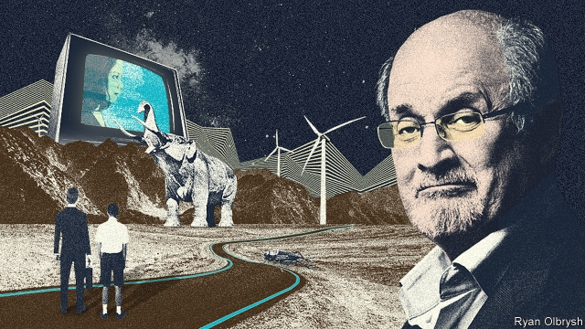

###### Tilting at windmills

# Salman Rushdie’s new novel is a metafictional romp 

 

> print-edition iconPrint edition | Books and arts | Sep 7th 2019 

Quichotte. By Salman Rushdie.Random House; 416 pages; $28. Jonathan Cape; £20. 

UPROOTING THE action of Miguel de Cervantes’s 17th-century picaresque “Don Quixote” to present-day America, Sir Salman Rushdie’s characteristically busy new book follows Sam, an Indian novelist who lives in New York. Sam draws on his own family strife to write the fantastical tale of a salesman, Ismail, out to woo Salma, an Indian-American talk-show host and “Oprah 2.0”. 

A talking gun and mastodons in New Jersey are among the oddities that Ismail, known as Quichotte, encounters during the road trip at the heart of this tricksy narrative. It is “the Age of Anything-Can-Happen!” Quichotte thinks, when a teenage son, Sancho (recalling Quixote’s comrade, Sancho Panza), magically appears to join him. “I’m a projection of your brain, just in the way that you started out as a projection of [your father’s],” a cricket tells Sancho, à la Pinocchio. 

A metafictional romp doubling as an oblique portrayal of the post-truth zeitgeist (and this week shortlisted for the Booker prize), “Quichotte” ought to be fun. Yet its teeming subplots fail to spark. Storylines about Salma’s secret opioid addiction, or a social-media storm that engulfs Sam’s estranged sister—a British politician accused of racism—seem to arise only from a desire to be topical. The dialogue and narration often sound like a vessel for the author’s views on matters from Brexit to the veil; the cast features a technology guru resembling Elon Musk and a Big Pharma boss caught in a #MeToo scandal. 

“Quichotte” expends a great deal of energy going nowhere in particular. A reference to a character’s “kindliness” carries a footnote explaining that he is “by no means kindly in all matters. As we shall see. As we shall presently see.” Salma’s past goes unmentioned, “out of respect for her privacy”, before a backtrack: “the privacy rights of fictional characters are questionable—to be frank, they are nonexistent—and so we hereby abandon our modesty.” It turns out the hesitation was redundant: Salma has spoken openly “on many nationally syndicated television talk shows”, so “we are not probing very deeply into her personal matters by revealing them.” 

As the book’s real and invented worlds collide, there are affecting moments. Sancho falls for a woman to whom—being a figment of imagination—he is invisible. Sam creates a scene in which Ismail and Sancho witness a deadly racist attack, only for the incident to recur in Sam’s own life, forcing him and his son to intervene. But ultimately Sir Salman’s games feel more bloated than bountiful. When he excuses yet another digression by saying that “so many of today’s stories are and must be of this plural, sprawling kind”, it sounds like special pleading. 
<<<<<<< HEAD

-- 

 单词注释:

1.tilt[tilt]:n. 倾斜, 倾向, 船篷, 车篷 vt. 使倾斜, 使倾侧, 用帆布篷遮盖 vi. 倾斜, 翘起, 冲, 评击 [计] 倾斜 

2.windmill['windmil]:n. 风车 

3.Salman[]:n. 萨尔曼（男子名） 

4.metafictional[]: 超小说(现代小说流派或其作品；有意强调作者的媒介作用和写作技巧；忽略传统写作中对真实性的关注) 

5.romp[rɒmp]:n. 喧闹游玩, 顽皮女孩 vi. 喧闹玩耍, 轻快奔跑 

6.Sep[]:九月 

7.jonathan['dʒɔnәθәn]:n. 乔纳森（男子名） 

8.cape[keip]:n. 岬, 海角, 披肩, 斗蓬 

9.uproot[ʌp'ru:t]:vt. 连根拔起, 根除 

10.Miguel[mi'gel]:n. 米格尔（男子名） 

11.de[di:]:[化] 非对映体过量 [医] 铥(69号元素铥的别名,1916年Eder离得的假想元素) 

12.picaresque[.pikә'resk]:a. 以无赖和流浪汉的冒险事迹徒为题材的 n. 关于流浪汉及其冒险事迹的小说或其它作品 

13.don[dɒn]:n. 西班牙贵族(或绅士), 先生, 阁下 vt. 穿上 

14.Quixote['kwiksәt]:n. 堂吉诃德 

15.characteristically[.kærәktә'ristikli]:adv. 表示特性地 

16.SAM[sæm]:[计] 安全性帐户管理器 

17.york[jɔ:k]:n. 约克郡；约克王朝 

18.strife[straif]:n. 争吵, 竞争, 冲突 

19.fantastical[fæn'tæstikәl]:a. 空想的；捕风捉影的 

20.Ismail[]:n. 伊斯梅尔（男子名） 

21.salma['sælmә]:意大利重量单位(=217.728公斤) 

22.oprah[]:n. 奥普拉（美国电视节目主持人） 

23.mastodon['mæstәdɒn]:n. 乳齿象 

24.jersey['dʒә:zi]:n. 运动衫 

25.oddity['ɒditi]:n. 奇异, 奇特, 怪人, 怪事, 怪僻 

26.tricksy['triksi]:a. 淘气的, 欺骗的, 狡猾的, 恶作剧的 

27.narrative['nærәtiv]:n. 叙述, 故事 a. 叙述的, 叙事的, 故事体的 

28.teenage['ti:nidʒ]:a. 十三岁到十九岁的 

29.sancho[]:桑乔（男子名） 

30.panza[]:潘扎（人名） 

31.magically[]:adv. 用魔法地；如魔法般地 

32.projection[prә'dʒekʃәn]:n. 发射, 计划, 突出部分, 设计, 推测 [计] 投影 

33.La[lɔ:, lɑ:]:[医] 镧(57号元素) 

34.pinocchio[]:n. 童话中的主角 

35.oblique[ә'bli:k]:a. 斜的, 倾斜的, 间接的, 不光明正大的, 躲躲闪闪的 [医] 斜的 

36.portrayal[pɔ:'treiәl]:n. 描绘, 描写, 画像, 肖像 [计] 描绘 

37.zeitgeist['tsait^aist]:n. 时代精神, 时代思潮 

38.shortlist['ʃɔ:tlist]:n. <英>供最后挑选(或考虑)用的候选人名单 

39.booker['bukә]:n. （旅馆车票, 戏票等的）登记人；寻选模特儿的人 

40.teem[ti:m]:vi. 充满, 充足, 倾注 vt. 倒出 

41.subplot['sʌbplɒt]:n. 陪衬情节, 次要情节 

42.storyline[]:n. 故事情节 

43.opioid[əʊ'pi:əʊɪd]:a. 类鸦片（引起）的 n. 类鸦片活性肽 

44.addiction[ә'dikʃәn]:n. 入迷, 瘾 [医] 瘾, 癖嗜 

45.engulf[in'gʌlf]:vt. 卷入, 吸进, 吞没, 使全神贯注 

46.estrange[i'streindʒ]:vt. 使疏远, 离间, 使离开 

47.topical['tɒpikl]:a. 论题的, 题目的, 时事问题的, 局部的 [医] 局部的 

48.narration[nә'reiʃәn]:n. 叙述, 故事, 叙述文 [法] 陈诉, 原告陈述者事实 

49.Brexit[]:[网络] 英国退出欧盟 

50.guru['guru:]:n. 古鲁(印度教导师) [医] 柯拉子 

51.elon[i'lɔn]:n. 埃伦（可溶性显影剂粉末） 

52.musk[mʌsk]:n. 麝香, 麝香的气味 [化] 麝香 

53.pharma[]:n. 制药公司 

54.metoo['metkəʊ]:adj. 〈美口〉行仿效计策的 v. 同意(对方的政见等) [网络] 咪兔；我也是；蜜桃 

55.kindliness['kaindlinis]:n. 亲切, 慈爱, 亲切行为 

56.footnote['futnәut]:n. 脚注 [计] 脚注 

57.kindly['kaindli]:a. 和蔼的, 温和的, 爽快的 adv. 温和地, 亲切地 

58.unmentioned[ʌn'menʃәnd]:a. 未提及的,未说起的 

59.privacy['praivәsi]:n. 隐私, 隐居, 秘密 [计] 个人保密权 

60.fictional['fikʃәnl]:a. 虚构的, 编造的, 小说式的 [法] 拟制的, 假定的, 虚构的 

61.hereby[hiә'bai]:adv. 因此, 据此 

62.modesty['mɒdisti]:n. 谦逊, 质朴, 羞怯 

63.hesitation[.hezi'teiʃәn]:n. 犹豫, 踌躇, 含糊, 口吃, 暂停 [计] 暂停 

64.openly['әjpәnli]:adv. 公开地, 坦率地, 直率地, 公然地 

65.nationally['næʃәnәli]:adv. 作为整个民族, 举国一致地, 全国性地 

66.syndicate['sindikit]:n. 企业联合, 辛迪加, 财团 v. 联合成辛迪加 

67.probe[prәub]:n. 探索, 调查, 探针, 探测器 v. 用探针探测, 调查, 探索 

68.collide[kә'laid]:vi. 碰撞, 互撞, 抵触 

69.figment['figmәnt]:n. 虚构的事 

70.racist['reisist]:n. 种族主义者 [法] 种族主义的, 种族歧视 

71.recur[ri'kә:]:vi. 复发, 回到, 重现, 再来, 诉诸, 采用, 循环 

72.intervene[.intә'vi:n]:vi. 插入, 调停, 干涉 [经] 进场干预 

73.bloat[blәut]:vt. 使膨胀, 腌制, 使自大 vi. 膨胀, 肿起 n. 肿胀病人 

74.bountiful['bauntiful]:a. 慷慨的, 宽大的 

75.digression[dai'greʃәn]:n. 离题, 扯到枝节上, 偏离 

76.sprawl[sprɒ:l]:vi. 伸开手足躺, 爬行, 蔓生, 蔓延 vt. 懒散地伸开, 使蔓生, 使不规则地伸展 n. 伸开手足躺卧姿势 

77.plead[pli:d]:vi. 辩护, 恳求 vt. 为...辩护, 提出...借口, 托称, 恳求 
=======
>>>>>>> 50f1fbac684ef65c788c2c3b1cb359dd2a904378

