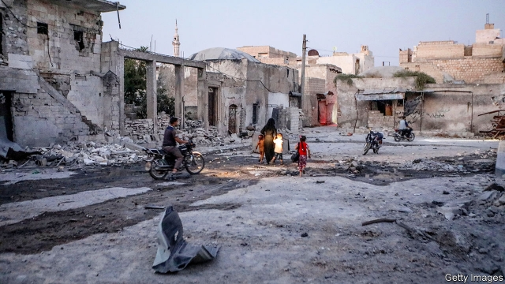
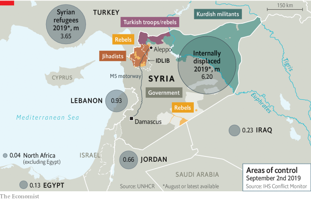
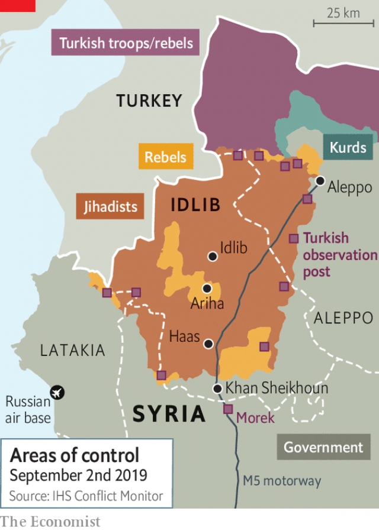

###### Wings over prayers

# Syria’s war is drawing to a close. But the pain will go on 

 

> print-edition iconPrint edition | Briefing | Sep 5th 2019 

EIGHT YEARS into a savage war, the images still numb. Near the village of Haas, a headless child lies amid the rubble of bombed homes. In the town of Ariha, an infant dangles several stories up from the wreckage of another building while her father looks on in horror. There is smoke and dust and blood, gnarled metal and smashed concrete, and the vacant stares of people who have endured almost a decade of violence. 

This is the start of a protracted battle for the province of Idlib, a swathe of scrubland in north-western Syria which contains dozens of towns and villages like Ariha and Haas as well as the city for which it is named. Lying between Aleppo and the coastal province of Latakia, it is the last big chunk of territory held by rebels. 

All summer long Syrian and Russian jets have bombed Idlib, destroying homes, hospitals, schools and bakeries. The United Nations sought to protect medical facilities by sharing their co-ordinates with Russia (“humanitarian deconfliction”, in UN jargon), but after dozens of air strikes on hospitals and clinics, doctors came to believe that the no-strike list was in fact being used as a target set. They have stopped sharing their locations.  

On the ground the Syrian army has retaken Khan Sheikhoun, the site of a vicious chemical-weapons attack by the regime in 2017. The biggest town in the south of the province, it occupies a strategic position along the M5, the motorway that connects Damascus to Aleppo. It will thus be a forward base as the army moves north in the coming months, fighting what remains of the opposition for one battered village after another while bombers roar overhead. 

There have been desperate attempts to halt the offensive. As The Economist went to press, a Russian-brokered ceasefire had temporarily halted the regime’s bombing. It will not last. Syria’s president, Bashar al-Assad, ever the revanchist, is determined to retake the last bit of rebel-held land. The Syrian dictator’s opponents can do little to resist him, while his allies are unwilling or unable to restrain him. 

It is tempting to think that, for all its ghastliness, this campaign at least marks the end of the war. But it marks at best the end of the fighting: not of the damage. It threatens to send a new exodus of refugees to Turkey, where hundreds of thousands of newly displaced Syrians have massed on the border, and perhaps beyond. And it will leave Mr Assad in control of a depopulated, ruined country, ruled through fear and beholden to allies busy squabbling for spoils. Syria will be suffering and unstable for years, possibly decades. 

Mr Assad had long telegraphed this offensive. Until this summer, though, he was in no position to launch it. His army, never much of a fighting force to begin with, was badly depleted after eight years of war. Iran wanted no part of the battle for a province it saw as peripheral and unimportant. Most of all, he was restrained by a deal Russia and Turkey made in 2018. The Sochi agreement, as it is known, put the onus on Turkey to enforce a buffer zone up to 25km deep between the rebels in Idlib and the regime. Extremist groups like Hayat Tahrir al-Sham (HTS), al-Qaeda’s former Syrian wing, were supposed to be completely excluded from this buffer zone. Less fanatical groups could stay—albeit without heavy weapons. Russia, in turn, would restrain Mr Assad. 

But the obdurate Syrian president never accepted the idea of a rebel-held scar on the edges of his realm. And Turkey overestimated its ability to control groups like HTS. Both the rebels and the regime violated the terms of the truce, lobbing ordnance and explosive drones at each other. Even if they had not, no one knew how to turn a temporary ceasefire into a lasting peace between sworn enemies. The deal was never more than a can-kicking exercise. 

This summer the can ran out of road, and both Russia and Iran threw their support behind Mr Assad’s offensive. The 12 observation posts dotted around Idlib from which Turkish soldiers were meant to enforce the ceasefire are now an irrelevance; the one in Morek, south of Khan Sheikhoun, is surrounded by the Syrian army. The soldiers inside are safe, for now, but other Turkish outposts have been hit by air strikes. A Turkish military convoy has been bombed as well. 

Hoping to salvage the Sochi agreement, Recep Tayyip Erdogan, the president of Turkey, flew to Russia on August 27th. He wanted Vladimir Putin to restrain his Syrian allies. The Russian president sent him away empty-handed (though he did treat Mr Erdogan to an ice-cream cone for the benefit of the press corps). Unless Turkey is willing to occupy Idlib, as it did parts of Aleppo in 2016, it cannot forestall a regime offensive. Russia talks of creating a new buffer zone along the border, as if the 3m desperate people in Idlib could be crammed into a few kilometres. 

More than 400,000 of those people have already fled their homes. Civilians find shelter where they can. Some camp in olive groves, one family beneath each tree. Civilians and surviving fighters will flee abroad as the regime advances. For many this will be a second exile. In staunch pro-opposition areas like the Damascus suburbs, the regime struck deals with rebels: it allowed them to live but banished them to Idlib. Now it will push them farther. 

More than half the pre-war population of 21m is now either internally displaced or abroad. To some extent this is a simple side-effect of war. But it is also a result of government policy, like the truces which displaced rebels to Idlib. Many have no homes to return to. The regime has used new laws to seize the property of some of the displaced, who tend to be Sunnis. In places like Marota City, on the western outskirts of Damascus, well-connected developers plan gleaming new homes that will one day house loyalists. 

 

Elsewhere there are few signs of reconstruction. The government cannot afford it. Gross domestic product is, at best, one-third of its pre-war level, according to UN estimates; Venezuela looks almost prosperous in comparison. The Syrian pound, which for years was consistently worth two American cents, is now worth less than a tenth of that. The industrial base that churned out textiles and consumer goods is devastated; today’s main exports are seeds, apples and nuts. Basic services are scarce. Last winter brought rolling blackouts and long queues at petrol stations. 

As the fighting draws to a close, Western powers have begun to debate whether to invest in rebuilding. America is unlikely to help. President Donald Trump is averse to spending money on foreigners; both parties in Congress find the thought of working with Mr Assad odious. The EU says it will give no help until it sees political reform, but not all its member states agree with this line. Some of their diplomats couch their arguments for moving quicker in humanitarian terms: “Do you give someone a bottle of water or rebuild the pipes?” Others insist, implausibly, that aid might persuade Mr Assad to share power and ease repression. “There’s a real opportunity to have some kind of leverage over how this pans out,” says one foreign-policy official in Brussels. This is wishful thinking. 

A few offer an honest if self-interested argument: rebuilding Syria might encourage refugees to go home. The devastation of their country currently makes return very uninviting, particularly for refugees in Europe, who live in relative comfort compared with their compatriots in squalid camps in Lebanon or Jordan. But material wants are not their chief concern. In February the UN surveyed residents of one camp, Rukban, a desperate patch of desert on the eastern edge of the border between Syria and Jordan. More than 80% wanted to go back to their home towns, wrecked as they might be. 

Yet they feared to do so. They told the UN they would be homeless, because the regime confiscated their property, or that they would be detained, or pressed into military service—all fair concerns. One group, the Syrian Network for Human Rights, estimates that at least 2,000 returnees have been arrested in the past two years. Another organisation found that 75% of returnees had been interrogated, detained or conscripted. 

Syria can look elsewhere for reconstruction money. China would have no qualms about dealing with a brutal dictatorship. It would want to turn a profit, though, and little about Syria’s corrupt and shattered economy looks profitable. Mr Assad’s closest allies, Russia and Iran, are struggling under economic sanctions. Neither can pick up a sizeable share of the estimated $250bn-$400bn tab to rebuild Syria. They want simply to claim the spoils: generous concessions to extract oil, mine phosphates and operate ports. 

 

For decades Syria was a centralised regime with a closed economy. Damascus controlled the provision of all basic services, from health care to bread. As Mr Assad lost control of territory, however, things got more complicated. Russia and Iran forged ties with pro-regime militias, which in turn built economic fiefs. Businessmen and crooks stepped in to deliver services—and turn healthy profits. All concerned profess loyalty to Mr Assad; but they have other interests and fealties. 

There are growing hints that Mr Assad is worried about this loss of control. In August, for example, his defence minister tried to rein in a loyalist militia known as the Tiger Forces. Commanded by Suhail al-Hassan, a favourite of the Russians, the Tigers have a reputation for brutal effectiveness, with allegations of massacres and torture that date back to the earliest days of the war. The unit has now been subsumed into the army, though it remains to be seen whether this is merely a cosmetic change. 

Then there is the unexpected bit of palace intrigue in Damascus this summer. Rami Makhlouf is a cousin of the president who made a fortune through his ownership of Syriatel, the largest mobile-phone operator, and then branched out to property, banking and other sectors. (He also helped finance the Tiger Forces.) With his family ties and wealth, he seemed untouchable—until August, when both regime supporters and critics said that Mr Makhlouf, and perhaps dozens of other tycoons, were being investigated. Offices were supposedly raided and assets frozen. 

Apologists were keen to paint this as an anti-corruption exercise—and graft is, to be sure, a huge problem in Syria. Mr Makhlouf’s son caused a stir this summer when he shared photos of his gilded lifestyle on Instagram. While his compatriots suffer and die, Mohammad Makhlouf showed himself with his luxury car collection in Dubai and flying around on a monogrammed private jet. 

But thinking Mr Assad would genuinely campaign against corruption is like imagining Mr Trump crusading for civility. The issue is not restitution but redistribution. Mr Putin wants some of the billions of dollars Russia has lent Syria repaid. Mr Assad is shaking down cronies to cover the bill. His regime likes to portray itself as standing against an “imperialist” West. But it is in thrall to Russia and Iran. 

Indeed, almost from the start, the Syrian war was fought on false premises. Mr Assad cast his opponents as terrorists. Western powers misled the rebels to believe they would have help. Turkey pretended not to see tens of thousands of foreign fighters streaming across its borders. The delusions continue today, whether in Russia and Turkey mooting deals to save Idlib or European states thinking they have “leverage” over Mr Assad. But no amount of foreign aid will extract democratic reforms from a blood-soaked dictator who burned his country and gassed his people to stay in power. Nor will it convince many of the refugees who fled Syria to return. 

It is far too late for a happier ending. The Syrians who took part in the uprising—as rebels, activists and the like—realise this. Scattered to the wind in exile, they have, in a sense, moved on: there are jobs to find, languages to learn, lives to build. But they also doubt this is truly the end. The abuse and corruption that caused the uprising in 2011 have only worsened. The regime is isolated, bankrupt and hollow. “Assad ran a police state,” says one former activist who found asylum in Europe. “Now he looks like a prisoner.”■ 

-- 

 单词注释:

1.Sep[]:九月 

2.HAA[]:abbr. 重型防空武器（Heavy Anti-Aircraft） 

3.headless['hedlis]:a. 无头的, 无领导者的, 无知的 

4.amid[ә'mid]:prep. 在其间, 在其中 [经] 在...中 

5.rubble['rʌbl]:n. 粗石, 碎砖, 粗石堆 

6.ariha[]:[网络] 埃里哈 

7.dangle['dæŋgl]:vi. 摇晃地悬挂着, 追求 vt. 使摇晃地悬挂 n. 悬垂 

8.gnarl[nɑ:l]:n. 木节, 木瘤 vi. 形成木节, 咆哮 vt. 扭曲 

9.protract[prәu'trækt]:vt. 延长, 拖延, 伸出, 绘制 [法] 延迟, 拖延, 延长 

10.Idlib[]:[地名] 伊德利卜 ( 叙 ) 

11.swathe[sweiθ]:vt. 绑, 裹, 包围 n. 带子, 绷带 

12.scrubland['skrʌblænd]:n. 灌木丛林地 

13.Syria['siriә]:n. 叙利亚 [经] 叙利亚 

14.Aleppo[ә'lepәu]:[医] 阿勒波(叙利亚的一个城市) 

15.coastal['kәustәl]:a. 海岸的, 沿海的, 沿岸的 [法] 海岸的, 沿海的 

16.Latakia[.lætә'ki:ә]:n. 拉塔基亚烟草(土耳其产) 

17.chunk[tʃʌŋk]:n. 大块, 矮胖的人(或物) [经] 定样 

18.Syrian['siriәn]:n. 叙利亚人, 叙利亚语 a. 叙利亚语的, 叙利亚人的 

19.humanitarian[hju:.mæni'tєәriәn]:n. 人道主义者, 博爱者, 基督凡人论者 a. 人道主义的, 博爱的, 凡人论的 

20.deconfliction[]:[网络] 脱色 

21.UN[ʌn]:pron. 家伙, 东西 [经] 联合国 

22.jargon['dʒɑ:gәn]:n. 专门术语, 行话, 梦话, 土语 [计] 行话 

23.retake[ri:'teik]:vt. 再取, 取回, 重摄 n. 重拍, 取回 

24.khan[kɑ:n]:n. 可汗, 商队宿店 

25.vicious['viʃәs]:a. 邪恶的, 堕落的, 品性不端的, 恶毒的, 恶性的, 有错误的 [医] 缺点的, 恶的 

26.regime[rei'ʒi:m]:n. 政权, 当权期间, 政体, 社会制度, 体制, 情态 [医] 制度, 生活制度 

27.motorway['mәutәwei]:n. 高速公路 

28.Damascus[dә'mæskәs]:n. 大马士革 

29.opposition[.ɒpә'ziʃәn]:n. 反对, 敌对, 相反, 在野党 [医] 对生, 对向, 反抗, 反对症 

30.batter['bætә]:v. 连续猛打（尤其指妇女），猛击 n. 面糊（食物），击球员，打击手 

31.bomber['bɒmә]:n. 轰炸机, 投弹手 

32.offensive[ә'fensiv]:a. 令人不快的, 侮辱的, 攻击性的 [法] 攻击的, 进攻的, 冒犯的 

33.economist[i:'kɒnәmist]:n. 经济学者, 经济家 [经] 经济学家 

34.ceasefire[ˈsi:sfaɪə(r)]:n. （通常指永久性的）停火, 停战; 停火命令 

35.temporarily['tempәrәrәli]:adv. 暂时, 一时, 临时 

36.bashar[]:巴沙尔 巴沙尔 

37.revanchist[rә'vɔŋʃist,ri'væntʃ-]:n. 复仇主义者 

38.ally['ælai. ә'lai]:n. 同盟者, 同盟国, 助手 vt. 使联盟, 使联合, 使有关系 vi. 结盟 

39.ghastliness['gɑ:stlinis]:n. 死人般的, 恐怖的, 糟透的 

40.exodus['eksәdәs]:n. 大批的离去 [法] 退出, 大批离去, 成一外出 

41.refugee[.refju'dʒi:]:n. 难民, 流亡者 [法] 避难者, 流亡者, 难民 

42.displace[dis'pleis]:vt. 移置, 替换, 转移 

43.Syrian['siriәn]:n. 叙利亚人, 叙利亚语 a. 叙利亚语的, 叙利亚人的 

44.Assad[]:阿萨德（人名） 

45.depopulate[di:'pɒpjuleit]:v. (使)人口减少 

46.ruine['ru:ɪn]: [医]路因碱 

47.beholden[bi'hәudәn]:a. 负有义务的, 受惠的 

48.squabble['skwɒbl]:vi. 争吵, 口角 n. 争吵, 口角 

49.deplete[di'pli:t]:vt. 耗尽, 使衰竭 [医] 排除, 减少 

50.Iran[i'rɑ:n]:n. 伊朗 

51.peripheral[pә'rifәrәl]:a. 周边的, 周围的, 圆周的, 无关紧要的, 肤浅的 [医] 外周的, 周围的, 末梢的 

52.Sochi['sәutʃi]:索契[苏联高加索中西部黑海东岸港市](著名疗养地) 

53.onus['әunәs]:n. 负担, 责任, 义务, 过失, 耻辱 [法] 责任, 义务, 负担 

54.buffer['bʌfә]:n. 缓冲器, 缓冲区 vt. 缓冲 [计] 缓冲区, 缓冲器 

55.extremist[iks'tri:mist]:[经] 偏激份子 

56.hayat[]:n. (Hayat)人名；(法)阿亚；(西)阿亚特；(德、土、阿拉伯、巴基)哈亚特 

57.tahrir[]:[网络] 广场；解放；开罗的解放 

58.HT[]:[计] 手控终端, 处理时间 

59.les[lei]:abbr. 发射脱离系统（Launch Escape System） 

60.fanatical[fә'nætikәl]:a. 狂热的, 盲信的 

61.obdurate['ɒbdjurit]:a. 顽固的, 执拗的, 冷酷的 [法] 执迷不悟的, 毫不悔改的, 无情的 

62.overestimate[.әuvәr'estimeit]:vt. 评价过高, 过高估价 n. 估计过高, 评价过高 

63.truce[tru:s]:n. 停战, 休战 vi. 停战, 休止 vt. 以休战结束 

64.lob[lɒb]:vt. 把球挑高 vi. 蹒跚地走 n. 笨人, 高球 

65.ordnance['ɒ:dnәns]:n. 大炮, 军械, 武器 

66.drone[drәun]:n. 雄蜂, 懒惰者, 嗡嗡的声音, 无人驾驶飞机(或船) vi. 嗡嗡作声, 混日子 vt. 低沉地说 

67.Turkish['tә:kiʃ]:n. 土耳其语 a. 土耳其的, 土耳其人的, 土耳其语的 

68.irrelevance[i'relivәns]:n. 不相关, 离题, 不相关的事物(言论) [计] 不相关性, 不恰当组合 

69.outpost['autpәust]:n. 前哨, 前哨部队, 前哨基地 

70.convoy['kɒnvɒi. kәn'vɒi]:n. 护送, 护卫 vt. 护航, 护送 

71.salvage['sælvidʒ]:n. 海上救助, 抢救, 打捞, 抢救出来的财物 vt. 海上救助, 抢救, 打捞, 营救 [计] 文件恢复程序 

72.recep[]:n. (Recep)人名；(土)雷杰普 

73.tayyip[]:[网络] 塔伊普 

74.erdogan[]:[网络] 埃尔多安；土耳其总理埃尔多安；艾尔多安 

75.Vladimir[vlɑ'dimɪr]:n. 弗拉基米尔（古罗斯弗拉基米尔-苏兹达里公国的古都） 

76.putin['putin]:n. 普京（人名） 

77.cone[kәun]:n. 圆锥体, 球果 vt. 使成锥形 

78.corp[]:[经] 公司 

79.cannot['kænɒt]:aux. 无法, 不能 

80.forestall[fɒ:'stɒ:l]:vt. 预先阻止, 先...一步行动, 占先一步, 垄断, 阻碍 [法] 先采取行动预防或阻止, 垄断 

81.cram[kræm]:vt. 塞满, 填满, 猛吃 vi. 贪吃 n. 极度拥挤, 死记硬背 

82.olive['ɒliv]:n. 橄榄, 橄榄树, 橄榄色, 橄榄枝 a. 黄绿色的, 黄褐色的, 橄榄色的 

83.grove[grәuv]:n. 小树林 

84.exile['eksail]:n. 放逐, 流放, 被放逐者 vt. 放逐, 流放, 使背井离乡 

85.staunch[stɒ:ntʃ]:vt. 止住, 止血 a. 坚固的, 坚强的, 忠实的, 忠诚的, 不透水的 

86.banish['bæniʃ]:vt. 驱逐, 消除 [法] 驱逐, 流放 

87.internally[in'tәnәli]:[计] 内部的 

88.Sunni['suni:]:n. 〈伊斯兰〉逊尼派教徒 

89.developer[di'velәpә]:n. 开发者 [计] 显影器 

90.gleam[gli:m]:n. 光束, 微光, 反光 vi. 闪烁, 隐约地闪现 vt. 使发微光, 使闪烁 

91.loyalist['lɒiәlist]:n. 忠诚的人, 反对独立者, 反佛朗哥派的人 

92.reconstruction[.ri:kәn'strʌkʃәn]:n. 改造, 再建 [医] 改建, 改造, 翻造 

93.Venezuela[,vene'zweilә]:n. 委内瑞拉 

94.consistently[]:adv. 坚固, 坚实, 一致, 始终如一, 连贯 [计] 相容地 

95.churn[tʃә:n]:n. 搅乳器 v. 搅拌, 搅动 

96.devastate['devәsteit]:vt. 毁坏 [法] 使荒废, 毁灭, 掠夺 

97.blackout['blækaut]:n. 灯火管制, 暂时的意识丧失, 灯火熄灭, 删除 [计] 电网掉电 

98.averse[ә'vә:s]:a. 不愿意的, 反对的 

99.odious['әudiәs]:a. 可憎的, 可厌的, 丑恶的 

100.EU[]:[化] 富集铀; 浓缩铀 [医] 铕(63号元素) 

101.diplomat['diplәmæt]:n. 外交官, 有外交手腕的人 [法] 外交家, 外交官, 有权谋的人 

102.couch[kautʃ]:n. 长沙发, 睡椅, 卧榻 vt. 横躺, 表达 vi. 躺下, 蹲伏 

103.implausibly[im'plɔ:zəbli]:adv. 难以置信地 

104.repression[ri'preʃәn]:n. 抑制, 压抑, 制止 [医] 压抑, 抑制 

105.Brussel[]:n. 布鲁塞尔（比利时首都） 

106.wishful['wiʃful]:a. 愿望的, 渴望的, 一厢情愿的 

107.devastation[.devә'steiʃәn]:n. 毁坏 

108.currently['kʌrәntli]:adv. 现在, 当前, 一般, 普通 [计] 当前 

109.uninviting['ʌnin'vaitiŋ]:a. 无吸引力的, 讨厌的, 不逗人兴趣的 

110.compatriot[kәm'pætriәt]:n. 同国人 a. 同国的, 同胞的 

111.squalid['skwɒlid]:a. 污秽的, 肮脏的, 悲惨的, 可怜的, 卑劣的 

112.Lebanon['lebәnәn]:n. 黎巴嫩 

113.jordan['dʒɒ:dәn]:n. 约旦, 约旦河, 尿壶 

114.homeless['hәumlis]:a. 无家的, 无养主的 

115.confiscate['kɒnfiskeit]:vt. 没收, 把...充公, 查抄 a. 被没收的 

116.detain[di'tein]:vt. 扣留, 扣押, 耽搁 [法] 拘留, 扣押, 留住 

117.returnee[ri.tә:'ni:]:n. 回国人员, 返回者 

118.organisation[,ɔ: ^әnaizeiʃən; - ni'z-]:n. 组织, 团体, 体制, 编制 

119.interrogate[in'terәgeit]:vt. 质问, 讯问, 审问 vi. 质问, 讯问 

120.conscript['kɒnskript]:a. 被征入伍的, 被征召的 n. 征兵 vt. 征召 

121.qualm[kwɒ:m]:n. 晕眩, 不安, 疑虑 [法] 疑虑, 不安, 内疚 

122.brutal['bru:tәl]:a. 残忍的, 野蛮的, 不讲理的 

123.dictatorship[dik'teitәʃip]:n. 独裁者之职位, 独裁, 独裁政权 [法] 专攻, 独裁权 

124.shatter['ʃætә]:n. 碎片, 粉碎, 落叶, 喷洒 vt. 打碎, 使散开, 粉碎, 破坏 vi. 粉碎, 损坏, 脱落 

125.sanction['sæŋkʃәn]:n. 核准, 制裁, 处罚, 约束力 vt. 制定制裁规则, 认可, 核准, 同意 

126.sizeable['saizәbl]:a. 相当大的, 可观的 

127.tab[tæb]:n. 制表(键), 搭襻, 标号, 调整片, (易拉罐)拉环, 帐单, 标签, 制表符 [计] 标签, 制表符, TAB键 

128.concession[kәn'seʃәn]:n. 特许, 让步, 认可 [经] 核准, 许可, 特殊(权) 

129.extract[ik'strækt]:n. 榨出物, 精汁, 摘录, 选段 vt. (费力地)取出, 采掘, 榨取, 摘录, 吸取 [计] 提取 

130.phosphate['fɔsfeit]:n. 磷酸盐, 磷酸酯 [化] 磷酸盐; 磷酸酯 

131.centralise['sentrәlɑiz]:vt. 形成中心, 把统治权集中于中央, 把...集中起来, 成为...的中心, 集中 

132.forge[fɒ:dʒ]:n. 熔炉, 铁工厂 vt. 打制, 锻造, 伪造 vi. 锻造, 伪造 

133.militia[mi'liʃә]:n. 义勇军, 民兵组织, 国民军 

134.fief[fi:f]:n. 封地, 采邑 

135.crook[kruk]:n. 钩, 弯曲部分, 坏蛋 vt. 使弯曲, 诈骗 vi. 弯曲 

136.profess[prә'fes]:vt. 声称, 以...为业, 伪称, 讲授 vi. 表白, 承认, 当教授 

137.fealty['fi:әlti]:n. 忠诚, 忠贞, 忠实 

138.suhail[]:[网络] 天记；老人；天记星 

139.effectiveness[i'fektivnis]:n. 效力 [经] 有效性, 能行性 

140.allegation[.æli'geiʃәn]:n. 断言, 主张, 申辩 [法] 声明, 事实陈述, 断言 

141.massacre['mæsәkә]:n. 大屠杀 vt. 大屠杀, 残杀 

142.subsume[sʌb'sju:m]:vt. 把...归入, 把...纳入, 把...列入某一类, 把...归类 

143.cosmetic[kɒz'metik]:n. 化妆品 a. 化妆用的 

144.unexpect[]:[网络] 意想不到；使意外 

145.intrigue[in'tri:g]:n. 阴谋, 复杂的事 vi. 密谋, 私通 vt. 激起...的兴趣, 用诡计取得 

146.rami['reimai]:ramus 的复数 

147.makhlouf[]:[网络] 洛夫 

148.sector['sektә]:n. 扇形, 部门, 部分, 函数尺, 象限仪, 段, 区段 vt. 把...分成扇形 [计] 扇面; 扇区; 段; 区段 

149.supporter[sә'pɒ:tә]:n. 支持者, 后盾, 迫随者, 护身织物 [法] 支持者, 赡养者, 抚养者 

150.tycoon[tai'ku:n]:n. 企业界大亨, 将军 [经] 企业界巨头, 企业家 

151.supposedly[sә'pәuzidli]:adv. 想象上, 看上去像, 被认为是, 恐怕, 按照推测 

152.asset['æset]:n. 资产, 有益的东西 

153.apologist[ә'pɒlәdʒist]:n. 辩护者, 教义辩护文作者 [法] 辩护者, 辩解者 

154.graft[grɑ:ft]:n. 嫁接, 贪污 v. 嫁接, 移植, 贪污 

155.gild[gild]:vt. 镀金, 虚饰, 装饰, 供给钱 

156.lifestyle['laifstail]:n. 生活方式 

157.Instagram[]:一款图片分享应用 

158.MOHAMMAD[]:n. 穆罕默德（穆斯林真主）；（阿拉伯）穆罕默德（男子名） 

159.dubai['dju:bai]:n. 迪拜（阿拉伯联合酋长国的酋长国之一）；迪拜港（阿拉伯联合酋长国港市） 

160.monogram['mɒnәgræm]:n. 字母组合 [法] 交织文字, 字母图案 

161.genuinely[]:adv. 真诚地；诚实地 

162.corruption[kә'rʌpʃәn]:n. 腐败, 堕落, 贪污 [计] 论误 

163.crusade[kru:'seid]:n. 改革运动, 十字军东侵 vi. 从事改革运动, 加入十字军 

164.civility[si'viliti]:n. 礼貌, 礼仪 

165.restitution[.resti'tju:ʃәn]:n. 归还, 偿还, 赔偿 [医] 整复, 恢复, 转回(胎头) 

166.redistribution['ri:distri'bju:ʃәn]:n. 重新分配, 再分发 [计] 重新分配 

167.repay[ri'pei]:v. 偿还, 报答, 报复 

168.crony['krәuni]:n. 密友, 亲密伙伴, 好朋友 

169.portray[pɒ:'trei]:vt. 描绘, 描写, 描绘...的肖像 

170.imperialist[im'piәriәlist]:n. 帝国主义者, 皇帝统治的拥护者, 皇帝派的人 a. 帝国主义的 

171.thrall[θrɒ:l]:n. 奴隶, 束缚, 奴役 

172.premise['premis]:n. 前提, 房屋连地基, 上述各项 vt. 预先提出, 引出, 作为...的前提 vi. 作出前提 

173.terrorist['terәrist]:n. 恐怖分子 [法] 恐怖份子, 恐怖主义 

174.tens[]:十位 

175.delusion[di'lu:ʒәn]:n. 迷惑, 欺瞒, 错觉 [医] 妄想 

176.moot[mu:t]:n. 大会, 模拟案件, 辩论会 a. 未决议的, 无实际意义的 vt. 讨论, 争论 

177.dictator['dikteitә]:n. 命令者, 独裁者 

178.gass[]:abbr. generic administration software (support) system 通用管理软件（支持）系统; geophysical airborne survey system 地球物理航空测量系统; Gimbal Assembly Storage System 万向架总成存储系统 

179.activist['æktivist]:n. 激进主义分子 

180.uprise[ʌp'raiz]:n. 升起, 起立, 上山坡, 出现 vi. 上升, 起义, 出现 

181.worsen['wә:sn]:vt. 使更坏, 使恶化 vi. 变得更坏, 恶化 

182.bankrupt['bæŋkrʌpt]:n. 破产者 a. 破产的 vt. 使破产 

183.asylum[ә'sailәm]:n. 庇护, 收容所 [医] 养育院 

