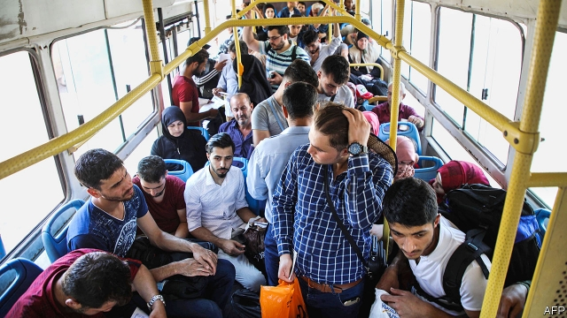

###### Another migrant crisis

# Turkey tightens restrictions on Syrian refugees 

 

> print-edition iconPrint edition | Briefing | Sep 7th 2019 

LIFE WAS HARD enough in Istanbul, says Mahmoud, speaking by phone from a police station on Symi, a tiny Greek island. Jobs were scarce, rents were high. When he heard he was to be sent back to the Anatolian province where he had first registered as a refugee years earlier, he decided instead to leave Turkey altogether. In August Mahmoud paid a smuggler $1,500 for a place on a rubber boat and headed for Symi. 

Few countries can claim to have done more than Turkey for the millions fleeing the war in neighbouring Syria. The country has taken in 3.6m Syrian refugees, offering them free public health care and education along with limited access to the labour market. Over 100,000 have been granted citizenship. 

Opposition parties, backed by public opinion, have long argued that some refugees should be sent packing. Stung by an economic downturn and a series of losses in municipal elections this spring, Turkey’s President Recep Tayyip Erdogan seems to have come to the same conclusion. Mr Erdogan has reportedly drawn up plans to resettle 700,000 refugees in a “safe zone” he plans to set up in Syria’s predominantly Kurdish north-east. The government has ordered hundreds of thousands of Syrians who, like Mahmoud, first registered outside Istanbul to leave the city by the end of October. 

Some will end up back in the war zones of Syria. Suleyman Soylu, the interior minister, says that around 350,000 Syrians have voluntarily returned home. Some say their return was not remotely voluntary. Ibrahim, who came to Turkey four years ago, says he was arrested in Istanbul earlier this summer because he had never applied for Turkish identity papers. Along with other refugees he was put in a bus, driven to the Syrian border and handed over to jihadists. He is now back in his home town, Al-Hasakah. His wife and baby daughter remain in Istanbul. 

Turkey’s government insists that it does not deport people without consent. But the ruling-party candidate in this spring’s mayoral election said he would have refugees who committed crimes in Istanbul “grabbed by the ears and sent back”. Officials acknowledge that refugees deemed a threat to public order or security are regularly forced to choose between returning to Syria and a year in a detention centre. The state news agency recently reported that over 6,000 people were deported from a single border province in the first half of the year. 

Some of those facing expulsion have gone into hiding. Others have followed in Mahmoud’s wake; he says he saw 200 more refugees arrive on Symi in the two days after he got there. Almost 10,000 Syrians got to Greece in August, mostly by sea, the highest monthly total since Mr Erdogan and the EU signed a deal to stem the flow of migrants and refugees into Europe in 2016. As one crisis unfolds on the border with Idlib, another may be brewing on the Aegean. 
<<<<<<< HEAD

-- 

 单词注释:

1.migrant['maigrәnt]:n. 候鸟, 移居者 [法] 移居者 

2.tighten['taitn]:vt. 勒紧, 使变紧 vi. 变紧, 绷紧 

3.Syrian['siriәn]:n. 叙利亚人, 叙利亚语 a. 叙利亚语的, 叙利亚人的 

4.refugee[.refju'dʒi:]:n. 难民, 流亡者 [法] 避难者, 流亡者, 难民 

5.Sep[]:九月 

6.Istanbul[.istæn'bu:l]:n. 伊斯坦布尔 

7.Mahmoud[]:穆罕默德（伊斯兰男名） 

8.symi[]:[网络] 锡米岛；宋琨；小岛 

9.Anatolian[,ænә'tәjljәn]:n. 安那托利亚语 

10.smuggler['smʌglә]:n. 走私者, 走私船 [经] 走私者, 走私船 

11.Syria['siriә]:n. 叙利亚 [经] 叙利亚 

12.citizenship['sitizәnʃip]:n. 国籍, 市民权, 市民的身份 [法] 公民权, 公民资格, 公民身分 

13.opposition[.ɒpә'ziʃәn]:n. 反对, 敌对, 相反, 在野党 [医] 对生, 对向, 反抗, 反对症 

14.downturn['dauntә:n]:n. (尤指经济方面的)衰退, 下降趋势 [电] 低迷时期 

15.sery[]:n. (Sery)人名；(俄)谢雷；(科特)塞里 

16.municipal[mju:'nisipl]:a. 市政的, 自治区的, 内政的 [经] 市政的, 市的 

17.recep[]:n. (Recep)人名；(土)雷杰普 

18.tayyip[]:[网络] 塔伊普 

19.erdogan[]:[网络] 埃尔多安；土耳其总理埃尔多安；艾尔多安 

20.reportedly[ri'pɒ:tidli]:adv. 根据传说, 根据传闻, 据报道 

21.resettle[ri:'setl]:v. (使)重新定居 

22.predominantly[]:adv. 主要地, 显著地, 大多数地, 突出地 

23.Kurdish['kә:diʃ]:a. 库尔德人的 n. 库尔德语 

24.Syrian['siriәn]:n. 叙利亚人, 叙利亚语 a. 叙利亚语的, 叙利亚人的 

25.Suleyman[]:n. (Suleyman)人名；(阿拉伯)苏莱曼 

26.voluntarily[.vɒlәn'terili]:adv. 自愿地, 以自由意志 

27.remotely[]:adv. 极小地, 极细微地 

28.Ibrahim[]:n. 易卜拉欣（与阿丹、努哈、穆萨、尔撒和穆罕默德并称为安拉的六大使者, 亦系犹太教和基督教推崇的圣人和希伯来人的祖先） 

29.Turkish['tә:kiʃ]:n. 土耳其语 a. 土耳其的, 土耳其人的, 土耳其语的 

30.jihadist[]:n. 伊斯兰圣战士 

31.deport[di'pɒ:t]:vt. 举止, 驱逐出境 [法] 放逐, 驱逐, 递解 

32.mayoral['mєәrәl]:a. 市长的 

33.grab[græb]:n. 抓握, 掠夺, 强占, 东方沿岸帆船 vi. 抓取, 抢去 vt. 攫取, 捕获, 霸占 

34.deem[di:m]:v. 认为, 相信 

35.detention[di'tenʃәn]:n. 阻止, 监禁, 拘留 [医] 隔离, 拘留, 滞留, 停滞 

36.expulsion[ik'spʌlʃәn]:n. 逐出, 开除, 驱逐, 排气 [医] 逼出 

37.EU[]:[化] 富集铀; 浓缩铀 [医] 铕(63号元素) 

38.Idlib[]:[地名] 伊德利卜 ( 叙 ) 

39.brew[bru:]:n. 酿造酒, 酝酿 v. 酿造, 酝酿 

40.Aegean[i:'dʒi:әn]:a. 爱琴海的 n. 爱琴海 
=======
>>>>>>> 50f1fbac684ef65c788c2c3b1cb359dd2a904378

