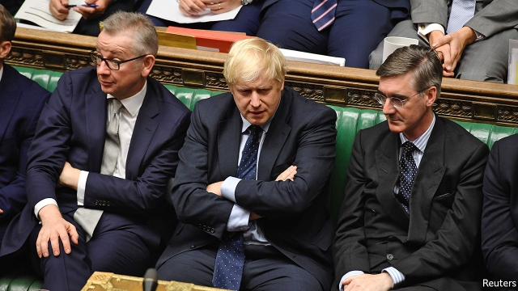

###### Johnson’s baby takes a bath

# A tumultuous week for Boris Johnson suggests an election is on the cards 

 

> print-edition iconPrint edition | Britain | Sep 5th 2019 

THE RETURN of MPs to Westminster this week could hardly have been more dramatic. Boris Johnson started on September 3rd with a working majority of one and a policy of leaving the European Union at the end of October no matter what. By day’s end he had lost a first Commons vote against his Brexit plans by the surprisingly large margin of 27. And after the ostentatious defection of Phillip Lee, who crossed the floor to join the Liberal Democrat benches even as Mr Johnson was speaking, a rebellion by 21 other Tories had reduced his notional majority from plus one to minus 43. 

MPs’ vote to take control of the agenda was but a first step. A day later they voted through all its Commons stages the so-called Benn-Burt bill seeking to stop Britain leaving the EU without a deal. The bill provides that, if the prime minister has not done a deal with the EU by October 19th, he must seek an extension of the October 31st deadline, initially to January 31st 2020. As we went to press it was moving to the Lords, where the government appeared to be willing to let it pass. Most observers now expect Benn-Burt to become law by early next week. 

Mr Johnson and his advisers have shown little feel for how to handle the Commons. The prime minister barely even tried to answer questions from Jeremy Corbyn, the Labour leader, and other MPs about his Brexit strategy. Instead he blustered that what he dubbed “Corbyn’s surrender bill” would undercut his negotiating position, making it impossible to win concessions in Brussels. This claim was disbelieved by opponents, including many Tories, who say no negotiations are happening, partly because Mr Johnson has made no clear proposals to replace the backstop to avert a hard border in Ireland.  

If the tactic of threatening no-deal to lever concessions out of the EU has failed, so have attempts to bully MPs. Mr Johnson’s high-handed suspension of Parliament from September 9th for almost five weeks was followed by threats to reimpose discipline lost under Theresa May by deselecting Tory MPs who defied the whip (which Mr Johnson himself did twice earlier this year). Yet the effect was just to strengthen the rebels. In April Mrs May lost an earlier version of the Benn-Burt bill by just one vote, compared with Mr Johnson’s 27. 

Mr Johnson responded to his defeat with characteristic belligerence. Although he conceded that he was bound to observe the law, he also said there were no circumstances in which he would ask for an extension of the October 31st deadline. The solution, he suggested, was to hold an election before then, to let the people decide who should be negotiating with the EU. He let it be known that October 15th was his preferred date. 

His problem is that, under the Fixed-term Parliaments Act (FTPA) of 2011, prime ministers can no longer call an election when they want. Doing so needs a two-thirds majority of MPs, so Mr Johnson requires Labour support. Although Mr Corbyn has long called for an election, he now insists the Benn-Burt bill to stop no-deal must become law first. Late on September 4th, a motion by Mr Johnson calling for an election duly failed because it passed with too small a majority. There are ways round the FTPA, however. A one-sentence motion calling for an election despite the act might get a simple majority. Or Mr Johnson could engineer defeat via a vote of no confidence. With his majority shot, an election seems to be coming. Can he win it? 

Here Mr Johnson is bullish. The latest polls give the Tories a ten-point lead over Labour. Yet elections go wrong, as Mrs May found when squandering an even bigger lead in 2017. Without a pact with Nigel Farage’s Brexit Party, which may be hard to agree, it could take Tory votes. The Tories may lose seats in Scotland, London and the south. To win a majority, they must make big gains in the midlands and north. These regions have many pro-Brexit voters, but they are by instinct anti-Tory. An election could be harder for Mr Johnson to win than some of his advisers think. ■ 

-- 

 单词注释:

1.tumultuous[tju:'mʌltʃuәs]:a. 吵闹的, 纷乱的, 骚乱的 [法] 喧嚣的, 骚乱的, 凶猛的 

2.boris['bɔris]:n. 鲍里斯（男子名） 

3.johnson['dʒɔnsn]:n. 约翰逊（姓氏） 

4.Sep[]:九月 

5.MP[]:国会议员, 下院议员 [计] 宏处理程序, 维护程序, 线性规划, 微程序, 多处理器 

6.Westminster['westminstә]:n. 威斯敏斯特 

7.Brexit[]:[网络] 英国退出欧盟 

8.ostentatious[.ɒsten'teiʃәs]:a. 装饰表面的, 铺张的, 夸示的, 华美的, 显眼的 

9.defection[di'fekʃәn]:n. 背叛, 缺乏, 毛病 [法] 缺点, 过失, 背叛 

10.phillip['filip]:n. 菲利普（人名）；爱马的人 

11.lee[li:]:n. 背风处, 避风处, 下风处, 保护, 庇护 a. 避风的, 背风的, 下风的, 保护的 

12.democrat['demәkræt]:n. 民主人士, 民主主义者, 民主党党员 [经] 民主党 

13.Tory['tɒ:ri]:n. 托利党党员, 保守党员, 亲英分子 a. 保守分子的 

14.notional['nәuʃәnәl]:a. 概念的, 想像的 [经] 名义上的 

15.EU[]:[化] 富集铀; 浓缩铀 [医] 铕(63号元素) 

16.initially[i'niʃәli]:adv. 最初, 开头 

17.adviser[әd'vaizә]:n. 顾问, 劝告者, 指导教师 [法] 顾问, 劝告者 

18.jeremy['dʒerimi]:n. 杰里米（男子名） 

19.Corbyn[]:科尔宾（人名） 

20.bluster['blʌstә]:vt. 风狂吹, 咆哮, 汹涌 vi. 咆哮着说出, 恐吓 n. 狂风声, 巨浪声, 夸口, 大话 

21.dub[dʌb]:vt. 配音, 轻点, 授予称号, 击 n. 一下击鼓声, 笨蛋 

22.undercut['ʌndәkʌt]:n. 底切, 牛腰部下侧嫩肉, 下口, 下旋削球 vt. 廉价出售, 底切, 雕出, 下旋削球 vi. 切除底部 

23.concession[kәn'seʃәn]:n. 特许, 让步, 认可 [经] 核准, 许可, 特殊(权) 

24.Brussel[]:n. 布鲁塞尔（比利时首都） 

25.disbelieve[.disbi'li:v]:v. 不信, 怀疑 

26.negotiation[ni.gәuʃi'eiʃәn]:n. 谈判, 磋商, 交涉 [经] 谈判, 协商 

27.backstop['bækstɒp]:n. 挡球网, 接球手 [电] 背向停止 

28.avert[ә'vә:t]:vt. 转开, 避免, 防止 

29.tactic['tæktik]:n. 一项战术, 一条策略 a. 战术的, 顺序的, 排列的 

30.bully['buli]:n. 欺凌弱小者, 土霸 vt. 威胁, 恐吓, 欺负 vi. 欺负 a. 特好的, 第一流的 adv. 十分 

31.reimpose[.ri:im'pәuz]:vt. 再强加, 重新征收 [经] 再征收, 重新征收 

32.theresa[ti'ri:zә]:n. 特丽萨（女子名） 

33.deselect[.di:si'lekt]:n. 取消...的受训资格 [计] 取消选定 

34.Tory['tɒ:ri]:n. 托利党党员, 保守党员, 亲英分子 a. 保守分子的 

35.defy[di'fai]:vt. 藐视, 挑衅, 使落空 n. 挑战 

36.Mr['mistә(r)]:先生 [计] 存储器回收程序, 多重请求 

37.belligerence[bi'lidʒәrәns]:n. 交战, 好战性, 斗争性 

38.concede[kәn'si:d]:vt. 承认, 退让 vi. 让步 

39.ftpa[]:[=perfluorotripropylamine(blood substitute)]全氟三丙胺 

40.duly['dju:li]:adv. 恰当地, 充分地, 适当地, 及时地 

41.bullish['buliʃ]:a. 似公牛的, 看涨的, 上扬的 [经] 行情看涨的 

42.squander['skwɒndә]:vt. 浪费, 使分散 vi. 浪费, 漂泊, 四散 

43.pact[pækt]:n. 契约, 协定, 条约 [化] 合同 

44.nigel['naidʒәl]:n. 奈杰尔（男子名） 

45.midland['midlәnd]:n. 中部地方, 内地 

46.voter['vәutә]:n. 选民, 投票人 [法] 选民, 选举人, 投票人 

