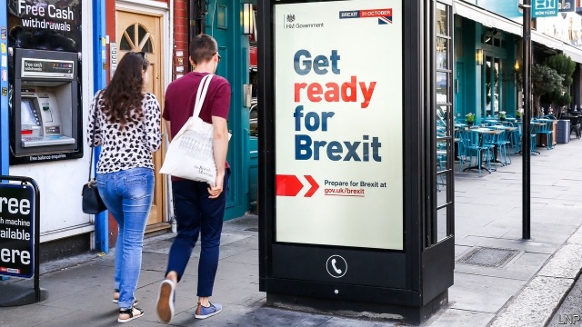

###### Cupboard love

# Brexit-related food stockpiling is on the rise 

 

> print-edition iconPrint edition | Britain | Sep 7th 2019 

WHEN THE food riots start, says Linda, a university administrator from Brighton, “I plan to watch them on TV enjoying a nice puttanesca whipped up from the Brexit cupboard.” Often included on no-deal-Brexit recipe lists, the fiery pasta dish from Naples requires nothing fresh. From her stash of tins and frozen veg, Linda is self-sufficient for up to three weeks. Stockpilers are seen as a bit crackers, but the chance of a disorderly exit from the European Union is prompting more people to take precautions. 

One survey in August by HIM, a shopper-research firm, found that 61% of consumers expect Brexit-related food shortages. Nearly a third of people plan to stockpile and 14% are already doing so. Anecdotal evidence of hoarding is plentiful. A manager of a big Waitrose store in London says he has seen a rise in purchases of tins and frozen veg. Does he, a supermarket insider, plan to stockpile? “Absolutely,” comes the answer. Shoppers who have done no hoarding plan to go into panic-buying mode later if no-deal stays on the cards. 

The government’s “Get ready for Brexit” campaign, launched this week by Michael Gove, the minister in charge of preparing for no-deal, will spur them on (though the associated website makes no mention of provisioning, focusing on health certificates for EU-bound pets, not what to do if the dog food runs out). 

But the food industry has driven home the relevant facts. Britain imports between two-fifths and half of its food, mostly from the EU. That supply could be halved because 50% of lorries coming from Calais into Dover are expected to get blocked by border checks and traffic chaos, says Tim Rycroft of the Food & Drink Federation, which represents giant food manufacturers. There are plans to fly in vital medicines, but not food. 

Stockpiling groups are aware of the risk of exacerbating shortages. A prominent, 10,960-strong Facebook group, 48% Preppers—a reference to the share of people who voted Remain in 2016—has stopped talking publicly about its activities. Jo Elgarf, an administrator, explains that it is now too late to stock up bit by bit. “Anything now will be panic.” 

Nor are stockpilers all nervy Remoaners. Zoe, an entrepreneur from Lewes, wants a no-deal Brexit and believes in self-reliance. She is using her five acres to raise animals for meat to supply family, friends and neighbours through any disruption. She has pigs booked into an abattoir in the first week of October—it takes time to process the meat. “I was gutted when we didn’t leave in March,” she says. “I was so prepared.”■ 
<<<<<<< HEAD

-- 

 单词注释:

1.stockpile['stɒkpail]:n. 储蓄, 积蓄, 库存 vt. 储蓄, 贮存 

2.Sep[]:九月 

3.riot['raiәt]:n. 暴动, 喧闹, 放纵 vi. 发动, 暴动, 纵情, 放荡 vt. 浪费, 挥霍 

4.linda[]:n. 琳达（女子名） 

5.administrator[әd'ministreitә]:n. 管理人, 行政官 [经] 遗产管理人员 

6.brighton['braitn]:n. 布赖顿（英国南部城市） 

7.puttanesca[]:[网络] 金枪鱼橄榄汁面；烟花女；烟花女义大利面 

8.Brexit[]:[网络] 英国退出欧盟 

9.fiery['faiәri]:a. 炽热的, 热烈的, 暴躁的 

10.pasta['pæstә]:n. 意大利面食 [医] 糊剂, 泥膏剂 

11.Naples['neiplz]:n. 那不勒斯 

12.stash[stæʃ]:vt. 藏起来 n. 隐藏处, 隐藏物 

13.veg[vedʒ]:n. 蔬菜 

14.stockpilers[]:n. 库存；积蓄 (stockpile的变形) 

15.cracker['krækә]:n. 饼干, 爆竹 [计] 破袭者 

16.disorderly[dis'ɒ:dәli]:a. 无秩序的, 乱的, 骚乱的 [法] 妨害治安的, 骚乱的, 无法无天的 

17.anecdotal[,ænek'dәutl]:a. 轶事的, 爱谈奇闻轶事的, 多轶事的 

18.hoard[hɒ:d]:n. 贮藏物, 密藏的金钱 v. 囤积, 贮藏 

19.Waitrose[]:维特罗斯（英国) 

20.insider['in'saidә]:n. 内部的人, 权威人士, 知道内情的人 [经] 熟悉内情者 

21.shopper['ʃɒpә]:n. 购物者 [经] 顾客, 购物的人 

22.michael['maikl]:n. 迈克尔（男子名） 

23.gove[]: [人名] 戈夫; [地名] [澳大利亚、美国] 戈夫 

24.provisioning[]:[经] 物质供应 

25.EU[]:[化] 富集铀; 浓缩铀 [医] 铕(63号元素) 

26.halve[hɑ:v]:vt. 二等分, 对半分享, 把...减半 

27.calais['kælei]:n. 加来（法国城市）；卡莱斯牌汽车 

28.Dover['dәuvә]:n. 多佛(英国港口) 

29.chao[]:n. 钞（货币） 

30.tim[tim]:n. 蒂姆（男子名） 

31.rycroft[]: [人名] [英格兰人姓氏] 里克罗夫特地貌名称，来源于古英语，含义是“裸麦+小自耕农地”(rye+smallholding); [地名] [加拿大] 赖克罗夫特 

32.federation[fedә'reiʃәn]:n. 联邦, 联合, 联盟 [法] 联邦, 联盟, 联邦政府 

33.exacerbate[ek'sæsәbeit]:vt. 使恶化, 使增剧, 激怒, 使加剧 

34.facebook[]:n. 脸谱网 

35.jo[dʒәu]:abbr. 乔（女子名, 等于Joseph, Josephine） 

36.stockpilers[]:n. 库存；积蓄 (stockpile的变形) 

37.nervy['nә:vi]:a. 有勇气的, 易激动的 

38.zoe['zәui]:n. 生命 

39.entrepreneur[.ɒntrәprә'nә:]:n. 企业家, 主办人 [经] 承包商, 企业家 

40.Lewes['lu(:)is]:刘易斯[英国英格兰东南部城市](东苏塞克斯郡首府) 

41.disruption[dis'rʌpʃәn]:n. 分裂, 崩溃, 瓦解 

42.abattoir['æbәtwɑ:]:n. 屠场, 角斗场 [医] 屠宰场 

43.gut[gʌt]:n. 剧情, 内容, 内脏, 肚子, 海峡, 勇气 vt. 取出内脏, 毁坏...的内部 
=======
>>>>>>> 50f1fbac684ef65c788c2c3b1cb359dd2a904378

