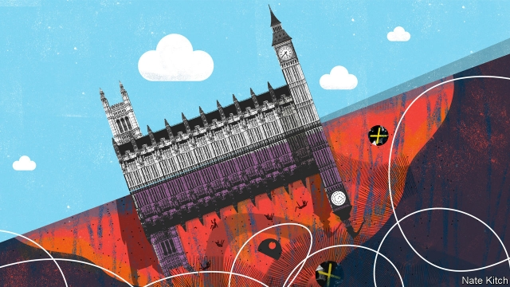

###### Bagehot

# British politics goes into the upside down 

 

> print-edition iconPrint edition | Britain | Sep 7th 2019 

SO MANY EXTRAORDINARY events are happening in British politics that it is impossible to tell the normal from the abnormal. This is not only disorientating—all the talk of “coups” and “traitors” can unsettle even the most philosophical of souls. It is also dangerous. A quick glance at history shows that terrible things can happen when you normalise the abnormal. Jacob Rees-Mogg, the leader of the House of Commons, maintains that the British constitution can “bend to a passing storm”. But if the storm is a hurricane that rages on for years, it can also break. 

Boris Johnson was elected over his more moderate rival, Jeremy Hunt, with 93,000 votes out of a turnout of just 150,000—all that remains of a Conservative Party that was once 3m strong. More than half are over 55 years old, 70% are men, 97% are white and, as a group, they have far more authoritarian and Eurosceptic views than the population at large. Yet this mockery of a mandate has not prevented Mr Johnson from pursuing an unbendingly extreme policy. He has filled his cabinet with people willing to sign up to a no-deal Brexit, a minority position in the parliamentary party. He has suspended Parliament in order to reduce the amount of time available to debate the rights and wrongs of such a Brexit, a decision that many regard as a constitutional outrage. His justification for this is that the “will of the people”, as embodied in the referendum result of 2016, must be honoured. But there is no evidence that the 52% who voted for Brexit support the no-deal variety. One recent poll shows that Britons don’t trust Mr Johnson to make the right decision on Brexit by a margin of 55% to 34%. 

Mr Johnson made his second-ever appearance as prime minister in the House of Commons on September 3rd, only to suffer one of the worst humiliations of any leader. Twenty-one Tories voted with the opposition to outlaw leaving the EU without a deal. Mr Johnson’s response was to purge the rebels from his party. They included two former chancellors (one of whom was in office just seven weeks ago), five other former cabinet ministers and Winston Churchill’s grandson, Sir Nicholas Soames. At the same time a former Tory prime minister, Sir John Major, is party to a lawsuit accusing Mr Johnson of acting unconstitutionally. 

With the reality-based wing of his party decimated, Mr Johnson is a prisoner of a narrow clique that combines ideological fervour with personal eccentricity. Steve Baker talks about bulldozing the House of Commons into the Thames. John Redwood is so lacking in the milk of human kindness that he makes Mr Gradgrind look like a lactating mother. This week Mr Rees-Mogg chose to listen to an era-defining debate while lying prone across the Commons benches, as if on a chaise longue, providing the Labour Party with an ideal election poster. 

Even more remarkable than the mainstreaming of extremists is the normalisation of a no-deal Brexit. During the referendum campaign, no Leaver mentioned the possibility of a no-deal Brexit, just as few brought up the issue of the Irish border. Brexiteers assured the country that negotiating a trade deal with the European Union would be the easiest thing in the world. Now, Mr Johnson believes that you have to support the possibility of no-deal to remain a Tory, and Nigel Farage, the leader of the Brexit Party, regards no-deal as the only acceptable option. 

In normal times, voters can shift to the opposition if one side goes berserk. But the Labour Party has a good claim to have arrived ahead of the Conservative Party in crazy town, by electing Jeremy Corbyn leader. Mr Corbyn has devoted his life to supporting obscure and often repellent causes. His guests in the House of Commons have included IRA sympathisers and Holocaust deniers. His inner circle of advisers includes a former communist, Andrew Murray, who has lauded North Korea and praised Stalin. For all the talk of his being an ineffectual party leader, Mr Corbyn has done a very good job of taking over the party’s executive committee and putting in place automatic “trigger ballots” which will allow activists to eject MPs who don’t toe the Corbyn line. 

British politics is now trapped in a weird impasse as these two extremists face each other across the aisle, bellowing and finger-jabbing. Mr Johnson, who claims that he doesn’t want an election, is now demanding one and Mr Corbyn, who claims that he does want an election, is refusing to give him one. But it is hard to summon up a laugh as events whirl out of control. Extremism is as addictive as roulette. The Conservative Party may fight the next election as a full-blown no-deal-Brexit party, forging a loose alliance with Mr Farage, and adding fury at political correctness and social breakdown to a powerful populist mix. 

Extremism in one party also legitimises extremism in another. If Mr Corbyn wins the next election—which is more likely than most Tories realise—he will be emboldened by the Conservatives’ recent behaviour. A Tory opposition will find it hard to accuse Mr Corbyn of sacrificing the economy on the altar of ideology when it has done exactly that. By arguing that the “will of the people” matters more than the rights of minorities or the conventions of the constitution, the Tories have supplied Mr Corbyn with the weapons he needs to push through a radical hard-left programme. All he needs is a majority, which they are doing their best to provide. 

There are some inspiring examples of countries righting themselves after periods of abnormality. Matteo Salvini, Italy’s fiery populist, has been weakened by his increasingly outrageous behaviour. But with both parties controlled by fanatical factions and Britain’s uncodified constitution depending on informal rules that extremists do not respect, it is difficult to see a way out of the mess. The great test for Britain is not just whether it can leave Europe with its economy intact. It is whether it can leave without doing lasting damage to institutions that were always more delicate than either Leavers or Remainers imagined. ■ 
<<<<<<< HEAD

-- 

 单词注释:

1.Bagehot[ˈbædʒət]:白芝浩；巴杰特（人名） 

2.politic['pɒlitik]:a. 精明的, 明智的, 策略的 

3.upside['ʌpsaid]:n. 上侧, 上段, 上部 [机] 上侧, 上部 

4.Sep[]:九月 

5.coup['ku:]:n. 砰然的一击, 妙计, 出乎意料的行动, 政变 [医] 发作, 中, 击 

6.unsettle[.ʌn'setl]:vt. 使移动, 搅乱, 使动摇, 使不安宁 vi. 动荡不定, 离开固定位置 

7.philosophical[.filә'sɒfikl]:a. 哲学的, 冷静的, 达观的, 哲学上的, 哲学家似的 

8.normalise['nɔ:mәlaiz]:vt.vi. 使正常化, 恢复友好状态, 使标准化 

9.jacob['dʒeikәb]:n. [圣经]雅各（以色列人的祖先）；雅各布（男子名） 

10.boris['bɔris]:n. 鲍里斯（男子名） 

11.johnson['dʒɔnsn]:n. 约翰逊（姓氏） 

12.jeremy['dʒerimi]:n. 杰里米（男子名） 

13.turnout['tә:naut]:n. 聚集的人群, 出席者, 产量 [化] 输出; 产额 

14.authoritarian[ɒ:.θɒri'tєәriәn]:a. 独裁的, 独裁主义的 

15.eurosceptic[ˌjʊərəʊ'skeptɪk]:n. 欧洲统一怀疑论者；反对英国亲近欧盟的人 

16.mockery['mɒkәri]:n. 嘲弄, 笑柄, 歪曲 

17.mandate['mændeit]:n. 命令, 指令, 要求 vt. 委任统治 

18.unbendingly[]:不妥协地 坚决地 不屈地 倔强地 

19.Brexit[]:[网络] 英国退出欧盟 

20.parliamentary[.pɑ:lә'mentәri]:a. 国会的, 议会的, 议会制度的 

21.constitutional[.kɒnsti'tju:ʃәnl]:a. 宪法的, 立宪的, 体质的 [医] 全身的; 体质的 

22.outrage['autreidʒ]:n. 暴行, 侮辱, 愤怒 vt. 凌辱, 虐待, 触犯 

23.justification[.dʒʌstifi'keiʃәn]:n. 辩护, 证明正当, 释罪 [计] 调整 

24.embody[im'bɒdi]:vt. 具体表达, 使具体化 [经] 合并, 具体化, 具体表现 

25.referendum[.refә'rendәm]:n. （就重大政治或社会问题进行的）全民公决，全民投票 

26.Briton['britәn]:n. 大不列颠人, 英国人 

27.humiliation[hju:.mili'eiʃәn]:n. 耻辱, 丢脸, 谦卑 

28.Tory['tɒ:ri]:n. 托利党党员, 保守党员, 亲英分子 a. 保守分子的 

29.opposition[.ɒpә'ziʃәn]:n. 反对, 敌对, 相反, 在野党 [医] 对生, 对向, 反抗, 反对症 

30.outlaw['autlɒ:]:n. 被剥夺法律保护的人, 罪犯 vt. 使...失去法律保护, 将...逐出社会, 宣告非法, 取缔 

31.EU[]:[化] 富集铀; 浓缩铀 [医] 铕(63号元素) 

32.purge[pә:dʒ]:n. 净化, 清除, 泻药 v. (使)净化, 清除, (使)通便 [计] 服务器文件删除实用程序 

33.chancellor['tʃɑ:nsәlә]:n. 大臣, 总理, 首相, 大使馆/领事馆的一等秘书, 司法官, 大学校长 

34.winston['winstәn]:n. 温斯顿（姓氏, 男子名） 

35.nicholas['nikәlәs]:n. 尼古拉斯（男子名） 

36.Soames[]:索姆斯（人名） 

37.Tory['tɒ:ri]:n. 托利党党员, 保守党员, 亲英分子 a. 保守分子的 

38.john[dʒɔn]:n. 盥洗室, 厕所, 嫖客 

39.lawsuit['lɒ:sju:t]:n. 诉讼 [法] 诉讼, 诉讼案件 

40.unconstitutionally[]:adv. 无意识的 

41.decimate['desimeit]:vt. 每十人杀一人, 大批杀害 

42.clique[kli:k]:n. 派系, 集团 vi. 结党 [计] 集团型 

43.ideological[.aidiә'lɒdʒikәl]:a. 意识形态的, 空想的 [法] 思想的, 思想上的, 意识形态的 

44.fervour['fә:vә]:n. 炽热, 热诚, 热情, 热烈 

45.eccentricity[.eksen'trisiti]:n. 古怪, 古怪行为, 怪癖 [化] 偏心度; 偏心距; 偏心率 

46.steve[]:n. 史蒂夫（男子名） 

47.baker['beikә]:n. 面包师 [医] 烤箱(骨科用) 

48.bulldoze['buldәuz]:vt. 强迫, 用推土机推平/削平, 用推土机清除, 压倒, 威胁 

49.Thame[]:泰姆（人名） 泰姆市（地名） 

50.redwood['redwud]:n. (美国)红杉, 红树 

51.Gradgrind['^ræd^raind]:n. 葛擂硬(狄更斯小说《艰难时世》中的人物) 

52.lactate['lækteit]:vi. 分泌乳汁, 授乳 n. 乳酸盐 

53.prone[prәun]:a. 俯伏的, 面向下的, 有...倾向的 [医] 旋前的, 伏的, 俯的 

54.chaise[ʃeiz]:n. 轻便马车 

55.longue[]:舌头；长肌 

56.mainstream['meinstri:m]:n. 主流 

57.extremist[iks'tri:mist]:[经] 偏激份子 

58.normalisation[,nɔ:məlai'zeiʃən]:n. normalise的变形 

59.leaver['li:vә]:n. 离开者（常指学校毕业生） 

60.Brexiteers[]:支持英国退欧的人（Brexiteer的复数） 

61.nigel['naidʒәl]:n. 奈杰尔（男子名） 

62.farage[]:[网络] 人B淋巴瘤细胞系；法拉格 

63.voter['vәutә]:n. 选民, 投票人 [法] 选民, 选举人, 投票人 

64.berserk[bә'sә:k]:a. 狂暴的, 疯的 adv. 狂暴地, 疯地 

65.Corbyn[]:科尔宾（人名） 

66.repellent[ri'pelәnt]:a. 抵抗的, 排斥的, 令人讨厌的, 防水的 n. 防水布, 防护剂 

67.ira['aiәrә]:abbr. 爱尔兰共和军（Irish Republican Army）；个人退休帐户（Individual Retirement Account） 

68.sympathiser['sɪmpəθaɪzə]:n. 同情者; 同意者; 支持者 

69.holocaust['hɔlәkɔ:st]:n. 大屠杀, 大火灾, 毁灭, 大规模烧杀 

70.denier[di'naiә]:n. 否认者, 法国往昔银币, 一小笔钱 [化] 旦尼尔; 旦; (曾用) 

71.adviser[әd'vaizә]:n. 顾问, 劝告者, 指导教师 [法] 顾问, 劝告者 

72.andrew['ændru:]:n. 安德鲁（男子名） 

73.murray['mʌri, 'm\\:-]:n. 默里（男子名）；墨累河（澳大利亚东南部一条河流） 

74.laud[lɒ:d]:n. 赞美, 称赞 vt. 赞美, 称赞 

75.Korea[kә'riә]:n. 朝鲜, 韩国 

76.stalin['stɑ:lin]:n. 斯大林（前苏联领导人） 

77.ineffectual[.ini'fektʃuәl]:a. 无效的, 无益的 

78.trigger['trigә]:n. 触发器, 扳机 vt. 触发, 发射, 引起 vi. 松开扳柄 [计] 切换开关 

79.ballot['bælәt]:n. 投票, 投票用纸, 抽签 vi. 投票, 抽签 vt. 投票选出, 拉选票 

80.activist['æktivist]:n. 激进主义分子 

81.eject[i'dʒekt]:vt. 逐放, 放逐, 喷射 [化] 排出 

82.MP[]:国会议员, 下院议员 [计] 宏处理程序, 维护程序, 线性规划, 微程序, 多处理器 

83.weird[wiәd]:a. 怪异的, 超自然的, 不可思议的 n. 命运, 预言, 符咒 

84.impasse['impɑ:s]:n. 难局, 僵局, 死路, 死胡同 

85.aisle[ail]:n. 走廊, 侧廊, 过道 [机] 走道 

86.bellow['belәu]:v. 怒吼 

87.summon['sʌmәn]:vt. 召唤, 召集, 号召, 振奋, 唤起, 鼓起 [经] 传唤, 传讯 

88.extremism[ik'stri:mizm]:n. 极端倾向, 极端论, 过激主义 

89.addictive[ә'diktiv]:a. 上瘾的 

90.roulette[ru:'let]:n. 轮盘赌, 点线机, 骑缝线 

91.forge[fɒ:dʒ]:n. 熔炉, 铁工厂 vt. 打制, 锻造, 伪造 vi. 锻造, 伪造 

92.alliance[ә'laiәns]:n. 联盟, 联合 [法] 同盟, 联盟, 联姻 

93.fury['fjuri]:n. 愤怒, 狂暴, 狂怒的人 [医] 狂乱, 狂暴, 狂怒 

94.correctness[]:[计] 正确性 [经] 正确性 

95.breakdown['breikdaun]:n. 崩溃, 故障 [化] 事故; 击穿 

96.Populist['pɔpjulist]:n. 民粹派的成员 

97.legitimise[li'dʒitimaiz]:vt.<主英> = legitimize 

98.extremism[ik'stri:mizm]:n. 极端倾向, 极端论, 过激主义 

99.embolden[im'bәuldn]:vt. 使大胆, 使有胆量 

100.altar['ɒ:ltә]:n. 圣坛, 祭坛 

101.ideology[.aidi'ɒlәdʒi]:n. 思想体系, 意识形态, 观念学, 空论 [医] 观念学, 观念形态 

102.abnormality[.æbnɒ:'mæliti]:n. 反常, 畸形, 变态 [化] 反常; 非正态性 

103.matteo[]:马泰奥（人名） 

104.salvini[]:[网络] 索氏丽体鱼；萨尔维尼 

105.fiery['faiәri]:a. 炽热的, 热烈的, 暴躁的 

106.outrageous[aut'reidʒәs]:a. 暴虐的, 极无礼的, 可恶的 

107.fanatical[fә'nætikәl]:a. 狂热的, 盲信的 

108.faction['fækʃәn]:n. 小派系, 内讧 [法] 宗派, 派别, 小集团 

109.uncodified[]:[网络] 法典化；不可编码的；不可以编码 

110.informal[in'fɒ:mәl]:a. 非正式的, 不拘礼的, 通俗的 [经] 非正式的, 日常使用的 

111.intact[in'tækt]:a. 尚未被人碰过的, 原封不动的, 完整的 [医] 完整的, 无伤的 

112.alway['ɔ:lwei]:adv. 永远；总是（等于always） 

113.leaver['li:vә]:n. 离开者（常指学校毕业生） 

114.remainers[]:[网络] 剩余物 
=======
>>>>>>> 50f1fbac684ef65c788c2c3b1cb359dd2a904378

